<h1 style="text-align: center; font-weight: bold;">StreamAPI</h1>

---

## 基本介绍

### StreamAPI 说明

<br/>
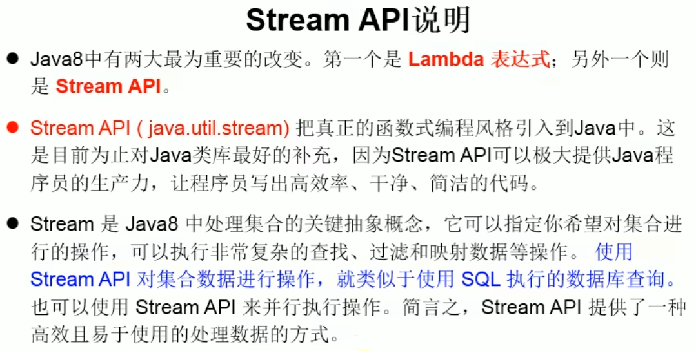

### 为什么要 StreamAPI

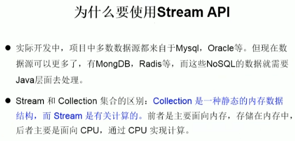

#### 总结

> #### （1）<span style="color:red">Stream</span> 关注的是对数据的<span style="color:red">运算</span>，与 <span style="color:red">CPU</span> 打交道
>
> #### （2）<span style="color:red">集合</span>关注的是数据的<span style="color:red">存储</span>，与<span style="color:red">内存</span>打交道

### 什么是 Stream

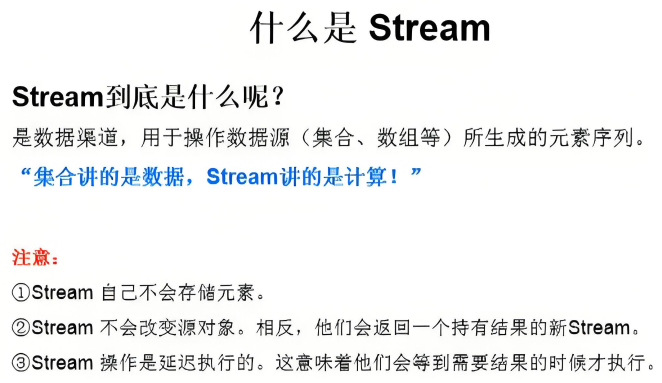

### 总结

> #### Stream 的作用就是对容器<span style="color:red">（数组 / 集合）</span>的<span style="color:red">计算</span>

## Stream 操作的三个步骤

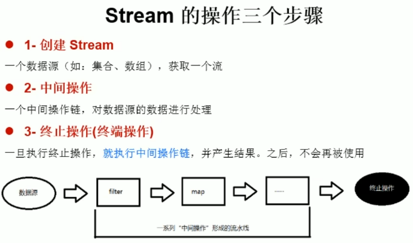

#### ⚠️ 注意点

> #### （1）<span style="color:red">只有终止操作，中间操作才会生效</span>（延迟执行）
>
> #### （2）一旦终止操作后，Stream 流关闭，不可以再使用（会抛异常），<span style="color:red">如需再次使用，需要重新创建 Stream 流</span>

## Stream 实例化

### 通过集合

> #### 创建方法：<span style="color:red">集合对象 . stream（）/ paralleStream（）</span>
>
> #### 流分类
>
> #### （1）顺序流：stream（）
>
> #### （2）并行流：paralleStream（）

```java
@Test
public void test1(){
    List<Employee> employees = EmployeeData.getEmployees();

    // 顺序流
    Stream<Employee> stream = employees.stream();

    // 并行流
    Stream<Employee> parallelStream = employees.parallelStream();
}
```

### 通过数组

> #### 创建方法：<span style="color:red">Arrays . stream（数组）</span>

```java
@Test
public void test2(){
    int[] arr = new int[]{1, 2, 3, 4, 5, 6};  // 创建一个数组
    // 调用Arrays类的static <T> Stream<T> stream(T[] array) 方法：返回一个流
    IntStream stream = Arrays.stream(arr);

    Employee e1 = new Employee(id: 1001, name: "Tom");
    Employee e2 = new Employee(id: 1002, name: "Jerry");
    Employee[][] arr1 = new Employee[][]{e1, e2};
    Stream<Employee> stream1 = Arrays.stream(arr1);
}
```

### 自定义内容

> #### 创建方法：<span style="color:red">Stream . of（）</span>

```java
@Test
public void test3(){
    Stream<Integer> stream = Stream.of(1, 2, 3, 4, 5, 6);
}
```

### 无限流

#### 迭代

> #### public static &lt;T&gt; iterate（final T seed, final UnaryOperator &lt;T&gt; f ）

#### 调用方法

> #### Stream . iterate (seed , 操作条件) . forEach（终止操作）

```java
@Test
public void test4() {
    // 遍历前十个偶数
    Stream.iterate(0, t -> t + 2).limit(10).forEach(System.out::println);
}
```

#### 生成

> #### public static &lt;T&gt; Stream &lt;T&gt; generate （<span style="color:red"> Supplier &lt;T&gt; s </span>）

#### 注意点

> #### <span style="color:red"> Supplier &lt;T&gt; s </span> 接口有 <span style="color:red">T get( )</span> 方法，如符合返回类型和参数类型一致，可以使用<span style="color:red">方法引用</span>

```java
@Test
public void test4() {
    // 生成十个范围在 0 <= x < 1 的随机数
    Stream.generate(Math::random).limit(10).forEach(System.out::println);
}
```

## 中间操作

### 筛选与切片

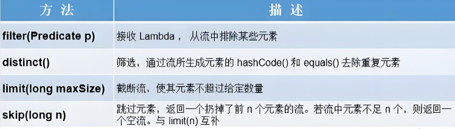

> #### filter 是 <span style="color:red">Predicate 接口</span>，对应的抽象方法是 <span style="color:red">boolean test（T t ）</span>
>
> #### <span style="color:red">distinct 去重</span>的前提是基于<span style="color:red">重写 equals（） 和 hashcode（）方法</span>

#### 代码示例

```java
package practise;

import java.util.ArrayList;
import java.util.stream.Stream;

public class pra {
    public static void main(String[] args) {
        ArrayList<Employee> employees = new ArrayList<>();
        employees.add(new Employee("jack", 18));
        employees.add(new Employee("tom", 23));
        employees.add(new Employee("lucy", 25));
        employees.add(new Employee("bob", 26));
        employees.add(new Employee("jack", 18));
        employees.add(new Employee("jack", 18));

        // 过滤
        Stream<Employee> stream1 = employees.stream();
        System.out.println("执行过滤：打印年龄大于 20 岁的员工");
        stream1.filter(employee -> employee.getAge() > 20).forEach(System.out::println);

        System.out.println();

        // 去重
        Stream<Employee> stream2 = employees.stream();
        System.out.println("执行去重");
        stream2.distinct().forEach(System.out::println);

        System.out.println();

        // 只查看前两名员工信息
        System.out.println("只查看前两名员工信息");
        employees.stream().limit(2).forEach(System.out::println);

        System.out.println();

        // 跳过前两名员工的信息
        System.out.println("跳过前两名员工的信息");
        employees.stream().distinct().skip(2).forEach(System.out::println);
    }
}

class Employee {
    String name;
    int age;

    public Employee() {

    }

    public Employee(String name, int age) {
        this.name = name;
        this.age = age;
    }

    public String getName() {
        return name;
    }

    public void setName(String name) {
        this.name = name;
    }

    public int getAge() {
        return age;
    }

    public void setAge(int age) {
        this.age = age;
    }

    @Override
    public String toString() {
        return "Employee{" +
                "name='" + name + '\'' +
                ", age=" + age +
                '}';
    }

    @Override
    public boolean equals(Object obj) {
        if (this == obj) {
            return true;  // 如果是同一个对象，直接返回 true
        }
        if (obj == null || getClass() != obj.getClass()) {
            return false;  // 如果类型不同，返回 false
        }

        Employee employee = (Employee) obj;  // 将 obj 转换为 Employee
        return age == employee.age && name.equals(employee.name);  // 比较 name 和 age
    }

    @Override
    public int hashCode() {
        return 31 * name.hashCode() + age;  // 使用 name 和 age 来计算哈希值
    }
}
```

### 映射

<br/>
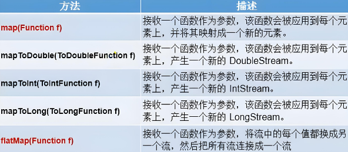

> #### 快速应用：map （传入值 --> 返回值）
>
> #### map 就是映射，简单理解就是一个 <span style="color:red">函数</span>，通过 <span style="color:red">某种规则的对应</span>，接收参数，按照规则处理，然后返回结果
>
> #### <span style="color:red">Function</span> 接口，对应的抽象方法为 <span style="color:red">R apply（T t）</span>
>
> #### <span style="color:red">flatMap（）</span> 接口可以处理流里面放流的情况，不是存放一个流而是直接把内容取出
>
> #### 类比集合：[ 1, 2, 3, [4, 5, 6] ] （ flatMap 处理 ）--> [ 1, 2, 3, 4, 5, 6 ]

```java
public class Test {
    public static void main(String[] args) {
        List<String> list = Arrays.asList("aa", "bb", "cc", "dd");

        // map 映射为大写字母
        list.stream().map(s -> s.toUpperCase()).forEach(System.out::print);

        System.out.println();

        // 使用 map 处理嵌套 Stream
        Stream<Stream<Character>> streamStream = list.stream().map(Tool::fromStringToStream);
        streamStream.forEach(s -> {
            s.forEach(System.out::print);
        });

        System.out.println();

        // 使用 map 处理嵌套 Stream
        /*
            flatMap(Function f) —— 接收一个函数作为参数，
            将流中的每个值都转换成另一个流，
            然后把所有流合并成一个流。
         */
        Stream<Character> characterStream = list.stream().flatMap(Tool::fromStringToStream);
        characterStream.forEach(System.out::print);
    }
}

class Tool {
    public static Stream<Character> fromStringToStream(String str) {
        ArrayList<Character> list = new ArrayList<>();
        for (Character c : str.toCharArray()) {
            list.add(c);
        }
        return list.stream();
    }
}
```

### 排序

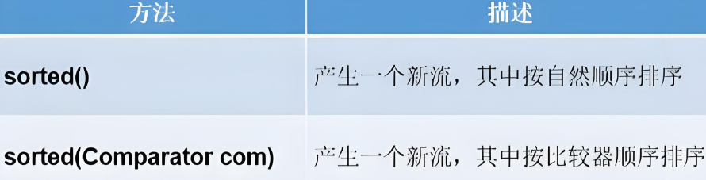

> #### 如果是<span style="color:red">定制排序</span>，需要<span style="color:red">实现</span> Comparator 接口的<span style="color:red">抽象方法</span>

```java
public void test4() {

    // 自然排序
    List<Integer> list = Arrays.asList(12, 43, 65, 34, 87, 0, -98, 7);
    list.stream().sorted().forEach(System.out::println);

    // sorted(Comparator com) —— 定制排序
    List<Employee> employees = EmployeeData.getEmployees();
    employees.stream().sorted((e1, e2) -> {
        int ageValue = Integer.compare(e1.getAge(), e2.getAge());
        if(ageValue != 0){
            return ageValue;
        } else {
            // 默认按照年龄排序，如果年龄相同按照薪水排序
            return Double.compare(e1.getSalary(), e2.getSalary());
        }
    }).forEach(System.out::println)

}
```

## 终止操作

### 匹配与查找

<br/>
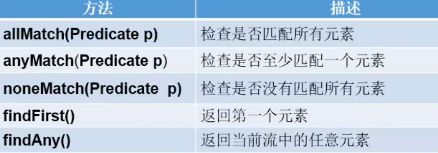

```java
@Test
public void test1(){
    List<Employee> employees = EmployeeData.getEmployees();

    // allMatch(Predicate p) — 检查是否所有员工的年龄都大于18
    boolean allMatch = employees.stream().allMatch(e -> e.getAge() > 18);
    System.out.println(allMatch);

    // anyMatch(Predicate p) — 检查是否存在员工的工资大于10000
    boolean anyMatch = employees.stream().anyMatch(e -> e.getSalary() > 10000);
    System.out.println(anyMatch);

    // noneMatch(Predicate p) — 检查是否没有匹配的元素
    // 检查是否存在员工姓名以“雷”字开头
    boolean noneMatch = employees.stream().noneMatch(e -> e.getName().startsWith("雷"));
    System.out.println(noneMatch);

    // findFirst — 返回第一个元素
    Optional<Employee> employee = employees.stream().findFirst();
    System.out.println(employee);

    // findAny — 返回当前流中的任意元素
    Optional<Employee> employee1 = employees.parallelStream().findAny();
    System.out.println(employee1);

}
```

### 统计

<br/>
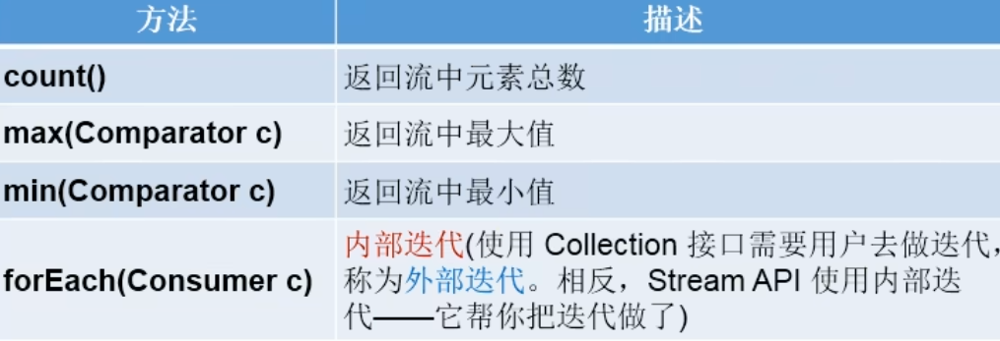

```java
@Test
public void test2(){
    List<Employee> employees = EmployeeData.getEmployees();

    // count — 计算工资大于5000的员工数量
    long count = employees.stream().filter(e -> e.getSalary() > 5000).count();
    System.out.println(count);

    // max(Comparator c) — 返回流中最大值
    Stream<Double> salaryStream = employees.stream().map(e -> e.getSalary());
    Optional<Double> maxSalary = salaryStream.max(Double::compare);
    System.out.println(maxSalary);

    // min(Comparator c) — 返回流中最小值
    // 返回最低工资的员工信息
    Optional<Employee> employeeMin = employees.stream().min((e1, e2) -> Double.compare(e1.getSalary(), e2.getSalary()));
    System.out.println(employeeMin);

    // forEach(Consumer c) — 内部迭代
    employees.stream().forEach(System.out::println);
}
```

### 归约（求和）

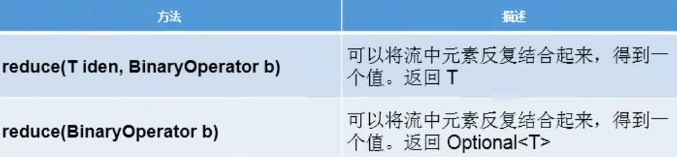

```java
@Test
public void test3(){
    // reduce(T identity, BinaryOperator) — 可以将流中元素反复结合起来，得到一个值。返回一个自然数的和
    // 计算 1 - 10 的自然数的和
    List<Integer> list = Arrays.asList(1, 2, 3, 4, 5, 6, 7, 8, 9, 10);
    Integer sum = list.stream().reduce(0, Integer::sum);
    System.out.println(sum);

    // reduce(BinaryOperator) — 可以将流中元素反复结合起来，得到一个值。返回公司所有员工工资的总和
    // 计算公司所有员工工资的总和
    List<Employee> employees = EmployeeData.getEmployees();
    Stream<Double> salaryStream = employees.stream().map(Employee::getSalary);
    Optional<Double> sumMoney = salaryStream.reduce(Double::sum);
    System.out.println(sumMoney);
}
```

### 收集

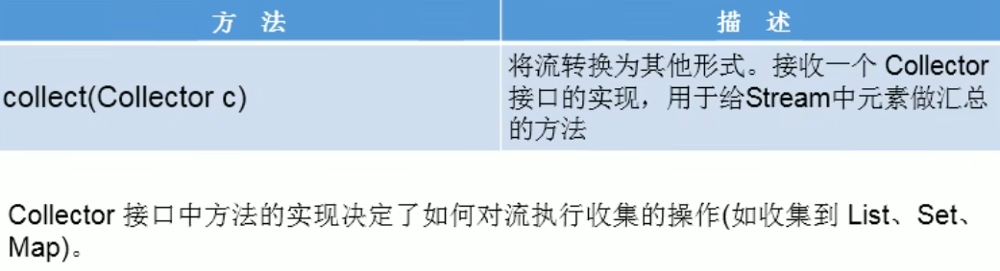

> #### 方法调用： collect （ <span style="color:red">Collectors . 调用方法名</span> ）

<br/>
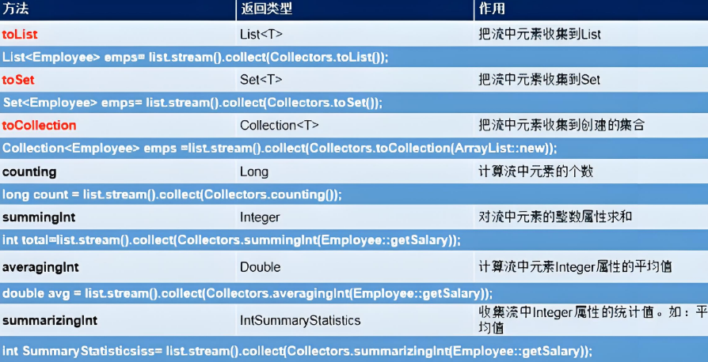

<br/>
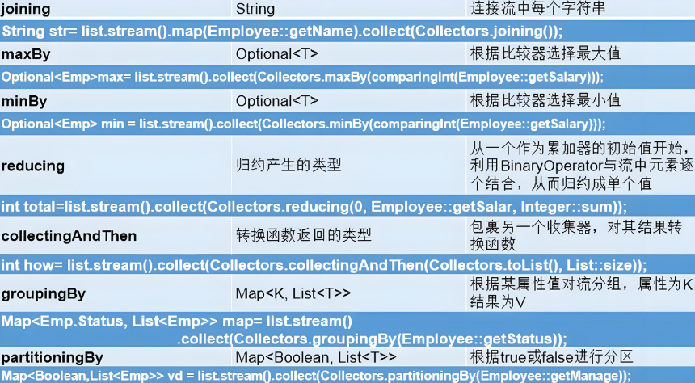

```java
public class Test {
    public static void main(String[] args) {
        List<Integer> list = Arrays.asList(1, 2, 3, 4, 5);
        List<Integer> collect = list.stream().filter(n -> n > 3).collect(Collectors.toList());
        System.out.println(collect);
    }
}
```
