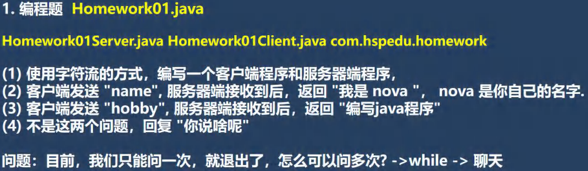

<h1 style="text-align: center;">第二十一章：网络编程</h1>
 
- - -

## 1. 第一题

#### 问题的解决在此不展开，后续在项目中再去实现



### （1）客户端

```java
import java.io.*;
import java.net.InetAddress;
import java.net.Socket;


public class client {
    public static void main(String[] args) throws IOException {
        System.out.println("客户端启动...");

        // 创建 socket 对象
        Socket socket = new Socket(InetAddress.getLocalHost(), 8888);

        // 定义发送的信息
        String send_info1 = "name";
        String send_info2 = "hobby";
        String send_info3 = "你好";

        // 实现三个信息都要发送，使用数组循环读取发送信息
        String[] send_infos = new String[3];
        send_infos[0] = send_info1;
        send_infos[1] = send_info2;
        send_infos[2] = send_info3;


        // 1. 发送信息
        OutputStream os = socket.getOutputStream();
        BufferedOutputStream bos = new BufferedOutputStream(os);

        bos.write(send_info3.getBytes());
        bos.flush(); // 如果使用 close() 会抛出异常
        socket.shutdownOutput(); // 发送信息的结束标志

        // 2. 接收信息
        InputStream is = socket.getInputStream();
        InputStreamReader isr = new InputStreamReader(is);
        BufferedReader reader = new BufferedReader(isr);
        String get_info = reader.readLine();
        System.out.println("接收到信息：" + get_info);

        // 3. 关闭资源（关闭最外层）
        reader.close();
        bos.close();
        socket.close();
    }
}
```

### （2）服务端

```java
import java.io.*;
import java.net.ServerSocket;
import java.net.Socket;

public class server {
    public static void main(String[] args) throws IOException {
        System.out.println("服务端启动...");

        // 创建服务并在8888端口监听
        ServerSocket serverSocket = new ServerSocket(8888);

        // 创建 socket 对象，等待接收信息
        Socket socket = serverSocket.accept();


        // 1. 接收信息
        String get_info = null;
        String send_info = null;

        InputStream is = socket.getInputStream();
        BufferedInputStream bis = new BufferedInputStream(is);
        int readLen = 0;
        byte[] buf = new byte[8];

        while ((readLen = bis.read(buf)) != -1) {
            get_info = new String(buf,0,readLen);
        }

        System.out.println("接收到信息：" + get_info);

        if(get_info.equals("name")){
            send_info = "我是jacksonling";
        }else if (get_info.equals("hobby")){
            send_info = "编写java程序";
        }else{
            send_info = "你说啥呢";
        }

        // 2. 发送信息
        OutputStream os = socket.getOutputStream();
        OutputStreamWriter osWriter = new OutputStreamWriter(os); // 使用转换流，发送字符
        BufferedWriter writer = new BufferedWriter(osWriter);
        writer.write(send_info);
        writer.newLine(); // 发送信息的结束标志

        // 3. 关闭资源（关闭最外层）
        writer.close();
        bis.close();
        socket.close();
        serverSocket.close();
    }
}
```

## 2. 第二题


### （1）发送端 B

```java
import java.io.IOException;
import java.net.*;

public class senderB {
    public static void main(String[] args) throws IOException {

        System.out.println("发送端 B 启动...");

        DatagramSocket datagramSocket = new DatagramSocket(8887);

        // 1. 发送信息
        String send_info1 = "四大名著是哪些";
        String send_info2 = "你好";

        byte[] send_info = send_info1.getBytes();
        DatagramPacket sendPacket = new DatagramPacket
                (send_info, send_info.length, InetAddress.getByName("LAPTOP-E8O2B4GK"), 8888);

        datagramSocket.send(sendPacket);

        // 2. 接收信息
        byte[] buf = new byte[1024];
        DatagramPacket getPacket = new DatagramPacket(buf, buf.length);

        datagramSocket.receive(getPacket);

        // 数据解包
        byte[] get_info = getPacket.getData();
        int length = getPacket.getLength();

        // 打印数据
        String s = new String(get_info, 0,length);
        System.out.println("接收到信息：" + s);

        // 关闭资源
        datagramSocket.close();
    }
}
```

### （2）接收端 A

```java
import java.io.IOException;
import java.net.*;

public class receiverA {
    public static void main(String[] args) throws IOException {
        System.out.println("接收端 A 启动...");

        DatagramSocket datagramSocket = new DatagramSocket(8888);

        // 1. 接收信息

        // 创建 DatagramPacket 对象
        byte[] buf = new byte[1024];
        DatagramPacket getPacket = new DatagramPacket(buf, buf.length);
        datagramSocket.receive(getPacket);

        // 数据解包
        byte[] get_info = getPacket.getData();
        int length = getPacket.getLength();
        String s = new String(get_info, 0, length);
        System.out.println("接收到信息：" + s);

        // 2. 发送信息

        // 定义发送信息
        String send_info1 = "四大名著是《红楼梦》、《三国演义》、《水浒传》、《西游记》";
        String send_info2 = "what?";

        // 对接收的信息判断
        if(s.equals("四大名著是哪些")){
            byte[] send_info = send_info1.getBytes();
            DatagramPacket sendPacket = new DatagramPacket
                    (send_info, send_info.length, InetAddress.getByName("LAPTOP-E8O2B4GK"), 8887);
            datagramSocket.send(sendPacket);
        }else{
            byte[] send_info = send_info2.getBytes();
            DatagramPacket sendPacket = new DatagramPacket
                    (send_info, send_info.length, InetAddress.getByName("LAPTOP-E8O2B4GK"), 8887);
            datagramSocket.send(sendPacket);
        }

        // 关闭资源
        datagramSocket.close();
    }
}
```

## 3. 第三题


### （1）补充 API

<h2 style="text-align: center; font-weight: bold;">StreamUtils</h2>

```java
package chapter_21.question_3;

import java.io.BufferedReader;
import java.io.ByteArrayOutputStream;
import java.io.IOException;
import java.io.InputStream;
import java.io.InputStreamReader;

/**
 * 此类用于演示关于流的读写方法
 *
 */
public class StreamUtils {
	/**
	 * 功能：将输入流转换成byte[]， 即可以把文件的内容读入到byte[]
	 * @param is
	 * @return
	 * @throws Exception
	 */
	public static byte[] streamToByteArray(InputStream is) throws Exception{
		ByteArrayOutputStream bos = new ByteArrayOutputStream();//创建输出流对象
		byte[] b = new byte[1024];//字节数组
		int len;
		while((len=is.read(b))!=-1){//循环读取
			bos.write(b, 0, len);//把读取到的数据，写入bos
		}
		byte[] array = bos.toByteArray();//然后将bos 转成字节数组
		bos.close();
		return array;
	}
	/**
	 * 功能：将InputStream转换成String
	 * @param is
	 * @return
	 * @throws Exception
	 */

	public static String streamToString(InputStream is) throws Exception{
		BufferedReader reader = new BufferedReader(new InputStreamReader(is));
		StringBuilder builder= new StringBuilder();
		String line;
		while((line=reader.readLine())!=null){
			builder.append(line+"\r\n");
		}
		return builder.toString();

	}

}
```

### （2）客户端

```java
import java.io.*;
import java.net.InetAddress;
import java.net.Socket;
import java.util.Scanner;

public class client {
    public static void main(String[] args) throws Exception {
        System.out.println("客户端启动...");

        Socket socket = new Socket(InetAddress.getLocalHost(),8888);

        // 1. 发送信息
        OutputStream os = socket.getOutputStream(); // 获取 socket 输出流

        String send_info;
        Scanner scanner = new Scanner(System.in);
        System.out.print("请输入一个音乐名：");
        send_info = scanner.next();

        OutputStreamWriter osWriter = new OutputStreamWriter(os); // 转换流
        BufferedWriter writer = new BufferedWriter(osWriter);
        writer.write(send_info);
        writer.newLine(); // 发送信息的结束标志
        writer.flush(); // 一定要刷新才可以成功写入信息


        // 2. 接收信息
        InputStream is = socket.getInputStream(); // 获取 socket 输入流
        BufferedInputStream bis = new BufferedInputStream(is);
        byte[] get_info = StreamUtils.streamToByteArray(bis);

        // 保存音乐文件
        String dirPath = "C:\\Users\\jackson\\Desktop\\高山流水2.mp3";
        BufferedOutputStream bos = new BufferedOutputStream(new FileOutputStream(dirPath));
        bos.write(get_info);

        // 关闭流
        bos.close();
        bis.close();
        writer.close();
        scanner.close();
        socket.close();
    }
}
```

### （3）服务端

```java
import java.io.*;
import java.net.ServerSocket;
import java.net.Socket;

public class server {
    public static void main(String[] args) throws Exception {
        System.out.println("服务端启动...");

        ServerSocket serverSocket = new ServerSocket(8888);

        Socket socket = serverSocket.accept();  // 在 8888 处于监听状态

        // 1. 接收信息
        InputStream is = socket.getInputStream();
        InputStreamReader isReader = new InputStreamReader(is);
        BufferedReader reader = new BufferedReader(isReader);
        String get_info = reader.readLine();
        System.out.println("接收到信息：" + get_info);

        // 2. 发送信息
        OutputStream os = socket.getOutputStream();

        // 高山流水音乐文件
        String dirPath = "C:\\Users\\jackson\\Desktop\\韩顺平Java课程资料\\资料\\分享资料\\高山流水.mp3";
        BufferedInputStream bis = new BufferedInputStream(new FileInputStream(dirPath));
        byte[] send_info = StreamUtils.streamToByteArray(bis);

        // 默认音乐文件
        String other = "C:\\Users\\jackson\\Desktop\\韩顺平Java课程资料\\资料\\分享资料\\111.wav";
        BufferedInputStream bis_ = new BufferedInputStream(new FileInputStream(other));
        byte[] send_info_ = StreamUtils.streamToByteArray(bis_);

        // 判断接收信息，发送音乐文件
        if(get_info.equals("高山流水")){
            BufferedOutputStream bos = new BufferedOutputStream(os);
            bos.write(send_info);
            bos.flush();
            socket.shutdownOutput(); // 发送信息的结束标志
        }else{
            BufferedOutputStream bos = new BufferedOutputStream(os);
            bos.write(send_info_);
            bos.flush();
            socket.shutdownOutput(); // 发送信息的结束标志
        }

        // 关闭流
        bis_.close();
        bis.close();
        reader.close();
        serverSocket.close();
        socket.close();
    }
}
```
