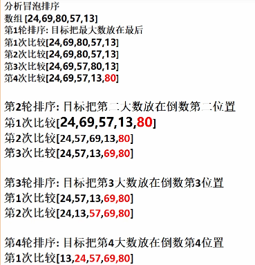

<h1 style="text-align: center; font-weight: bold;">冒泡排序</h1>

---

## 基本介绍

> #### 冒泡排序（BubbleSorting）的基本思想是：通过对待排序序列从后向前（从下标较大的元素开始），依次比较相邻元素的值，若发现逆序则交换，使值较大的元素逐渐从前移向后部

## 代码示例

```java
int[] a = {3, 2, 1};
for( int i = 0; i < a.length-1; i++){
    for( int j = 0; j < a.length-1-i; j++){
        if(a[j] > a[j+1]){
            int temp = a[j];
            a[j] = a[j+1];
            a[j+1] = temp;
        }
    }
}
for( int i = 0; i < a.length; i++){
    System.out.print(a[i]+ " ");
}
```

> #### 大体思想：化繁为简，先死后活，由内层推出的外层
>
> #### 1. 外层`for`循环：表示需要进行排序的轮次，即每一次都找出最大的数排在队尾，需要排序`数组长度-1`次才可以排完
>
> #### 2. 内层`for`循环：表示每一轮排序把最大的放在数组末尾的这个过程的实现元素之间需要比较的轮次，每排序好一个元素，比较的轮次就减少，和外层循环有关

## 执行过程



## 延申：大到小排序

### 思路

> #### 修改比较的方式即可
>
> #### 1. 从<span style="color:red">小到大</span>排序：`前面`的比`后面`大就交换
>
> #### 2. 从<span style="color:red">大到小</span>排序：`后面`的比`前面`小就交换

### 代码示例

```java
int[] a = {3, 2, 1};
for( int i = 0; i < a.length-1; i++){
    for( int j = 0; j < a.length-1-i; j++){
        if(a[j] < a[j+1]){
            int temp = a[j];
            a[j] = a[j+1];
            a[j+1] = temp;
        }
    }
}
for( int i = 0; i < a.length; i++){
    System.out.print(a[i]+ " ");
}
```

## 内置排序（API）

### 基本介绍

> #### 导入包：import java.util.Arrays
>
> #### 方法：<span style="color:red">Arrays . sort ( 数组 )</span>

### 代码示例

```java
import java.util.Arrays;

public class ttest {
    public static void main(String[] args) {
        int[] arr = {1, 3, 2};
        Arrays.sort(arr);
        for (int i = 0; i < arr.length; i++) {
            System.out.print(arr[i] + " ");
        }
    }
}
```
