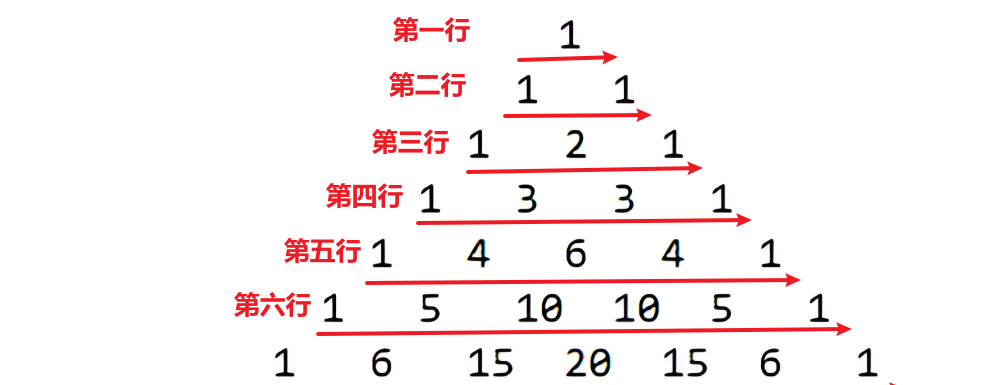

<h1 style="text-align: center; font-weight: bold;">顺序查找</h1>

---

## 基本介绍

> #### 二维数组的理解：二维数组中的每一个元素都是一个一维数组，从图形界面上看，二维数组就是一个二维矩阵

## 数组定义方法

```java
int[][] arr; //第一种

int[] arr[]; //第二种

int arr[][]; //第三种
```

## 数组初始化

### 静态初始化

```java
int[][] arr = {{1,1},{2,2},{3,3}}
```

### 动态初始化

> #### `int[][] arr = new int[n][m]`，初始化一个 <span style="color:red">n 行 m 列</span> 的二维数组

```java
int[][] arr;
arr = new int[3][3];
```

### 使用细节

> #### Java 中<span style="color:red">允许列数不确定</span>，即初始化时定义了二维数组的长度，然而每个元素（一维数组）的长度（内容）可以<span style="color:red">动态分配</span>

#### 代码示例

> #### 生成一个二维矩阵，列数等于行数

```java
int[][] arr = new int[3][];
for(int i = 0; i < arr.length; i++){
    //遍历二维数组中的每一个一维数组中的值
    //注意：数组下标比物理位置在数值上小一，分配的是数组空间的大小，需要使用物理位置的数值
    arr[i] = new int[i+1];
}

// 遍历二维数组，给每一个元素赋值
for(int i = 0; i < arr.length; i++){
    for(int j = 0; j < arr[i].length; j++){
        arr[i][j] = i+1;
    }
}

//输出二维数组的值
for(int i = 0; i < arr.length; i++){
    for(int j = 0; j < arr[i].length; j++){
        System.out.print(arr[i][j] + " ");
    }
    System.out.println("");
}

//输出效果
1
2 2
3 3 3
```

---

## 应用：杨辉三角

### 基本介绍



#### 图形特点

#### （1）第一行有 1 个元素，<span style="color:red">第 n 行有 n 个元素</span>

#### （2）每一行的<span style="color:red">第一个元素和最后一个元素都是 1</span>

#### （3）从<span style="color:red">第三行</span>开始，对<span style="color:red">非首尾元素</span>，其值由公式计算

> #### <span style="color:red"> arr [ i ] [ j ] = arr [ i - 1 ] [ j - 1] + arr [ i - 1 ] [ j ]</span>

### 代码示例

```java
int[][] yanghui = new int[10][];

for( int i = 0; i < yanghui.length; i++){
    yanghui[i] = new int[i+1];

    //一个思想：边初始化空间边赋值

    for( int j = 0; j < yanghui[i].length; j++){ //遍历二维数组中的每一个一维数组中的每一个元素

        if( j == 0 || j == yanghui[i].length-1){
            yanghui[i][j] = 1;
        }else{
            yanghui[i][j] = yanghui[i-1][j] + yanghui[i-1][j-1];
        }
    }
}

for(int i = 0; i < yanghui.length; i++){
    for(int j = 0; j < yanghui[i].length; j++){
        System.out.print(yanghui[i][j] + " ");
    }
    System.out.println("");
}


//输出结果
1
1 1
1 2 1
1 3 3 1
1 4 6 4 1
1 5 10 10 5 1
1 6 15 20 15 6 1
1 7 21 35 35 21 7 1
1 8 28 56 70 56 28 8 1
1 9 36 84 126 126 84 36 9 1
```
