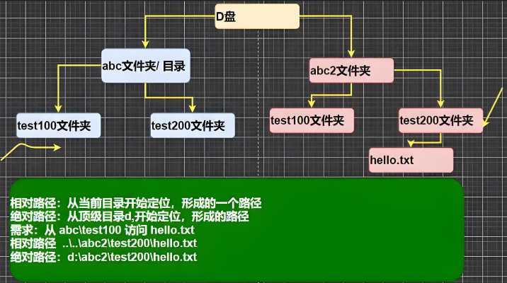

<h1 style="text-align: center; font-weight: bold;">DOS指令</h1>

---

## 命令类别

#### （1）接受指令

#### （2）解析指令

#### （3）执行指令

## 常用命令

#### （1）查看当前目录有什么：`dir`

#### （2）使用绝对路径查看特定目录下文件：`dir 绝对路径`

#### （3）切换到其他盘：直接输入`C:` 或 `D:`直接切换到根目录

#### （4）返回上一级目录：`cd..`

#### （5）切换到根目录：`cd\`

#### （6）清屏：`cls`

#### （7）某个目录内容以树的形式呈现：`tree 绝对路径`

## 更多命令

#### [点击查看更多命令教程](https://blog.csdn.net/m0_51779342/article/details/116711762?ops_request_misc=%257B%2522request%255Fid%2522%253A%2522ada0962d4f1f92ddcdb99f0d7d63dea7%2522%252C%2522scm%2522%253A%252220140713.130102334..%2522%257D&request_id=ada0962d4f1f92ddcdb99f0d7d63dea7&biz_id=0&utm_medium=distribute.pc_search_result.none-task-blog-2~all~top_positive~default-1-116711762-null-null.142^v102^control&utm_term=dos%E5%91%BD%E4%BB%A4&spm=1018.2226.3001.4187)

## ⭐ 相对路径和绝对路径

#### （1）相对路径：从某个文件夹作为开始起点定位到具体目录（`..\`表示回到上一级目录）

#### （2）绝对路径：直接从磁盘作为根目录往下查找

