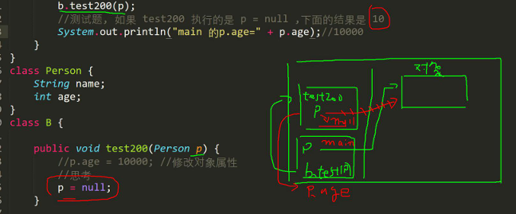

<h1 style="text-align: center; font-weight: bold;">传参机制</h1>

---

## 基本数据类型

### 基本介绍

> #### 基本数据类型传参是<span style="color:red">值传递</span>，<span style="color:red">形参的任何改变不影响实参</span>

### 代码实例

```java
public class practise {
    public static void main(String[] args){
        int a = 10;
        int b = 20;
        exchange method = new exchange();
        method.exchangemethod(a,b);
        System.out.println("main方法中的值：" + "a=" + a + "  " + "b=" + b);

    }
}

class exchange{
    public void exchangemethod(int a,int b){
        int temp = a;
        a = b;
        b = temp;
        System.out.println("类方法中交换后的值：" + "a=" + a + "  " + "b=" + b);
    }
}

//输出结果
类方法中交换后的值：a=20  b=10
main方法中的值：a=10  b=20

```

#### 代码分析

> #### （1）方法调用完成后，<span style="color:red">栈空间释放，主栈中的值并未受到影响</span>
>
> #### （2）换个角度看，实际上输出的是 main 方法中的 a 和 b 的值（即在主栈中执行的输出语句）

## 引用数据类型

### 基本介绍

> #### <span style="color:red">引用传递 / 地址传递，形参影响实参</span>

### 案例一

```java
public class practise {
    public static void main(String[] args){
        person p = new person();
        p.age = 10;
        p.name = "jackson";
        b methodb = new b();
        methodb.test(p);
        System.out.println("main方法中的年龄为：" + p.age);

    }
}

class person{
    int age;
    String name;
}

class b{
    public void test(person p){
        p.age = 1000;
    }
}

//输出结果
main方法中的年龄为：1000
```

> #### 结论：P 的值发生变化

#### 代码分析

#### （1）通过 new 创建了一个 person 类的一个对象 p，在堆空间中申请一段空间，返回地址给 p，于是主栈中的 p 指向<span style="color:red">堆空间</span>中对象 p 申请的这段空间

#### （2）通过 new 创建了一个 b 类的一个对象 methodb，调用 <span style="color:red">b 类中的方法</span>，此时会在申请一段<span style="color:red">栈空间</span>用于方法的调用

#### （3）由于传递的参数是引用类型 p（传的是地址），此时方法中的 p 会指向主栈中 p 指向的堆空间，即<span style="color:red">主栈中的 p 和方法的栈空间中的 p 指向同一堆空间</span>

#### （3）这个时候方法对 p.age 进行了修改，方法的栈空间释放，返回到主栈中，主栈中的 p 找到堆空间中的 age，输出 p.age 的值，即是方法中的 p.age 的值


### 案例二

> #### 把案例一中的 b 方法修改为 p = null

```java
public class practise {
    public static void main(String[] args){
        person p = new person();
        p.age = 10;
        p.name = "jackson";
        b methodb =new b();
        methodb.test(p);
        System.out.println("main方法中的年龄为：" + p.age);

    }
}

class person{
    int age;
    String name;
}

class b{
    public void test(person p){
        p = null
    }
}

//输出结果
main方法中的年龄为：10
```

> #### 结论：P 的值不会变化

#### 代码分析

> #### p = null 这句话是对方法的<span style="color:red">栈空间</span>有影响，<span style="color:red">对主栈并不会有影响</span>



### 案例三

```java
public class practise {
    public static void main(String[] args){
        person p = new person();
        p.age = 10;
        p.name = "jackson";
        b methodb =new b();
        methodb.test(p);
        System.out.println("main方法中的年龄为：" + p.age);

    }
}

class person{
    int age;
    String name;
}

class b{
    public void test(person p){
        p = new person();
        p.age = 99;
    }
}

//输出结果
main方法中的年龄为：10
```

> #### P 的值不会变化

#### 代码分析

#### （1）虽然 p 传进来了，但是方法中<span style="color:red">p 又指向了一个新的堆空间</span>，并不指向主栈中的 p 指向的堆空间，这个时候对<span style="color:red">主栈中的 p 并不会有影响</span>

#### （2）在 test 方法中， p 指向新创建的堆空间，方法执行后返回，这个堆空间并<span style="color:red">没有被引用</span>，底层会执行<span style="color:red">垃圾回收</span>机制


### 总结

> #### <span style="color:red">引用数据类型</span>是<span style="color:red">地址传递</span>，是否影响主栈，要看方法是否指向主栈中的堆空间，并对主栈中堆空间的属性做出了修改
