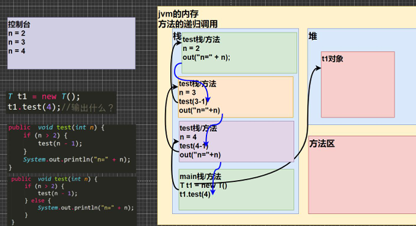
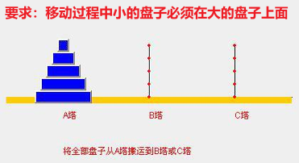

<h1 style="text-align: center; font-weight: bold;">递归（recursion）</h1>

---

## 基本介绍

#### （1）核心思想

> #### 把一个<span style="color:red">复杂的问题拆分成一个简单问题和子问题</span>，子问题又是更小规模的复杂问题，循环往复

#### （2）递归的核心

> #### <span style="color:red">栈</span>的使用

## 递归细节

#### （1）需要有<span style="color:red">递归出口</span>，否者就会<span style="color:red">无限递归造成栈溢出</span>

#### （2）<span style="color:red">每一次递归调用都会生成一个新的栈空间</span>，代码从上往下执行，如果符合条件就会一直递归，直到递归出口，最后一层一层返回值，完成函数的调用

#### （3）方法的局部变量都是独立的，不会相互应影响

#### （4）当一个方法执行完毕，或者遇到 return 就会返回，<span style="color:red">遵守谁调用，就将结果返回给谁</span>

## 递归机制

### 代码示例

```java

public class Recursion01 {
    public static void main(String[] args) {
        Tt1 = newT();
        t1.test(4);//输出什么？ n=2 n=3 n=4
    }
 }

class T {
    public void test(int n) {
        if (n > 2) {
            test(n- 1);
        }
        System.out.println("n=" + n);
    }
}

```

### 内存视图分析

> #### 每一次递归都会开辟新的栈空间，单层递归执行完成，把返回值返回给上一次递归调用



---

## 递归案例

### 阶乘问题（ factorial ）

```java
import java.util.Scanner;
public class recursion {
    public static void main(String[] args){
        Scanner input = new Scanner(System.in);
        object object = new object();
        System.out.print("input a number：");
        long n = input.nextLong();
        long result = object.factorial(n);
        System.out.print("factorial(" + n + ") is：" + result);
    }
}

class object{
    public long factorial(long n){
        if(n == 1){
            return 1;
        }else{
            return n * factorial(n - 1);
        }
    }
}
```

### 猴子吃桃问题

#### （1）问题

> #### 有一堆桃子，猴子第一天吃了其中的一半，并再多吃了一个！以后每天猴子都吃其中的一半，然后再多吃一个。当到第 10 天时，想再吃时（即还没吃），发现只有 1 个桃子了

#### （2）提问

> #### 最初共多少个桃子？

#### （3）递推分析

> #### day = 10 时 有 1 个桃子
>
> #### day = 9 时 有（day10 + 1）\* 2 = 4
>
> #### day = 8 时 有（day9 + 1）\* 2 = 10

#### （4）结论

> #### <span style="color:red">前一天的桃子 =（后一天的桃子 + 1）\* 2</span>

```java
public class recursion {
    public static void main(String[] args){
        method t = new method();
        int res = t.peach(1);
        System.out.print(res);
    }
}

class method{
    public int peach(int day){
        if(day == 10){
            return 1;
        } else if(day >= 1 && day <= 9){
            return ( peach(day + 1) + 1 ) * 2;   // 递归返回前一天的桃子
        }else{
            return -1;
        }
    }
}
```

### 斐波那契数列

#### （1）问题

> #### 1,1,2,3,5,8,13...给你一个整数 n，求出它的值是多少？

#### （2）数列特点

> #### 1. 第一个数和第二个数为 1
>
> #### 2. 从第三个数开始，后一个数等于前面两个数之和

```java
//斐波那契数列：1,1,2,3,5,8,13...

public class recursion {
    public static void main(String[] args){
        method t = new method();
        int res = t.fibonacci(10);
        System.out.print(res);
    }
}

class method{
    public int fibonacci(int n){
        if(n == 1 || n == 2){
            return 1;
        }
        else{
            return fibonacci(n - 1) + fibonacci(n - 2);
        }
    }
}

//输出：55
```

### 汉诺塔

> #### 在一根柱子上从下往上按照大小顺序摞着 64 片圆盘。大梵天命令婆罗门把圆盘从下面开始按大小顺序重新摆放在另一根柱子上。并且规定，在小圆盘上不能放大圆盘，在三根柱子之间一次只能移动一个圆盘。
>
> #### 假如每秒钟移动一次，共需多长时间呢？移完这些金片需要 5845.54 亿年以上，太阳系的预期寿命据说也就是数百亿年。真的过了 5845.54 亿年，地球上的一切生命，连同梵塔、庙宇等，都早已经灰飞烟灭

<br>


#### 思路分析

#### （1）把上面的 n-1 个圆盘<span style="color:red">看作整体</span>，从 A 塔移动到 B 塔，中转塔是 C 塔

#### （2）把最底层移动从 A 塔移动到 C 塔

#### （3）把 n-1 个圆盘从 B 塔移动到 C 塔

```java
//斐波那契数列：1,1,2,3,5,8,13...

public class recursion {
    public static void main(String[] args){
        tower t = new tower();
        t.move(3, 'a', 'b', 'c');
    }
}

class tower{
    // 移动的圆盘个数， A塔 ，B塔 ， C塔
    public void move(int num, char a, char b, char c){
        if(num == 1){
            System.out.println(a + "->" + c);
        }else{
            // 把上面的 n-1 个圆盘从 a塔 移动到 b塔，中间借助 c 塔
            move(num -1, a, c, b);
            // 把最下面的圆盘移动到 c塔
            System.out.println(a + "->" + c);
            // 把 b塔 的所有盘移动到 c塔，中介借助 a塔
            move(num -1, b, a, c);
        }
    }
}

//输出
a->c
a->b
c->b
a->c
b->a
b->c
a->c
```

### 迷宫问题


#### 基本介绍

#### 运用二维数组表示迷宫，初始位置为（1，1），走到出口处（箭头指向位置），标记路线

> #### （1）0 表示可以走（还未被标记）
>
> #### （2）1 表示障碍物
>
> #### （3）2 表示可以走（被标记后）
>
> #### （4）3 表示走过，但是走不通是死路

#### 注意

> #### <span style="color:red">中心的圆点不是墙面，可以走</span>

#### 代码示例

```java
public class migong {
    public static void main(String[] args){
        // 创建迷宫（8行7列）
        int[][] map = new int[8][7];

        //标记墙面的部分
        for(int i = 0; i < 8; i++){ // 左右部分
            map[i][0] = 1;
            map[i][6] = 1;
        }
        for(int i = 0; i < 7; i++){ // 上下部分
            map[0][i] = 1;
            map[7][i] = 1;
        }
        map[3][1] = 1;
        map[3][2] = 1;

        // 回溯测试：辅助理解方法调用完成后栈空间释放，是如何返回的
//        map[2][2] = 1;

        // 封闭路径，测试结果
//        map[2][1] = 1;
//        map[2][2] = 1;
//        map[1][2] = 1;

        // 调用方法
        t finder = new t();
        finder.findway(map,1,1); // 起点是（1，1）
        //打印找路结果
        for(int i = 0; i < map.length; i++){
            for(int j = 0; j < map[i].length; j++){
                System.out.print(map[i][j] + " ");
            }
            System.out.println("");
        }

    }
}


class t{
    public boolean findway(int[][] map, int i, int j){
        // 找路策略：下右上左

        // 如果找到了就出口返回 true
        if(map[6][5] == 2){
            return true;
        }else{
            if(map[i][j] == 0){
                //假设当前点使用探路策略可以走通，就说明可以和之前的点衔接起来构成一条可以走通的路线
                map[i][j] = 2;

                // 接着使用找路策略开始探路，验证当前点开始是否可以走通

                //往下走
                if(findway(map, i+1, j)){
                    return true;
                }
                // 往右走
                else if(findway(map, i, j+1)){
                    return true;
                }
                // 往上走
                else if(findway(map, i-1, j)){
                    return true;
                }
                // 往左走
                else if(findway(map, i, j-1)){
                    return true;
                }
                // 四个方向都走不通，假定错误
                else{
                    map[i][j] = 3;
                    return false;
                }
            }else{
            // 此时可能的值为map[i][j] = 1, 2, 3，这些情况都表示已经走过了，就不要重复测试
                return false;
            }
        }
    }
}
```

> #### 理解：每走到一个点，就会递归的使用<span style="color:red">下->右->上->左</span>的方式进行探路，如果都走不通就会返回到上一次递归调用，继续探路，直到找到出口为止
