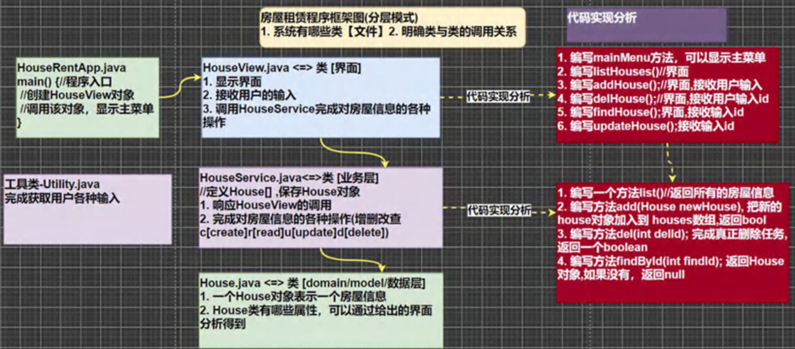
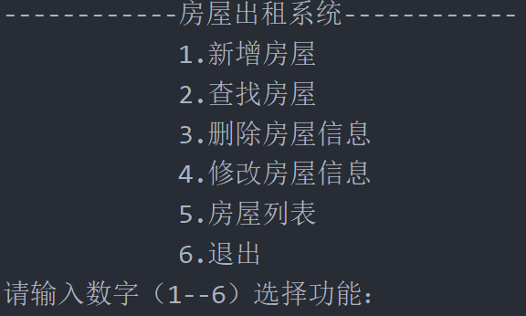

# 房屋出租系统（面向对象版本）

## 整体思想：采用==数组==存储房屋信息，深刻体会==面向对象==的好处和过程

## 一、实现需求

- ## （1）用户层
  - ## 系统菜单显示
  - ## 提示用户输入对应的数字选择功能
  - ## 各个功能界面操作提示（底层调用功能实现层相应的方法实现）
- ## （2）功能实现层
  - ## 新增房源
  - ## 查找房屋
  - ## 删除房屋
  - ## 修改房屋信息
  - ## 房屋列表
  - ## 退出

## 二、==需求分析（项目框架设计）==

## 采用==分层模式==构建项目框架设计图，在这其中引入了`Utility`类库（可以理解为==工具包==，==直接调用==相关方法即可）

## 整体思路

- ## （1）==用户界面层==
- ## （2）==数据层==：实现功能，提供给用户层调用相应的方法
- ## （3）==house 类==：数据层的==操作对象==是`house`这个类，需要说明该类具有的相关属性




---

# 第一部分：`Utility`类库源码

## 说明：如果方法是==静态的（static）==，可以通过==类名==直接==调用方法==，==无需创建对象==后调用方法

## 源码（创建`Utils`这个包，将`Utility`类库加入其中，后续==通过类名调用==相应==方法==即可）

```java
package utils;

/**
 工具类的作用:
 处理各种情况的用户输入，并且能够按照程序员的需求，得到用户的控制台输入。
 */

import java.util.*;
/**


 */
public class Utility {
    //静态属性。。。
    private static Scanner scanner = new Scanner(System.in);


    /**
     * 功能：读取键盘输入的一个菜单选项，值：1——5的范围
     * @return 1——5
     */
    public static char readMenuSelection() {
        char c;
        for (; ; ) {
            String str = readKeyBoard(1, false);//包含一个字符的字符串
            c = str.charAt(0);//将字符串转换成字符char类型
            if (c != '1' && c != '2' &&
                    c != '3' && c != '4' && c != '5') {
                System.out.print("选择错误，请重新输入：");
            } else break;
        }
        return c;
    }

    /**
     * 功能：读取键盘输入的一个字符
     * @return 一个字符
     */
    public static char readChar() {
        String str = readKeyBoard(1, false);//就是一个字符
        return str.charAt(0);
    }
    /**
     * 功能：读取键盘输入的一个字符，如果直接按回车，则返回指定的默认值；否则返回输入的那个字符
     * @param defaultValue 指定的默认值
     * @return 默认值或输入的字符
     */

    public static char readChar(char defaultValue) {
        String str = readKeyBoard(1, true);//要么是空字符串，要么是一个字符
        return (str.length() == 0) ? defaultValue : str.charAt(0);
    }

    /**
     * 功能：读取键盘输入的整型，长度小于2位
     * @return 整数
     */
    public static int readInt() {
        int n;
        for (; ; ) {
            String str = readKeyBoard(2, false);//一个整数，长度<=2位
            try {
                n = Integer.parseInt(str);//将字符串转换成整数
                break;
            } catch (NumberFormatException e) {
                System.out.print("数字输入错误，请重新输入：");
            }
        }
        return n;
    }
    /**
     * 功能：读取键盘输入的 整数或默认值，如果直接回车，则返回默认值，否则返回输入的整数
     * @param defaultValue 指定的默认值
     * @return 整数或默认值
     */
    public static int readInt(int defaultValue) {
        int n;
        for (; ; ) {
            String str = readKeyBoard(10, true);
            if (str.equals("")) {
                return defaultValue;
            }

            //异常处理...
            try {
                n = Integer.parseInt(str);
                break;
            } catch (NumberFormatException e) {
                System.out.print("数字输入错误，请重新输入：");
            }
        }
        return n;
    }

    /**
     * 功能：读取键盘输入的指定长度的字符串
     * @param limit 限制的长度
     * @return 指定长度的字符串
     */

    public static String readString(int limit) {
        return readKeyBoard(limit, false);
    }

    /**
     * 功能：读取键盘输入的指定长度的字符串或默认值，如果直接回车，返回默认值，否则返回字符串
     * @param limit 限制的长度
     * @param defaultValue 指定的默认值
     * @return 指定长度的字符串
     */

    public static String readString(int limit, String defaultValue) {
        String str = readKeyBoard(limit, true);
        return str.equals("")? defaultValue : str;
    }


    /**
     * 功能：读取键盘输入的确认选项，Y或N
     * 将小的功能，封装到一个方法中.
     * @return Y或N
     */
    public static char readConfirmSelection() {
        System.out.println("请输入你的选择(Y/N)");
        char c;
        for (; ; ) {//无限循环
            //在这里，将接受到字符，转成了大写字母
            //y => Y n=>N
            String str = readKeyBoard(1, false).toUpperCase();
            c = str.charAt(0);
            if (c == 'Y' || c == 'N') {
                break;
            } else {
                System.out.print("选择错误，请重新输入：");
            }
        }
        return c;
    }

    /**
     * 功能： 读取一个字符串
     * @param limit 读取的长度
     * @param blankReturn 如果为true ,表示 可以读空字符串。
     * 					  如果为false表示 不能读空字符串。
     *
     *	如果输入为空，或者输入大于limit的长度，就会提示重新输入。
     * @return
     */
    private static String readKeyBoard(int limit, boolean blankReturn) {

        //定义了字符串
        String line = "";

        //scanner.hasNextLine() 判断有没有下一行
        while (scanner.hasNextLine()) {
            line = scanner.nextLine();//读取这一行

            //如果line.length=0, 即用户没有输入任何内容，直接回车
            if (line.length() == 0) {
                if (blankReturn) return line;//如果blankReturn=true,可以返回空串
                else continue; //如果blankReturn=false,不接受空串，必须输入内容
            }

            //如果用户输入的内容大于了 limit，就提示重写输入
            //如果用户如的内容 >0 <= limit ,我就接受
            if (line.length() < 1 || line.length() > limit) {
                System.out.print("输入长度（不能大于" + limit + "）错误，请重新输入：");
                continue;
            }
            break;
        }

        return line;
    }
}
```

# 第二部分：`house`类对象

## 说明：新建一个包`domain`，将 house 对象放入其中

```java
package domain;

public class House {
    private int id;
    private String name;
    private String phone;
    private String address;
    private int rent;
    private String state;

    public House(int id, String name, String phone, String address, int rent, String state) {
        this.id = id;
        this.name = name;
        this.phone = phone;
        this.address = address;
        this.rent = rent;
        this.state = state;
    }

    public int getId() {
        return id;
    }

    public void setId(int id) {
        this.id = id;
    }

    public String getName() {
        return name;
    }

    public void setName(String name) {
        this.name = name;
    }

    public String getPhone() {
        return phone;
    }

    public void setPhone(String phone) {
        this.phone = phone;
    }

    public String getAddress() {
        return address;
    }

    public void setAddress(String address) {
        this.address = address;
    }

    public int getRent() {
        return rent;
    }

    public void setRent(int rent) {
        this.rent = rent;
    }

    public String getState() {
        return state;
    }

    public void setState(String state) {
        this.state = state;
    }

    // 编号，房主，电话，地址，月租，状态（未出租/已出租）

    @Override
    public String toString() {
        return id +
                "\t\t\t" + name +
                "\t\t\t" + phone +
                "\t\t\t" + address +
                "\t\t\t" + rent +
                "\t\t\t" + state;
    }
}
```

## 代码解析

- ## （1）house 类具有的属性
  - ## 房屋的==编号==
  - ## 房东的==姓名==
  - ## 房东的==电话==
  - ## 房屋的==地址==
  - ## 房屋的==租金==
  - ## 房屋的==出租状态==
- ## （2）生成可以初始化==所有属性==的==构造器==
- ## （3）给每一个对象赋予`getter`和`setter`方法（==封装的思想==）
- ## （4）在==输出对象==时，会==默认调用==`toString方法`，这里==重写==`toString方法`，会==返回对象的属性值==，这里修改输出内容和格式，使之输出成列表的形式

---

# 第三部分：用户界面设计

## 说明：新建`view`包，把==houseview==放入其中

```java
package view;

import domain.House;
import service.houseservice;
import utils.Utility;

public class Houseview {

    private boolean loop = true;

    public void housemenu() {

        while (loop) {

            System.out.println("------------房屋出租系统------------");
            System.out.println("\t\t\t1.新增房屋");
            System.out.println("\t\t\t2.查找房屋");
            System.out.println("\t\t\t3.删除房屋信息");
            System.out.println("\t\t\t4.修改房屋信息");
            System.out.println("\t\t\t5.房屋列表");
            System.out.println("\t\t\t6.退出");
            System.out.print("请输入数字（1--6）选择功能：");

            //如果方法是静态的(static),可以直接通过类名调用方法，无需创建对象
            char choice = Utility.readChar();

            switch (choice) {
                case '1':
                    addhouse();
                    break;
                case '2':
                    find();
                    break;
                case '3':
                    delhouse();
                    break;
                case '4':
                    this.update();
                    break;
                case '5':
                    houselist();
                    break;
                case '6':
                    exit();
                    break;
            }
        }
    }

    // 创建房屋数组这个对象，对数组的大小进行初始化，存储房屋信息
    private houseservice houseservice = new houseservice(2);

    public void houselist() {
        System.out.println("--------------房屋列表--------------");
        System.out.println("编号\t\t房主\t\t电话\t\t地址\t\t月租\t\t状态（未出租/已出租）");
        // 信息从数组层中调用，用一个数组接收在类方法中已经初始化的数组
        House[] house_arr = houseservice.list();
        for (int i = 0; i < house_arr.length; i++) {
            if (house_arr[i] == null) {
                break;
            }
            System.out.println(house_arr[i]);  // 在House类中重写了toString方法，这里会输出属性
        }
        System.out.println("---------房屋信息显示完毕---------\n");
    }

    // 方法：房屋的添加，在主界面中显示相关内容，并调用add（）方法进行添加
    public void addhouse() {

        // 内容提示和用户输入
        System.out.println("------------房屋信息添加------------");
        System.out.print("姓名: ");
        String name = Utility.readString(8);
        System.out.print("电话: ");
        String phone = Utility.readString(12);
        System.out.print("地址: ");
        String address = Utility.readString(16);
        System.out.print("月租: ");
        int rent = Utility.readInt();
        System.out.print("状态: ");
        String state = Utility.readString(3);

        // 创建对象，把值传入进去形成一个house对象类型的数组元素
        House newhouse = new House(0, name, phone, address, rent, state);
        houseservice.add(newhouse);

        System.out.println("-----------房屋信息添加成功----------\n");
    }

    // 方法：删除房屋信息
    public void delhouse() {
        System.out.println("------------房屋信息添加------------");
        System.out.print("请输入待删除房屋的编号(-1退出):");
        int delid = Utility.readInt();
        if (delid == -1) {
            System.out.println("---------退出了删除房屋信息---------");
            return;
        }
        //注意该方法本身就有循环判断的逻辑,必须输出Y/N
        char choice = Utility.readConfirmSelection();
        if (choice == 'Y') {//真的删除
            //判断房屋编号是否存在
            if (houseservice.del(delid)) {
                System.out.println("=============删除房屋信息成功============");
            } else {
                System.out.println("=============房屋编号不存在，删除失败============");
            }
        } else {
            System.out.println("=============放弃删除房屋信息============");
        }
    }

    // 退出确认
    public void exit() {
        char c = Utility.readConfirmSelection();
        if (c == 'Y') {
            loop = false;
        }
        System.out.println("-------退出了房屋出租系统------");
    }

    // 查找房屋信息
    public void find() {
        System.out.println("---------房屋id查询界面---------");
        System.out.print("请输出你要查询的房屋id：");
        int findid = Utility.readInt();
        // 通过id返回的是house数组的全部信息，用house对象接收
        House findhouse = houseservice.findhouseid(findid);
        if (findhouse != null) {
            // 通过重写toString，在输出对象时会直接输出对象的属性
            System.out.println("编号\t\t房主\t\t电话\t\t地址\t\t月租\t\t状态（未出租/已出租）");
            System.out.println(findhouse);
        } else {
            System.out.println("---------查找的房屋id不存在---------\n");
        }
    }
    //根据id修改房屋信息
    public void update() {
        System.out.println("=============修改房屋信息============");
        System.out.println("请选择待修改房屋编号(-1表示退出)");
        int updateId = Utility.readInt();
        if (updateId == -1) {
            System.out.println("=============你放弃修改房屋信息============");
            return;
        }

        //根据输入得到updateId，查找对象

        // 返回的是数组（引用类型），对齐内容修改会直接影响数组本身的内容
        House house = houseservice.findhouseid(updateId);
        if (house == null) {
            System.out.println("=============修改房屋信息编号不存在..============");
            return;
        }

        System.out.print("姓名(" + house.getName() + "): ");
        String name = Utility.readString(8, "");//这里如果用户直接回车表示不修改该信息,默认""
        if (!"".equals(name)) {//修改
            house.setName(name);
        }

        System.out.print("电话(" + house.getPhone() + "):");
        String phone = Utility.readString(12, "");
        if (!"".equals(phone)) {
            house.setPhone(phone);
        }
        System.out.print("地址(" + house.getAddress() + "): ");
        String address = Utility.readString(18, "");
        if (!"".equals(address)) {
            house.setAddress(address);
        }
        System.out.print("租金(" + house.getRent() + "):");
        int rent = Utility.readInt(-1);
        if (rent != -1) {
            house.setRent(rent);
        }
        System.out.print("状态(" + house.getState() + "):");
        String state = Utility.readString(3, "");
        if (!"".equals(state)) {
            house.setState(state);
        }
        System.out.println("=============修改房屋信息成功============");
    }
}
```

---

# 第四部分：功能实现部分

## 说明；新建`houseservice`包，把==houseservice==放入其中

```java
package service;

import domain.House;

public class houseservice {
    /*
        信息： 编号，房主，电话，地址，月租，状态（未出租/已出租）
        House数组的说明：数组的每一个元素都存储house类的对象的各种属性
    */
    private House[] houses; // 初始化一个House对象的数组
    private int housenum = 1; // 记录目前房屋的信息数
    private int houseid = 1; // 记录房屋的编号


    // 构造器
    public houseservice(int size) {
        houses = new House[size];
        houses[0] = new House(1, "jack", "123123", "usa", 500, "未出租");
    }

    // 方法：返回房屋数组
    public House[] list() {
        return houses;
    }

    //添加房屋信息
    public boolean add(House newhouse) {
        //首先判断是否能继续添加
        if (housenum == houses.length) {
            System.out.println("房屋信息已经满了，无法继续添加！");
            return false;
        }
        // 添加信息
        houses[housenum] = newhouse;
        housenum++;
        //修改加入房屋的编号,自增一
        houseid++;
        newhouse.setId(houseid);
        return true;
    }

    //删除房屋信息
    public boolean del(int delid) {
        int index = -1; // 如果index的值没有改变，就代表需要删除的编号不存在

        //遍历house数组，判断是否有要删除的编号，执行删除操作
        for (int i = 0; i < housenum; i++) {
            if (delid == houses[i].getId()) {
                index = i; // 记录要删除房屋编号的数组下标
            }
        }
        // 房屋编号不存在
        if (index == -1) {
            return false;
        }

        //执行删除操作（采用顺序表的删除思想）
        for (int i = index; i < housenum - 1; i++) {
            houses[i] = houses[i + 1];  // 用后面的元素覆盖需要删除的元素
        }

        // 删除后需要修改房屋的数量，并把空位处的元素置空
        houses[housenum - 1] = null;
        housenum--;
        return true;
    }

    // 查找房屋信息
    public House findhouseid(int findid) {
        for (int i = 0; i < housenum; i++) {
            if (findid == houses[i].getId()) {
                return houses[i];
            }
        }

        // 遍历之后都没有找到，返回空
        return null;
    }
}
```
