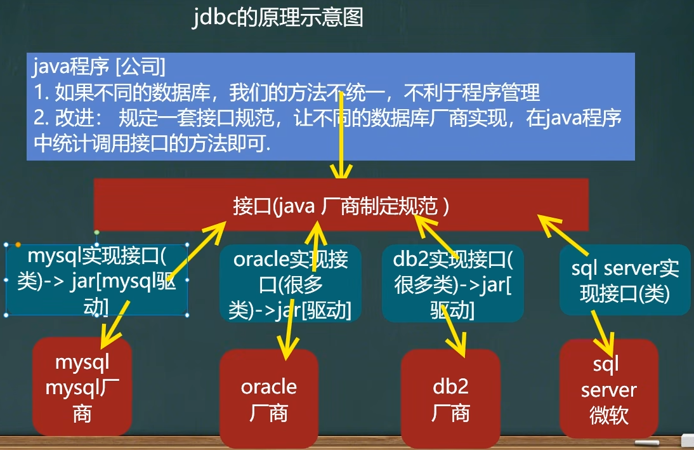
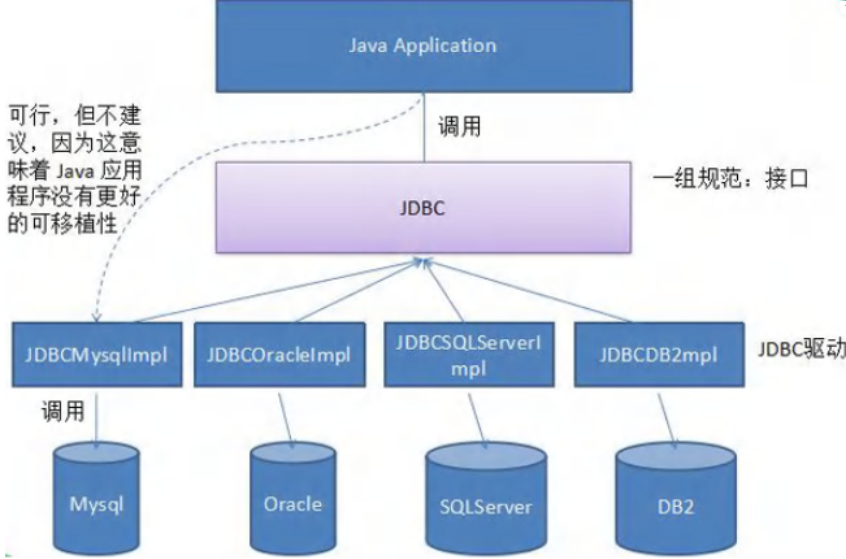
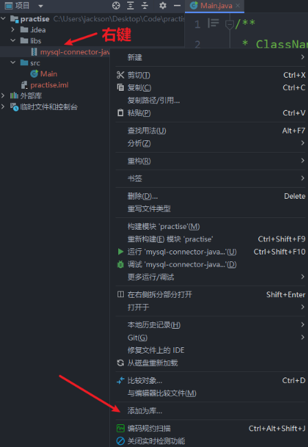
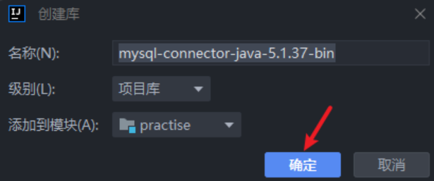

<h1 style="text-align: center; font-weight: bold;">JDBC 基本介绍</h1>

---

## 基本介绍

#### （1）JDBC 是 Java 提供<span style="color:red;font-weight:bold">一套用数据库操作的接口 API</span>，Java 程序员只需要面向这套接口编程即可，为使用者屏蔽了细节问题，不同的数据库厂商，需要针对这套接口，提供不同的实现

#### （2）Java 程序员使用 JDBC，可以连接任何提供了<span style="color:red;font-weight:bold">JDBC 驱动程序</span>的数据库系统，从而完成对数据库的各种操作

<h2>示意图</h2>

<br/>

<br/>


## 连接方法

> #### 获取 mysql-connector-java-5.1.37-bin.jar
>
> #### 安装包： https://pan.baidu.com/s/1hNC1vSXbkvOGnHNJS0SqaQ?pwd=3tn6 提取码: 3tn6

<br/>

<br/>


### 连接步骤

> #### （1）注册驱动：加载 Driver 类
>
> #### （2）获取连接：得到 Connection
>
> #### （3）执行增删改查：发送 SQL 语句给 MySQL 执行
>
> #### （4）释放资源：关闭相关连接

### 方法一

#### 步骤

#### （1）创建 Driver 对象

#### （2）指定连接的数据库

> #### url = "jdbc:mysql://数据库地址:端口号/数据库名"
>
> #### <span style="color:red;font-weight:bold">固定写法</span>：jdbc:mysql://

#### （3）利用 properties 对象设置登录信息

#### （4）调用 Driver 对象的 <span style="color:red;font-weight:bold">connect 方法，传入数据库地址和登录信息</span>，完成连接

```java
public class Main {
    public static void main(String[] args) throws Exception {
        // 创建 Driver 对象
        Driver driver = new Driver();

        /*
            指定连接的数据库
            （1）固定写法  jdbc:mysql://
            （2）填写  数据库地址:端口//数据库名
         */
        String url = "jdbc:mysql://localhost:3306/jdbc";

        // 用 properties 对象存储用户登录信息
        Properties properties = new Properties();
        // 用户名
        properties.setProperty("user","root");
        // 密码
        properties.setProperty("password","");
        // 获取连接
        Connection connect = driver.connect(url, properties);
        System.out.println(connect);
    }
}
```

### 方法二

#### 和方式一大同小异，区别在于<span style="color:red;font-weight:bold">使用反射和加载类信息</span>，提高灵活性，减少依赖

```java
public class Main {
    public static void main(String[] args) throws Exception {
        // 利用反射动态加载 Driver类，提高灵活性，减少依赖
        Class<?> clazz = Class.forName("com.mysql.jdbc.Driver");
        Driver driver = (Driver) clazz.newInstance();
        // 数据库地址
        String url = "jdbc:mysql://localhost:3306/jdbc";
        // 设置登录信息
        Properties properties = new Properties();
        properties.setProperty("user","root");
        properties.setProperty("password","");
        // 获取连接
        Connection connect = driver.connect(url, properties);
        System.out.println(connect);
    }
}
```

### 方法三

> #### 连接时候<span style="color:red;font-weight:bold">使用 DriverManager 的 registerDriver 方法</span>注册驱动
>
> #### <span style="color:red;font-weight:bold">调用 getConnection(url,user,password) 方法</span>连接

```java
public class Main {
    public static void main(String[] args) throws Exception {
        // 利用反射动态加载 Driver类，提高灵活性，减少依赖
        Class<?> clazz = Class.forName("com.mysql.jdbc.Driver");
        Driver driver = (Driver) clazz.newInstance();
        // 设置信息
        String url = "jdbc:mysql://localhost:3306/jdbc";
        String user = "root";
        String password = "";
        // 注册驱动
        DriverManager.registerDriver(driver);
        // 获取连接
        Connection connection = DriverManager.getConnection(url, user, password);
        System.out.println(connection);
    }
}
```

### ⭐ 方法四

#### 区别方法三，方法四不用注册驱动，同样可以完成连接

#### 解释：在<span style="color:red;font-weight:bold">加载 Driver 类</span>时，底层有静态代码块，类加载时<span style="color:red;font-weight:bold">完成了驱动的注册</span>

> #### 底层源码
>
> ```java
> static {
>     try {
>         DriverManager.registerDriver(new Driver());
>     } catch (SQLException var1) {
>        throw new RuntimeException("Can't register driver!");
>     }
> }
> ```

```java
public class Main {
    public static void main(String[] args) throws Exception {
        // 利用反射动态加载 Driver类，提高灵活性，减少依赖
        Class<?> clazz = Class.forName("com.mysql.jdbc.Driver");
        Driver driver = (Driver) clazz.newInstance();
        // 设置信息
        String url = "jdbc:mysql://localhost:3306/jdbc";
        String user = "root";
        String password = "";
        // 获取连接
        Connection connection = DriverManager.getConnection(url, user, password);
        System.out.println(connection);
    }
}
```

#### 温馨提醒


#### 最后简化如下

```java
public class Main {
    public static void main(String[] args) throws Exception {
        // 设置信息
        String url = "jdbc:mysql://localhost:3306/jdbc";
        String user = "root";
        String password = "";
        // 获取连接
        Connection connection = DriverManager.getConnection(url, user, password);
        System.out.println(connection);
    }
}
```

### ⭐ 方法五

#### 改进方法四，动态变化<span style="color:red;font-weight:bold">登录信息，写在配置文件中</span>，利用 properties 加载配置文件，获取相关信息

#### 配置文件信息（<span style="color:red;font-weight:bold">等号两边不要有空格</span>）

```java
user=root
password=
url=jdbc:mysql://localhost:3306/jdbc
driver=com.mysql.jdbc.Driver
```

#### 代码如下

```java
public class Main {
    public static void main(String[] args) throws IOException, ClassNotFoundException, SQLException {
        // 利用 properties 读取配置文件信息
        Properties properties = new Properties();
        properties.load(new FileInputStream("src/JDBC/connect.properties"));
        String user = properties.getProperty("user");
        String password = properties.getProperty("password");
        String url = properties.getProperty("url");
        String driver = properties.getProperty("driver");
        // 加载类（可以不写）
        Class<?> aClass = Class.forName(driver);
        // 获取连接
        Connection connection = DriverManager.getConnection(url, user, password);
        System.out.println(connection);
    }
}
```
