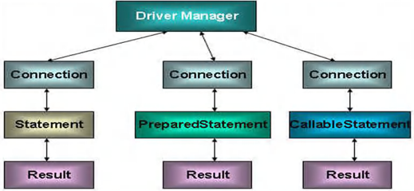
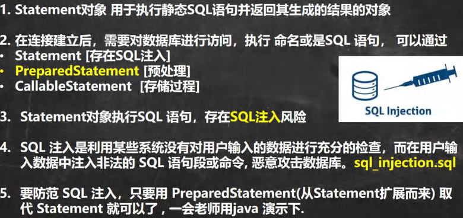
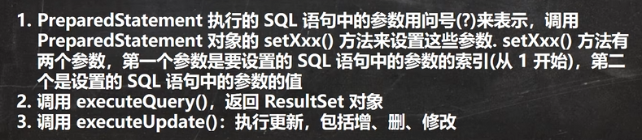
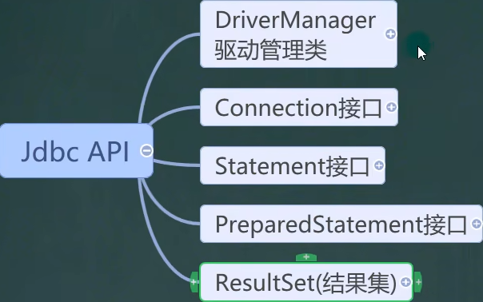
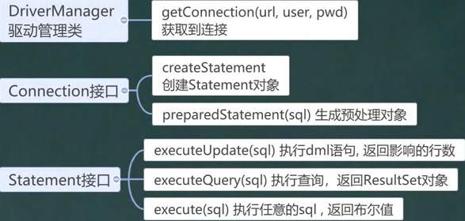
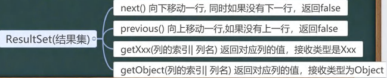

<h1 style="text-align: center; font-weight: bold;">JDBC 相关API</h1>

---

## 基本介绍

#### JDBC API 是一系列的接口，它统一和规范了应用程序与数据库的连接、执行 SQL 语句，并得到返回结果等各类操作，相关类和接口在 java.sql 和 javax.sql 包中

<br>


## ResultSet（结果集）

### 基本介绍

> #### 理解：相当有一个指针，指向表的每一行，类似于 iterator 的 hasnext 方法，如果为空，返回 false，之后通过相应的方法得到每一行的每一列内容


### 使用步骤

> #### （1）通过 properties 读取配置文件信息
>
> #### （2）注册驱动
>
> #### （3）利用 DriverManager 的 getConnection()方法获取连接
>
> #### （4）通过 Connection 对象得到 Statement 对象
>
> #### （5）调用 Statement 对象的相关方法执行 sql 语句，返回结果集
>
> #### （6）遍历结果集，使用循环遍历，输出结果
>
> #### （7）<span style="color:red;font-weight:bold">关闭连接</span>

### 相关方法

> #### xxx：表示一种数据类型
>
> #### getxxx（<span style="color:red;font-weight:bold">列索引</span>）：按照列索引返回该列的值
>
> #### getxxx（<span style="color:red;font-weight:bold">列名</span>）：直接通过列名查找某一列，并返回该列的值

### 示例代码

```java
public class Main {
    public static void main(String[] args) throws Exception {
        // 利用 properties 读取配置文件信息
        Properties properties = new Properties();
        properties.load(new FileInputStream("src/JDBC/connect.properties"));
        String user = properties.getProperty("user");
        String password = properties.getProperty("password");
        String url = properties.getProperty("url");
        String driver = properties.getProperty("driver");
        // 注册驱动
        Class<?> aClass = Class.forName(driver);
        // 获取连接
        Connection connection = DriverManager.getConnection(url, user, password);
        // 得到Statement
        Statement statement = connection.createStatement();
        // 执行 sql 语句
        String sql = "select id, name,sex from actor";
        // 获取 resultSet（结果集）
        ResultSet resultSet = statement.executeQuery(sql);
        // 使用while循环读取数据
        while (resultSet.next()){
            // 获取每一列数据
            int id = resultSet.getInt(1);
            String name = resultSet.getString(2);
            String sex = resultSet.getString(3);
            // 打印信息
            System.out.println(id + "\t" + name + "\t" + sex);
        }

        // 关闭连接
        resultSet.close();
        statement.close();
        connection.close();
    }
}
```

## Statement

### 基本介绍

> #### 用于执行静态 SQL 语句并返回其生成的结果的对象

### DQL 语句

> #### <span style="color:red;font-weight:bold">利用 ResultSet 完成查询</span>，示例代码见上方

#### 相关方法

> #### 通过 connection 对象，调用 <span style="color:red;font-weight:bold">createStatement() </span> 方法，得到 statement 对象，调用相关的方法
>
> #### DQL 语句：<span style="color:red;font-weight:bold">executeQuery()，返回 ResultSet 对象</span>

### DML 语句

#### 相关方法

> #### 通过 connection 对象，调用 <span style="color:red;font-weight:bold">createStatement() </span> 方法，得到 statement 对象，调用相关的方法
>
> #### DML 语句：<span style="color:red;font-weight:bold">executeUpate()</span>，<span style="color:red;font-weight:bold">返回</span>结果是<span style="color:red;font-weight:bold">影响的行数</span>，<span style="color:red;font-weight:bold">大于 0：执行成功</span>，否则执行失败

```java
public class Main {
    public static void main(String[] args) throws Exception {
        // 利用 properties 读取配置文件信息
        Properties properties = new Properties();
        properties.load(new FileInputStream("src/JDBC/connect.properties"));
        String user = properties.getProperty("user");
        String password = properties.getProperty("password");
        String url = properties.getProperty("url");
        String driver = properties.getProperty("driver");
        // 注册驱动
        Class<?> aClass = Class.forName(driver);
        // 获取连接
        Connection connection = DriverManager.getConnection(url, user, password);
        // 得到Statement
        Statement statement = connection.createStatement();
        // 执行 sql 语句

/*
        // 添加
        String sql = "insert into actor values(null,'candy','女')";

        // 修改
        String sql = "update actor set name = 'fancy' where name = 'candy'";

*/

        // 删除
        String sql = "delete from actor where name='fancy'";

        // 获取 resultSet（结果集）
        int rows = statement.executeUpdate(sql);

        // 结果判断
        if (rows > 0) {
            System.out.println("执行成功");
        } else {
            System.out.println("执行失败");
        }

        // 关闭连接
        statement.close();
        connection.close();
    }
}
```

### SQL 注入问题

<h3><span style="color:red;font-weight:bold">Statement 缺陷：容易产生 SQL 注入问题</span></h3>



#### 注入参数

> #### 用户名：1'or
>
> #### 万能密码：or'1'='1

```bash
SELECT * FORM actor WHERE NAME='1'OR' AND pwd=' OR '1'='1'
```

#### 漏洞问题

> #### 登录时候，只要验证能查得到有人，则登录成功（因为 '1'='1' 这个条件永远成立，结果为真）

## PrepareStatement

### 基本介绍

> #### SQL 语句中的值都采用 " ？" 的方式占位，用实际参数填入，提高代码的灵活性，同时逻辑结构也更加清晰
>
> #### 相关方法：得到 connection 对象后，使用 <span style="color:red;font-weight:bold">preparedStatement(sql)</span> 方法得到 Statement 对象，然后调用<span style="color:red;font-weight:bold">一系列 set 方法给 sql 语句的?占位赋值</span>
>
> #### 注意：<span style="color:red;font-weight:bold">关键字、列名、表名不能使用 ?</span>，只用于动态变化的参数



### 优势

> #### （1）不再使用 + 拼接 SQL 语句，减少语法错误
>
> #### （2）有效的<span style="color:red;font-weight:bold">解决了 SQL 问题</span>
>
> #### （3）大大减少了编译次数，<span style="color:red;font-weight:bold">效率较高</span>

### DQL 语句

```java
public class Main {
    public static void main(String[] args) throws Exception {
        Properties properties = new Properties();
        properties.load(new FileInputStream("src/JDBC/connect.properties"));
        String user = properties.getProperty("user");
        String password = properties.getProperty("password");
        String url = properties.getProperty("url");
        String driver = properties.getProperty("driver");
        // 注册驱动
        Class<?> aClass = Class.forName(driver);
        // 获取连接
        Connection connection = DriverManager.getConnection(url, user, password);
        // sql 语句
        String sql = "select name,sex from actor where sex=?";
        // 获取 Statement 对象
        PreparedStatement preparedStatement = connection.prepareStatement(sql);
        // 利用set方法给 ? 占位赋值
        preparedStatement.setString(1, "男"); // 第一个问号
        // 调用方法执行 sql 语句（注意，这里不要传入 sql，已经通过prepareStatement的一系列set方法设置了参数）
        ResultSet resultSet = preparedStatement.executeQuery();
        // 循环遍历，打印信息
        while (resultSet.next()) {
            String name = resultSet.getString(1);
            String sex = resultSet.getString(2);
            System.out.println("姓名：" + name + "\t" + "性别：" + sex);
        }

        // 关闭资源
        resultSet.close();
        preparedStatement.close();
        connection.close();
    }
}
```

### DML 语句

> #### 调用<span style="color:red;font-weight:bold">executeUpate()</span>方法，<span style="color:red;font-weight:bold">返回</span>结果是<span style="color:red;font-weight:bold">影响的行数</span>，<span style="color:red;font-weight:bold">大于 0：执行成功</span>，否则执行失败

```java
public class Main {
    public static void main(String[] args) throws Exception {
        Properties properties = new Properties();
        properties.load(new FileInputStream("src/JDBC/connect.properties"));
        String user = properties.getProperty("user");
        String password = properties.getProperty("password");
        String url = properties.getProperty("url");
        String driver = properties.getProperty("driver");
        // 注册驱动
        Class<?> aClass = Class.forName(driver);
        // 获取连接
        Connection connection = DriverManager.getConnection(url, user, password);
        // sql 语句
        String sql = "insert into actor values (null,?,?)"; // 添加

/*
        // 修改
        String sql = "update actor set name = ? where name = ?";

        // 删除
        String sql = "delete from actor where name= ?";
*/

        // 获取 Statement 对象
        PreparedStatement preparedStatement = connection.prepareStatement(sql);
        // 利用set方法给 ? 占位赋值
        preparedStatement.setString(1, "fancy"); // 第一个问号
        preparedStatement.setString(2, "女"); // 第二个问号
        // 调用方法执行 sql 语句（注意，这里不要传入 sql，已经通过prepareStatement的一系列set方法设置了参数）
        int rows = preparedStatement.executeUpdate();
        // 判断是否成功
        if (rows > 0) {
            System.out.println("执行成功");
        } else {
            System.out.println("执行失败");
        }
        // 关闭资源
        preparedStatement.close();
        connection.close();
    }
}
```

### ⭐ 注意点

> #### preparedstatement 是通过一些列 set 方法来给 sql 语句中的通配符 ? 赋值的，<span style="color:red;font-weight:bold">当调用相关方法（ executeQuery( ) 或 executeUpdate( ) ）时不需要传入 sql 语句</span>，否则会出现语法错误（因为 ? 是不合规范的 sql 语句）

## API 小结


<hr/>

<hr/>

<hr/>

<hr/>
