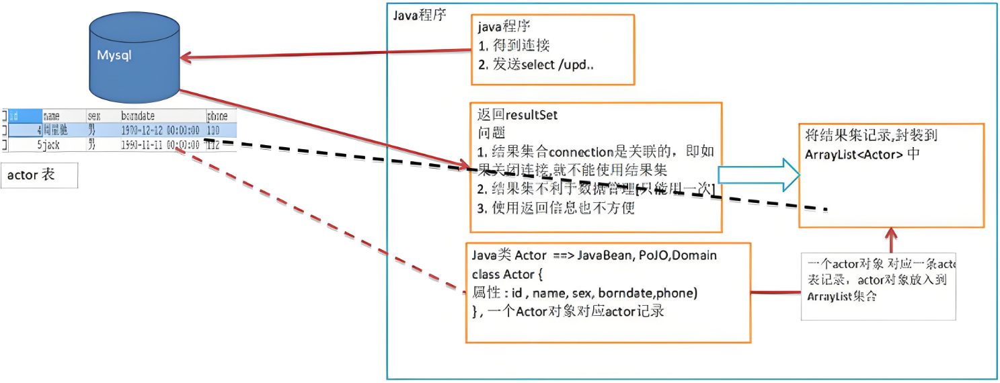
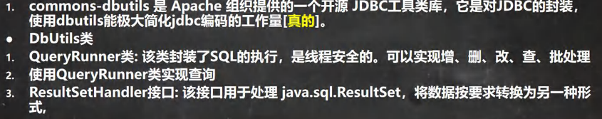
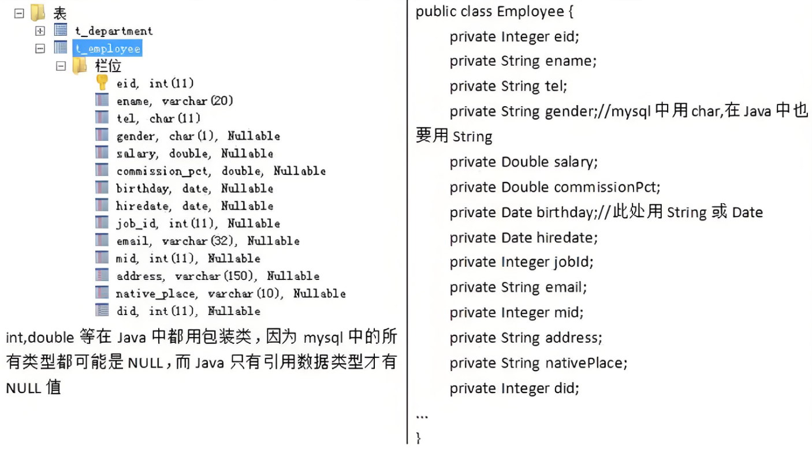
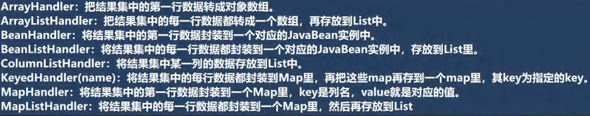

<h1 style="text-align: center; font-weight: bold;">Apache——DBUtils</h1>

---

## 引入外部库

> #### 获取 commons-dbutils-1.3
>
> #### 安装包： https://pan.baidu.com/s/1hNC1vSXbkvOGnHNJS0SqaQ?pwd=3tn6 提取码: 3tn6
>
> #### 使用方法：拷贝 jar 包到 libs 文件目录下，右键添加为库，可以参考前面获取 mysql-connector-java-5.1.37-bin.jar 的操作

## 问题引入

> #### （1）关闭 connection 后，<span style="color:red;font-weight:bold">resultSet 结果集无法使用</span>
>
> #### （2）resultSet 不利于数据的管理

## 基本介绍

> #### 使用该工具类，可以将 resultSet 的内容<span style="color:red;font-weight:bold">映射</span>到一个类中，每一个列属性就对应一个字段，然后把每一条记录封装成对象放到 <span style="color:red;font-weight:bold">ArrayList</span> 集合中，即使关闭 connection，仍然可以获取结果集的内容





## 数据库表映射

#### 基本介绍

> #### 将数据库的列信息<span style="color:red;font-weight:bold">映射</span>为一个类，称这个类为：<span style="color:red;font-weight:bold">Javabean，POJO，Domian 对象</span>

#### 数据库类型映射表



## 相关方法

> #### 首先<span style="color:red;font-weight:bold">创建 QueryRunner 对象</span>
>
> #### DQL 语句：调用 <span style="color:red;font-weight:bold">query()</span> 方法
>
> #### DML 语句：调用 <span style="color:red;font-weight:bold">update()</span> 方法

## 结合 DruidUtils 工具类

```java
public class JDBCUtils_Druid {
    private static DataSource dataSource;

    // 静态代码块初始化
    static {
        // 读取配置文件信息
        Properties properties = new Properties();

        try {
            properties.load(new FileInputStream("src/druid.properties"));
            dataSource = DruidDataSourceFactory.createDataSource(properties);
        } catch (Exception e) {
            e.printStackTrace();
        }

    }

    // 连接方法
    public static Connection getConnection() throws SQLException {
        return dataSource.getConnection();
    }

    // 关闭连接（注意：这里不是真的断掉连接，只是把使用的Connection对象放回连接池）
    public static void close(ResultSet resultSet, Connection connection, Statement statement){
        try {
            if (resultSet != null) {
                resultSet.close();
            }
            if (connection != null) {
                connection.close();
            }
            if (statement != null) {
                statement.close();
            }
        } catch (SQLException e) {
            /*
                实际开发中常用下面的方式处理
                1. 将编译异常转为运行异常
                2. 调用者可以选择捕获该异常，也可以选择默认处理该异常，比较方便
             */
            throw new RuntimeException(e);
        }
    }
}
```

## 映射类：Actor

```java
import java.util.Date;

public class Actor { //Javabean, POJO, Domain对象

    private Integer id;
    private String name;
    private String sex;
    private Date borndate;
    private String phone;

    public Actor() { //一定要给一个无参构造器[反射需要]
    }

    public Actor(Integer id, String name, String sex, Date borndate, String phone) {
        this.id = id;
        this.name = name;
        this.sex = sex;
        this.borndate = borndate;
        this.phone = phone;
    }

    public Integer getId() {
        return id;
    }

    public void setId(Integer id) {
        this.id = id;
    }

    public String getName() {
        return name;
    }

    public void setName(String name) {
        this.name = name;
    }

    public String getSex() {
        return sex;
    }

    public void setSex(String sex) {
        this.sex = sex;
    }

    public Date getBorndate() {
        return borndate;
    }

    public void setBorndate(Date borndate) {
        this.borndate = borndate;
    }

    public String getPhone() {
        return phone;
    }

    public void setPhone(String phone) {
        this.phone = phone;
    }

    @Override
    public String toString() {
        return "\nActor{" +
                "id=" + id +
                ", name='" + name + '\'' +
                ", sex='" + sex + '\'' +
                ", borndate=" + borndate +
                ", phone='" + phone + '\'' +
                '}';
    }
}
```

## DQL 语句

### 基本介绍

> #### 首先<span style="color:red;font-weight:bold">创建 QueryRunner 对象</span>
>
> #### 调用 <span style="color:red;font-weight:bold">query(connection,sql,new BeanListHandler<>(映射类.class),...)</span> 方法，返回的是一个集合，遍历集合即可显示表的查询信息
>
> #### ⭐ 关闭资源：底层会得到 resultset，会在 query 关闭，其次还会得到 preparedStatment 对象并关闭，只需要<span style="color:red;font-weight:bold">关闭 connection 即可</span>

### 参数说明

> #### connection：可以利用 JDBCUtils_Druid 获取连接
>
> #### sql：传入需要执行的 sql 语句
>
> #### new BeanListHandler<>()：将结果集中的每一行数据都封装到一个对应的 javabean 实例中，存放在 List 里（还可以 new 其他类，根据查询需求选择，具体如下图）
>
> #### 映射类.class：通过反射，拿到结果集中的信息，并把这个对象封装到 ArrayList 中
>
> #### ... ：这是<span style="color:red;font-weight:bold">可变参数</span>，当 sql 语句中<span style="color:red;font-weight:bold">有多个 ? 时</span>，这个时候就可以<span style="color:red;font-weight:bold">填多个值</span>，和 ? 一一对应

### 内容查询参数类



### 全表查询

> #### new <span style="color:red;font-weight:bold">BeanListHandler</span><>()

```java
public static void query() throws Exception{
    // 获取连接
    Connection connection = JDBCUtils_Druid.getConnection();
    // 获取 QueryRunner 对象，用它去调用相应的方法
    QueryRunner queryRunner = new QueryRunner();
    // 定义 sql 语句
    String sql = "select * from actor";
    // 调用查询方法
    List<Actor> list = queryRunner.query(connection,sql,new BeanListHandler<>(Actor.class));
    // 遍历，打印查询信息
    for (Actor actor:list){
        System.out.println(actor);
    }
    // 关闭资源
    JDBCUtils_Druid.close(null,connection,null);
}
```

### 单行查询

> #### new <span style="color:red;font-weight:bold">BeanHandler</span><>()，返回的是当行记录，对应单个对象

```java
public static void query() throws Exception{

    // 获取连接
    Connection connection = JDBCUtils_Druid.getConnection();
    // 获取 QueryRunner 对象，用它去调用相应的方法
    QueryRunner queryRunner = new QueryRunner();
    // 定义 sql 语句
    String sql = "select * from actor where id = ?";
    // 调用查询方法
    Actor query = queryRunner.query(connection, sql, new BeanHandler<>(Actor.class),10);
    // 打印查询信息
    System.out.println(query);
    // 关闭资源
    JDBCUtils_Druid.close(null,connection,null);
}
```

### 单行单列查询

> #### new <span style="color:red;font-weight:bold">ScalarHandler</span>()，返回单个对象
>
> #### ScalarHandler() <span style="color:red;font-weight:bold">不需要传入类.class</span>

```java
public static void query() throws Exception{

    // 获取连接
    Connection connection = JDBCUtils_Druid.getConnection();
    // 获取 QueryRunner 对象，用它去调用相应的方法
    QueryRunner queryRunner = new QueryRunner();
    // 定义 sql 语句
    String sql = "select name from actor where id = ?";
    // 调用查询方法
    Object query = queryRunner.query(connection, sql, new ScalarHandler(), 10);
    // 打印查询信息
    System.out.println(query);
    // 关闭资源
    JDBCUtils_Druid.close(null,connection,null);
}
```

## DML 语句

### 基本介绍

> #### 首先<span style="color:red;font-weight:bold">创建 QueryRunner 对象</span>
>
> #### 调用 <span style="color:red;font-weight:bold">update(connection,sql,...)</span> 方法，返回的是<span style="color:red;font-weight:bold">影响的行数</span>
>
> #### ⭐ 关闭资源：底层会得到 resultset，会在 query 关闭，其次还会得到 preparedStatment 对象并关闭，只需要<span style="color:red;font-weight:bold">关闭 connection 即可</span>

### 参数说明

> #### connection：可以利用 JDBCUtils_Druid 获取连接
>
> #### sql：传入需要执行的 sql 语句
>
> #### ... ：这是<span style="color:red;font-weight:bold">可变参数</span>，当 sql 语句中<span style="color:red;font-weight:bold">有多个 ? 时</span>，这个时候就可以<span style="color:red;font-weight:bold">填多个值</span>，和 ? 一一对应

### 示例代码

```java
public static void query() throws Exception {

    // 获取连接
    Connection connection = JDBCUtils_Druid.getConnection();
    // 获取 QueryRunner 对象，用它去调用相应的方法
    QueryRunner queryRunner = new QueryRunner();
    // 定义 sql 语句
    String sql = "insert into actor values (null,'john502','男')";
    // 调用查询方法
    int rows = queryRunner.update(connection,sql);
    // 判断是否执行
    if (rows > 0) {
        System.out.println("执行成功");
    } else {
        System.out.println("执行失败");
    }
    // 关闭资源
    JDBCUtils_Druid.close(null, connection, null);
}
```
