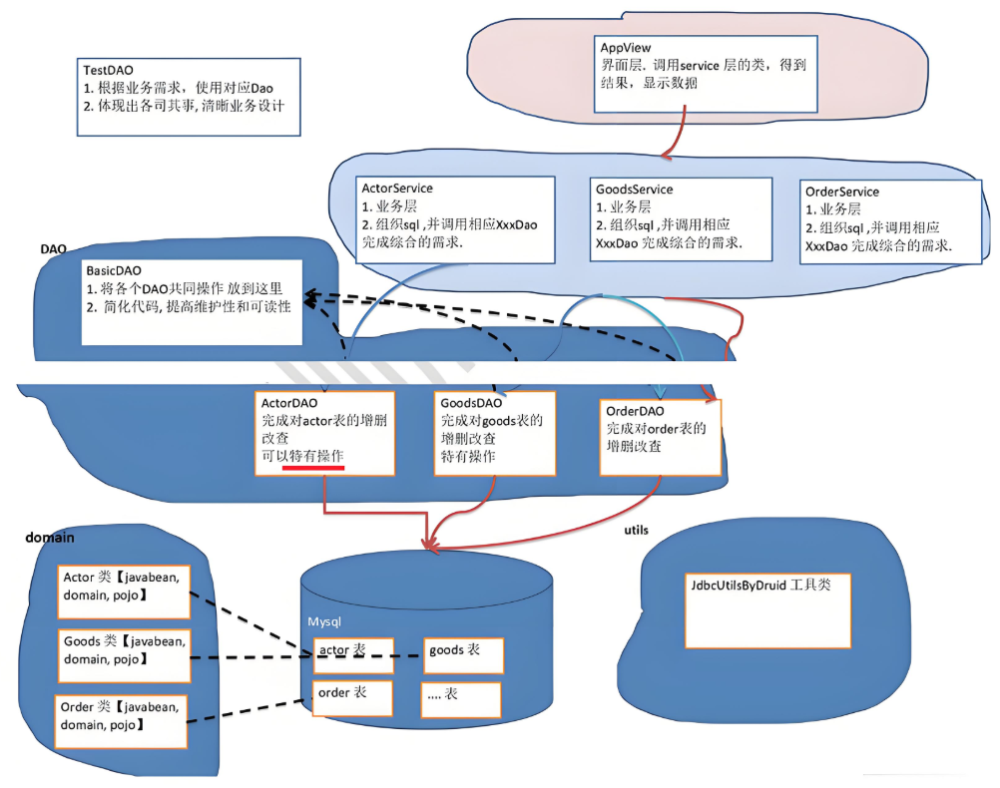

<h1 style="text-align: center; font-weight: bold;">DAO</h1>

---

## 问题引入

#### apache-dbutils+Druid 简化了 JDBC 开发，但还有不足

> #### （1）SQL <span style="color:red;font-weight:bold">语句是固定</span>，不能通过参数传入，通用性不好，需要进行改进，更方便执行增删改查
>
> #### （2）对于 select 操作，如果有返回值，<span style="color:red;font-weight:bold">返回类型不能固定</span>，需要使用泛型
>
> #### （3）将来的表很多，业务需求复杂，不可能只靠一个 Java 类完成

#### 总结：当表很多的时候，由于 sql 语句固定，这样就要编写很多个工具类，不够高效、灵活，然而有很多相同的部分就导致了代码冗余，这个时候可以通过<span style="color:red;font-weight:bold">封装</span>的思想，调用对应的方法来完成业务需求

## 基本介绍

> #### （1）DAO： data access object（理解：访问数据库的对象即可）
>
> #### （2）这样的<span style="color:red;font-weight:bold">通用类</span>，称为 <span style="color:red;font-weight:bold">BasicDao</span>，是专门和数据库交互的，即完成对数据库 (表) 的 crud 操作。
>
> #### （3）在 BaiscDao 的基础上，实现<span style="color:red;font-weight:bold">一张表对应一个 Dao</span>，更好的完成功能<br>比如 Customer 表 - Customer.java 类 (javabean)-CustomerDao.java



## 设计思路

#### 基本思路

> #### 连接数据库-->完成 CRUD 操作-->关闭连接

#### 工具类包：utils

> #### DruidUtils：利用封装好的工具类完成数据库的连接，资源的关闭

#### 映射包：domain

> #### 将每一张数据库表做成 javabean（domain 类）

#### DAO 包

> #### basicdao：存放共有的操作（DML,DQL 语句）
>
> #### 每张表的 DAO：<span style="color:red;font-weight:bold">继承 basicdao</span>，拥有父类的方法，在<span style="color:red;font-weight:bold">自己的类中可以写特有的方法</span>

#### 测试类包：test

## 导入外部库

> #### 获取 druid-1.1.10、commons-dbutils-1.3
>
> #### 安装包： https://pan.baidu.com/s/1hNC1vSXbkvOGnHNJS0SqaQ?pwd=3tn6 提取码: 3tn6
>
> #### 使用方法：拷贝 jar 包到 libs 文件目录下，右键添加为库，可以参考前面获取 mysql-connector-java-5.1.37-bin.jar 的操作

## Actor

```java
package DAO.domain;

import java.util.Date;

public class Actor { //Javabean, POJO, Domain对象

    private Integer id;
    private String name;
    private String sex;

    //一定要给一个无参构造器(反射需要)
    public Actor() {
    }

    public Actor(Integer id, String name, String sex, Date borndate, String phone) {
        this.id = id;
        this.name = name;
        this.sex = sex;
    }

    public Integer getId() {
        return id;
    }

    public void setId(Integer id) {
        this.id = id;
    }

    public String getName() {
        return name;
    }

    public void setName(String name) {
        this.name = name;
    }

    public String getSex() {
        return sex;
    }

    public void setSex(String sex) {
        this.sex = sex;
    }

    @Override
    public String toString() {
        return "Actor{" +
                "id=" + id +
                ", name='" + name + '\'' +
                ", sex='" + sex + '\'' +
                '}';
    }
}
```

## JDBCUtils_Druid

```java
package DAO.utils;


import com.alibaba.druid.pool.DruidDataSourceFactory;

import javax.sql.DataSource;
import java.io.FileInputStream;
import java.sql.Connection;
import java.sql.ResultSet;
import java.sql.SQLException;
import java.sql.Statement;
import java.util.Properties;

public class JDBCUtils_Druid {
    private static DataSource dataSource;

    // 静态代码块，完成初始化工作
    static {
        Properties properties = properties = new Properties();
        try {
            properties.load(new FileInputStream("src/druid.properties"));
            // 调用方法读取信息
            dataSource = DruidDataSourceFactory.createDataSource(properties);
        } catch (Exception e) {
            throw new RuntimeException(e);
        }
    }

    // 获取连接
    public Connection getConnection() throws SQLException {
        return dataSource.getConnection();
    }

    // 关闭连接
    // 关闭连接（注意：这里不是真的断掉连接，只是把使用的Connection对象放回连接池）
    public static void close(ResultSet resultSet, Connection connection, Statement statement){
        try {
            if (resultSet != null) {
                resultSet.close();
            }
            if (connection != null) {
                connection.close();
            }
            if (statement != null) {
                statement.close();
            }
        } catch (SQLException e) {
            /*
                实际开发中常用下面的方式处理
                1. 将编译异常转为运行异常
                2. 调用者可以选择捕获该异常，也可以选择默认处理该异常，比较方便
             */
            throw new RuntimeException(e);
        }
    }
}
```

## basicdao

```java
package DAO.dao;

import JDBC.JDBCUtils_Druid;
import org.apache.commons.dbutils.QueryRunner;
import org.apache.commons.dbutils.handlers.BeanHandler;
import org.apache.commons.dbutils.handlers.BeanListHandler;
import org.apache.commons.dbutils.handlers.ScalarHandler;

import java.sql.Connection;
import java.sql.SQLException;
import java.util.List;

// 使用泛型，指定接收某个类
public class basicdao<T> {
    // 使用 DBUtils，首先需要创建 QueryRunner对象
    QueryRunner queryRunner = new QueryRunner();

    // 查询全表
    public List<T> queryTable(String sql, Class<T> clazz,Object...parameters){
        Connection connection = null;
        try {
            // 获取连接
           connection = JDBCUtils_Druid.getConnection();
            // 返回结果
            return queryRunner.query(connection,sql,new BeanListHandler<T>(clazz),parameters);
        } catch (SQLException e) {
            throw new RuntimeException(e);
        }finally {
            JDBCUtils_Druid.close(null,connection,null);
        }
    }

    // 单行查询
    public T queryLine(String sql,Class<T> clazz,Object...parameters){
        Connection connection = null;
        try {
            // 获取连接
            connection = JDBCUtils_Druid.getConnection();
            // 返回结果
            return queryRunner.query(connection,sql,new BeanHandler<T>(clazz),parameters);
        } catch (SQLException e) {
            throw new RuntimeException(e);
        } finally {
            JDBCUtils_Druid.close(null,connection,null);
        }
    }

    // 单行单列查询
    public Object queryValue(String sql,Object...parameters){
        Connection connection = null;
        try {
            // 获取连接
            connection = JDBCUtils_Druid.getConnection();
            // 返回结果
            return queryRunner.query(connection,sql,new ScalarHandler(),parameters);
        } catch (SQLException e) {
            throw new RuntimeException(e);
        } finally {
            JDBCUtils_Druid.close(null,connection,null);
        }
    }

    // DML语句（返回的是影响的行数）
    public int update(String sql,Object...parameters){
        Connection connection = null;
        try {
            // 获取连接
            connection = JDBCUtils_Druid.getConnection();
            // 返回结果
            int rows = queryRunner.update(connection,sql,parameters);
            return rows;
        } catch (SQLException e) {
            throw new RuntimeException(e);
        } finally {
            JDBCUtils_Druid.close(null,connection,null);
        }
    }

}
```

## actordao

```java
package DAO.dao;

import DAO.domain.Actor;

// 注意继承时需要指定类型(javabean)
public class actordao extends basicdao<Actor>{
    // 共有的内容都放到 basicdao 中
    // 该类可以声明特有的方法
}
```

## dao_test

```java
package DAO.dao_test;

import DAO.dao.actordao;
import DAO.domain.Actor;

import java.util.List;

public class dao_test {
    public static void main(String[] args) {
        // 创建表的domain对象（dao）
        actordao actordao = new actordao();

        // 调方法完成 CRUD 操作

        // 查询全表
        List<Actor> list = actordao.queryTable("select * from actor", Actor.class);
        for (Actor actor : list) {
            System.out.println(actor);
        }

        // 单行查询
        Actor actor = actordao.queryLine("select * from actor where id=?", Actor.class, 6);
        System.out.println(actor);

        // 单行单列查询
        Object o = actordao.queryValue("select name from actor where id = ?", Actor.class, 6);
        System.out.println(o);

        // DML 语句
        int update = actordao.update("insert into actor values(?,?,?)", null, "john506", "男");
        System.out.println(update > 0 ? "执行成功" : "执行失败");
    }
}
```
