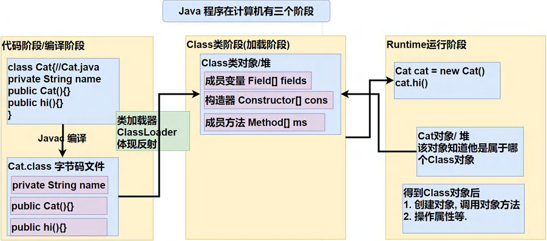
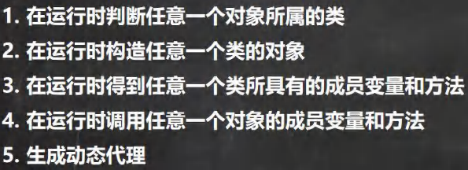
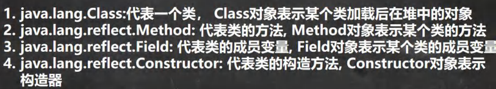

<h1 style="text-align: center; font-weight: bold;">反射</h1>

---

## 1. 反射引出

在配置文件中存储了不同的类信息和方法，要求创建该类，然后对该类的属性和方法进行操作

> 思路
>
> - 首先创建 properties 类，读取配置文件的信息
> - 问题来了：<span style = "color:red;font-weight:bold">我们只能获取信息，但是不能通过返回的信息创建类示例</span>，**因为返回的类型是**<span style = "color:red;font-weight:bold">字符串</span>，不可能取创建一个字符串~~😂😂

## 2. 基本介绍

1. **反射机制允许程序在执行期借助于 <span style = "color:red;font-weight:bold">Reflection</span> API 取得任何类的内部信息(比如<span style = "color:red;font-weight:bold">成员变量，构造器，成员方法等等</span>)，并能操作对象的属性及方法。反射在<span style = "color:red;font-weight:bold">设计模式和框架</span>底层都会用到**

2. **加载完类之后，在堆中就产生了一个 Class 类型的对象（<span style = "color:red;font-weight:bold">一个类只有一个 Class 对象</span>），这个对象<span style = "color:red;font-weight:bold">包含了类的完整结构信息</span>。通过这个对象得到类的结构。这个 Class 对象就像一面镜子，透过这个镜子看到类的结构，所以，形象的称之为：反射**

3. 内容补充

   > <span style = "color:red;font-weight:bold">设计模式的 OCP 原则（开闭原则）： 不能修改源码，但是需要扩展功能，这就能用到反射</span><span style = "font-weight:bold">（在后续学习<span style = "color:red;font-weight:bold">框架</span>还会遇到很多的需求，都需要使用反射解决） </span>

4. 简单理解：**通过反射可以直接操作类的属性和方法，这会非常方便**
   > 引出问题的解决：无论配置文件写什么内容，只要知道类的名称就可以操作，提高了代码的复用性，提高开发效率

## 3. ⚠️ 反射原理图



1. 一个类可以创建多个多项实例，但是<span style = "color:red;font-weight:bold">类加载只会执行一次</span>

2. 在进行类加载时，通过<span style = "color:red;font-weight:bold">类加载器</span>在<span style = "color:red;font-weight:bold">堆中</span>会生成一个该类的 Class 对象，同时加载该类的信息（**字段，构造器，方法**），把他们<span style = "color:red;font-weight:bold">当作对象对待</span>，存放在一个数组中

3. 类加载后，对象在<span style = "color:red;font-weight:bold">堆中</span>**被创建**，同时，<span style = "color:red;font-weight:bold">这个对象知道他是属于哪个 Class 对象</span>（<span style = "color:blue;font-weight:bold">即 Class 对象的类型）</span>，**这也就解释了为什么可以通过这个对象拿到他所关联的那个 Class 对象**，**拿到该类的 Class 对象之后，就可以**<span style = "color:red;font-weight:bold">在不修改源码的条件下</span> **对该类进行操作**

## 4. 反射机制的作用



## 5. 反射相关的类



### 补充方法

- **获取类的 Class 对象： <span style = "color:red;font-weight:bold">Class.forName</span>(类的路径)**，<span style = "color:red;font-weight:bold">会有异常</span>**，需要抛出或者捕获**
- **通过该类的 Class 对象创建该类的一个实例对象：**<span style = "color:red;font-weight:bold">newInstance()</span>，**返回的是** <span style = "color:red;font-weight:bold">Object 对象</span>，<span style = "color:red;font-weight:bold">会有异常</span>**，需要抛出或者捕获**

### （1）Method

- **getMethod(字符串)：通过 该类的 Class 对象调用该方法，传入方法名**
- **invoke(类对象)：得到 Method 对象后，通过这个方法调用类的方法，**<span style = "color:red;font-weight:bold">会有异常</span>**，需要抛出或者捕获**

### （2）Field

- **getField()：通过 该类的 Class 对象得到字段对象，之后调用 get()方法根据字段获得属性值**
- **get(类对象)：通过 Field 对象获得某个类的指定字段值**
- **注意：<span style = "color:red;font-weight:bold">只能获取 public 修饰的属性</span>，否则会抛出 <span style = "color:red;font-weight:bold">NoSuchFieldException 异常</span>**

### （3）Constructor

- **注意：如果是<span style = "color:red;font-weight:bold">有参</span>构造器，传入参数类型应该是**<span style = "color:red;font-weight:bold">该数据类型的 Class 对象</span>

### 代码示例

```java
package reflect;

import java.lang.reflect.Constructor;
import java.lang.reflect.Field;
import java.lang.reflect.Method;

public class reflect {
    public static void main(String[] args) throws Exception {

        // 拿到 dog 类的 Class 对象
        Class cls = Class.forName("reflect.Dog");

        // 通过 Class 对象创建 dog 类的一个对象示例
        Object o = cls.newInstance();

        // Method 方法
        Method method = cls.getMethod("hi"); // 首先获得 method 对象
        method.invoke(o); // invoke 方法调用类的方法

        // Field 方法
        Field field = cls.getField("name");
        String name = field.get(o).toString(); // 获取 dog 类的 name属性
        System.out.println("dog类中name：" + name);

        // Constructor 方法

        // 无参构造器
        Constructor constructor = cls.getConstructor();
        System.out.println(constructor);

        // 含有 String 参数的构造器
        Constructor constructor1 = cls.getConstructor(String.class);
        System.out.println(constructor1);
    }
}

// 输出示例
hi~
dog类中name：white
public reflect.Dog()
public reflect.Dog(java.lang.String)
```

## 6. ⭐ 常用方法（获取类信息）

### 第一组：Class 类

| 方法名                      | 功能描述                                                                                                                                           |
| --------------------------- | -------------------------------------------------------------------------------------------------------------------------------------------------- |
| getName                     | 获取全类名                                                                                                                                         |
| getSimpleName               | 获取简单类名                                                                                                                                       |
| getField**s**               | 获取<span style = "color:red;font-weight:bold">所有 public</span> 修饰的属性，<span style = "color:red;font-weight:bold">包含本类以及父类的</span> |
| getDeclaredFields           | 获取本类中<span style = "color:red;font-weight:bold">所有</span>属性                                                                               |
| getMethod**s**              | 获取<span style = "color:red;font-weight:bold">所有 public</span> 修饰的方法，<span style = "color:red;font-weight:bold">包含本类以及父类的</span> |
| getDeclaredMethod**s**      | 获取本类中<span style = "color:red;font-weight:bold">所有</span>方法                                                                               |
| getConstructor**s**         | 获取本类<span style = "color:red;font-weight:bold">所有 public</span> 修饰的构造器                                                                 |
| getDeclaredConstructor**s** | 获取本类<span style = "color:red;font-weight:bold">所有</span>构造器                                                                               |
| getPackage                  | 以 Package 形式返回包信息                                                                                                                          |
| getSuperClass               | 以 Class 形式返回父类信息                                                                                                                          |
| getInterfaces               | 以 Class[] 形式返回接口信息                                                                                                                        |
| getAnnotation**s**          | 以 Annotation[] 形式返回注解信息                                                                                                                   |

##### 注意

1. getConstructors，<span style = "color:red;font-weight:bold">不包含父类</span>构造器

2. 包含 Defalut 就可以获得本类所有的（字段，构造器，方法...），但是<span style = "color:red;font-weight:bold">无法访问 private</span>

### 第二组：Feild 类

| 序号 | 方法名       | 说明                                                              |
| ---- | ------------ | ----------------------------------------------------------------- |
| 1    | getModifiers | 以 int 形式返回修饰符                                             |
| 2    | getType      | <span style = "color:red;font-weight:bold">返回 Class 类型</span> |
| 3    | getName      | 返回属性名                                                        |

<h4>getModifiers 说明</h4>

> - 默认修饰符是 0
> - public 是 1
> - private 是 2
> - protected 是 4
> - static 是 8
> - final 是 16
> - 如果是组合使用，则相加，如 **public(1) + static (8) = 9**

### 第三组：Method 类

| 序号 | 方法名            |                                                              说明                                                               |
| ---- | ----------------- | :-----------------------------------------------------------------------------------------------------------------------------: |
| 1    | getModifiers      |                                                      以 int 形式返回修饰符                                                      |
| 2    | getName           |                                                           返回方法名                                                            |
| 3    | getParameterTypes | 以 <span style = "color:red;font-weight:bold">Class[]</span> 返回<span style = "color:red;font-weight:bold">参数类型</span>数组 |
| 4    | getReturnType     |                           以 <span style = "color:red;font-weight:bold">Class</span> 形式获取返回类型                           |

<h4>getModifiers 说明</h4>

> - 默认修饰符是 0
> - public 是 1
> - private 是 2
> - protected 是 4
> - static 是 8
> - final 是 16
> - 如果是组合使用，则相加，如 **public(1) + static (8) = 9**

### 第四组：Contstructor 类

| 方法名            | 功能说明                                                                                                                     |
| ----------------- | ---------------------------------------------------------------------------------------------------------------------------- |
| getModifiers      | 以 int 形式返回修饰符                                                                                                        |
| getName           | 返回构造器名（<span style = "color:red;font-weight:bold">全类名</span>）                                                     |
| getParameterTypes | <span style = "color:red;font-weight:bold">Class[]</span> 返回<span style = "color:red;font-weight:bold">参数类型</span>数组 |

<h4>getModifiers 说明</h4>

> - 默认修饰符是 0
> - public 是 1
> - private 是 2
> - protected 是 4
> - static 是 8
> - final 是 16
> - 如果是组合使用，则相加，如 **public(1) + static (8) = 9**

## 7. 反射操作对象

### （1）创建对象（构造器）

| 方法名                                 | 功能说明                                                                                                                                       |
| -------------------------------------- | ---------------------------------------------------------------------------------------------------------------------------------------------- |
| newInstance                            | 调用类中的<span style = "color:red;font-weight:bold">无参</span>构造器，<span style = "color:red;font-weight:bold">返回 Object 对象</span>     |
| getConstructor(Class... clazz)         | 根据<span style = "color:red;font-weight:bold">参数列表</span>，获取对应的 <span style = "color:red;font-weight:bold">public</span> 构造器对象 |
| getDeclaredConstructor(Class... clazz) | 根据<span style = "color:red;font-weight:bold">参数列表</span>，获取对应的所有构造器对象（包含非 public 修饰的）                               |

#### 注意：如果需要指定构造器创建对象实例，拿到构造器对象后，使用<span style = "color:red;font-weight:bold">构造器对象 . newInstance()</span>方法创建对象实例

### （2）字段

| 方法名                                                                                 | 功能说明                                                                                                                                           |
| -------------------------------------------------------------------------------------- | -------------------------------------------------------------------------------------------------------------------------------------------------- |
| getField**s**                                                                          | 获取<span style = "color:red;font-weight:bold">所有 public</span> 修饰的属性，<span style = "color:red;font-weight:bold">包含本类以及父类的</span> |
| getDeclaredFields                                                                      | 获取本类中<span style = "color:red;font-weight:bold">所有</span>属性                                                                               |
| Method 对象.set(对象 / <span style = "color:red;font-weight:bold">null</span>，属性值) | 设置属性值，但是不修改源码                                                                                                                         |
| Method 对象.get(对象 / <span style = "color:red;font-weight:bold">null</span>)         | 根据 Method 对象获取属性值                                                                                                                         |

##### 说明：如果是<span style = "color:red;font-weight:bold">静态属性，可以写成空</span>，因为静态变量是在类的加载完成初始化的，<span style = "color:red;font-weight:bold">不需要依赖任何对象实例</span>

### （3）方法

| 方法名                                                                                                                              | 功能说明                                                                                                                                           |
| ----------------------------------------------------------------------------------------------------------------------------------- | -------------------------------------------------------------------------------------------------------------------------------------------------- |
| getMethod**s**                                                                                                                      | 获取<span style = "color:red;font-weight:bold">所有 public</span> 修饰的方法，<span style = "color:red;font-weight:bold">包含本类以及父类的</span> |
| getDeclaredMethod**s**                                                                                                              | 获取本类中<span style = "color:red;font-weight:bold">所有</span>方法                                                                               |
| Method 对象.<span style = "color:red;font-weight:bold">invoke</span>(对象 / <span style = "color:red;font-weight:bold">null</span>) | 调用对象的方法                                                                                                                                     |

##### 说明

##### （1）如果是<span style = "color:red;font-weight:bold">静态方法，可以写成空</span>，因为静态方法是直接通过类名来调用的，<span style = "color:red;font-weight:bold">不需要依赖任何对象实例</span>

##### （2）如果方法有返回值，统一<span style = "color:red;font-weight:bold">返回 Object 对象</span>

## 8. ⭐ 反射爆破

### （1）解决的问题

#### <span style = "color:red;font-weight:bold">无法访问 private</span>的问题

#### 方法：<span style = "color:red;font-weight:bold">setAccesible(true)</span>

### （2）适用对象

> - Field
> - Method
> - Constructor

## 9. 反射的优缺点

#### 1. <span style = "color:red;font-weight:bold">优点</span>: 可以<span style = "color:red;font-weight:bold">动态的创建和使用对象(也是框架底层核心)</span>, 使用灵活, 没有反射机制，框架技术就失去底层支撑。

#### 2. <span style = "color:red;font-weight:bold">缺点</span>: 使用反射基本<span style = "color:red;font-weight:bold">是解释执行</span>, 对<span style = "color:red;font-weight:bold">执行速度</span>有影响.

## 10. 反射调优

#### （1）什么是**反射检查**？

- 定义：反射检查的含义通常是指通过反射去查看或验证某个类的结构（如方法、字段、构造函数等），并在程序运行时进行相应的检查操作。
- 具体实现
  - 检查类是否包含某个方法或字段
  - 检查方法或字段的可访问性
  - 检查类的类型信息

#### （2）反射调优

#### >>核心思想：<span style = "color:red;font-weight:bold">关闭反射检查</span>

#### >>关闭反射检查

#### 1. <span style = "color:red;font-weight:bold">Method 和 Field、Constructor</span> 对象都有 <span style = "color:red;font-weight:bold">setAccessible()</span>方法

#### 2. setAccessible 作用是启动和禁用访问安全检查的开关

#### 3. 参数值为 <span style = "color:red;font-weight:bold">true</span> 表示反射的对象在使用时<span style = "color:red;font-weight:bold">取消访问检查</span>，提高反射的效率。参数值为 false 则表示反射的对象执行访问检查

#### 代码示例

```java
package reflect;

import java.lang.reflect.Constructor;
import java.lang.reflect.Field;
import java.lang.reflect.Method;

public class reflect {
    public static void main(String[] args) throws Exception {
        m1(); // 反射
        m2(); // 关闭反射检查
    }

    public static void m1() throws Exception {
        long start = System.currentTimeMillis();

        Class cls = Class.forName("reflect.Dog");
        Object o = cls.newInstance();

        // Method 方法
        Method method = cls.getMethod("hi");
        method.setAccessible(true);  // 关闭反射检查
        for (int i = 0; i < 999999999; i++) {
            method.invoke(o); // invoke 方法调用类的方法
        }

        long end = System.currentTimeMillis();

        long gap = end - start;

        System.out.println("反射用时：" + gap);
    }

    public static void m2() throws Exception {
        long start = System.currentTimeMillis();

        Class cls = Class.forName("reflect.Dog");
        Object o = cls.newInstance();

        // Method 方法
        Method method = cls.getMethod("hi");
        method.setAccessible(true);  // 关闭反射检查
        for (int i = 0; i < 999999999; i++) {
            method.invoke(o); // invoke 方法调用类的方法
        }

        long end = System.currentTimeMillis();

        long gap = end - start;

        System.out.println("关闭反射检查用时：" + gap);
    }
}

// 输出
反射用时：518
关闭反射检查用时：488
```
