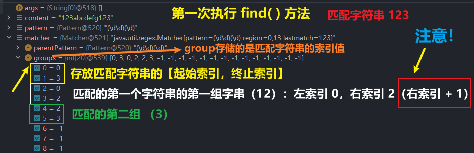

<h1 style="text-align: center; font-weight: bold;">基本介绍</h1>

---

## 问题引入

#### (1) 提取文章中所有的英文单词

#### (2) 提取文章中所有的数字

#### (3) 提取文章中所有的英文单词和数字

#### (4) 提取百度热榜 标题

#### (5) 给你一个字符串 (或文章), 请你找出所有四个数字连在一起的子串？

#### (6) 给你一个字符串 (或文章), 请你找出所有四个数字连在一起的子串，并且这四个数字要满足：第一位与第四位相同，第二位与第三位相同，比如 1221，5775

#### (7) 请验证输入的邮件，是否符合电子邮件格式.

#### (8) 请验证输入的手机号，是否符合手机号格式

> #### 总结：可以发现以上的问题都是有需要处理文本的特性，<span style = "color:red;font-weight:bold">正则表达式是处理文本的利器</span>

## 基本介绍

#### （1）正则表达式（RegularExpression）：简写 regexp

#### （2）<span style = "color:red;font-weight:bold">正则表达式就是对字符串执行模式匹配的技术</span>，一个正则表达式，就是用某种模式去匹配字符串的一个公式，可以<span style = "color:red;font-weight:bold">高效的处理文本</span>

#### （3）正则表达式不只是 Java 才有，很多编程语言都支持正则表达式进行字符串操作

## 相关方法

#### 1. Pattern（模式对象，即正则表达式对象）：调用 <span style = "color:red;font-weight:bold">compile("正则表示式")</span>方法，传入匹配要求

#### 2. Matcher（匹配器）：pattern.matcher(匹配字符串)获取 Matchar 对象

> #### （1）调用 <span style = "color:red;font-weight:bold">find()</span> 方法进行匹配
>
> #### （2）<span style = "color:red;font-weight:bold">gruop()</span>方法：匹配内容的分组，详见底层实现部分

## 代码示例

```java
public class Main {
    public static void main(String[] args) {
        // 匹配内容
        String content = "123abcdefg123";
        // 创建模式对象（即正则表达式对象）
        Pattern pattern = Pattern.compile("(\\d\\d)(\\d)");
        // 创建匹配器
        Matcher matcher = pattern.matcher(content);
        // 开始匹配
        while (matcher.find()){
            System.out.println("匹配内容：" + matcher.group(0));
            System.out.println("第一组：" + matcher.group(1));
            System.out.println("第二组：" + matcher.group(2));
        }
    }
}
```

#### 输出结果

```java
匹配内容：123
第一组：12
第二组：3
匹配内容：123
第一组：12
第二组：3
```

## ⭐ 底层实现

### matcher.find（）

#### 什么是分组？

> #### <span style = "color:red;font-weight:bold">一个括号表示一组</span>，比如 `(\\d\\d)(\\d)`，正则表达式中有两个分组，第 1 个表示第 1 组，第 2 个表示第 2 组...

#### 1. 根据指定的规则，定位满足规则的字符串（比如`(19)(98)`）

#### 2. 找到后，将字符串的开始的索引记录到 `matcher` 对象的属性 `int[] groups`：

> #### group( <span style = "color:red;font-weight:bold">0</span> )：表示匹配字符串的<span style = "color:red;font-weight:bold">左边界索引值</span>
>
> #### group( <span style = "color:red;font-weight:bold">1</span> )：表示匹配字符串的<span style = "color:red;font-weight:bold">右边界索引值 + 1</span>
>
> #### group( <span style = "color:red;font-weight:bold">2</span> )：表示匹配字符串的<span style = "color:red;font-weight:bold">第一组字串</span>左边界索引值
>
> #### group( <span style = "color:red;font-weight:bold">3</span> )：表示匹配的字符串<span style = "color:red;font-weight:bold">第一组字串</span>右边界索引值 + 1
>
> #### 以此类推，<span style = "color:red;font-weight:bold">两个 group 值为一组</span>
>
> #### （1）第一个 group 表示字符串的左索引
>
> #### （2）第二个 group 表示字符串的右索引 + 1
>
> #### 除了第一组 group 表示匹配的字符串，后面的组别都表示该匹配字符串中<span style = "color:red;font-weight:bold">分组的字串</span>

#### 3. 同时记录 `oldLast` 的值为<span style = "color:red;font-weight:bold">匹配字符串的结束的索引+1</span> 的值，下一次执行 `find` 时，匹配的起始位置就从上一次 oldLast 更新的值开始开始匹配。



### matcher.group（）

#### 源码

```java
public String group(int group) {
    if (first < 0)
        throw new IllegalStateException("No match found");

    if (group < 0 || group > groupCount())
        throw new IndexOutOfBoundsException("No group " + group);

    if ((groups[group*2] == -1) || (groups[group*2+1] == -1))
        return null;

    return getSubSequence(groups[group * 2], groups[group * 2 + 1]).toString();
}
```

#### group（0）：匹配的字符串

#### group（1）：匹配字符串的<span style = "color:red;font-weight:bold">第一个分组</span>字串

#### group（2）：匹配的字符串<span style = "color:red;font-weight:bold">第二个分组</span>字串
