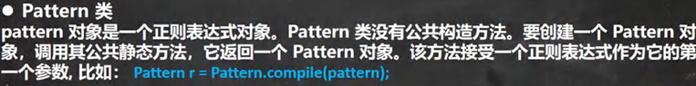

<h1 style="text-align: center; font-weight: bold;">常用类</h1>

---

## Pattern 类



### matches( ) 方法

> #### 用于<span style="color:red;font-weight:bold">整体匹配</span>，返回一个 boolean 结果，可以用于快速验证

```java
public class Main {
    public static void main(String[] args) {
        String regStr = "123abc456";
        boolean matches = Pattern.matches("123.*", regStr);
        if (matches) {
            System.out.println("匹配成功");
        } else {
            System.out.println("匹配失败");
        }
    }
}

// 输出结果：匹配成功
```

## Matcher 类

### start( ) 和 end( )

> #### start( )方法：返回捕获字串的起始索引位置
>
> #### end( )方法：返回捕获字串的结束索引位置

```java
public class Main {
    public static void main(String[] args) {
        String regStr = "123abc456";
        Pattern pattern = Pattern.compile("\\d{3}");
        Matcher matcher = pattern.matcher(regStr);
        while (matcher.find()){
            System.out.println("匹配：" + matcher.group(0));
            System.out.println("起始索引：" + matcher.start());
            System.out.println("终止索引( +1 )：" + matcher.end());
            System.out.println("");
        }
    }
}

// 输出结果
匹配：123
起始索引：0
终止索引( +1 )：3

匹配：456
起始索引：6
终止索引( +1 )：9
```

### replaceAll( ) 方法

> #### <span style="color:red;font-weight:bold">一次性替换所有匹配内容</span>，不会改变原字符串的内容，而是<span style="color:red;font-weight:bold">返回一个新的字符串</span>

```java
public class 命名捕获分组 {
    public static void main(String[] args) {
        String content = "123abc456";
        Pattern pattern = Pattern.compile("[a-z]");
        Matcher matcher = pattern.matcher(content);
        // 一次性替换所有匹配项
        String s = matcher.replaceAll("789");
        System.out.println(s);
        // 原字符串并未改变
        System.out.println(content);
    }
}
// 输出结果
123789789789456
123abc456
```
