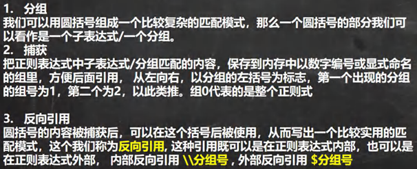
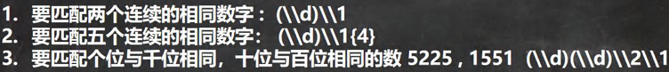

<h1 style="text-align: center; font-weight: bold;">反向引用</h1>

---

## 问题引入

> #### 给出一串文本，需求：找到第一位与第四位相同并且第二位与第三位相同的数字

## 基本介绍

> #### 反向引用可以通过分组的组别引用特定的内容，解决了引入的问题

#### 分两种类型

> #### <span style="color:red;font-weight:bold">内部</span>反向引用：<span style="color:red;font-weight:bold">\\\\</span>分组号
>
> #### <span style="color:red;font-weight:bold">外部</span>反向引用：<span style="color:red;font-weight:bold">$</span>分组号



## 案例一



## 案例二


```java
\\d{5}-(\\d)\\1{2}(\\d)\\2{2}(\\d)\\3{2}
```

#### 解释以下代码片段

> #### 表示匹配一个数字，首先对第一组匹配的数字引用一次，之后加上{2}，表示出现三次相同的数字

```java
(\\d)\\1{2}
```
