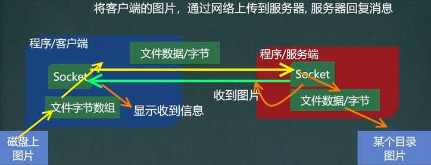

<h1 style="text-align: center; font-weight: bold;">网络上传文件</h1>

---

## 1. 需求分析


#### 思路流程图



##### 本题的关键就是关于图片的读取，这里需要把文件转为字符串数组，下方提供补充 API，在代码中调用即可，本题的核心是理解整个文件传输的过程

## 2. 补充 API

<h2 style="text-align: center; font-weight: bold;">StreamUtils</h2>

```java

import java.io.BufferedReader;
import java.io.ByteArrayOutputStream;
import java.io.IOException;
import java.io.InputStream;
import java.io.InputStreamReader;

/**
 * 此类用于演示关于流的读写方法
 *
 */
public class StreamUtils {
	/**
	 * 功能：将输入流转换成byte[]， 即可以把文件的内容读入到byte[]
	 * @param is
	 * @return
	 * @throws Exception
	 */
	public static byte[] streamToByteArray(InputStream is) throws Exception{
		ByteArrayOutputStream bos = new ByteArrayOutputStream();//创建输出流对象
		byte[] b = new byte[1024];//字节数组
		int len;
		while((len=is.read(b))!=-1){//循环读取
			bos.write(b, 0, len);//把读取到的数据，写入bos
		}
		byte[] array = bos.toByteArray();//然后将bos 转成字节数组
		bos.close();
		return array;
	}
	/**
	 * 功能：将InputStream转换成String
	 * @param is
	 * @return
	 * @throws Exception
	 */

	public static String streamToString(InputStream is) throws Exception{
		BufferedReader reader = new BufferedReader(new InputStreamReader(is));
		StringBuilder builder= new StringBuilder();
		String line;
		while((line=reader.readLine())!=null){
			builder.append(line+"\r\n");
		}
		return builder.toString();

	}

}
```

## 3. 代码实现

### （1）客户端

```java
import java.io.*;
import java.net.InetAddress;
import java.net.Socket;

public class client {
    public static void main(String[] args) throws Exception {
        System.out.println("客户端启动...");
        // 传入连接服务器的 ip 和 端口
        Socket socket = new Socket(InetAddress.getLocalHost(),8888);

        // 第一部分：发送图片

        String srcPath = "C:\\Users\\jackson\\Desktop\\青灯爬虫.png";
        // 传入图片路径，读取图片信息
        BufferedInputStream bis = new BufferedInputStream(new FileInputStream(srcPath));
        // 首先将图片资源转成字符串数组，调用提供的API
        byte[] send_src = StreamUtils.streamToByteArray(bis);
        bis.close(); // 文件的读取操作完成，注意要关流

        // 写入资源
        OutputStream os = socket.getOutputStream();
        BufferedOutputStream bos = new BufferedOutputStream(os);
        bos.write(send_src);

        socket.shutdownOutput(); //发送信息的结束标志


        // 第二部分：接收服务端的信息
        InputStream inputStream = socket.getInputStream();
        // 提供的 API 有相应的方法，这里不用使用转换流
        String get_info = StreamUtils.streamToString(inputStream);
        System.out.println("接收到服务端的信息如下：\n" + get_info);

        // 关闭资源
        inputStream.close();
        bos.close();
        socket.close();
    }
}
```

### （2）服务端

```java
import java.io.*;
import java.net.ServerSocket;
import java.net.Socket;

public class server {
    public static void main(String[] args) throws Exception {
        System.out.println("服务端启动，等待连接...");
        // 启动服务，在 8888 端口监听
        ServerSocket serverSocket = new ServerSocket(8888);
        // 等待客户端连接
        Socket socket = serverSocket.accept();

        // 第一部分：接收图片

        // 读取客户端的信息
        InputStream inputStream = socket.getInputStream();
        // 通过 socket 读取到客户端的信息
        BufferedInputStream bis = new BufferedInputStream(inputStream);
        // 同理可以使用提供的 API 把客户端发送的文件转为字符串数组
        byte[] get_src = StreamUtils.streamToByteArray(inputStream);


        // 设置保存图片的目标路径
        String dirPath = "C:\\Users\\jackson\\Desktop\\青灯爬虫1.png";
        // 保存文件，使用输出流，如果没有该文件就会创建
        BufferedOutputStream bos = new BufferedOutputStream(new FileOutputStream(dirPath));
        bos.write(get_src);
        bos.close();// 文件的保存操作完成，注意要关流

        // 第二部分：发送信息给客户端
        OutputStream os = socket.getOutputStream();
        BufferedOutputStream bos_ = new BufferedOutputStream(os);
        String send_info = "收到图片";
        bos_.write(send_info.getBytes());
        bos_.flush(); // 如果使用 close() 会报错
        socket.shutdownOutput(); //发送信息的结束标志

        // 关闭资源
        bis.close();
        socket.close();
        serverSocket.close();
    }
}

```

## 4. ⚠️ 重点补充

#### 说明：在服务端发送信息时，因为是字符，正常使用 writer + flush()方法是没有问题的，这里想尝试使用字节流，于是发现了问题

### （1）报错现象

##### 在服务端中发送信息给客户端的部分有如下代码

```java
bos_.write(send_info.getBytes());
bos_.flush(); // 如果使用 close() 会报错
socket.shutdownOutput(); //发送信息的结束标志
```

#### 正常的逻辑如下

```java
bos_.write(send_info.getBytes());
bos_.close(); // 如果使用 close() 会报错
socket.shutdownOutput(); //发送信息的结束标志
```

#### 此时会抛出异常

```java
Exception in thread "main" java.net.SocketException: Socket is closed
	at java.net.Socket.shutdownOutput(Socket.java:1551)
	at net.server.main(server.java:38)
```

#### 提示信息说<span style = "color:red;font-weight:bold">Socket 已经关闭</span>，不能重复关闭

### （2）原因解释

- <span style = "color:red;font-weight:bold">close() 操作已经完全终止了输出流的生命周期，包括底层的 SocketOutputStream。此时调用 shutdownOutput() 相当于对一个已销毁的资源执行操作，因此触发异常</span>

- **补充内容**：close() 会隐式调用 flush()，关闭流时，缓冲区数据会自动刷新，无需额外调用 flush()（除非需要中途刷新）

### （3）解决方案一

#### 关闭流之前先调用 shutdownOutput()

```java
bos_.write(send_info.getBytes());
bos_.flush(); // 先把缓冲区的数据刷新到输出流
socket.shutdownOutput(); // 发送结束标志
bos_.close(); // 关闭流
```

### （4）解决方案二

#### 不调用 shutdownOutput()，直接关闭流

```java
bos_.write(send_info.getBytes());
bos_.close(); // 关闭流的同时会隐式调用flush()
// 不需要调用socket.shutdownOutput()
```

### （5）⭐ 知识点补充

- 字节流
  - **FileOutputStream、Socket.getOutputStream() 等：直接连接到底层设备，没有缓冲区**
  - **BufferedOutputStream：有缓冲区，flush() 会强制将缓冲区数据写入底层流**
- 字符流（<span style = "color:red;font-weight:bold">字符流处理文本数据，需要字符编码转换，必须使用缓冲</span>）

### （6）flush 总结

| 流类型             | 示例类                                 | 是否需要 / 支持 **flush()** |
| ------------------ | -------------------------------------- | --------------------------- |
| 未缓冲的字节流     | **FileOutputStream**                   | 存在但无实际效果            |
| 缓冲的字节流       | **BufferedOutputStream**               | 需要手动调用 **flush()**    |
| 字符流（默认缓冲） | **FileWriter**、**OutputStreamWriter** | 需要手动调用 **flush()**    |
| 显式缓冲的字符流   | **BufferedWriter**                     | 需要手动调用 **flush()**    |
