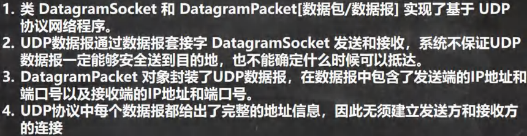
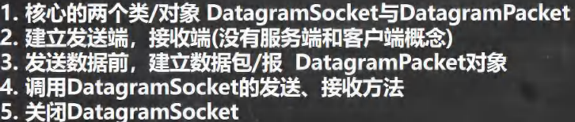
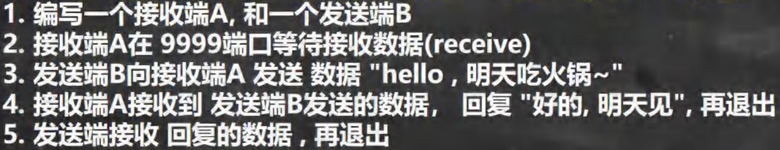
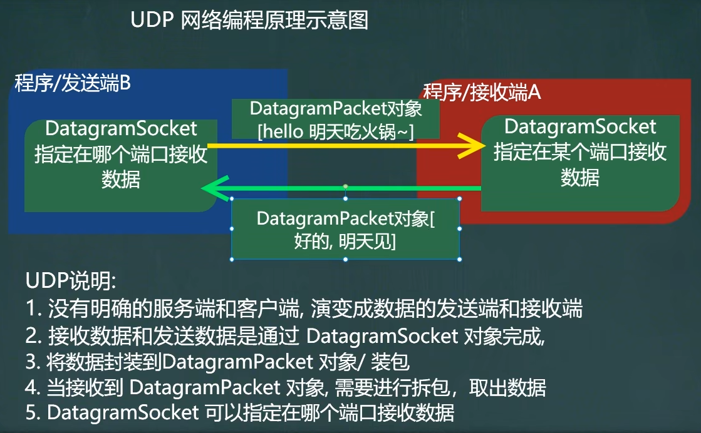

<h1 style="text-align: center; font-weight: bold;">UDP编程</h1>

---

## 1. 基本介绍



### （1）UDP 编程实现过程

#### 注意：<span style="color:red;font-weight:bold">先启动接收方后启动发送方</span>



#### 理解：其实就是<span style="color:red;font-weight:bold">数据包传输</span>的过程，注意没有客户端和服务端之分，只有发送端和接收端，<span style="color:red;font-weight:bold">发送端也可以是接收端</span>

- **发送端：对数据进行**<span style="color:red;font-weight:bold">打包</span>
- **接收端：对数据进行**<span style="color:red;font-weight:bold">拆包</span>

#### 注意：UDP 编程中，<span style="color:red;font-weight:bold">每个数据包的大小限制在 64k 内</span>

### （2）相关方法

- DatagramSocket: UDP 编程的标志，适用于发送方、接收方，**创建该对象时**<span style="color:red;font-weight:bold">会有异常，需要捕获或者抛出</span>

  - 构造器：需要传入端口，表示在哪个端口监听并接收数据
  - 相关方法
    - **send()**：通过 DatagramSocket 对象调用该方法给**接收端发送信息**，**调用该方法时**<span style="color:red;font-weight:bold">会有异常，需要捕获或者抛出</span>
    - **receive()**：接收方接收数据包
    - **这两个方法容易遗漏，这里给出如下逻辑：**<span style="color:red;font-weight:bold">先拿到数据包才能拆包，不发送数据包怎么让对方拆包</span>

- DatagramPacket：表示通信中传输的信息，通过**数据包**的形式发送
  - 构造器（发送方）
    - byte[]：存放发送信息
    - byte[].length
    - 接收方的 IP：通过 InetAddress.getByname()方法获取
    - 接收方的端口
  - 构造器（接收方）
    - byte[]：存放接收信息
    - byte[].length
  - 相关方法
    - **getData()**：数据解包，接收发送方发送的信息
    - **getLength()**：获取数据的长度
    - 以上两个方法可以作为参数传入 **new String(字节数组，<span style="color:red;font-weight:bold">0</span>，字节数组长度)** 转换为字符输出接收的信息
- <span style="color:red;font-weight:bold">注意关闭资源</span>

## 2. 案例



#### 理解示意图



### （1）发送端

```java
import java.io.IOException;
import java.net.*;

public class senderB {
    public static void main(String[] args) throws IOException {
        // 发送方
        System.out.println("发送方 B 开始发送信息...");

        // 1. 创建 DatagramSocket 对象
        DatagramSocket datagramSocket = new DatagramSocket(9998);

        // 2. 发送端：发送信息

        byte[] send_info = "hello，明天吃火锅~".getBytes();
        // 创建 DatagramPacket 对象，把发送信息打包发送
        DatagramPacket sendPacket = new DatagramPacket
                (send_info, send_info.length, InetAddress.getByName("LAPTOP-E8O2B4GK"), 9999);
        datagramSocket.send(sendPacket);

        // 3. 发送端：接收信息
        byte[] buf = new byte[1024]; // 一个数据包的大小应该小于 64k
        DatagramPacket getPacket = new DatagramPacket(buf,buf.length);

        // 接收信息
        datagramSocket.receive(getPacket);

        // 数据拆包
        byte[] get_info = getPacket.getData();
        int get_info_length = getPacket.getLength();

        // 输出信息
        String string = new String(get_info, 0,get_info_length);
        System.out.println("接收到信息：" + string);

        // 4. 关闭资源
        datagramSocket.close();
    }
}
```

### （2）接收端

```java
import java.io.IOException;
import java.net.DatagramPacket;
import java.net.DatagramSocket;
import java.net.InetAddress;


public class receiverA {
    public static void main(String[] args) throws IOException {
        // 接收方
        System.out.println("接收方 A 等待接收信息...");

        // 1. 创建 DatagramSocket 对象
        DatagramSocket datagramSocket = new DatagramSocket(9999);

        // 2. 接收信息
        byte[] buf = new byte[1024];
        DatagramPacket getPacket = new DatagramPacket(buf, buf.length);

        datagramSocket.receive(getPacket);

        // 数据拆包
        byte[] get_info = getPacket.getData();
        int length = getPacket.getLength();

        // 输出信息
        String string = new String(get_info, 0,length);
        System.out.println("接收到信息：" + string);

        // 3. 发送信息
        byte[] send_info = "好的，明天见".getBytes();
        DatagramPacket datagramPacket = new DatagramPacket
                (send_info, send_info.length, InetAddress.getByName("LAPTOP-E8O2B4GK"), 9998);
        datagramSocket.send(datagramPacket);

        // 4. 关闭资源
        datagramSocket.close();
    }
}
```
