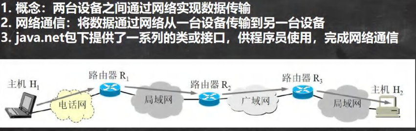

<h1 style="text-align: center; font-weight: bold;">网络的基本概念</h1>

---

## 1. 网络通信

#### 简单来说：网络通信就是数据的传输

## 2. 网络

### （1）局域网

#### 覆盖范围最小，仅仅覆盖一个教室或一个机房

### （2）城域网

#### 覆盖范围较大，可以覆盖一个城市

### （3）广域网

#### 覆盖范围最大，可以覆盖全国，甚至全球，万维网是广域网的代表

## 3. IP 地址

#### 说明

- IP 地址（192.168.16.69） = 网络地址（192.168.16） + 主机地址（69）
- IPV6：由于 IPV4 能表示的**网络地址资源**，引入了 IPV6，能够表示更多的网络地址资源

### （1）IPV4

#### 说明

- 一个字节 = 8 个 bit 位（一个 bit 就表示二进制的一位）
- 一个字节的范围：**0(00000000) ~ 255(11111111)**

  - 0 的计算：0 × 27 + 0 × 26 + 0 × 25 + 0 × 24 + 0 × 23 + 0 × 22 + 0 × 21 + 0 × 20 = 0
  - 255 的计算：1 × 27 + 1 × 26 + 1 × 25 + 1 × 24 + 1 × 23 + 1 × 22 + 1 × 21 + 1 × 20 = 128 + 64 + 32 + 16 + 8 + 4 + 2 + 1 = 255

- IPV4 有4 个字节 = 32 个 bit 位
- 地址是以十进制来表示的

### 1. IPV4 的地址分类

### 2. IPV4 表示地址的范围

### （2）IPV6

- 使用16 个字节（128（16 x 8）个 bit 位），是 IPV4 的4 倍
- 地址是以十六进制来表示的
- 例如：**2408.8207.1851.8670.d52d.7a14.362c.4e8d**

#### 进制内容补充

- **24 = 16**，也就是说 16 进制中的 1 位对应 2 进制中的 4 位
- 根据上面的 IP 地址，每 4 位（**每一位是十六进制中的一位**）一组，一共 8 组，也就是一共**4 \* 8 = 32**位（16 进制）
- 那根据关系可以知道，1 位（16 进制） = 4 位（2 进制），则一共对应 2 进制的位数：**32 \* 4 = 128（2 进制）**
- 二进制中，**每 8 位代表代表一个字节**，现在是 128 / 8 = **16 个字节**

## 4. 域名与端口

### 1. 对端口的理解

一个服务器对应一个 ip，服务器上可以有很多服务，当程序向服务器发送请求时，就可以通过服务监听的端口来接收程序的请求，简单来说，端口可以说是某项特定服务的标识，当程序在服务器上请求服务时，可以通过端口来区分不同的服务

#### 可以把服务器理解为房子，那端口 + 服务就可以理解为门，通过不同的门（不同的端口对应不同的服务）进入来访问不同的服务（程序发送请求，向哪个端口发送请求呢？），进而就形象的解释了端口的作用

### 2. 常见的端口

| **协议/服务**  | **端口号** | **描述**                           |
| -------------- | ---------- | ---------------------------------- |
| SSH            | 22         | 用于安全远程登录                   |
| FTP            | 21         | 用于文件传输协议                   |
| SMTP           | 25         | 用于邮件发送（简单邮件传输协议）   |
| HTTP           | 80         | 用于 HTTP 服务（无加密的网页浏览） |
| HTTPS          | 443        | 用于 HTTPS 服务（加密的网页浏览）  |
| MySQL, MariaDB | 3306       | 用于 MySQL 和 MariaDB 数据库       |
| Tomcat (HTTP)  | 8080       | 用于 Tomcat 服务器的 HTTP 服务     |
| Tomcat (HTTPS) | 8443       | 用于 Tomcat 服务器的 HTTPS 服务    |
| Redis          | 6379       | 用于 Redis 数据库服务              |
| RabbitMQ       | 5672       | 用于 RabbitMQ 消息队列服务         |
| MongoDB        | 27017      | 用于 MongoDB 数据库                |
| Elasticsearch  | 9200       | 用于 Elasticsearch 搜索引擎服务    |
| Jenkins        | 8080       | 用于 Jenkins 持续集成工具          |
| Nginx          | 80, 443    | 用于 Nginx 反向代理和负载均衡服务  |
| Git            | 9418       | 用于 Git 协议（版本控制工具）      |
| Oracle         | 1521       | 用于 Oracle 数据库服务             |
| SQL Server     | 1433       | 用于 SQL Server 数据库服务         |

### 3. 提醒

#### 在实际开发中不要使用 0 ~ 1024端口

## 5. 网络通信协议

协议 (tcp/ip) TCP/IP (Transmission Control Protocol/Internet Protocol) 的简写，中文译名为**传输控制协议 / 因特网互联协议**，又叫网络通讯协议，这个协议是 Internet 最基本的协议、Internet 国际互联网络的基础，简单地说，就是由网络层的 IP 协议和传输层的 TCP 协议组成的。

<table><thead><tr><th>OSI模型</th><th>TCP/IP模型</th><th>TCP/IP模型各层对应协议</th></tr></thead><tbody><tr><td>应用层</td><td rowspan="3">应用层</td><td rowspan="3">HTTP、ftp、telnet、DNS...</td></tr><tr><td>表示层</td></tr><tr><td>会话层</td></tr><tr><td>传输层</td><td>传输层（TCP）</td><td rowspan="2">TCP、UDP、... IP、ICMP、ARP...</td></tr><tr><td>网络层</td><td>网络层（IP）</td></tr><tr><td>数据链路层</td><td rowspan="2">物理+数据链路层</td><td rowspan="2">Link</td></tr><tr><td>物理层</td></tr></tbody></table>

#### 数据在传输的过程中就是封装信息和拆包的过程

- 左边**从上到下**：发送数据，进行封装
- 右边**从下到上**：拆包，接收数据

## 6. TCP 和 UDP

#### TCP 的三次握手就是确认双方的过程，经过确认后才会发送数据，这样更安全可靠

