<h1 style="text-align: center; font-weight: bold;">用户登录</h1>

---

##### 设计思路（<span style = "color:red;font-weight:bold">非常重要！！！</span>）

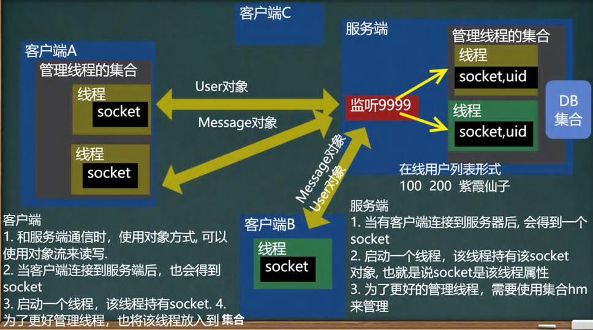

## 说明

> #### 因为还没有学习数据库，我们人为规定 用户名 id = 100, 密码 123456 就可以登录，其它用户不能登录
>
> #### 后面使用 <span style = "color:red">HashMap</span> 模拟数据库，可以多个用户登录.

#### 开发思路

part 1

- 首先编写 User、Message 对象

part 2

- 编写用户界面

part 3

- 编写用户端的 socket，用于和服务端的通信：登录检测功能
- 编写用户端与服务连接的线程

part 4

- 编写用户端的集合，用来管理线程

part 5

- 编写服务端的 socket，同时编写线程，把 socket 放到线程中，实现和用户端通信

part 6

- 编写服务端的集合，用于管理线程

part 7

- 测试阶段，同时增加多用户登录功能

## part 1

### 1. 新建项目

- 编写两个项目，实现分类开发

  - QQClient：客户端
  - QQServer：服务端

- 新建包 common，表示共同的，在该包下创建如下内容

### 2. 说明

- 由于是多用户通信，需要考虑到对象的特征，后续使用<span style = "color:red;font-weight:bold">对象流</span>来处理信息，需要<span style = "color:red;font-weight:bold">实现 Serializable 接口</span>
- 为了防止序列化对象时出现冲突，可以给对象<span style = "color:red;font-weight:bold">添加版本号属性</span>

### 3. Message 对象

给出如下属性

- 序列化版本号属性
- sender：发送方
- getter：接收方
- content：信息的内容
- sendTime：发送时间
- mesType：消息类型（可以在接口中定义消息类型）
- getter、setter 方法

```java
package common;

import java.io.Serializable;

public class Message implements Serializable {
    // 为了防止序列化冲突，这里可以设置一下版本
    private static final long serialVersionUID = 1L;

    private String sender; // 发送方
    private String getter; // 接收方
    private String content; // 信息的内容
    private String sendTime; // 发送时间
    private String mesType; // 消息类型（可以在接口中定义消息类型）

    // 给出 setter 和 getter 方法

    public String getSender() {
        return sender;
    }

    public void setSender(String sender) {
        this.sender = sender;
    }

    public String getGetter() {
        return getter;
    }

    public void setGetter(String getter) {
        this.getter = getter;
    }

    public String getContent() {
        return content;
    }

    public void setContent(String content) {
        this.content = content;
    }

    public String getSendTime() {
        return sendTime;
    }

    public void setSendTime(String sendTime) {
        this.sendTime = sendTime;
    }

    public String getMesType() {
        return mesType;
    }

    public void setMesType(String mesType) {
        this.mesType = mesType;
    }
}
```

### 4. User 对象

给出如下属性

- 序列化版本号属性
- userId：用户名
- passwd：用户密码
- getter、setter 方法

```java
package common;

import java.io.Serializable;

public class User implements Serializable {
     // 为了防止序列化冲突，这里可以设置一下版本
    private static final long serialVersionUID = 1L;

    private String userId; // 用户名
    private String passwd; // 用户密码

    public User() {

    }

    public User(String userId, String passwd) {
        this.userId = userId;
        this.passwd = passwd;
    }

    // 给出 setter 和 getter 方法

    public String getUserId() {
        return userId;
    }

    public void setUserId(String userId) {
        this.userId = userId;
    }

    public String getPasswd() {
        return passwd;
    }

    public void setPasswd(String passwd) {
        this.passwd = passwd;
    }
}
```

### 5. MessageType 接口

```java
package common;

public interface MessageType {
    String MESSAGE_LOGIN_SUCCEED = "1"; // 表示登录成功
    String MESSAGE_LOGIN_FAIL = "2"; // 表示登录失败
}

```

### 6. 注意点

#### 对于客户端来说也是同样的道理，可以把代码复制到服务端

## part 2

### 1. 项目结构

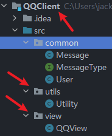

<span style = "color:red;font-size:30px;font-weight:bold;"><center>阶段任务：编写用户界面</center></span>

### 2. 补充 API：Utility

```java
package utils;


/**
	工具类的作用:
	处理各种情况的用户输入，并且能够按照程序员的需求，得到用户的控制台输入。
*/

import java.util.*;
/**


*/
public class Utility {
	//静态属性。。。
    private static Scanner scanner = new Scanner(System.in);


    /**
     * 功能：读取键盘输入的一个菜单选项，值：1——5的范围
     * @return 1——5
     */
	public static char readMenuSelection() {
        char c;
        for (; ; ) {
            String str = readKeyBoard(1, false);//包含一个字符的字符串
            c = str.charAt(0);//将字符串转换成字符char类型
            if (c != '1' && c != '2' &&
                c != '3' && c != '4' && c != '5') {
                System.out.print("选择错误，请重新输入：");
            } else break;
        }
        return c;
    }

	/**
	 * 功能：读取键盘输入的一个字符
	 * @return 一个字符
	 */
    public static char readChar() {
        String str = readKeyBoard(1, false);//就是一个字符
        return str.charAt(0);
    }
    /**
     * 功能：读取键盘输入的一个字符，如果直接按回车，则返回指定的默认值；否则返回输入的那个字符
     * @param defaultValue 指定的默认值
     * @return 默认值或输入的字符
     */

    public static char readChar(char defaultValue) {
        String str = readKeyBoard(1, true);//要么是空字符串，要么是一个字符
        return (str.length() == 0) ? defaultValue : str.charAt(0);
    }

    /**
     * 功能：读取键盘输入的整型，长度小于2位
     * @return 整数
     */
    public static int readInt() {
        int n;
        for (; ; ) {
            String str = readKeyBoard(2, false);//一个整数，长度<=2位
            try {
                n = Integer.parseInt(str);//将字符串转换成整数
                break;
            } catch (NumberFormatException e) {
                System.out.print("数字输入错误，请重新输入：");
            }
        }
        return n;
    }
    /**
     * 功能：读取键盘输入的 整数或默认值，如果直接回车，则返回默认值，否则返回输入的整数
     * @param defaultValue 指定的默认值
     * @return 整数或默认值
     */
    public static int readInt(int defaultValue) {
        int n;
        for (; ; ) {
            String str = readKeyBoard(10, true);
            if (str.equals("")) {
                return defaultValue;
            }

			//异常处理...
            try {
                n = Integer.parseInt(str);
                break;
            } catch (NumberFormatException e) {
                System.out.print("数字输入错误，请重新输入：");
            }
        }
        return n;
    }

    /**
     * 功能：读取键盘输入的指定长度的字符串
     * @param limit 限制的长度
     * @return 指定长度的字符串
     */

    public static String readString(int limit) {
        return readKeyBoard(limit, false);
    }

    /**
     * 功能：读取键盘输入的指定长度的字符串或默认值，如果直接回车，返回默认值，否则返回字符串
     * @param limit 限制的长度
     * @param defaultValue 指定的默认值
     * @return 指定长度的字符串
     */

    public static String readString(int limit, String defaultValue) {
        String str = readKeyBoard(limit, true);
        return str.equals("")? defaultValue : str;
    }


	/**
	 * 功能：读取键盘输入的确认选项，Y或N
	 * 将小的功能，封装到一个方法中.
	 * @return Y或N
	 */
    public static char readConfirmSelection() {
        System.out.println("请输入你的选择(Y/N)");
        char c;
        for (; ; ) {//无限循环
        	//在这里，将接受到字符，转成了大写字母
        	//y => Y n=>N
            String str = readKeyBoard(1, false).toUpperCase();
            c = str.charAt(0);
            if (c == 'Y' || c == 'N') {
                break;
            } else {
                System.out.print("选择错误，请重新输入：");
            }
        }
        return c;
    }

    /**
     * 功能： 读取一个字符串
     * @param limit 读取的长度
     * @param blankReturn 如果为true ,表示 可以读空字符串。
     * 					  如果为false表示 不能读空字符串。
     *
	 *	如果输入为空，或者输入大于limit的长度，就会提示重新输入。
     * @return
     */
    private static String readKeyBoard(int limit, boolean blankReturn) {

		//定义了字符串
		String line = "";

		//scanner.hasNextLine() 判断有没有下一行
        while (scanner.hasNextLine()) {
            line = scanner.nextLine();//读取这一行

			//如果line.length=0, 即用户没有输入任何内容，直接回车
			if (line.length() == 0) {
                if (blankReturn) return line;//如果blankReturn=true,可以返回空串
                else continue; //如果blankReturn=false,不接受空串，必须输入内容
            }

			//如果用户输入的内容大于了 limit，就提示重写输入
			//如果用户如的内容 >0 <= limit ,我就接受
            if (line.length() < 1 || line.length() > limit) {
                System.out.print("输入长度（不能大于" + limit + "）错误，请重新输入：");
                continue;
            }
            break;
        }

        return line;
    }
}

```

### 2. QQview 文件

编写用户界面（菜单）

```java
package view;

import utils.Utility;

public class QQView {
    private boolean loop = true;
    private String key = "";

    // 做测试
    public static void main(String[] args) {
        new QQView().mainMenu();
    }

    // 显示主菜单
    private void mainMenu(){
        while (loop){
            System.out.println("===========欢迎登录网络通信系统===========");
            System.out.println("\t\t 1 登录系统");
            System.out.println("\t\t 9 退出系统");
            System.out.print("请输入你的选择: ");
            key = Utility.readString(1);

            switch (key) {
                case "1":
                    System.out.print("请输入用户号: ");
                    String userId = Utility.readString(50);
                    System.out.print("请输入密  码: ");
                    String pwd = Utility.readString(50);
                    // 需要在服务端验证是否登录成功，并在用户端返回
                    if (true) { // 还没有写完....
                        System.out.println("===========欢迎 (用户 " + userId + " 登录成功) ===========");
                        //进入到二级菜单
                        while (loop) {
                            System.out.println("\n=========网络通信系统二级菜单(用户 " + userId + " )=======");
                            System.out.println("\t\t 1 显示在线用户列表");
                            System.out.println("\t\t 2 群发消息");
                            System.out.println("\t\t 3 私聊消息");
                            System.out.println("\t\t 4 发送文件");
                            System.out.println("\t\t 9 退出系统");
                            System.out.print("请输入你的选择: ");
                            key = Utility.readString(1);
                            switch (key) {
                                case "1":
                                    System.out.println("1 显示在线用户列表");
                                    break;
                                case "2":
                                    System.out.println("2 群发消息");
                                    break;
                                case "3":
                                    System.out.println("3 私聊消息");
                                    break;
                                case "4":
                                    System.out.println("4 发送文件");
                                    break;
                                case "9":
                                    System.out.println("退出系统...");
                                    loop = false;
                                    break;
                            }

                        }
                    } else { //登录服务器失败
                        System.out.println("=========登录失败=========");
                    }
                    break;
                case "9":
                    System.out.println("退出系统...");
                    loop = false;
                    break;
            }
        }
    }
}

```

## part 3

### 1. 项目结构

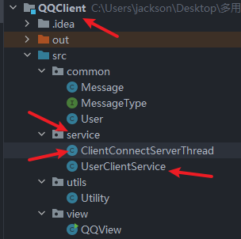

<span style = "color:red;font-size:25px;font-weight:bold;">阶段任务：编写用户端登录检测功能，通过 socket 给服务端发送信息和接收信息，同时把这个过程放到一个线程中</span>

### 2. UserClientService

在前面已经编写好了界面，现在需要编写业务判断用户是否登录成功，所以这里新建一个类
思路如下

- 首先获取输入流输出流对象，使用<span style="color:red;font-weight:bold">对象流</span>读取和输出信息
- 编写向服务端发送信息、接收服务端信息功能模块

```java
package service;

import common.Message;
import common.MessageType;
import common.User;

import java.io.ObjectInputStream;
import java.io.ObjectOutputStream;
import java.net.InetAddress;
import java.net.Socket;

public class UserClientService {

    // 因为可能需要在其他方法使用user信息
    private User u = new User();
    // 因为 socket 可能在其他地方使用，做成属性
    private Socket socket;

    // 判断用户是否合法
    public boolean checkUser(String userId, String pwd) {
        u.setUserId(userId);
        u.setPasswd(pwd);

        try {
            socket = new Socket(InetAddress.getLocalHost().getHostAddress(), 9999);

            // 发送 u 对象到服务器
            ObjectOutputStream oos = new ObjectOutputStream(socket.getOutputStream());
            oos.writeObject(u);

            // 读取服务端返回的 message 对象
            ObjectInputStream ois = new ObjectInputStream(socket.getInputStream());
            Message ms = (Message) ois.readObject();

            // 判断
            if (ms.getMesType().equals(MessageType.MESSAGE_LOGIN_SUCCEED)) { // 登录成功
                // 创建一个和服务端保持通信的线程
                ClientConnectServerThread clientConnectServerThread = new ClientConnectServerThread(socket);
                // 启动客户端线程
                clientConnectServerThread.start();
                b = true;
            } else {

            }

        } catch (Exception e) {
            e.printStackTrace();
        }
    }

}
```

### 3. ClientConnectServerThread

在开始时项目的介绍中提到了多用户，可以使用线程来独立不同用户之间的通讯，上面已经写好了用户端的登录判断的大致逻辑，现在需要编写用户端和服务端通信的线程

```java
package service;

import common.Message;

import java.io.ObjectInputStream;
import java.net.Socket;

public class ClientConnectServerThread extends Thread{

    private Socket socket;

    // 可以接收一个 socket 对象
    public ClientConnectServerThread(Socket socket) {
        this.socket = socket;
    }

    @Override
    public void run() {
        // 在后台和服务器通讯
        while (true){
            System.out.println("等待读取服务端的信息...");
            try {
                ObjectInputStream ois = new ObjectInputStream(socket.getInputStream());
                // 如果服务端没有发送信息，线程会阻塞在这里
                Message message = (Message) ois.readObject();
            } catch (Exception e) {
                e.printStackTrace();
            }
        }
    }

    // 为了更方便的得到 socket
    public Socket getSocket() {
        return socket;
    }

}
```

## part 4

### 1. 项目结构

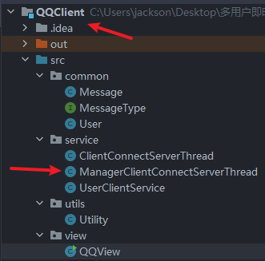

<span style = "color:red;font-size:25px;font-weight:bold;">阶段任务：编写集合（HashMap），管理线程</span>

### 2. ManagerClientConnectServerThread

编写用户端线程管理集合

- key：userId
- value：线程

```java
package service;

import java.util.HashMap;

public class ManagerClientConnectServerThread {
    // 把多线程放到 hashmap 集合中管理，key：用户id，value：线程
    private static HashMap<String,ClientConnectServerThread> hm = new HashMap<>();

    // 把线程加入集合
    public static  void addClientConnectSercerThread(String userId,ClientConnectServerThread clientConnectServerThread){
        hm.put(userId,clientConnectServerThread);
    }

    // 通过 userId 获取线程
    public static ClientConnectServerThread getClientConnectServerThread(String userId){
        return hm.get(userId);
    }
}

```

### 3. UserClientService

完善该类，线程集合已经写好了，把这个线程放到集合中

```java
// 判断
if (ms.getMesType().equals(MessageType.MESSAGE_LOGIN_SUCCEED)) { // 登录成功

    // 创建一个和服务端保持通信的线程
    ClientConnectServerThread clientConnectServerThread = new ClientConnectServerThread(socket);
    // 启动客户端线程
    clientConnectServerThread.start();
    // 为了方便管理线程，放到集合中
    ManagerClientConnectServerThread.addClientConnectSercerThread(userId, clientConnectServerThread);
    b = true;
}
```

### 4. QQClient

用户端已经写好了登录的判断逻辑，调用方法用来判断客户端是否登录成功

```java
 if (userClientService.checkUser(userId,pwd)) {
    System.out.println("===========欢迎 (用户 " + userId + " 登录成功) ===========");
    //进入到二级菜单
    ...
 }
```

## part 5

### 1. 项目结构

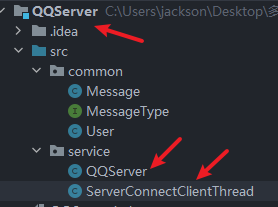

<span style = "color:red;font-size:25px;font-weight:bold;">阶段任务：延续客户端的登陆验证逻辑，现在编写-->服务端，编写服务端的 socket，实现和客户端通讯，把 socket 放到一个线程中，并且启动</span>

### 2. QQServer

编写服务端的 socket，用于接收用户端的信息判断是否登录成功，并把信息返回

**注意点**：服务端不是之和一个 socket 通信，会有很多，所以需要**使用循环来不断监听端口实现和多用户通讯**

```java
package service;

import common.Message;
import common.MessageType;
import common.User;

import java.io.ObjectInputStream;
import java.io.ObjectOutputStream;
import java.net.ServerSocket;
import java.net.Socket;

public class QQServer {

    private ServerSocket ss =null;

    public  QQServer(){
        // 注意：端口可以写在配置文件
        System.out.println("服务器在 9999 端口监听...");
        try {
            ss = new ServerSocket(9999);
            // 监听多个客户端
            while (true){
                Socket socket = ss.accept(); // 如果没有客户端连接，就会阻塞
                ObjectInputStream ois = new ObjectInputStream(socket.getInputStream());
                User u = (User)ois.readObject();

                // 创建 Message 对象，回复客户端信息
                ObjectOutputStream oos = new ObjectOutputStream(socket.getOutputStream());
                Message message = new Message();

                // 验证登录
                if(u.getUserId().equals("100")&& u.getPasswd().equals("123456")){ // 登录成功
                    message.setMesType(MessageType.MESSAGE_LOGIN_SUCCEED);
                    oos.writeObject(message);
                    // 创建线程和客户端保持通讯
                    ServerConnectClientThread serverConnectClientThread = new ServerConnectClientThread(socket, u.getUserId());
                    serverConnectClientThread.start(); // 启动线程
                    // 把线程放到集合中
                    ...
                }
            }
        } catch (Exception e) {
            e.printStackTrace();
        } finally {

        }

    }
}
```

### 3. ServerConnectClientThread

编写和用户端连接的线程，把服务端的 socket 放到线程中，实现和多用户的独立通信

```java
package service;

import common.Message;

import java.io.IOException;
import java.io.ObjectInputStream;
import java.net.Socket;

public class ServerConnectClientThread extends Thread{

    private Socket socket;
    private String userId; // 连接服务端的用户 id

    public ServerConnectClientThread(Socket socket, String userId) {
        this.socket = socket;
        this.userId = userId;
    }

    @Override
    public void run() { // 线程，可以给客户端发送信息或者接收客户端的信息
        while(true){
            System.out.println("服务端和客户端" + userId + "保持通信，读取数据中...");
            try {
                ObjectInputStream ois = new ObjectInputStream(socket.getInputStream());
                Message message = (Message) ois.readObject();
            } catch (Exception e) {
                e.printStackTrace();
            }
        }
    }
}
```

## part 6

### 1. 项目结构

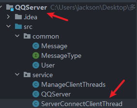

<span style = "color:red;font-size:25px;font-weight:bold;">阶段任务：编写服务端集合（HashMap），管理线程</span>

### 2. ManageClientThreads

思路和客户端类似

```java
package service;

import java.util.HashMap;

public class ManageClientThreads {

    private static HashMap<String,ServerConnectClientThread> hm = new HashMap<>();

    // 添加线程对象到 hm 集合中，key：userId ，value：线程
    public static void addClientThread(String userId, ServerConnectClientThread serverConnectClientThread){
        hm.put(userId,serverConnectClientThread);
    }

    // 根据 userId 返回线程
    public static ServerConnectClientThread getServerConnectClientThread(String userId){
        return hm.get(userId);
    }
}
```

### 3. QQServer

补充验证登录的部分

- 登录成功：把线程放到集合中
- 补充登录失败的逻辑
- 关闭资源

```java
try {
    ss = new ServerSocket(9999);
    // 监听多个客户端
    while (true){
        ...
        // 验证登录
        if(u.getUserId().equals("100")&& u.getPasswd().equals("123456")){ // 登录成功
            message.setMesType(MessageType.MESSAGE_LOGIN_SUCCEED);
            oos.writeObject(message);
            // 创建线程和客户端保持通讯
            ServerConnectClientThread serverConnectClientThread = new ServerConnectClientThread(socket, u.getUserId());
            serverConnectClientThread.start(); // 启动线程
            // 把线程放到集合中
            ManageClientThreads.addClientThread(u.getUserId(),serverConnectClientThread);
        }else {
            // 登录失败
            message.setMesType(MessageType.MESSAGE_LOGIN_FAIL);
            oos.writeObject(message);
            // 关闭 socket
            socket.close();
        }
    }
} catch (Exception e) {
    e.printStackTrace();
} finally {
    // 如果服务端退出了 while 循环，不再监听，需要关闭 ServerSocket
    try {
        ss.close();
    } catch (IOException e) {
        e.printStackTrace();
    }
}
```

## part 7

### 1. 项目结构

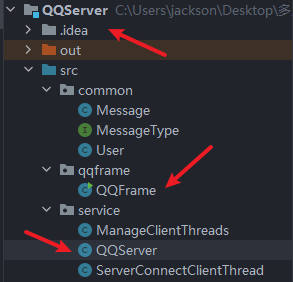

<span style = "color:red;font-size:25px;font-weight:bold;">阶段任务：测试阶段，同时增加多用户登录功能</span>

### 2. QQserver

增加多用户登录功能，修改登录检测逻辑

```java
public class QQServer {

    private ServerSocket ss = null;

    // 创建一个集合，存放多个用户
    private static HashMap<String,User> validUsers = new HashMap<>();

    static { // 静态代码块，类加载时会初始化 validUsers
        validUsers.put("100",new User("100","123456"));
        validUsers.put("200",new User("200","123456"));
        validUsers.put("300",new User("300","123456"));
        validUsers.put("jacksonling",new User("jacksonling","123456"));
    }

    // 验证用户是否有效
    private boolean checkUser(String userId,String passwd){
        User user = validUsers.get(userId);
        // 用户不存在
        if(user == null){
            return false;
        }
        // 用户存在，密码错误
        if(!user.getPasswd().equals(passwd)){
            return false;
        }
        return true;
    }

    public  QQServer(){
        // 注意：端口可以写在配置文件
        System.out.println("服务器在 9999 端口监听...");
        try {
            ss = new ServerSocket(9999);
            // 监听多个客户端
            while (true){
                ...
                // 验证登录
                if(checkUser(u.getUserId(),u.getPasswd())){ // 登录成功
                    ...
                }
            }
        } catch (Exception e) {
            ...
        } finally {
            ...
        }
    }
}
```

### 3. QQFrame

创建主函数入口，用来启动服务端

```java
package qqframe;

import service.QQServer;

public class QQFrame {
    public static void main(String[] args) {
        new QQServer();
    }
}
```

## 🎉 完结：功能测试 🎉

### 一、启动多个用户端线程配置

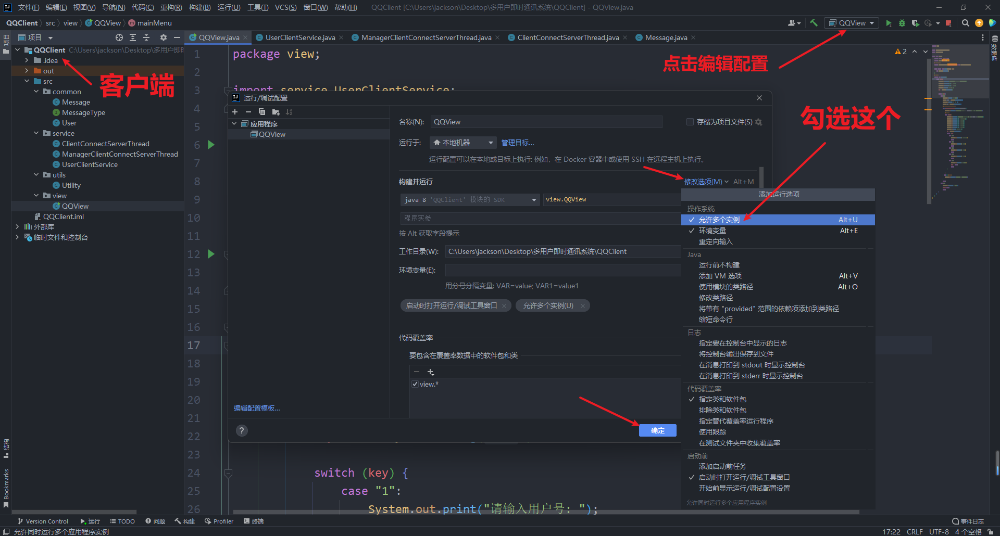

### 二、用户端测试图例

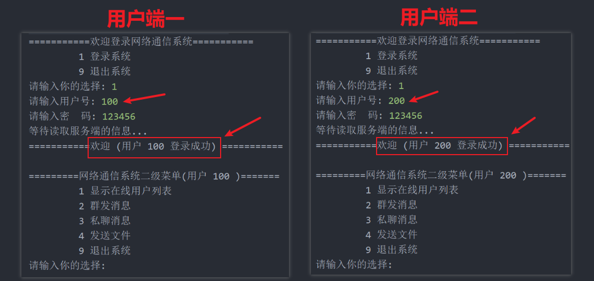

### 三、服务端测试图例

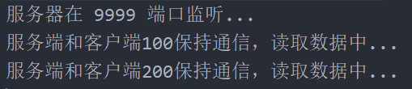

### 四、项目结构回顾

#### （1）客户端

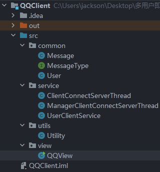

#### （2）服务端

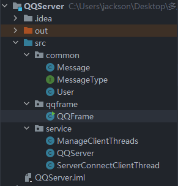
