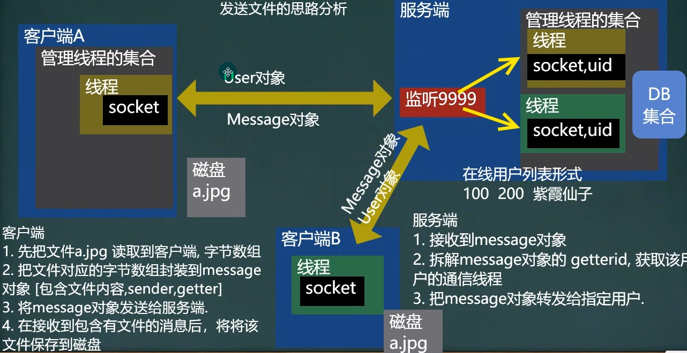

<h1 style="text-align: center; font-weight: bold;">发送文件</h1>

---

##### 设计思路（<span style = "color:red;font-weight:bold">非常重要！！！</span>）


## 1. 文件发送思路



## 2. 客户端

### MessageType 扩展

增加文件属性，<span style = "color:red;font-weight:bold">在客户端也是一样，拷贝一份即可</span>

```java
package common;

public interface MessageType {
    String MESSAGE_LOGIN_SUCCEED = "1"; // 表示登录成功
    String MESSAGE_LOGIN_FAIL = "2"; // 表示登录失败
    String MESSAGE_COMM_MES = "3"; //普通信息包
    String MESSAGE_GET_ONLINE_FRIEND = "4"; //要求返回在线用户列表
    String MESSAGE_RET_ONLINE_FRIEND = "5"; //返回的在线用户列表
    String MESSAGE_CLIENT_EXIT = "6"; //客户端请求退出
    String MESSAGE_TO_ALL_MES = "7"; // 群发消息
    String MESSAGE_FILE_MES = "8"; // 文件消息（发送文件）
}
```

### Message 扩展

增加文件属性和对应的 getter 和 setter 方法，<span style = "color:red;font-weight:bold">在客户端也是一样，拷贝一份即可</span>

```java
// 添加文件相关的成员
private byte[] fileBytes;
private int fileLen = 0;
private String dest; // 发送文件传输到哪
private String src; // 源文件路径

public byte[] getFileBytes() {
    return fileBytes;
}

public void setFileBytes(byte[] fileBytes) {
    this.fileBytes = fileBytes;
}

public int getFileLen() {
    return fileLen;
}

public void setFileLen(int fileLen) {
    this.fileLen = fileLen;
}

public String getDest() {
    return dest;
}

public void setDest(String dest) {
    this.dest = dest;
}

public String getSrc() {
    return src;
}

public void setSrc(String src) {
    this.src = src;
}
```

### FileClientService

在客户端的 service 包下新建该文件，用于文件的发送功能实现

```java
package service;

import common.Message;
import common.MessageType;

import java.io.*;

public class FileClientService {
    public void sendFileToOne(String src,String dest,String senderId,String getterId){
        // 读取 src 文件，封装到 message 中
        Message message = new Message();
        message.setMesType(MessageType.MESSAGE_FILE_MES);
        message.setSender(senderId);
        message.setGetter(getterId);
        message.setSrc(src);
        message.setDest(dest);

        // 文件读取
        FileInputStream fileInputStream = null;
        byte[] fileBytes = new byte[(int)new File(src).length()];
        try {
            fileInputStream = new FileInputStream(src);
            fileInputStream.read(fileBytes);
            // 封装到 message 对象中
            message.setFileBytes(fileBytes);
        } catch (Exception e) {
            e.printStackTrace();
        }finally {
            if(fileInputStream != null){
                try {
                    fileInputStream.close();
                } catch (IOException e) {
                    e.printStackTrace();
                }
            }
        }
        // 提示信息
        System.out.println("\n" + senderId + "给" + getterId + "发送文件：" + src + " 到对方的电脑目录" + dest);

        // 发送文件到服务端
        try {
            ObjectOutputStream oos = new ObjectOutputStream(ManagerClientConnectServerThread.getClientConnectServerThread(senderId).getSocket().getOutputStream());
            oos.writeObject(message);
        } catch (IOException e) {
            e.printStackTrace();
        }
    }
}
```

### QQView

```java
// 发送文件
private FileClientService fileClientService = new FileClientService();

case "4":
    System.out.print("请输入你想把文件发送给的用户(在线用户): ");
    getterId = Utility.readString(50);
    System.out.print("请输入发送文件的路径(形式 d:\\xx.jpg)");
    String src = Utility.readString(100);
    System.out.print("请输入把文件发送到对应的路径(形式 d:\\yy.jpg)");
    String dest = Utility.readString(100);
    fileClientService.sendFileToOne(src,dest,userId,getterId);
    break;
```

### ClientConnectServerThread

接收到服务器返回的文件，需要保存到本地，打印提示信息

```java
else if (message.getMesType().equals(MessageType.MESSAGE_FILE_MES)){
    System.out.println("\n" + message.getSender() + " 给 " + message.getGetter() + " 发文件：" + message.getSrc() + "到我的文件目录" + message.getDest());
    FileOutputStream fileOutputStream = new FileOutputStream(message.getDest());
    fileOutputStream.write(message.getFileBytes());
    fileOutputStream.close();
    System.out.println("\n保存文件成功...");
}
```

## 3. 服务端

### ServerConnectClientThread

接收到客户端发送的文件，直接转发

```java
else if (message.getMesType().equals(MessageType.MESSAGE_FILE_MES)){
    // 转发文件消息
    ObjectOutputStream oos = new ObjectOutputStream(ManageClientThreads.getServerConnectClientThread(message.getGetter()).getSocket().getOutputStream());
    oos.writeObject(message);
}
```
