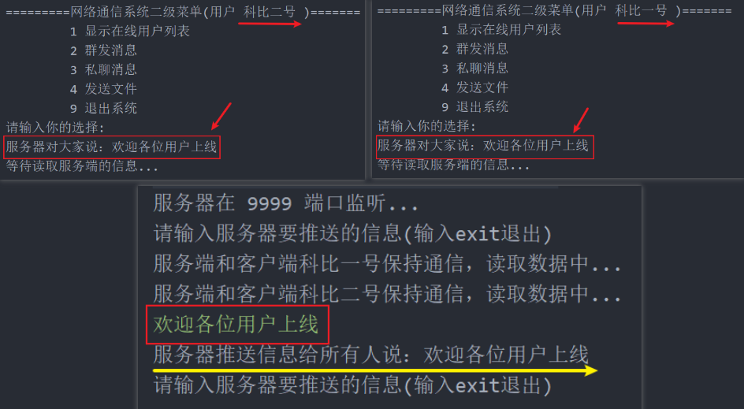

<h1 style="text-align: center; font-weight: bold;">服务器推送信息</h1>

---

##### 设计思路（<span style = "color:red;font-weight:bold">非常重要！！！</span>）


### （1）思路介绍

服务器推送信息的本质是群发，遍历所有线程集合，拿到 socket 后发送信息即可，<span style = "color:red;font-weight:bold">同时推送信息也需要是一个线程，这里单独启动一个线程用来推送消息</span>

### （2）服务端

在 service 包下编写一个类 **SendNewsToAllService** 继承 **Runable** 接口

```java
package service;

import common.Message;
import common.MessageType;
import utils.Utility;

import java.io.IOException;
import java.io.ObjectOutputStream;
import java.util.Date;
import java.util.HashMap;
import java.util.Iterator;

public class SendNewsToAllService implements Runnable {

    @Override
    public void run() {
        while (true) {
            System.out.println("请输入服务器要推送的信息(输入exit退出)");
            String news = Utility.readString(100);

            if("exite".equals(news)){
                break;
            }
            // 服务器推送信息的本质就是群发
            Message message = new Message();
            message.setSender("服务器");
            message.setContent(news);
            message.setMesType(MessageType.MESSAGE_TO_ALL_MES);
            message.setSendTime(new Date().toString());
            System.out.println("服务器推送信息给所有人说：" + news);

            // 遍历集合，拿到 socket，发送信息
            HashMap<String, ServerConnectClientThread> hm = ManageClientThreads.getHm();
            Iterator<String> iterator = hm.keySet().iterator();
            while (iterator.hasNext()){
                String onLineUserId = iterator.next().toString();
                try {
                    ObjectOutputStream oos = new ObjectOutputStream(hm.get(onLineUserId).getSocket().getOutputStream());
                    oos.writeObject(message);
                } catch (IOException e) {
                    e.printStackTrace();
                }
            }
        }
    }
}

```

## 🎉 完结：功能测试 🎉


