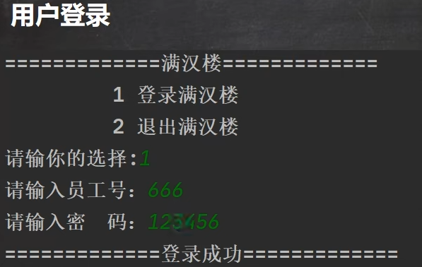
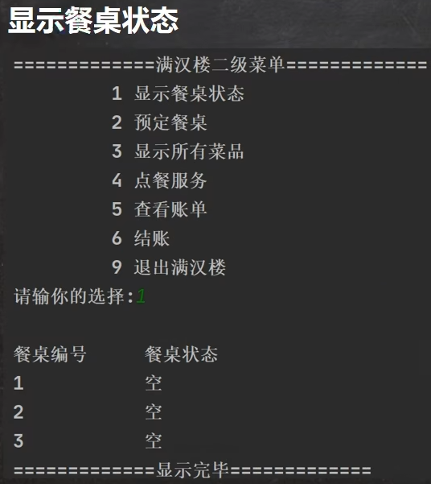
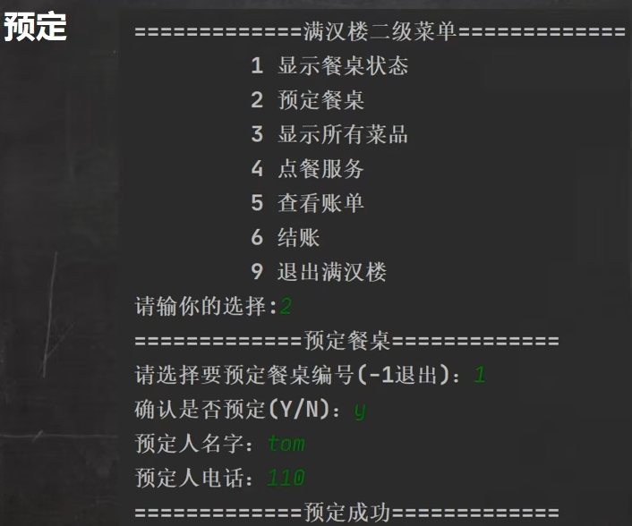
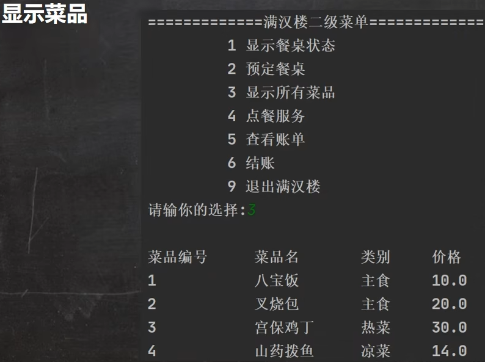
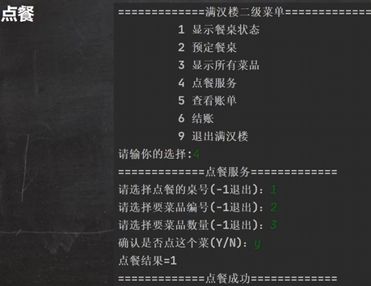
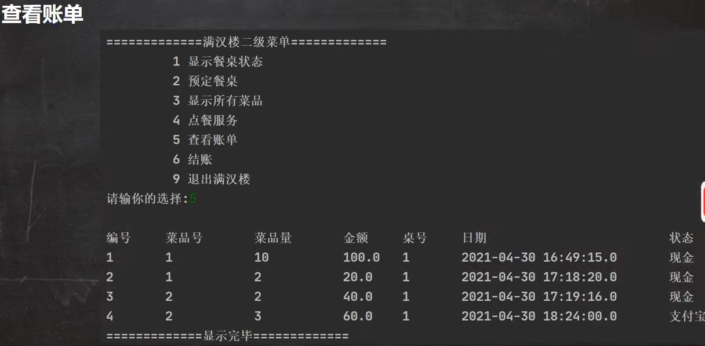
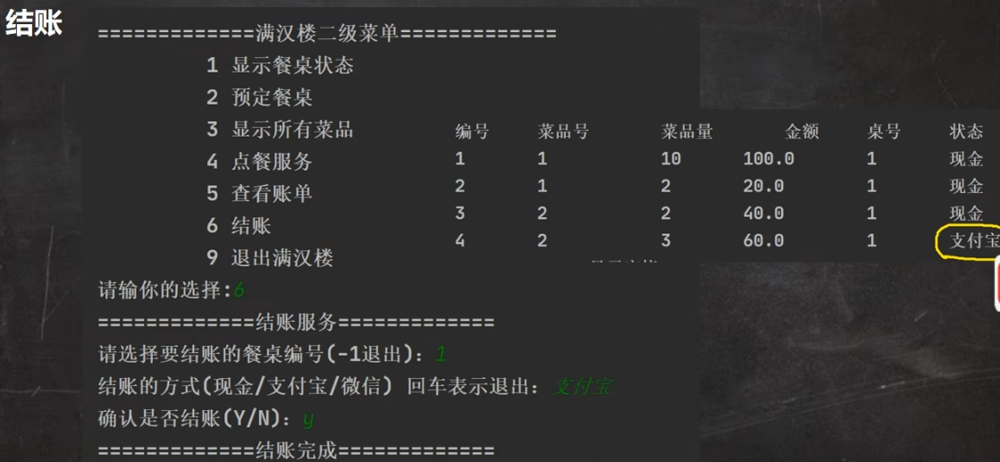
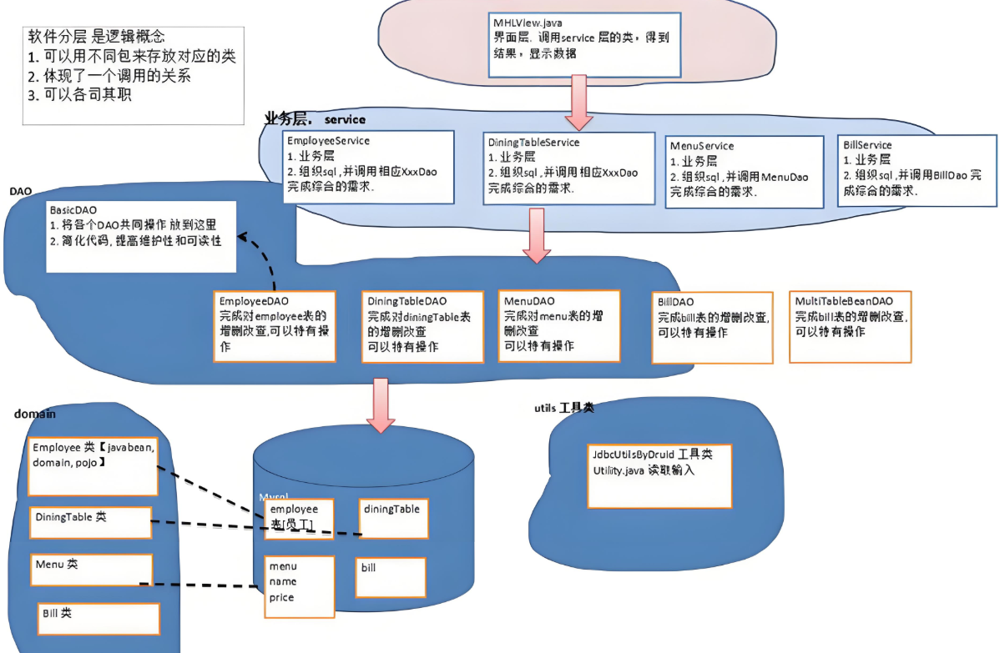

<h1 style="text-align: center; font-weight: bold;">项目介绍</h1>

---

## 基本介绍

> #### JavaSE + JDBC（Druid） + MySQL 综合项目，主要功能是模拟酒楼的管理系统

## 功能模块

### 用户登录

 

### 显示餐桌状态

 

### 预定

 

### 显示菜品

 

### 点餐

 

### 查看账单

 

### 结账

 

## 分层设计

 

#### （1）数据库层（domain）

> #### 数据库表映射类（Javabean）

#### （2）Dao 层

#### 对数据库操作，实现 CRUD

> #### BasicDao
>
> #### xxxDao

#### （3）业务层（service）

#### （4）界面层（view）

#### （5）工具层（utils）
