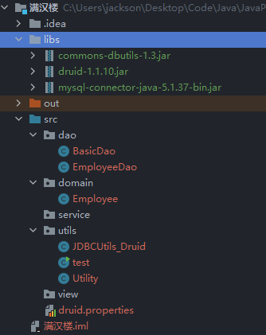

<h1 style="text-align: center; font-weight: bold;">准备工作</h1>

---

## 项目结构



#### 引入外部库

> #### 获取 <span style="color:red">mysql-connector-java-5.1.37-bin.jar、druid-1.1.10、commons-dbutils-1.3、Utility 工具包</span>
>
> #### 安装包： https://pan.baidu.com/s/1hNC1vSXbkvOGnHNJS0SqaQ?pwd=3tn6 提取码: 3tn6
>
> #### 使用方法：拷贝 jar 包到 libs 文件目录下，右键添加为库，可以参考前面获取 mysql-connector-java-5.1.37-bin.jar 的操作

## 需求分析

### 包需求

#### （1）view：用户界面层

#### （2）service：业务层，核心业务实现逻辑都在这里实现

#### （3）dao：对数据库进行 CRUD

#### （4）domain：数据库表映射

#### （5）utils：工具类

### 相关类

#### （1）引入工具类

> #### Utility：负责接收用户输入
>
> #### JDBCUtils_Druid：封装了相关方法，数据库的连接，资源的关闭

#### （2）创建雇员表

#### （3）创建 Employee（domian 类），数据表的映射

#### （4）Dao

> #### BasicDao：封装好的数据库类，实现基本操作，对数据库的 CRUD
>
> #### EmployeeDao：共有方法都放在 BasicDao 中，特有的方法可以在自己的类中声明

## dao 包

### BasicDao

```java
package dao;

import org.apache.commons.dbutils.QueryRunner;
import org.apache.commons.dbutils.handlers.BeanHandler;
import org.apache.commons.dbutils.handlers.BeanListHandler;
import org.apache.commons.dbutils.handlers.ScalarHandler;
import utils.JDBCUtils_Druid;

import java.sql.Connection;
import java.sql.SQLException;
import java.util.List;

public class BasicDao<T> {
    // 使用 DBUtils 封装DAO类，实现对数据库的增删改查

    // 创建 queryRunner 对象
    QueryRunner queryRunner = new QueryRunner();

    // 查询全表
    public List<T> queryTable(String sql, Class<T> clazz, Object... parameters) {
        Connection connection = null;
        try {
            // 获取连接
            connection = JDBCUtils_Druid.getConnection();
            // 返回查询结果
            return queryRunner.query(connection, sql, new BeanListHandler<T>(clazz), parameters);
        } catch (SQLException e) {
            throw new RuntimeException(e);
        } finally {
            // 关闭资源
            JDBCUtils_Druid.close(null, connection, null);
        }
    }

    // 单行查询
    public T queryLine(String sql, Class<T> clazz, Object... parameters) {
        Connection connection = null;
        try {
            // 获取连接
            connection = JDBCUtils_Druid.getConnection();
            // 返回查询结果
            return queryRunner.query(connection, sql, new BeanHandler<T>(clazz), parameters);
        } catch (SQLException e) {
            throw new RuntimeException(e);
        } finally {
            // 关闭资源
            JDBCUtils_Druid.close(null, connection, null);
        }
    }

    // 单行单列查询
    public Object queryValue(String sql, Object... parameters) {
        Connection connection = null;
        try {
            // 获取连接
            connection = JDBCUtils_Druid.getConnection();
            // 返回查询结果
            return queryRunner.query(connection, sql, new ScalarHandler(), parameters);
        } catch (SQLException e) {
            throw new RuntimeException(e);
        } finally {
            // 关闭资源
            JDBCUtils_Druid.close(null, connection, null);
        }
    }

    // DML语句
    public int update(String sql, Object... parameters) {
        Connection connection = null;
        try {
            connection = JDBCUtils_Druid.getConnection();
            int rows = queryRunner.update(connection, sql, parameters);
            return rows;
        } catch (SQLException e) {
            throw new RuntimeException(e);
        } finally {
            JDBCUtils_Druid.close(null, connection, null);
        }
    }
}
```

### EmployeeDao

```java
package dao;

import domain.Employee;

public class EmployeeDao extends BasicDao<Employee>{
    // 如有特殊方法或者需求再写
}
```

## domain 包

### Employee

```java
package domain;

public class Employee {
    private Integer id;
    private String empId;
    private String pwd;
    private String name;
    private String job;

    // 无参构造器，apache-DBUtils反射需要用
    public Employee(){

    }

    public Employee(Integer id, String empId, String pwd, String name, String job) {
        this.id = id;
        this.empId = empId;
        this.pwd = pwd;
        this.name = name;
        this.job = job;
    }

    public Integer getId() {
        return id;
    }

    public void setId(Integer id) {
        this.id = id;
    }

    public String getEmpId() {
        return empId;
    }

    public void setEmpId(String empId) {
        this.empId = empId;
    }

    public String getPwd() {
        return pwd;
    }

    public void setPwd(String pwd) {
        this.pwd = pwd;
    }

    public String getName() {
        return name;
    }

    public void setName(String name) {
        this.name = name;
    }

    public String getJob() {
        return job;
    }

    public void setJob(String job) {
        this.job = job;
    }

    @Override
    public String toString() {
        return "Employee{" +
                "id=" + id +
                ", empId='" + empId + '\'' +
                ", pwd='" + pwd + '\'' +
                ", name='" + name + '\'' +
                ", job='" + job + '\'' +
                '}';
    }
}
```

## utils 包

### JDBCUtils_Druid

```java
package utils;

import com.alibaba.druid.pool.DruidDataSourceFactory;

import javax.sql.DataSource;
import java.io.FileInputStream;
import java.sql.Connection;
import java.sql.ResultSet;
import java.sql.SQLException;
import java.sql.Statement;
import java.util.Properties;

public class JDBCUtils_Druid { // Druid 连接池
    private static DataSource dataSource = null;

    // 静态代码快初始化，读取配置文件信息
    static {
        Properties properties = new Properties();
        try {
            properties.load(new FileInputStream("src/druid.properties"));
            dataSource = DruidDataSourceFactory.createDataSource(properties);
        } catch (Exception e) {
            e.printStackTrace();
        }
    }

    // 连接方法
    public static Connection getConnection() throws SQLException {
        return dataSource.getConnection();
    }

    // 关闭资源
    public static void close(ResultSet resultSet,Connection connection,Statement statement){
        try {
            if (resultSet != null) {
                resultSet.close();
            }
            if (connection != null) {
                connection.close();
            }
            if (statement != null) {
                statement.close();
            }
        } catch (SQLException e) {
            /*
                实际开发中常用下面的方式处理
                1. 将编译异常转为运行异常
                2. 调用者可以选择捕获该异常，也可以选择默认处理该异常，比较方便
             */
            throw new RuntimeException(e);
        }
    }
}
```

### Utility

```java
package utils;


/**
	工具类的作用:
	处理各种情况的用户输入，并且能够按照程序员的需求，得到用户的控制台输入。
*/

import java.util.*;
/**


*/
public class Utility {
	//静态属性。。。
    private static Scanner scanner = new Scanner(System.in);


    /**
     * 功能：读取键盘输入的一个菜单选项，值：1——5的范围
     * @return 1——5
     */
	public static char readMenuSelection() {
        char c;
        for (; ; ) {
            String str = readKeyBoard(1, false);//包含一个字符的字符串
            c = str.charAt(0);//将字符串转换成字符char类型
            if (c != '1' && c != '2' &&
                c != '3' && c != '4' && c != '5') {
                System.out.print("选择错误，请重新输入：");
            } else {
                break;
            }
        }
        return c;
    }

	/**
	 * 功能：读取键盘输入的一个字符
	 * @return 一个字符
	 */
    public static char readChar() {
        String str = readKeyBoard(1, false);//就是一个字符
        return str.charAt(0);
    }
    /**
     * 功能：读取键盘输入的一个字符，如果直接按回车，则返回指定的默认值；否则返回输入的那个字符
     * @param defaultValue 指定的默认值
     * @return 默认值或输入的字符
     */

    public static char readChar(char defaultValue) {
        String str = readKeyBoard(1, true);//要么是空字符串，要么是一个字符
        return (str.length() == 0) ? defaultValue : str.charAt(0);
    }

    /**
     * 功能：读取键盘输入的整型，长度小于2位
     * @return 整数
     */
    public static int readInt() {
        int n;
        for (; ; ) {
            String str = readKeyBoard(2, false);//一个整数，长度<=2位
            try {
                n = Integer.parseInt(str);//将字符串转换成整数
                break;
            } catch (NumberFormatException e) {
                System.out.print("数字输入错误，请重新输入：");
            }
        }
        return n;
    }
    /**
     * 功能：读取键盘输入的 整数或默认值，如果直接回车，则返回默认值，否则返回输入的整数
     * @param defaultValue 指定的默认值
     * @return 整数或默认值
     */
    public static int readInt(int defaultValue) {
        int n;
        for (; ; ) {
            String str = readKeyBoard(10, true);
            if (str.equals("")) {
                return defaultValue;
            }

			//异常处理...
            try {
                n = Integer.parseInt(str);
                break;
            } catch (NumberFormatException e) {
                System.out.print("数字输入错误，请重新输入：");
            }
        }
        return n;
    }

    /**
     * 功能：读取键盘输入的指定长度的字符串
     * @param limit 限制的长度
     * @return 指定长度的字符串
     */

    public static String readString(int limit) {
        return readKeyBoard(limit, false);
    }

    /**
     * 功能：读取键盘输入的指定长度的字符串或默认值，如果直接回车，返回默认值，否则返回字符串
     * @param limit 限制的长度
     * @param defaultValue 指定的默认值
     * @return 指定长度的字符串
     */

    public static String readString(int limit, String defaultValue) {
        String str = readKeyBoard(limit, true);
        return str.equals("")? defaultValue : str;
    }


	/**
	 * 功能：读取键盘输入的确认选项，Y或N
	 * 将小的功能，封装到一个方法中.
	 * @return Y或N
	 */
    public static char readConfirmSelection() {
        System.out.println("请输入你的选择(Y/N)");
        char c;
        for (; ; ) {//无限循环
        	//在这里，将接受到字符，转成了大写字母
        	//y => Y n=>N
            String str = readKeyBoard(1, false).toUpperCase();
            c = str.charAt(0);
            if (c == 'Y' || c == 'N') {
                break;
            } else {
                System.out.print("选择错误，请重新输入：");
            }
        }
        return c;
    }

    /**
     * 功能： 读取一个字符串
     * @param limit 读取的长度
     * @param blankReturn 如果为true ,表示 可以读空字符串。
     * 					  如果为false表示 不能读空字符串。
     *
	 *	如果输入为空，或者输入大于limit的长度，就会提示重新输入。
     * @return
     */
    private static String readKeyBoard(int limit, boolean blankReturn) {

		//定义了字符串
		String line = "";

		//scanner.hasNextLine() 判断有没有下一行
        while (scanner.hasNextLine()) {
            line = scanner.nextLine();//读取这一行

			//如果line.length=0, 即用户没有输入任何内容，直接回车
			if (line.length() == 0) {
                if (blankReturn) {
                    return line;//如果blankReturn=true,可以返回空串
                } else {
                    continue; //如果blankReturn=false,不接受空串，必须输入内容
                }
            }

			//如果用户输入的内容大于了 limit，就提示重写输入
			//如果用户如的内容 >0 <= limit ,我就接受
            if (line.length() < 1 || line.length() > limit) {
                System.out.print("输入长度（不能大于" + limit + "）错误，请重新输入：");
                continue;
            }
            break;
        }

        return line;
    }
}
```

## druid 配置文件

```bash
#key=value
driverClassName=com.mysql.jdbc.Driver
#url=jdbc:mysql://localhost:3306/jdbc
url=jdbc:mysql://localhost:3306/manhanlou?rewriteBatchedStatements=true
username=root
password=
#initial connection Size
initialSize=10
#min idle connecton size
minIdle=5
#max active connection size
maxActive=20
#max wait time (5000 mil seconds)
maxWait=5000
```

## 创建 employee 表

```sql
CREATE DATABASE ManHanLou;
CREATE TABLE employee (
  id INT PRIMARY KEY AUTO_INCREMENT,             -- 自增主键
  empId VARCHAR(50) UNIQUE NOT NULL DEFAULT '',  -- 员工号，唯一且非空
  pwd CHAR(32) NOT NULL DEFAULT '',              -- 密码（MD5加密）
  NAME VARCHAR(50) NOT NULL DEFAULT '',          -- 姓名
  job VARCHAR(50) NOT NULL DEFAULT ''            -- 岗位
) DEFAULT CHARSET=utf8;


INSERT INTO employee VALUES(NULL, '6668612', MD5('123456'), '张三丰', '经理');
INSERT INTO employee VALUES(NULL, '6668622', MD5('123456'), '小龙女', '服务员');
INSERT INTO employee VALUES(NULL, '6668633', MD5('123456'), '张无忌', '收银员');
INSERT INTO employee VALUES(NULL, '666666',  MD5('123456'), '老韩',   '经理');
```

## 测试类 test

```java
package utils;

import dao.EmployeeDao;
import domain.Employee;

import java.sql.Connection;
import java.sql.SQLException;
import java.util.List;

public class test {
    public static void main(String[] args) throws SQLException {
        // 测试连接
        Connection connection = JDBCUtils_Druid.getConnection();
        System.out.println(connection);
        // DQL语句测试
        EmployeeDao employeeDao = new EmployeeDao();
        String sql = "select * from employee";
        List<Employee> employees = employeeDao.queryTable(sql, Employee.class);
        for (Employee employee :employees) {
            System.out.println(employee.getEmpId() + "\t" + employee.getName() + "\t" + employee.getJob()
            + "\t" + employee.getPwd());
        }
    }
}
```

#### 输出结果

```java
com.mysql.jdbc.JDBC4Connection@5f150435
6668612	张三丰	经理	e10adc3949ba59abbe56e057f20f883e
6668622	小龙女	服务员	e10adc3949ba59abbe56e057f20f883e
6668633	张无忌	收银员	e10adc3949ba59abbe56e057f20f883e
666666	老韩	经理	e10adc3949ba59abbe56e057f20f883e
```

<br/>

::: tip &nbsp;

<h1 style="text-align:center;padding-bottom:30px">🎉🎉成功实现，完结散花🎉🎉</h1>
:::
