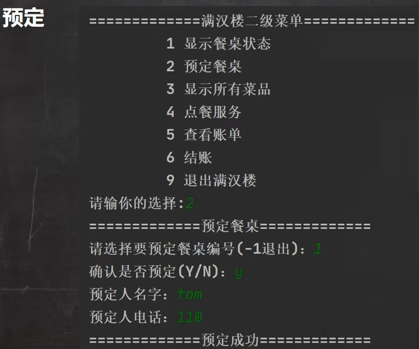

<h1 style="text-align: center; font-weight: bold;">菜单界面</h1>

---

## 界面需求


<br/>


## 代码实现

> #### 在 view 包下创建两个类
>
> #### （1）View 类：编写用户界面相关的逻辑
>
> #### （1）Main：程序的入口

## View 类

```java
package view;

import domain.Employee;
import service.EmployeeService;
import utils.Utility;

/**
 * ClassName: logInView
 * Package: view
 * Description:
 *
 * @author jacksonling
 * @version 1.0
 * @Date 2025-08-06 14:09
 */

public class View {
    // 循环结束标志
    boolean loop = true;
    // 接收用户输入
    String key = "";

    // 创建 EmployeeService 对象
    EmployeeService employeeService = new EmployeeService();
    //显示主菜单
    public void mainMenu() {
        while (loop) {
            System.out.println("\n===============满汉楼================");
            System.out.println("\t\t 1 登录满汉楼");
            System.out.println("\t\t 2 退出满汉楼");
            System.out.print("请输入你的选择: ");
            key = Utility.readString(1);
            switch (key) {
                case "1":
                    System.out.print("输入员工号: ");
                    String empId = Utility.readString(50);
                    System.out.print("输入密  码: ");
                    String pwd = Utility.readString(50);
                    System.out.println("===============登录成功================\n");
                    //显示二级菜单, 这里二级菜单是循环操作，所以做成while
                    while (loop) {
                        System.out.println("\n===============满汉楼(二级菜单)================");
                        System.out.println("\t\t 1 显示餐桌状态");
                        System.out.println("\t\t 2 预定餐桌");
                        System.out.println("\t\t 3 显示所有菜品");
                        System.out.println("\t\t 4 点餐服务");
                        System.out.println("\t\t 5 查看账单");
                        System.out.println("\t\t 6 结账");
                        System.out.println("\t\t 9 退出满汉楼");
                        System.out.print("请输入你的选择: ");
                        key = Utility.readString(1);
                        switch (key) {
                            case "1":
                                // 显示餐桌状态
                                System.out.println("显示餐桌状态");
                                break;
                            case "2":
                                // 预定餐桌
                                System.out.println("预定餐桌");
                                break;
                            case "3":
                                // 显示所有菜品
                                System.out.println("显示所有菜品");
                                break;
                            case "4":
                                // 点餐服务
                                System.out.println("点餐服务");
                                break;
                            case "5":
                                // 查看账单
                                System.out.println("查看账单");
                                break;
                            case "6":
                                // 结账
                                System.out.println("结账");
                                break;
                            case "9":
                                loop = false;
                                break;
                            default:
                                System.out.println("你的输入有误，请重新输入");
                                break;
                        }
                    }
                    break;
                case "2":
                    loop = false;//
                    break;
                default:
                    System.out.println("你输入有误，请重新输入.");
            }
        }
        System.out.println("退出了满汉楼系统~");
    }
}
```

## Main 类

```java
package view;

/**
 * ClassName: Main
 * Package: view
 * Description:
 *
 * @author jacksonling
 * @version 1.0
 * @Date 2025-08-06 15:28
 */

/**
 * 用户信息
 * 6668612	张三丰	经理	e10adc3949ba59abbe56e057f20f883e
 * 6668622	小龙女	服务员	e10adc3949ba59abbe56e057f20f883e
 * 6668633	张无忌	收银员	e10adc3949ba59abbe56e057f20f883e
 * 666666	老韩	经理	e10adc3949ba59abbe56e057f20f883e
 */

public class Main {
    public static void main(String[] args) {
        new View().mainMenu();
    }
}
```
