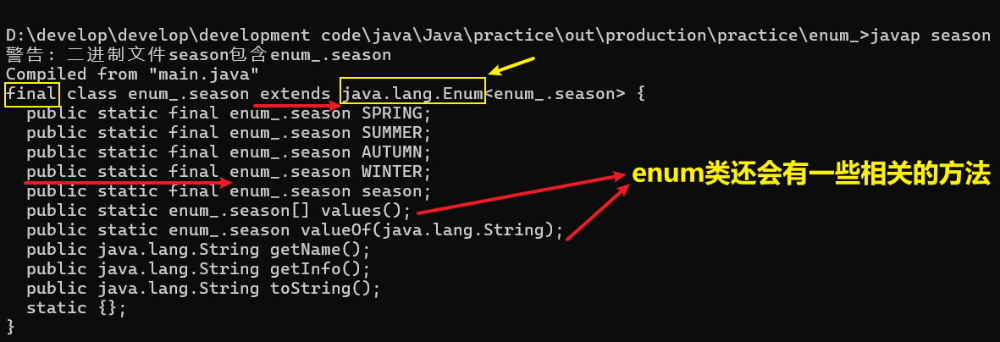
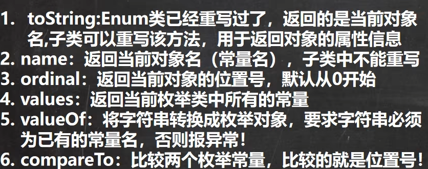

# 枚举(enum)

## 一、基本介绍

- ## 引出关键字：`enum`，全称为`enumerate`
- ## 枚举是一组==常量集合==
- ## 理解：枚举属于一种特殊的类，里面只包含一组有限的特定的对象

## 二、使用场景

## 当一个类的属性==有限定条件时==（例如一个星期只能有七天），可以使用枚举类（==特点：只读不改==）

## 三、实现枚举的方式

## 1. ==自定义类实现枚举==

## 特点如下（构建方法四步走）

- ## （1）==构造器私有化，不让 new 对象==
- ## （2）在类的内部直接==创建固定对象==（使用`public`修饰：==对外暴露对象==）
- ## （3）不需要提供`set()`方法，因为枚举对象值通常为只读。
- ## （4）对枚举对象/属性使用 `final + static` 共同修饰，实现==底层优化==
  - ## ==static== ：可以通过==类名直接访问==
  - ## ==final== ：底层优化，和 ==static== 一起使用==不会导致类的加载==

## 补充内容

- ## （5）==枚举对象名称==通常==全都大写==（由于使用了`final`修饰），常量的命名规范。
- ## （6）枚举对象根据需要，也==可以有多个属性==

## 2. ==使用`enum`关键字实现枚举==

- ## （1）class ---> enum，==不能再继承其他类==
- ## （2）枚举对象必须位于枚举类的开头，不同对象用逗号隔开，最后一个对象后使用分号
  - ## 枚举对象格式：==对象名(实参)==
  - ## 说明：如果创建时，==调用的是无参构造器==，实参列表和小括号都可以省略
- ## （3）enum 类底层是==继承==了 java.lang.Enum 这个类的，即创建枚举类时==必须明确调用哪个构造器==
- ## （4）枚举对象底层是`final + static` 共同修饰的，和自定义类实现枚举是等价的
  - ## 例如：`public final static season SPRRING = new season("春天","温暖")`等价于`SPRING("春天","温暖")`

## 四、追寻 enum 类的==底层源码==(`使用javap反编译`)



## 五、enum 类的==成员方法==

| 方法名            | 详细描述                                                                                                                                                                             |
| ----------------- | ------------------------------------------------------------------------------------------------------------------------------------------------------------------------------------ |
| valueOf           | 传递枚举类型的 Class 对象和枚举常量名称给静态方法 valueOf，会得到与参数匹配的枚举常量。                                                                                              |
| toString          | 得到当前枚举常量的名称。你可以通过重写这个方法来使得到的结果更易读。                                                                                                                 |
| equals            | 在枚举类型中可以直接使用 == 来比较两个枚举常量是否相等。Enum 提供的这个 equals() 方法，也是直接使用 == 实现的。它的存在是为了在 Set、List 和 Map 中使用。注意，equals() 是不可变的。 |
| hashCode          | Enum 实现了 hashCode() 来和 equals() 保持一致。它也是不可变的。                                                                                                                      |
| getDeclaringClass | 得到枚举常量所属枚举类型的 Class 对象。可以用它来判断两个枚举常量是否属于同一个枚举类型。                                                                                            |
| name              | 得到当前枚举常量的名称。建议优先使用 toString()。                                                                                                                                    |
| ordinal           | 得到当前枚举常量的次序。                                                                                                                                                             |
| compareTo         | 枚举类型实现了 Comparable 接口，这样可以比较两个枚举常量的大小（按照声明的顺序排列）                                                                                                 |
| clone             | 枚举类型不能被 Clone。为了防止子类实现克隆方法，Enum 实现了一个仅抛出 CloneNotSupportedException 异常的不可变 Clone()。                                                              |

## 常用方法的说明



## 六、enum==实现接口==

## 通过类名调用在类中创建的对象实例，即==eunm 类名 . 创建对象的对象名==（这就表示 enum 的一个实例对象），==通过对象调用方法==

---

# 案例：设置季节类

## 分析：季节只有四季

- ## 1. 内容是受到限制的
- ## 2. 不能创建新的对象
- ## 3. 对象的信息不能被修改

# 一、自定义类实现枚举

## 代码示例

```java
package enum_;

public class main {
    public static void main(String[] args) {
        // 直接访问类中创建的对象，用过 toString 方法重写后会输出对象的信息
        System.out.println(season.SPRRING);
        System.out.println(season.SUMMER);
        System.out.println(season.AUTUMN);
        System.out.println(season.WINTER);
    }
}

class season{
    // 对象属性私有化
    private String name;
    private String info;

    // 创建实例对象提供给其他类进行读取
    public final static season SPRRING = new season("春天","温暖");
    public final static season SUMMER = new season("夏天","炎热");
    public final static season AUTUMN = new season("秋天","凉爽");
    public final static season WINTER = new season("冬天","寒冷");

    // 构造器私有化
    private season(String name, String info) {
        this.name = name;
        this.info = info;
    }

    public String getName() {
        return name;
    }

    public String getInfo() {
        return info;
    }

    // 重写 toString 方法，输出对象的信息
    @Override
    public String toString() {
        return "season{" +
                "name='" + name + '\'' +
                ", info='" + info + '\'' +
                '}';
    }
}

// 输出结果
season{name='春天', info='温暖'}
season{name='夏天', info='炎热'}
season{name='秋天', info='凉爽'}
season{name='冬天', info='寒冷'}
```

# 二、使用`enum`关键字实现枚举

## 代码示例

```java
package enum_;

public class main {
    public static void main(String[] args) {
        // 直接访问类中创建的对象，用过 toString 方法重写后会输出对象的信息
        System.out.println(season.SPRING);
        System.out.println(season.SUMMER);
        System.out.println(season.AUTUMN);
        System.out.println(season.WINTER);
        System.out.println(season.season);
    }

}

enum season{

    // 枚举对象必须位于枚举类的开头
    SPRING("春天","温暖"),SUMMER("夏天","炎热"),
    AUTUMN("秋天","凉爽"), WINTER("冬天","寒冷"),
    season;

    /*
        使用枚举对象代替了
        public final static season SPRRING = new season("春天","温暖");
        public final static season SUMMER = new season("夏天","炎热");
        public final static season AUTUMN = new season("秋天","凉爽");
        public final static season WINTER = new season("冬天","寒冷");
     */

    // 对象属性私有化
    private String name;
    private String info;

    // 构造器私有化
    private season(){

    }

    private season(String name, String info) {
        this.name = name;
        this.info = info;
    }

    public String getName() {
        return name;
    }

    public String getInfo() {
        return info;
    }

    // enum类在底层继承了父类，在子类中不重写该方法
    // 调用父类的方法，输出的是对象的名称
}
```

## ==注意==：子类==不重写== ==toString== 方法，`enum`类在底层继承了父类，调用父类的方法，输出的是对象的名称

# 三、`enum`成员方法


## 代码示例

```java
package enum_;

public class main {
    public static void main(String[] args) {
        season spring = season.SPRING;

        // name 方法
        System.out.println("1. 调用 name() 方法：" + spring.name());
        System.out.println("spring.name() = " + spring.name());
        System.out.println();

        // ordinal 方法：从 0 开始编号
        System.out.println("2. 调用 ordinal() 方法");
        System.out.println("spring.ordinal() = "+ spring.ordinal());
        System.out.println();

        // values 方法 ：返回的是数组，存储 enum类 中的所有常量
        System.out.println("3. 调用 values() 方法，遍历数组，返回所有常量");
        season[] seasons = season.values();
        /*
        使用增强for循环
        for（变量类型 变量名：数组或集合）
         */
        for(season s:seasons){
            System.out.println(s);
        }
        System.out.println();

        // valueOf 方法：判断常量是否存在于enum类中，存在则返回常量名，否则报异常
        System.out.println("4. 调用 valueof() 方法");
        System.out.println("season.valueOf(\"AUTUMN\") = " + season.valueOf("AUTUMN"));
//        System.out.println("season.valueOf(\"hi\") = " + season.valueOf("hi")); // 会报异常
        System.out.println();

        // compareTo() 方法：计算两个枚举常量位置序号的差值
        System.out.println("5. 调用 compareTo() 方法");
        System.out.println("season.WINTER.compareTo(season.SPRING) = " + season.WINTER.compareTo(season.SPRING));
        System.out.println();
    }

}

enum season{

    // 枚举对象必须位于枚举类的开头
    SPRING("春天","温暖"),SUMMER("夏天","炎热"),
    AUTUMN("秋天","凉爽"), WINTER("冬天","寒冷");

    // 对象属性私有化
    private String name;
    private String info;

    // 构造器私有化
    private season(){

    }

    private season(String name, String info) {
        this.name = name;
        this.info = info;
    }

    public String getName() {
        return name;
    }

    public String getInfo() {
        return info;
    }

    // enum类在底层继承了父类，在子类中不重写该方法
    // 调用父类的方法，输出的是对象的名称

    /*
        enum类的 toString 方法

        public String toString() {
            return name;
        }
     */
}

// 输出结果
1. 调用 name() 方法：SPRING
spring.name() = SPRING

2. 调用 ordinal() 方法
spring.ordinal() = 0

3. 调用 values() 方法，遍历数组，返回所有常量
SPRING
SUMMER
AUTUMN
WINTER

4. 调用 valueof() 方法
season.valueOf("AUTUMN") = AUTUMN

5. 调用 compareTo() 方法
season.WINTER.compareTo(season.SPRING) = 3
```

# 四、enum 实现接口

## 代码示例

```java
package enum_;

public class main {
    public static void main(String[] args) {
        // season.INTERFACE_METHIOD 是 enum 类的一个实例对象，通过对象调用方法
        season.INTERFACE_METHIOD.hi();
    }

}

interface A{
    public void hi();
}

enum season implements A{

    // 枚举对象必须位于枚举类的开头
    SPRING("春天","温暖"),SUMMER("夏天","炎热"),
    AUTUMN("秋天","凉爽"), WINTER("冬天","寒冷"),
    INTERFACE_METHIOD;

    // 对象属性私有化
    private String name;
    private String info;

    // 构造器私有化
    private season(){

    }

    private season(String name, String info) {
        this.name = name;
        this.info = info;
    }

    public String getName() {
        return name;
    }

    public String getInfo() {
        return info;
    }

    public void hi(){
        System.out.println("在 enum 类中实现了接口的 hi() 方法");
    }
}
```
