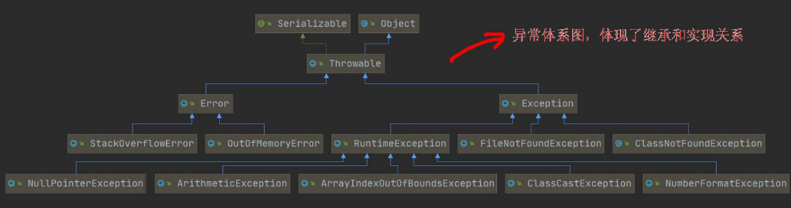
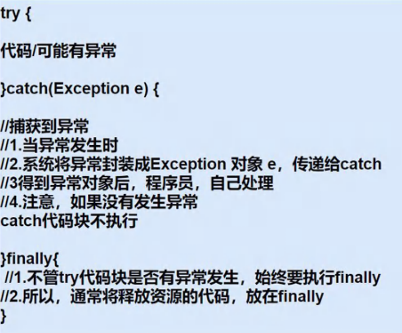
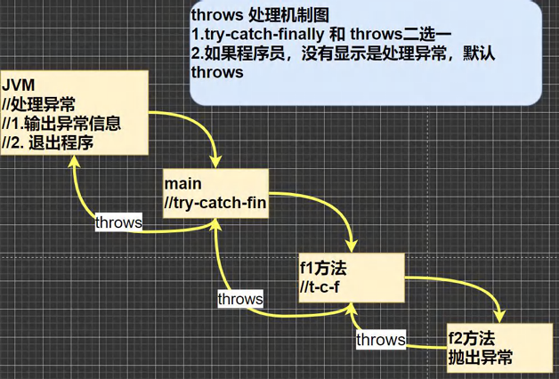

# 异常（Exception）

## 一、基本介绍

## 在 Java 程序中，将运行中发生的==不正常情况称为 “异常”==，开发过程中的语法错误和运行时发生的异常情况是不一样的。

## 二、异常的分类

- ## 1. ==Error（错误）==：==Java 虚拟机无法解决的严重问题==，比如：JVM 虚拟机的崩溃、虚拟机内存溢出等 “严重” 问题。比如：StackOverflowError（栈溢出）和 OutOfMemoryError（内存溢出）等。==Error 是系统级的错误，程序无法处理==
- ## 2. ==Exception（异常）==：其他因编程错误或偶然的外在因素导致的一般性问题，可以使用针对性的代码进行处理。例如：空指针异常、数组越界异常、文件找不到异常等

  - ## （1）==编译异常==

    - ## 编译时异常，是编译器要求==必须处理==的异常。

  - ## （2）==运行异常==
    - ## 运行时异常，==编译器检查不出来==。一般是指编程时的逻辑错误，是程序员应该避免其出现的异常
    - ## 对于运行时异常，==可以不作处理==，因为这类异常很普遍，若全处理可能会对程序的可读性和运行效率产生影响

- ## 3. 自定义异常
  - ## 程序出现了某些"错误"，但该错误信息并没有在`Throwable`子类中描述处理，这个时候可以自己设计异常类，==自定义异常的描述信息==

## 三、处理异常的方法

- ## （1）`try-catch-finally`
- ## （2）`throws`

## 四、==异常体系图（重点！！）==

## 异常体系图==体现了继承关系==



## 说明

- ## 在`Trowable`下的两个子类
  - ## `Error`
  - ## `Exception`
- ## 在异常`Exception`下又有两个分类
  - ## ==编译异常==（列举了两个）
    - ## `FileNotFoundException`
    - ## `ClassNotFoundException`
  - ## ==运行异常==：`RuntimeException`（==常见的五个==）
    - ## `NullPointerException`：空指针异常
    - ## `ArithmeticException`：数学运算异常
    - ## `ArrayIndexOutOfBoundsException`：数组下标越界异常
    - ## `ClassCastException`：类型转换异常
    - ## `NumberFormatException`：数字格式不正确异常

## 五、`throws` 和 `throw` 的区别

---

# 一、编译异常

## （1）介绍：编译异常是指在编译期间，就==必须处理==的异常，否则代码不能通过编译

## （2）常见的编译异常

- ## `SQLException`：操作数据库时，查询表可能发生异常
- ## `IOException`：操作文件时，发生的异常
- ## `FileNotFoundException`：操作一个不存在的文件时，发生异常
- ## `ClassNotFoundException`：加载类，而该类不存在时，异常
- ## `EOFException`：操作文件，到文件末尾，发生异常
- ## `IllegalArgumentException`：参数异常

---

# 二、运行异常

## （1）介绍：在编译时不会发现，在程序运行时出现的逻辑错误导致的异常，==若不做处理，默认抛出（throws）异常==，交给 ==父类 或 上一级== 来处理

## （2）常见类型

- ## `NullPointerException`：空指针异常
- ## `ArithmeticException`：数学运算异常
- ## `ArrayIndexOutOfBoundsException`：数组下标越界异常
- ## `ClassCastException`：类型转换异常
- ## `NumberFormatException`：数字格式不正确异常

## 异常演示

## （1）`NullPointerException`：空指针异常

```java
public class NullPointerException_ {
    public static void main(String[] args) {
        String name = null;
        System.out.println(name.length());
    }
}
```

## 异常：获取空字符窜的长度

## （2）`ArithmeticException`：数学运算异常

```java
public class ArithmeticException_ {
    public static void main(String[] args) {
        int a = 1;
        int b = 0;
        System.out.println("a / b = " + a / b);
    }
}
```

## 异常：分母为 0

## （3）`ArrayIndexOutOfBoundsException`：数组下标越界异常

```java
public class ArrayIndexOutOfBoundsException_ {
    public static void main(String[] args) {
        int[] arr = {1, 2, 3};
        for (int i = 0; i <= arr.length; i++) {
            System.out.println("arr[" + i + "] = " + arr[i]);
        }
    }
}
```

## 异常：数组只有三个元素，却访问了第四个元素

## （4）`ClassCastException`：类型转换异常

```java
public class ClassCastException_ {
    public static void main(String[] args) {
        person p_a = new A(); // 向上转型
        A a = (A)p_a; // 向下转型

        // 两个不相关的类进行转换会报异常
        B b = (B) p_a; // A 和 B 之间无关系，不可以把指向 A 的转换为 B
    }
}

class person {

}

class A extends person{

}

class B extends person{

}
```

## 异常：A 类 和 B 类 没有关系，不可以把指向 A 类 的对象转成指向 B 类 的对象

## （5）`NumberFormatException`：数字格式不正确异常

```java
public class NumberFormatException_ {
    public static void main(String[] args) {
        String name = "异常";
        // 将 String 转成 int
        int num = Integer.parseInt(name);
        System.out.println(num);
    }
}
```

## 异常：无法将字符串转化为整数

---

# 三、异常处理

# 1. ==try - catch - finally==

## 使用方法：选中可能出现异常的代码部分，使用==快捷键`ctrl + alt + t`==，在弹窗中选择需要的结构即可

## 1. 三种结构

- ## `try - catch`
- ## `try - finally`
- ## `try - catch - finally`

## 2. 基本结构图



## 3. 代码示例

```java
public class main {
    public static void main(String[] args) {
        try {
            String name = "异常";
            // 将 String 转成 int
            int num = Integer.parseInt(name);  // 会抛出 NumberFormatException
            System.out.println(num);
        } catch (NumberFormatException e) {
            System.out.println(e.getMessage());
        } finally {
            System.out.println("程序执行到 finally 部分.....");
        }
    }
}
```

## 说明：在==catch==结构中，使用==getMessage()==方法==获取异常信息==

## 4. ==try - catch==结构的使用细节

- ## （1）如果==异常发生==了，则异常==后面的代码不会执行==，直接进入到`catch`块
- ## （2）如果==异常没有发生==，则==顺序执行 try 的代码块==，不会进入到`catch`
- ## （3）不管异常是否发生，都希望指向某段代码（比如：关闭连接，释放资源等），可以使用`finally`结构
  - ## ==注意：`finally`中的代码必须执行！！==
- ## （4）==可以有多个 catch 语句==，捕获不同的异常（进行不同的业务处理）
  - ## （1）==子类在前，父类在后==
  - ## （2）==只会匹配一个`catch`==

## 5. ==try - finally==结构的使用细节

## 该用法相当于==没有捕获异常==，因此程序会直接退出==崩掉 / 退出

## 应用场景：执行一段代码后，不管是否发生异常，都==必须执行==某个业务逻辑（`finally`部分的代码）

## 解释：为什么子类在前，父类在后？

```java
package exception_;

public class main {
    public static void main(String[] args) {
        try {
            // NullPointerException
            String name = null;
            System.out.println(name.length());

            // ArrayIndexOutOfBoundsException
            int[] arr = {1,2,3};
            for (int i = 0; i <= arr.length; i++) {
                System.out.println("arr[" + i + "] = " + arr[i]);
            }
        } catch (NullPointerException e) {
            System.out.println("空指针异常：" + e.getMessage());
        } catch (ArrayIndexOutOfBoundsException e){
            System.out.println("数组下标越界异常：" + e.getMessage());
        }
        System.out.println("程序继续执行......");
    }
}

// 运行结果
空指针异常：null
程序继续执行......
```

## 代码解析

## `NullPointerException`（子类）和`ArrayIndexOutOfBoundsException`（子类）都是`RuntimeException`（父类）的子类，然而运行异常又是`Exception`的子类，==如果把父类`Exception`写在前面，即包含了所有子类，后面再写子类就没有意义了==

## 6. ==try - catch==的练习题

```java
public class ExceptionExe01 {
    public static int method() {
        int i = 1;
        try {
            i++;
            String[] names = new String[3];
            if (names[1].equals("tom")) {
                System.out.println(names[1]);
            } else {
                names[3] = "jack";
            }
            return 1;
        } catch (ArrayIndexOutOfBoundsException e) {
            return 2;
        } catch (NullPointerException e) {
            return ++i;
        } finally {
            ++i;
            System.out.println("i = " + i);
        }
    }

    public static void main(String[] args) {
        System.out.println(method());
    }
}
```

## 程序执行结果

```java
i = 4
3
```

## 解释

- ## （1）finally 一定会执行，所以在调用方法的时候就执行了其中的代码，调用了 method()方法，输出的肯定是方法的返回值
- ## （2）代码中属于空指针异常，即会在`catch (NullPointerException e)`中返回 i 的值

---

# 2. ==throws==

## 1. 基本介绍：==抛出==异常

- ## （1）程序可能出现某些异常，通过==throws==显示的声明，==不做处理==
- ## （2）在方法声明中用==throws==语句可以声明抛出异常的==列表==，抛出的异常类型可以是
  - ## 1. 方法中产生的异常类型
  - ## 2. 抛出的异常类型的==父类==
- ## （3）抛出的异常==由上一级 / 调用者 / 父类进行处理==
  - ## ==注意点==：如果抛出的是==编译异常==，==上一级必须显示声明==异常的处理
    - ## （1）上一级做==try - catch==的处理，捕获异常
    - ## （2）继续抛出异常==throws==
- ## （4）如果上一级都不做处理，==最后到 JVM 时，会直接结束程序，输出异常信息==

## 2. 基本原理图



## 3. 代码示例

## （1）抛出方法中的==异常==

```java
public static void method() throws NullPointerException,ArrayIndexOutOfBoundsException{
    // NullPointerException
    String name = null;
    System.out.println(name.length());

    // ArrayIndexOutOfBoundsException
    int[] arr = {1,2,3};
    for (int i = 0; i <= arr.length; i++) {
        System.out.println("arr[" + i + "] = " + arr[i]);
    }
    System.out.println("程序继续执行......");
}
```

## （2）抛出方法中的异常的==父类==

```java
public static void method() throws RuntimeException{
    // NullPointerException
    String name = null;
    System.out.println(name.length());

    // ArrayIndexOutOfBoundsException
    int[] arr = {1,2,3};
    for (int i = 0; i <= arr.length; i++) {
        System.out.println("arr[" + i + "] = " + arr[i]);
    }
    System.out.println("程序继续执行......");
}
```

## 代码解释

> ## 父类：`RuntimeException`
>
> ## 子类
>
> - ## `NullPointerException`
> - ## `ArrayIndexOutOfBoundsException`

## 4. throws 的==使用细节==

- ## （1） 对于==编译异常，程序中必须处理==（try-catch 或者 throws）
- ## （2） 对于==运行时异常==，程序中如果==没有处理==，==默认==就是==throws==的方式处理
- ## （3） ==子类重写父类的方法==时，子类重写的方法所抛出异常类型的两种情况
  - ## 1. 要么类型要和父类抛出的==异常一致==
  - ## 2. 要么为==父类==抛出的==异常==的类型的==子类型==
- ## （4） 在 throws 过程中，如果==有方法 try-catch==，就相当于处理异常，就可以==不必 throws==

## 代码解析：子类重写父类方法抛出异常

```java
class a {
    public void method() throws RuntimeException{
        // NullPointerException
        String name = null;
        System.out.println(name.length());
    }
}

class b extends a {
    @Override
    public void method() throws ArrayIndexOutOfBoundsException{
        // ArrayIndexOutOfBoundsException
        int[] arr = {1, 2, 3};
        for (int i = 0; i <= arr.length; i++) {
            System.out.println("arr[" + i + "] = " + arr[i]);
        }
    }
}
```

## 代码解析

## b 类是 a 类的子类，则==b 类抛出的异常必须是 a 类抛出异常类型的子类==，然而 a 类抛出异常的类型`NullPointerException`是`RuntimeException`的==子类==，抛出的异常类型用其父类代替是没有问题的

## ==但是！！！==

## 若将子类抛出异常的类型换成`Exception`，必然会报错，因为扩大了父类抛出异常的类型（本质还是继承关系）

---

# 3. ==自定义异常==

## 1. 基本介绍

## 程序出现了某些"错误"，但该错误信息并没有在`Throwable`子类中描述处理，这个时候可以自己设计异常类，==自定义异常的描述信息==

## 2. 构建方法

- ## （1）定义类：自定义异常类名（程序员自己写），继承 `Exception` 或 `RuntimeException`
- ## （2）==如果继承 `Exception`，属于编译时异常（受检异常）==
- ## （3）如果继承 `RuntimeException`，属于运行时异常（非受检异常）

## 3. 应用案例

## 要求：接收 person 对象年龄时，要求年龄范围在 `18 - 120` 之间，否则抛出一个自定义异常，并给出提示信息

## 代码示例

```java
package exception_;

public class main {
    public static void main(String[] args) {
        int age = 180;
        if(!(age >= 18 && age <= 120)){
            throw new AgeException("年龄需要在 18 - 120 之间");
        }
        System.out.println("你的年龄范围正确");
    }
}

class AgeException extends RuntimeException {
    // 调用 RuntimeException 的构造器，修改异常信息
    public AgeException(String message) {
        super(message);
    }
}
```

## 输出结果

```java
Exception in thread "main" exception_.AgeException: 年龄需要在 18 - 120 之间
	at exception_.main.main(main.java:7)
```

## 代码解析

## 思路：创建了一个类，==通过调用父类的构造器，在创建自定义异常调用构造器来传入自定义异常信息==

## 如何理解 new？

## 异常是一个类，==抛出的必须是异常类的一个对象实例==，所以需要 new，创建对象时通过调用构造器传入信息来完成对象实例的初始化

---

# 4. `throws` 和 `throw`的区别

| 意义       | 位置       | 后面跟的东西 |
| ---------- | ---------- | ------------ |
| throw==s== | 方法声明处 | 异常==类型== |
| throw      | 方法体中   | 异常==对象== |
