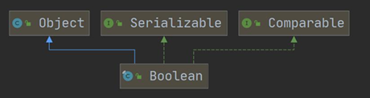
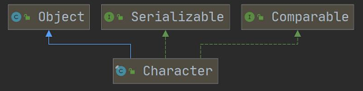
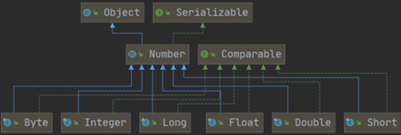
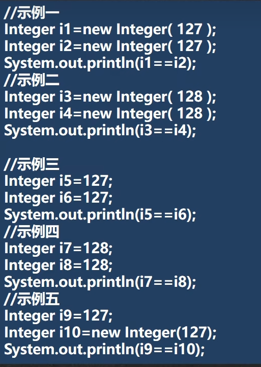
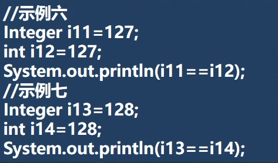
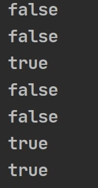

# 包装类（Wrapper）

## 1. 介绍

- ## （1）针对八种基本数据类型相应的==引用类型== --> 包装类
- ## （2）有了类的特点，就可以调用类中的方法

## 2. 分类和继承关系

| 基本数据类型 | 包装类    | 父类       |
| ------------ | --------- | ---------- |
| ==boolean==  | Boolean   | ==Object== |
| ==char==     | Character | ==Object== |
| byte         | Byte      | Number     |
| short        | Short     | Number     |
| int          | Integer   | Number     |
| long         | Long      | Number     |
| float        | Float     | Number     |
| double       | Double    | Number     |





---

# 一、包装类和==基本数据类型==的相互转换（==装箱和拆箱==）

## （1）==jdk5 前==的==手动装箱和拆箱==方式， 装箱：基本类型->包装类型，反之，拆箱

## （2）==jdk5 以后==(含 jdk5)的==自动装箱和拆箱==方式

## （3）底层调用的方法

- ## 自动装箱：`valueOf()`方法
- ## 自动拆箱：`intValue()`方法

## （4）下面以`Integer`举例，其他包装类的方法类似，不一一举例

## 1. 装箱(`int` --> `Integer`)

```java
int n = 10;

// 方式一
Integer integer = Integer.valueOf(n);

// 方式二
Integer integer1 = new Integer(n);
```

## 2. 拆箱(`Integer` --> `int`)

```java
int n = 10;

// 装箱
Integer integer = Integer.valueOf(n);

// 拆箱
int n1 = integer.intValue();
```

## 3. 自动装箱和插箱

```java
int n = 10;

// 自动装箱
Integer integer = n; // 底层调用 valueOf() 方法

// 自动拆箱
int n1 = integer; // 底层调用 intValue() 方法
```

## 实现自动的原理：==在底层会调用相应的方法==

---

# 二、包装类和==String 类==的相互转换

## 1. `Integer` --> `String`的三种方法

- ## （1）使用字符串串拼接
- ## （2）使用`Integer.toString()`方法
- ## （3）使用`String.valueOf()`方法
  - ## `String.valueOf()`方法在底层==接收的是一个对象==，而`Integer`刚好就是一个对象

## 代码示例

```java
Integer integer = 5; // 自动装箱

// Integer --> String

// 方法一
String str1 = integer + "";

// 方法二
String str2 = integer.toString();

// 方法三
String str3 = String.valueOf(integer);
```

## 2. `String` --> `Integer`

## 两种方法

- ## （1）使用`Integer.parseInt()`方法（==自动装箱==）
  - ## 解读：`parseInt()`方法==返回`int`类型==，==本质还是把`int`类型赋值给`Integer`类型==，实现了自动装箱
- ## （2）使用构造器，创建`Integer`对象

## 代码示例

```java
String str = "123";

Integer integer1 = Integer.parseInt(str); // 使用自动装箱

Integer integer2 = new Integer(str); // 使用构造器
```

---

# 三、`Integer`类和`Character`类的一些常用方法

## 说明：下面举例说明，对于其他类型的大同小异

| 方法                           | 描述                     |
| ------------------------------ | ------------------------ |
| `Integer.MIN_VALUE`            | 返回整数的最小值         |
| `Integer.MAX_VALUE`            | 返回整数的最大值         |
| `Character.isDigit(char)`      | 判断字符是否为数字       |
| `Character.isLetter(char)`     | 判断字符是否为字母       |
| `Character.isUpperCase(char)`  | 判断字符是否为大写字母   |
| `Character.isLowerCase(char)`  | 判断字符是否为小写字母   |
| `Character.isWhitespace(char)` | 判断字符是否为空格       |
| `Character.toUpperCase(char)`  | 将字符==转换为大写==字母 |
| `Character.toLowerCase(char)`  | 将字符==转换为小写==字母 |

## 代码示例

```java
public class Test {
    public static void main(String[] args) {
        System.out.println(Integer.MIN_VALUE); // 返回最小值
        System.out.println(Integer.MAX_VALUE); // 返回最大值

        System.out.println(Character.isDigit('a')); // 判断是不是数字
        System.out.println(Character.isLetter('a')); // 判断是不是字母
        System.out.println(Character.isUpperCase('a')); // 判断是不是大写
        System.out.println(Character.isLowerCase('a')); // 判断是不是小写

        System.out.println(Character.isWhitespace('a')); // 判断是不是空格
        System.out.println(Character.toUpperCase('a')); // 转成大写
        System.out.println(Character.toLowerCase('A')); // 转成小写
    }
}

// 运行结果
-2147483648 // 返回最小值
2147483647 // 返回最大值
false // 判断是不是数字
true // 判断是不是字母
false // 判断是不是大写
true // 判断是不是小写
false // 判断是不是空格
A // 转成大写
a // 转成小写
```

---

# 四、`Integer`的创建机制==底层源码探究==

## 源码如下

```java
public static Integer valueOf(int i) {
        if (i >= IntegerCache.low && i <= IntegerCache.high)
            return IntegerCache.cache[i + (-IntegerCache.low)];
        return new Integer(i);
    }
```

## 继续追源码，可以得到：==low:-127、high:128==

## `int` --> `Integer`==底层机制的解释==

- ## （1）值在 `-128 --> 127` 范围内会==使用缓存池==，当两个 Integer 对象的值在这个范围内时，它们会==引用相同的缓存对象==（存储在`Cache`数组中）
- ## （2）如果==数值超出范围==，转换时，底层==会创建`Integer`对象==

## 代码示例

## （1）数据在范围内：引用相同的缓存对象

```java
Integer integer1 = 1;
Integer integer2 = 1;
System.out.println(integer1 == integer2);

// 输出结果
true
```

## （2）数据不再范围内：创建`Integer`对象

```java
Integer integer1 = 128;
Integer integer2 = 128;
System.out.println(integer1 == integer2);

// 输出结果
false
```

---

# 五、题目练习

## 1. ==易错题==

## （1）第一题

```java
Object obj1 = true ? new Integer(1) : new Double(2.0);
System.out.println(obj1);
```

## 输出：==1.0==

## 解释：==三元运算符看成一个整体==，`double`的==优先级最高==，所以输出`double`（遵循自动类型转换中的==自动提升原则==）

## `自动提升原则：表达式结果的类型自动提升为操作数中最大的类型`

```java
int result = true ? 1 : 2.5;
System.out.println(result);
```

## 输出：==1.0==

## （2）第二题

```java
Object obj2;
if (true) {
    obj2 = new Integer(1);
} else {
    obj2 = new Double(2.0);
}
System.out.println(obj2);
```

## 输出：==1==

## 2. 综合题




## 答案



## 总结

## （1）如果是在范围内：是同一个对象

## （2）如果超出范围或者`new`：只要是创建了对象就不是同一个对象

## （3）`int`和`Integer`：==只要有基本数据类型，判断的是值是否相等==
