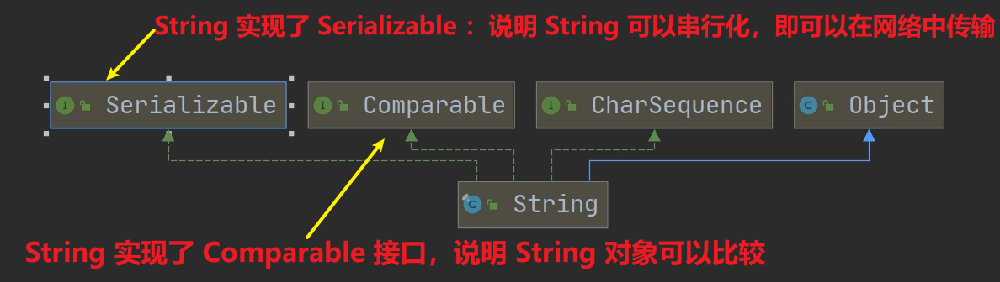
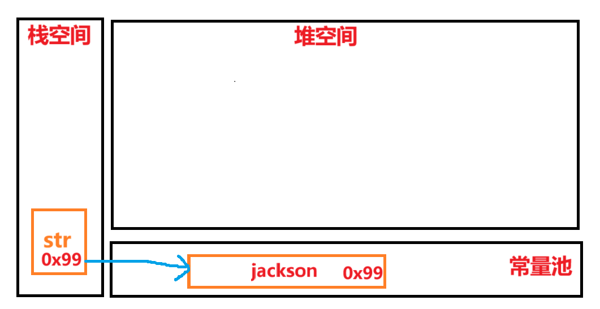
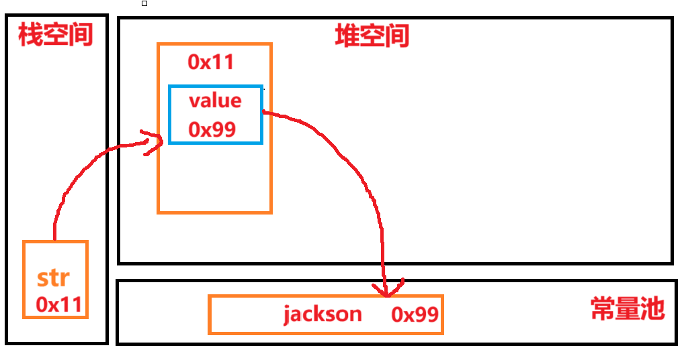
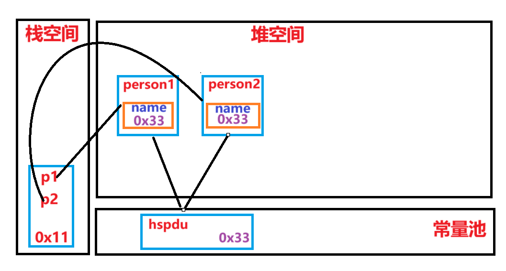
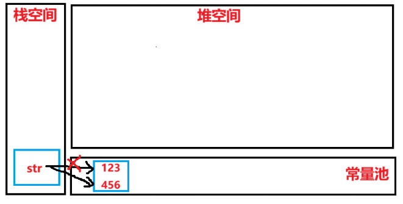
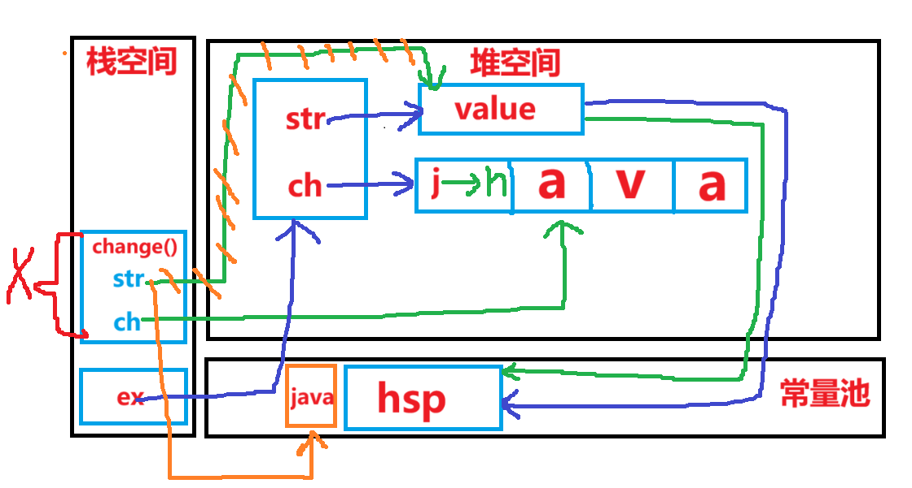

# String 类（==重点==）

## 1. 基本介绍

- ## （1）String 对象用于存储字符串，也就是一组字符序列
- ## （2）字符串常量对象是用双引号括起的字符串序列。例如："你好"、"12.97"、"boy"等
- ## （3）字符串的字符使用==Unicode 字符编码==，==一个字符(不区分字母还是汉字)占`两个`字节==
- ## （4）String 类 ==常用构造器==(其他查看手册):
  - ## `String s1 = new String()`
  - ## `String s2 = new String(String original)`
  - ## `String s3 = new String(char[] a)`
  - ## `String s4 = new String(char[] a, int startIndex, int count)`
- ## （5）String 类 是 ==final 类（不可变对象）==，不能被其他的类继承
- ## （6）String 有属性 `private final char value[]`：用于存放字符串内容
- ## （7）注意：`value`也是一个==final 类==，==不可以被修改==（指的是`value`==不能指向新的地址==，但是单个字符==内容可以变化==）

## 2. 结构关系图



## 3. String 类的==特点==和缺点

## （1）String 类 是保存字符串常量的，==每次更新都要重新开辟空间，效率较低==

## （2）后续可以用`StringBuffer`和`StringBuilder`来增强 String 的功能，提高效率

---

# 一、String 对象的==创建机制==

## 1. 创建方式

- ## 第一种（直接赋值）：`String str = "jackson"`
- ## 第二种（调用构造器）：`String str = new String("jackson")`

## 2. 两种创建方式的==区别==（==重点理解！！！==）

## （1）直接赋值

- ## 1. 先从==常量池==查看是否有"jackson"数据空间
- ## 2. 如果==有，直接指向==
- ## 3. 如果==没有则重新创建==，然后指向
- ## 4. 最终==指向==的是==常量池==的空间地址
  

## （2）调用构造器

- ## 1. 先在==堆中创建空间==，里面维护了==value 属性==，指向常量池的 jackson 空间
- ## 2. 如果常量池==没有=="jackson"，重新==创建==
- ## 3. 如果==有==，直接通过 value==指向==
- ## 4. 最终==指向==的是==堆中的空间地址==
  

---

## 3. 练习题

## （1）第一题

```java
String a = "abc";
String b = "abc";
System.out.println(a.equals(b)); // T
System.out.println(a == b);      // T
```

## 代码分析

## 1. equals 方法被重写，比较的是内容是否相同

## 2. 使用直接赋值法，==直接指向常量池的地址==

- ## （1）对于==a==：常量池中==没有==`abc`，==需要创建==
- ## （2）对于==b==：常量值中==有==`abc`,==直接指向==

---

## （2）第二题

```java
String a = new String("abc");
String b = new String("abc");
System.out.println(a.equals(b));  // T
System.out.println(a == b);       // F
```

## 代码分析

## 1. 字符串中重写了`equals()`方法，比较的是字符串内容是否相同

## 2. 两个都是`new`，是两个不同的对象，地址当然不 i 同

---

## （3）第三题

> ### 知识点补充：`intern()`方法
>
> ### 当调用 intern() 方法时
>
> - ### （1）如果池中已经包含一个等于此 String 对象的字符串（用 equals(Object) 方法确认）,则返回池中的字符串
> - ### （2）否则，将此 String 对象添加到池中，并返回该 String 对象的引用。
>
> ### ==总结：返回的是常量池的地址==

```java
String a = "hsp";  // a指向常量池的"hsp"
String b = new String("hsp");  // b指向堆中对象
System.out.println(a.equals(b));  // T
System.out.println(a == b);       // F
System.out.println(a == b.intern());  // T
System.out.println(b == b.intern());  // F
```

## 代码分析

- ## （1）`b.intern()`返回的是==常量池==的地址
- ## （2） ==a== 指向的是==常量池==
- ## （3） ==b== 指向的是==堆空间==

---

## （4）第四题

```java
String s1 = "hspedu";  // 指向常量池 "hspedu"
String s2 = "java";    // 指向常量池 "java"
String s4 = "java";    // 指向常量池 "java"
String s3 = new String("java"); // 指向堆中对象 "java"
System.out.println(s2 == s3);  // F
System.out.println(s2 == s4);  // T
System.out.println(s2.equals(s3));  // T
System.out.println(s1 == s2);  // F
```

---

## （5）第五题

```java
Person p1 = new Person();
p1.name = "hspedu";
Person p2 = new Person();
p2.name = "hspedu";

System.out.println(p1.name.equals(p2.name)); // 比较内容：True
System.out.println(p1.name == p2.name);      // T
System.out.println(p1.name == "hspedu");     // T

String s1 = new String("bcde");
String s2 = new String("bcde");
System.out.println(s1 == s2); // False
```



---

# 二、字符串的特性

## 1. 说明

- ## （1）String 是一个==final 类==，代表不可变的字符序列
- ## （2）字符串是不可变的，一个字符串==对象一旦被分配==，其==内容是不可变的==

## 2. “不可变“的底层原理分析

```java
String str = "123";
str = "456";
```

## 注意：底层在常量池==创建了两个对象==



## 分析：（1）首先在常量池创建`456`对象（2）==改变`str`指向的地址==

---

## 3. 面试题练习

## （1）第一题

```java
String a = "hello" + "abc";
```

## 代码分析

- ## （1）==底层创建了`一个`对象==
- ## （2）==编译器会优化处理==：`"hello" + "abc"`等价于`helloabc`

---

## （2）第二题

```java
String a = "hello";
String b = "abc";
String c = a + b;
```

## 1. 代码分析：==底层创建了`三个`对象==

## 2. `String c = a + b`的执行过程分析（==重点！！==）

- ## `StringBuilder sb = new StringBuilder()`
- ## `sb.append(a)`
- ## `sb.append(b)`
- ## sb 是堆中，并且 append 是在原来字符串的基础上追加的

## 3. ==总结==

- ## （1）==常量相加，看的是池==（`String c1 = "ab" + "cd";`）
- ## （2）==变量相加，是在堆中==（`String c1 = a + b`）

---

## （3）第三题（==综合题==）

```java
public class Test1 {
    String str = new String("hsp");
    final char[] ch = {'j', 'a', 'v', 'a'};

    public void change(String str, char[] ch) {
        str = "java";
        ch[0] = 'h';
    }

    public static void main(String[] args) {
        Test1 ex = new Test1();
        ex.change(ex.str, ex.ch);
        System.out.print(ex.str + " and ");
        System.out.println(ex.ch);
    }
}

// 输出结果
hsp and hava
```



---

# 三、String 类 的常见方法

## 要求：==会用即可，无需死记硬背==，需要用的时候直接查 API 文档即可

| 方法               | 描述                                                                              |
| ------------------ | --------------------------------------------------------------------------------- |
| `equals`           | 区分大小写，判断内容是否相等                                                      |
| `equalsIgnoreCase` | ==忽略大小写==的判断内容是否相等                                                  |
| `length`           | 获取字符串的个数，字符串的长度                                                    |
| `indexOf`          | 获取字符串在字符串中==第 1 次==出现的索引，索引从 0 开始，如果==找不到，返回 -1== |
| `lastIndexOf`      | 获取字符串在字符串中==最后 1 次==出现的索引，索引从 0 开始，如==找不到，返回 -1== |
| `substring`        | 截取指定范围的子串（==传入下标==，==区间左闭右开==）                              |
| `trim`             | 去前后空格                                                                        |
| `charAt`           | 获取某索引处的字符，注意不能使用 `Str[index]` 这种方式                            |
| `toUpperCase`      | ==全部==转换为==大写==字母                                                        |
| `toLowerCase`      | ==全部==转换为==小写==字母                                                        |
| `concat`           | 拼接字符串中的字符                                                                |
| `replace`          | 替换字符串中==全部==要被替换的字符（传参：==被替换的字符串==，==替换的字符串==）  |
| `split`            | 分割字符串，对于某些分割符，我们需要转义如 `\\` 等                                |
| `compareTo`        | 比较两个字符串的大小 （==区别三种情况的比较方式==）                               |
| `toCharArray`      | 转换成字符串数组                                                                  |
| `format`           | 格式化字符串，`%s` 字符串 `%c` 字符 `%d` 整型 `%.2f` 浮点型                       |

## 代码示例

```java
public class StringMethodsExample {

    public static void main(String[] args) {

        // equals: 区分大小写，判断内容是否相等
        String a = "hello";
        String b = "Hello";
        System.out.println(a.equals(b));  // false

        // equalsIgnoreCase: 忽略大小写的判断内容是否相等
        System.out.println(a.equalsIgnoreCase(b));  // true

        // length: 获取字符串的个数，字符串的长度
        System.out.println("Length of 'hello': " + a.length());  // 5

        // indexOf: 获取字符串中第1次出现的索引
        String c = "hello world";
        System.out.println(c.indexOf('l'));  // 2

        // lastIndexOf: 获取字符串中最后1次出现的索引
        System.out.println(c.lastIndexOf('l'));  // 3

        // substring: 截取指定范围的子串
        System.out.println(c.substring(0, 5));  // hello

        // trim: 去前后空格
        String d = "   hello world   ";
        System.out.println(d.trim());  // "hello world"

        // charAt: 获取某索引处的字符
        System.out.println(c.charAt(0));  // h

        // toUpperCase: 转换为大写字母
        System.out.println(c.toUpperCase());  // HELLO WORLD

        // toLowerCase: 转换为小写字母
        System.out.println(c.toLowerCase());  // hello world

        // concat: 拼接字符串中的字符
        String e = "hello";
        String f = " world";
        System.out.println(e.concat(f));  // hello world

        // replace: 替换字符串中的字符
        System.out.println(c.replace('l', 'p'));  // heppo word

        // split: 分割字符串
        String g = "apple,banana,grape";
        String[] fruits = g.split(",");
        for (String fruit : fruits) {
            System.out.println(fruit + " ");
            /*
              apple banana grape
            */
        }

        // compareTo: 比较两个字符串的大小
        String h = "apple";
        String i = "banana";
        System.out.println(h.compareTo(i));  // -1 (apple < banana)

        // toCharArray: 转换成字符串数组
        char[] chars = h.toCharArray();
        for (char ch : chars) {
            System.out.println(ch);
            /*
               a
               p
               p
               l
               e
            */
        }

        // format: 格式化字符串
        String name = "John";
        int age = 30;
        System.out.println(String.format("My name is %s and I'm %d years old.", name, age));  // My name is John and I'm 30 years old.
    }
}

```

## 个别方法的说明

## （1）==equalsIgnoreCase==方法

```java
String str = "i am learning java";
String str1 = "I AM LEARNING JAVA";
System.out.println(str.equalsIgnoreCase(str1));

// 输出：true
```

## 忽略大小写，比较内容是否相同

## （2）==concat==方法

- ## 1. 可以==传入变量==
- ## 2. 也可以==传入==字符串==常量==
- ## 3. 也可以==连续调用==

```java
String str = "I";
System.out.println(str.concat(" am").concat(" learning").concat(" java"));
// 输出：I am learning java

String str1 = "I am learning";
String str2 = " java";
String str3 = "!!!";
System.out.println(str1.concat(str2).concat(str3));
// 输出：I am learning java!!!
```

## （3）==replace==方法

- ## 1. 会把字符串中==所有的被替换字符==替换掉
- ## 2. 同样是可以==传入常量==，也可以==传入变量==

```java
String str = "jackson未来要走java后端，所以他正在学java";
System.out.println(str.replace("java","C++"));
// 输出：jackson未来要走C++后端，所以他正在学C++

String str1 = "我在学java";
String str2 = "C语言";
System.out.println(str1.replace("java",str2));
// 输出；我在学C语言
```

## ==易错！==：==替换对本身无影响==，返回的结果才是被替换的

## （4）==split==方法

- ## 1. 对字符分割，==返回的是数组==
- ## 2. 如果有==特殊字符==，需要==加转义符==

```java
String str = "千里之行，始于足下";
String[] split_result = str.split("，");
for (int i = 0; i < split_result.length; i++) {
    System.out.println(split_result[i]);
}
// 输出结果
千里之行
始于足下

String str = "C:\\aaa\\bbb";
String[] split_reuslt = str.split("\\\\");
for (int i = 0; i < split_reuslt.length; i++) {
    System.out.println(split_reuslt[i]);
}
// 输出结果
C:
aaa
bbb
```

## 说明：遇到特殊字符需要加转义符 =="\\"==

## （5）==compareTo==方法

- ## 1. 如果长度相同，并且每个个字符也相同，就返回 0
- ## 2. 如果长度相同或者不相同，但是在比较时，可以区分大小
- ## 3. 如果前面的部分都相同，就返回长度之差（`str1.len - str2.len`）

## 情况一

```java
String str1 = "java";
String str2 = "java";
System.out.println(str1.compareTo(str2));

// 输出结果
0
```

## 说明：长度、内容相同返回`0`

## 情况二

```java
String str1 = "javahahaha";
String str2 = "haha";
System.out.println(str1.compareTo(str2));

// 输出结果：2
```

## 说明：`j`和`h`在字母表中的顺序相差`2`

## 情况三

```java
String str1 = "javaha";
String str2 = "java";
System.out.println(str1.compareTo(str2));

// 输出结果
2
```

## 说明：多了两个字符`ha`

## （6）==format==方法

## 1. 使用方法：`String.format(字符串，常量...)`

```java
System.out.println(String.format("%s今年%d岁了，正在学Java，未来打算走Java后端开发，期望薪资为%.1f","jackson",18,20000.55));

// 输出结果
jackson今年18岁了，正在学Java，未来打算走Java后端开发，期望薪资为20000.6
```

## 注意：使用`%f`占位符时==会自动四舍五入==

## 2. 格式化时也==可以传变量==

```java
String name = "jackson";
int age = 18;
double salary = 20000.55;
System.out.println(String.format("%s今年%d岁了，正在学Java，未来打算走Java后端开发，期望薪资为%.1f",name,age,salary));

// 输出结果
jackson今年18岁了，正在学Java，未来打算走Java后端开发，期望薪资为20000.6
```
