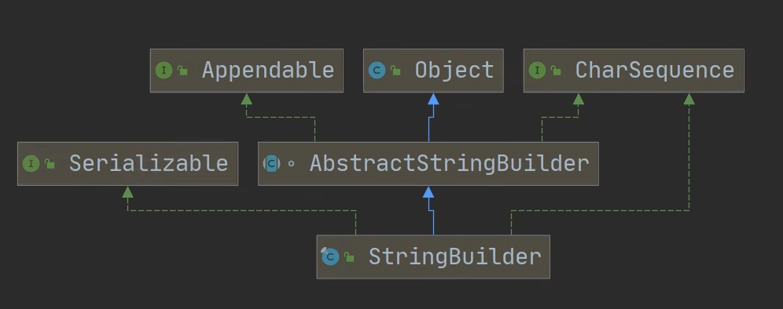

# StringBuilder（==重点==）

## 1. 基本介绍

- ## 是一个==可变的字符串序列==。该类提供一个与 `StringBuffer` ==兼容的 API==，但不保证同步（`StringBuilder` ==不是线程安全的==）
- ## 该类被设计用作 StringBuffer 的一个简易替换，用在字符串==频繁被单线程使用==的时候。如果可能，==建议优先使用该类==，因为在大量实践中，它==比 StringBuffer 要快==
- ## 在 StringBuilder 上的主要操作是 append 和 insert 方法，可重载这些方法，以接受任意类型的数值。

## 2. 结构关系图

## 1. StringBuilder 继承 `AbstractStringBuilder` 类

## 2. 实现了 `Serializable`，说明 StringBuilder 对象是可以串行化（对象可以网络传输，可以保存到文件）

## 3. StringBuilder 是 ==final 类==，不能被继承

## 4. StringBuilder 对象字符串仍然是存放在其父类 AbstractStringBuilder 的 `char[] value`，因此，==字符串列是堆中==

## 5. StringBuilder 的方法，==没有做互斥的处理==，即==没有 synchronized 关键字==，因此在==单线程的情况下使用==

---

# StringBuilder 的常用方法

## 该类提供一个与 `StringBuffer` ==兼容的 API==，调用`StringBuffer`中相应的方法即可
