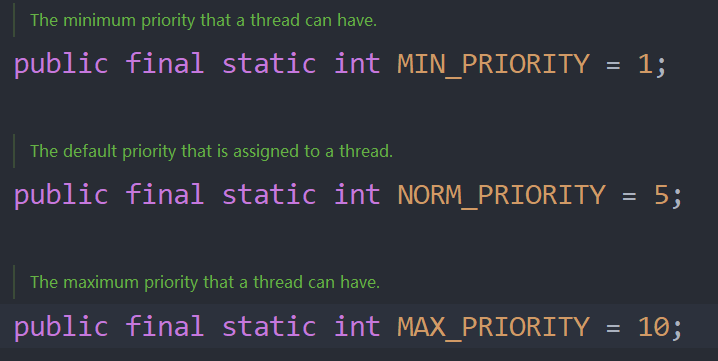

# 线程的常用方法

# 补充：==线程中止==

## 1. 基本介绍

- ## 当线程完成任务后，会自动退出
- ## 通过==使用变量==来控制 run()方法退出的方式停止线程，即==通知线程退出==

## 2. 核心思想

## 子线程初始设置为死循环，提供 setter()方法，在主线程中在需要结束子线程的时候通过改变变量的值来实现

## 3. 代码示例

```java
public class main {
    public static void main(String[] args) throws InterruptedException {
        a a = new a();
        a.start();
        System.out.println("主线程休眠10s~~");
        Thread.sleep(10 * 1000);
        a.setLoop(false);
    }
}

class a extends Thread {
    private int i = 0;

    public void setLoop(boolean loop) {
        this.loop = loop;
    }

    private boolean loop = true;
    @Override
    public void run() {

        while (loop) {
            System.out.println("a " + ++i + "--->" +  Thread.currentThread().getName());
            try {
                Thread.sleep(1000);
            } catch (InterruptedException e) {
                e.printStackTrace();
            }
        }
    }
}

// 输出结果
主线程休眠10s~~
a 1--->Thread-0
a 2--->Thread-0
a 3--->Thread-0
a 4--->Thread-0
a 5--->Thread-0
a 6--->Thread-0
a 7--->Thread-0
a 8--->Thread-0
a 9--->Thread-0
a 10--->Thread-0
```

## 代码分析

## 1. 在子线程中设置 loop 变量

## 2. 在主线程中，让主线程休眠 10s 后，通知子线程退出（==loop = false==）

## 3. 由于子线程也是每输出依次就会休眠 1s，和主线程达到了同步，所以结果会输出 10 次

---

# 一、第一组方法

| 方法          | 说明                                                        |
| ------------- | ----------------------------------------------------------- |
| `setName`     | 设置线程名称，使之与参数 `name` 相同                        |
| `getName`     | 返回该线程的名称                                            |
| `start`       | 使该线程开始执行；Java 虚拟机底层调用该线程的 `start0` 方法 |
| `run`         | 调用线程对象的 `run` 方法                                   |
| `setPriority` | 更改线程的优先级                                            |
| `getPriority` | 获取线程的优先级                                            |
| `sleep`       | 在指定的毫秒数内让当前正在执行的线程休眠（暂停执行）        |
| `interrupt`   | ==中断==线程                                                |

## 优先级字段

## 调用方法：Thead.MIN_PRIORITY



## 1. 线程中断

## 关于 =="中断"== 的理解：中断线程 ==不等于== 结束线程，一般用于中断正在休眠的线程

## 代码示例

```java
public class main {
    public static void main(String[] args) throws InterruptedException {
        a a = new a();
        a.setName("<子线程>");
        a.setPriority(Thread.MIN_PRIORITY);
        a.start();

        for (int i = 1; i < 6; i++) {
            Thread.sleep(1000);
            System.out.println(Thread.currentThread().getName() + "执行中~ ~ " + i);
        }
        System.out.println(a.getName() + "--->优先级为：" + a.getPriority());
        a.interrupt();
    }
}


class a extends Thread {
    private int i = 0;

    @Override
    public void run() {
        while (true) {
            for (int i = 1; i <= 5; i++) {
                System.out.println(Thread.currentThread().getName() + "线程启动：" + i);
            }
            try {
                System.out.println(Thread.currentThread().getName() + "休眠中~ ~");
                Thread.sleep(20000);
            } catch (InterruptedException e) {
                System.out.println(Thread.currentThread().getName() + "线程的休眠被中断了~ ~");
            }
        }
    }
}
```

## 输出结果

```java
<子线程>线程启动：1
<子线程>线程启动：2
<子线程>线程启动：3
<子线程>线程启动：4
<子线程>线程启动：5
<子线程>休眠中~ ~
main执行中~ ~ 1
main执行中~ ~ 2
main执行中~ ~ 3
main执行中~ ~ 4
main执行中~ ~ 5
<子线程>--->优先级为：1
<子线程>线程的休眠被中断了~ ~
<子线程>线程启动：1
<子线程>线程启动：2
<子线程>线程启动：3
<子线程>线程启动：4
<子线程>线程启动：5
<子线程>休眠中~ ~
```

## 代码分析

## （1）首先启动==子==线程，然后启动==主==线程

## （2）在子线程中设置休眠 20s，在主线程执行完之后==执行 intertupt()方法==，终止子线程的休眠

## （3）在子线程休眠被中断后又继续执行

## （4）由于是只==中断了一次==，==子线程又进入休眠状态==

---

# 第二组方法

## 1. ==yield==: 线程的==礼让==

- ## 让出 CPU 占用资源，让其他线程执行
- ## 但让出的时间不确定，所以也==不一定礼让成功==
  - ## 能否礼让成功要==根据底层资源的分配情况==，如果当前资源丰富，CPU 会同时执行两个线程，就不会又等待的过程，即不会礼让成功
- ## 简单来说就是让 CPU 先去执行别的线程，当前线程可以等会再执行

## 2. ==join==: 线程的==插队==。插队的线程一旦插队成功，则肯定先执行完插入的线程所有的任务（==插队是一定会成功的==）

## 注意：==join()方法==会==有异常提示==，需要捕获或者抛出

## 代码示例

```java
public class main {
    public static void main(String[] args) throws InterruptedException {
        a a = new a();
        for (int i = 1; i <= 4; i++) {
            System.out.println("主线程执行中 " + i);
            if(i==2){
                a.start();
                a.join();
            }
        }
    }
}

class a extends Thread{
    @Override
    public void run() {
        System.out.println("----子线程开始插队----");
        for (int i = 1; i <= 2; i++) {
            System.out.println("子线程插队中 " + i);
        }
        System.out.println("----子线程执行结束----");
    }
}
```

## 输出结果

```java
主线程执行中 1
主线程执行中 2
----子线程开始插队----
子线程插队中 1
子线程插队中 2
----子线程执行结束----
主线程执行中 3
主线程执行中 4
```

## 代码分析

## （1）首先让主线程开始执行

## （2）当主线程执行两次后，子线程开始插队

## （3）只有当子线程执行完之后，主线程才会继续执行
