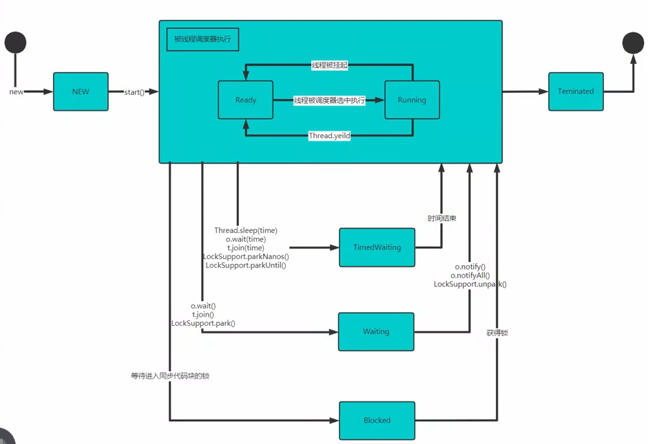
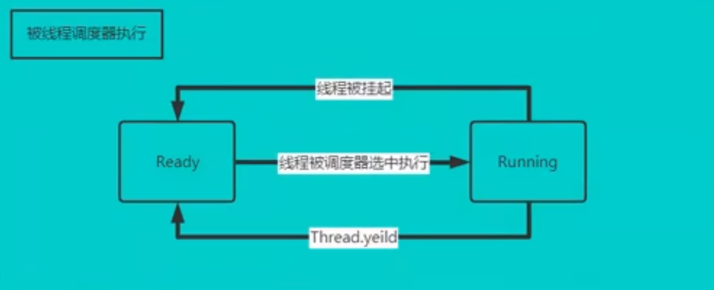
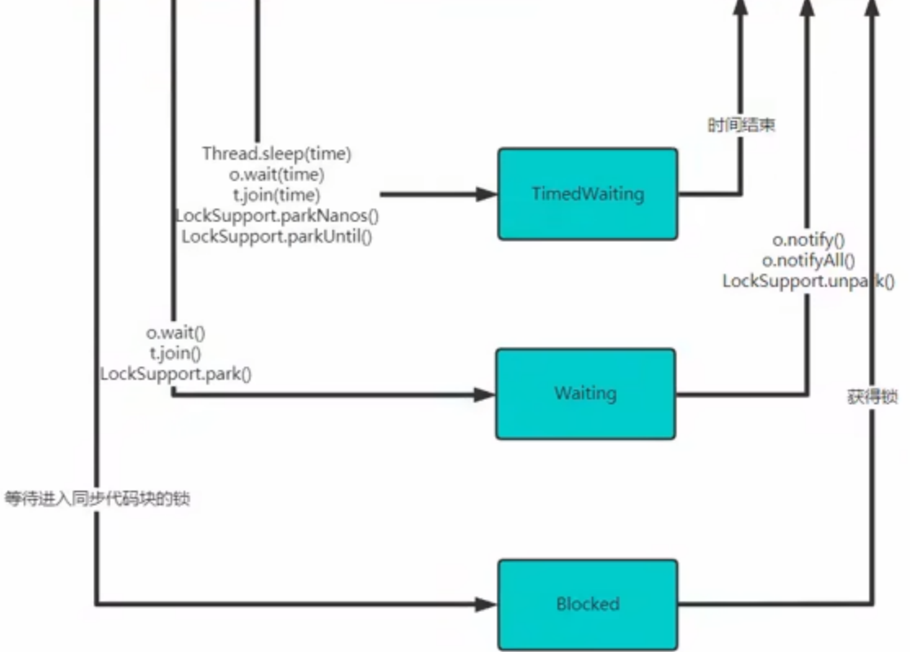

# 线程的七种状态

## 1. 七种状态

- ## NEW：尚未启动的线程处于此状态。

- ## RUNNABLE：在 Java 虚拟机中执行的线程处于此状态。（==又细分为两种状态==）
  - ## ready：预备状态
  - ## running：正在执行
- ## BLOCKED：被阻塞等待监视器锁定的线程处于此状态。

- ## WAITING：正在等待另一个线程执行特定动作的线程处于此状态。

- ## TIMED WAITING：正在等待另一个线程执行动作直到指定时间的线程处于此状态。

- ## TERMINATED：已退出的线程处于此状态。

## 2. 线程的生命周期图

## RUNNABLE 状态

## 其他状态

