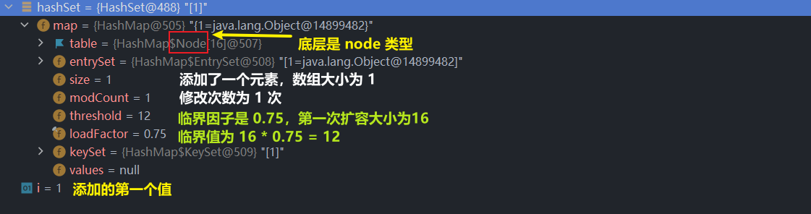

# Set 接口

## 1. 基本介绍

## （1）==无序==（添加和取出的顺序不一致），没有索引

- ## 具体详述
  - ## `添加的顺序`和`取出的顺序`不一致（强调二者顺序不一致）
  - ## 但是`取出的顺序`是固定的（强调存储后，位置是固定的，不会变化）

## （2）==不允许有重复元素==，最多包含一个==null==

## （3）两个实现类（不是指全部）

- ## HashSet
- ## TreeSet

## 2. 常用方法

## 由于是 ==Collection== 的子接口，方法和它一样

## 3. Set 接口的==遍历==

- ## 迭代器：Iterator
- ## 增强 for 循环
- ## ==不可以用索引来取值==

## 关于顺序的说明（以`HashSet`举例）

```java
import java.util.HashSet;
import java.util.Set;
@SuppressWarnings("all")
public class pra {
    public static void main(String[] args) {

        Set set = new HashSet();

        // jack
        set.add("jack");
        set.add("jack");
        // null
        set.add(null);
        // java
        set.add("java");
        // tom
        set.add("tom");

        System.out.println(set + "\n");

        for (int i = 0; i < 5; i++) {
            System.out.println(set);
        }
    }
}

// 输出结果
[null, java, tom, jack]

[null, java, tom, jack]
[null, java, tom, jack]
[null, java, tom, jack]
[null, java, tom, jack]
[null, java, tom, jack]
```

## 代码分析

- ## 添加顺序和取出的顺序是不一致的
- ## 但是取出的顺序是固定的
- ## 元素是不能重复的
- ## 如果添加的是对象（==即使内容相同==），也可以添加进去（具体分析需要==看底层源码==的实现原理）

## ==面试经典易错题==

```java
import java.util.HashSet;

@SuppressWarnings("all")
public class pra {
    public static void main(String[] args) {
        HashSet hashSet = new HashSet();
        hashSet.add(new dog(8));
        hashSet.add(new dog(8));

        hashSet.add("dog：8");
        hashSet.add("dog：8");

        System.out.println(hashSet);
    }
}

class dog{
    int age;

    public dog(int age) {
        this.age = age;
    }

    @Override
    public String toString() {
        return "dog{" +
                "age=" + age +
                '}';
    }
}

// 输出结果
[dog{age=8}, dog{age=8}, dog：8]
```

## 代码分析

## （1）对于创建的对象（内容相同），可以添加（不够成重复元素的判断条件）

## （2）但是对于==字符串对象，只能添加一个==

## 为什么？引出 HashSet 的底层添加原理

---

# HashSet（==理解底层源码很重要！==）

## 1. 基本介绍

- ## HashSet 底层是 ==HashMap==
- ## 实现了 Set 接口，拥有 Set 接口和 Collection 接口的方法
- ## 可以存放空值，且只能有一个 null
- ## HashSet 不能保证元素是有序的，取决于 hash 后的索引值（即无法保证存储元素顺序和取出元素顺序一致）
- ## 不能有重复元素
- ## HashSet、HashMap 都是==线程不安全==的

## 2. 透彻理解 ==HashSet== 的==添加原理==（剖析底层源码）

## 说明：==HashSet 底层是 HashMap==

# HashMap 的基本介绍

## 底层结构：`数组 + 单链表 + 红黑树`


# ==>> 先说结论==

## 一、HashSet 底层==添加机制==

## (1) HashSet ==底层是 HashMap==

## (2) 添加一个元素时，先得到 hash 值（hashCode 方法），会转换 -> 索引值

## (3) 找到存储数据的==哈希表 table（即数组）==，看这个索引位置是否已经存放的元素

## (4) 如果没有，直接加入

## (5) 如果有，调用 ==equals 方法（由程序员决定，可以被重写） 比较==，如果相同，就放弃添加，如果不同，则添加到最后

## (6) 在 Java8 中

- ## 如果一条链表的元素个数达到 `TREEIFY_THRESHOLD`（==临界值：默认是 8==）
- ## ==并且== table 的大小 >= `MIN_TREEIFY_CAPACITY`（==执行树化需要 table 数组的大小：默认 64==）
- ## 就会==进行树化==（红黑树）

## 二、==树化（红黑树）和扩容机制==

## (1) HashSet 底层是 HashMap，==第一次添加时==，table 数组==扩容到 16==，临界值 (threshold) 是 16 \* ==加载因子 (loadFactor) 0.75== = 12

## (2) 如果 table 数组使用==到临界值 12==，==就会扩容 2 倍==到 16 \* 2 = 32，新的临界值就是 32 \* 0.75 = 24，依次类推

## (3) 在 Java8 中

- ## 如果一条链表的元素个数达到 `TREEIFY_THRESHOLD`（==默认是 8==）
- ## 并且 table 的大小 >= `MIN_TREEIFY_CAPACITY`（==默认 64==），就会进行==树化==（红黑树）
- ## 否则仍然采用数组扩容机制（==即如果节点数达到八，但是数组空间小于 64，就会先扩容到 64，之后进行树化==）

## （4）==容易误解的地方！==：只要添加了新节点到 HashSet（HashMap）中，就算数组空间大小自增一，==不是说添加到第一个位置才算空间自增==，当值达到某些条件就会进行相应的操作

# >> ==源码剖析==

## 示例代码

```java
import java.util.HashSet;

@SuppressWarnings("all")
public class pra {
    public static void main(String[] args) {
        HashSet hashSet = new HashSet();

        for (int i = 1; i <= 100; i++) {
            hashSet.add(i);
        }

        System.out.println(hashSet);
    }
}
```

---

# 阶段一：第一次插入元素的过程

## 第一步

## 调用构造器，==底层是 HashMap==

```java
public HashSet() {
    map = new HashMap<>();
}
```

## 第二步

## 首先进行装箱操作（`valueOf()`方法），这部分不看，进入`add()`方法

```java
public boolean add(E e) {
    return map.put(e, PRESENT)==null;
}
```

## 代码说明

## `PRESENT`：`private static final Object PRESENT = new Object()`，这里起到的==占位作用==，在后续在`put()`方法中==传值给`value`==

## 第三步

## 进入`put()`方法

```java
public V put(K key, V value) {
    return putVal(hash(key), key, value, false, true);
}
```

## 代码说明

## `key`：`add()`方法中添加的内容

## 第四步

## （1）首先调用`hash()`方法，计算哈希值

```java
static final int hash(Object key) {
    int h;
    return (key == null) ? 0 : (h = key.hashCode()) ^ (h >>> 16);
}
```

## （2）进入`putVal()`方法（==重点！==）

## 补充：`resize()`方法

```java
final Node<K,V>[] resize() {
    Node<K,V>[] oldTab = table;
    int oldCap = (oldTab == null) ? 0 : oldTab.length;
    int oldThr = threshold;
    int newCap, newThr = 0;
    if (oldCap > 0) {
        if (oldCap >= MAXIMUM_CAPACITY) {
            threshold = Integer.MAX_VALUE;
            return oldTab;
        }
        else if ((newCap = oldCap << 1) < MAXIMUM_CAPACITY &&
                    oldCap >= DEFAULT_INITIAL_CAPACITY)
            newThr = oldThr << 1; // double threshold
    }
    else if (oldThr > 0) // initial capacity was placed in threshold
        newCap = oldThr;
    else {               // zero initial threshold signifies using defaults
        newCap = DEFAULT_INITIAL_CAPACITY;
        newThr = (int)(DEFAULT_LOAD_FACTOR * DEFAULT_INITIAL_CAPACITY);
    }
    if (newThr == 0) {
        float ft = (float)newCap * loadFactor;
        newThr = (newCap < MAXIMUM_CAPACITY && ft < (float)MAXIMUM_CAPACITY ?
                    (int)ft : Integer.MAX_VALUE);
    }
    threshold = newThr;
    @SuppressWarnings({"rawtypes","unchecked"})
        Node<K,V>[] newTab = (Node<K,V>[])new Node[newCap];
    table = newTab;
    if (oldTab != null) {
        for (int j = 0; j < oldCap; ++j) {
            Node<K,V> e;
            if ((e = oldTab[j]) != null) {
                oldTab[j] = null;
                if (e.next == null)
                    newTab[e.hash & (newCap - 1)] = e;
                else if (e instanceof TreeNode)
                    ((TreeNode<K,V>)e).split(this, newTab, j, oldCap);
                else { // preserve order
                    Node<K,V> loHead = null, loTail = null;
                    Node<K,V> hiHead = null, hiTail = null;
                    Node<K,V> next;
                    do {
                        next = e.next;
                        if ((e.hash & oldCap) == 0) {
                            if (loTail == null)
                                loHead = e;
                            else
                                loTail.next = e;
                            loTail = e;
                        }
                        else {
                            if (hiTail == null)
                                hiHead = e;
                            else
                                hiTail.next = e;
                            hiTail = e;
                        }
                    } while ((e = next) != null);
                    if (loTail != null) {
                        loTail.next = null;
                        newTab[j] = loHead;
                    }
                    if (hiTail != null) {
                        hiTail.next = null;
                        newTab[j + oldCap] = hiHead;
                    }
                }
            }
        }
    }
    return newTab;
}
```

## 代码解析

```java
static final float DEFAULT_LOAD_FACTOR = 0.75f;

static final int DEFAULT_INITIAL_CAPACITY = 1 << 4; // aka 16
```

## 1. 初始化空间大小（table 数组）：16

## 2. 临界因子：0.75

- ## 解释：`16 * 0.75 = 12`，当数组大小达到 12 时候，数组就会进行扩容（==扩容 2 倍==），变为`16 * 2 = 32`
- ## ==扩容==：`newCap = oldCap << 1; // double threshold`

## 最后返回一个新的数组

## 总结：`resize()`方法的==本质就是初始化`table`数组==，初始化空间为 ==16==，同时设置==临界因子==为`0.75 * size`

##

## `putVal()`方法

```java
final V putVal(int hash, K key, V value, boolean onlyIfAbsent,
                boolean evict) {
    Node<K,V>[] tab; Node<K,V> p; int n, i;// 定义了一些临时变量
    if ((tab = table) == null || (n = tab.length) == 0)
        n = (tab = resize()).length;
    if ((p = tab[i = (n - 1) & hash]) == null)
        tab[i] = newNode(hash, key, value, null);
    else {
        Node<K,V> e; K k;
        if (p.hash == hash &&
            ((k = p.key) == key || (key != null && key.equals(k))))
            e = p;
        else if (p instanceof TreeNode)
            e = ((TreeNode<K,V>)p).putTreeVal(this, tab, hash, key, value);
        else {
            for (int binCount = 0; ; ++binCount) {
                if ((e = p.next) == null) {
                    p.next = newNode(hash, key, value, null);
                    if (binCount >= TREEIFY_THRESHOLD - 1) // -1 for 1st
                        treeifyBin(tab, hash);
                    break;
                }
                if (e.hash == hash &&
                    ((k = e.key) == key || (key != null && key.equals(k))))
                    break;
                p = e;
            }
        }
        if (e != null) { // existing mapping for key
            V oldValue = e.value;
            if (!onlyIfAbsent || oldValue == null)
                e.value = value;
            afterNodeAccess(e);
            return oldValue;
        }
    }
    ++modCount;
    if (++size > threshold)
        resize();
    afterNodeInsertion(evict);
    return null;
}
```

## 代码解析

- ## `table`：是`HashMap`的一个属性（数组），类型是 Node[ ]（==即结构示意图中的数组==）

```java
if ((tab = table) == null || (n = tab.length) == 0)
    n = (tab = resize()).length;
```

## 代码解析

- ## 1. if 语句：如果`table`数组当前为空或者大小为 0，就进行==第一次初始化==

- ## 2. 执行完`resize()`方法后，`table`数组的空间大小初始化为 16，里面元素为 ==null==

```java
if ((p = tab[i = (n - 1) & hash]) == null)
    tab[i] = newNode(hash, key, value, null);
```

## 代码解析

- ## (1)根据 ==key== （`add()` 方法中==添加的内容==），得到 hash 去计算该 key 应该存放到 table 表的哪个==索引位置== , 并把这个==位置的对象，赋给 p==

- ## (2)判断 p 是否为 null

  - ## 如果 p 为 null, 表示还没有存放元素, 就创建一个 Node (==key = (传入的值), value = PRESENT==)
  - ## 放在该位置 tab[i] = newNode(hash, key, value, null)，==传入 hash==的目的是：下一次添加节点时，==判断该位置是否已经存放了元素==（避免冲突）

> ## 由于是元素第一次添加，节点处还没有值（结果为空），进入 if 语句，跳过 else 语句，接下来进入 if 判断

```java
if (e != null) { // existing mapping for key
    V oldValue = e.value;
    if (!onlyIfAbsent || oldValue == null)
        e.value = value;
    afterNodeAccess(e);
    return oldValue;
}
```

## 代码解析

- ## e 是`add()`方法中的添加的元素，此时==不为空==，跳过 if 判断，进入到下面的代码

```java
++modCount;
if (++size > threshold)
    resize();
afterNodeInsertion(evict);
return null;
```

## 代码解析

- ## 1. 记录修改次数，自增一次

- ## 2. 如果当前空间大小==大于了临界值==，数组就需要进行==扩容（2 倍大小）==
- ## 3. 在 HashMap 中`afterNodeInsertion()`方法为空，==留给子类（例如：`LinkedHashMap`）实现，涉及插入后的有序问题==（` void afterNodeInsertion(boolean evict) { }`）
- ## 4. 返回 null
  - ## `putval()`方法返回空，传递给`put()`方法
  - ## `put()`方法也返回空，传递给`add()`方法
  - ## 接下来在`add()`方法中判断是否为空，返回`add()`方法的值
  - ## ==如果不返回空==，则返回`oldValue`，`oldValue == null`返回 ==false== ，即==插入失败==

```java
public V put(K key, V value) {
    return putVal(hash(key), key, value, false, true); // 返回空，传递给 put() 方法
}
```

```java
public boolean add(E e) {
    return map.put(e, PRESENT)==null;
} // 返回空， 传递给 add() 方法
```

# 结论：结果为 true，返回真，`add()`方法执行成功，==第一次插入元素执行结束==

## 预备工作：显示控制 ==null== 值


## 调试结果如下

## 1. 内存视图



## 2. ==table== 数组


---

# 阶段二：添加相同的元素的处理

## 代码示例

```java
public class pra {
    public static void main(String[] args) {
        HashSet hashSet = new HashSet();

        hashSet.add("java");
        hashSet.add("java");
        System.out.println(hashSet);
    }
}
```

## 由于添加的是==同一个对象，计算的 hash 值相同==，此时 p 的指向不为空，==进入 else 分支==

```java
else {
    // 编程习惯：需要用到什么变量，在局部定义
    Node<K,V> e; K k;
    if (p.hash == hash &&
        ((k = p.key) == key || (key != null && key.equals(k))))
        e = p;
    else if (p instanceof TreeNode)
        e = ((TreeNode<K,V>)p).putTreeVal(this, tab, hash, key, value);
    else {
        for (int binCount = 0; ; ++binCount) {
            if ((e = p.next) == null) {
                p.next = newNode(hash, key, value, null);
                if (binCount >= TREEIFY_THRESHOLD - 1) // -1 for 1st
                    treeifyBin(tab, hash);
                break;
            }
            if (e.hash == hash &&
                ((k = e.key) == key || (key != null && key.equals(k))))
                break;
            p = e;
        }
    }
    if (e != null) { // existing mapping for key
        V oldValue = e.value;
        if (!onlyIfAbsent || oldValue == null)
            e.value = value;
        afterNodeAccess(e);
        return oldValue;
    }
}
```

## 代码解析

## 1. 第一个分支判断（==首先判断第一个节点==（存放在 table 数组中））

```java
if (p.hash == hash &&
    ((k = p.key) == key || (key != null && key.equals(k))))
    e = p;
```

## 首先判断 p 指向的==第一个节点==的哈希值和需要插入节点的哈希值是否相同，==并且==

- ## 是否是==同一个对象==，==或者==
- ## ==内容（key 值）相同==（`equals() 方法`由程序员决定，==可以被重写==）

## 结论：如果满足这个条件，就不能添加

## 2. 第二个分支判断

```java
else if (p instanceof TreeNode){
    e = ((TreeNode<K,V>)p).putTreeVal(this, tab, hash, key, value);
}
```

## 如果是红黑树，就调用`putTreeVal()`方法来添加

## 3. 第三个分支判断（==从第二个元素开始判断==（table 数组中存放元素链接的第一个节点））

```java
else {
    for (int binCount = 0; ; ++binCount) {
        if ((e = p.next) == null) {
            p.next = newNode(hash, key, value, null);
            if (binCount >= TREEIFY_THRESHOLD - 1) // -1 for 1st
                treeifyBin(tab, hash);
            break;
        }
        if (e.hash == hash &&
            ((k = e.key) == key || (key != null && key.equals(k))))
            break;
        p = e;
    }
}
```

## 在==第一个分支判断==中完成了==和第一个元素的比较==，如果加入的值不是第一个元素（存放在 table 数组中），则可能是后面连接的元素，这个时候通过==死循环遍历判断==

## （1）情况一：比较过程中==发现相同的==，就是第一个分支判断的情况，直接跳出循环，==不执行添加==

```java
if (e.hash == hash &&
    ((k = e.key) == key || (key != null && key.equals(k))))
    break;
```

## （2）情况二：==没有找到相同的==

```java
 if ((e = p.next) == null) {
    p.next = newNode(hash, key, value, null);
    if (binCount >= TREEIFY_THRESHOLD - 1) // -1 for 1st
        treeifyBin(tab, hash);
    break;
}
```

## 通过两个指针遍历，如果为空，直接生成新的节点链接起来

## ==注意！==：链接之后立马判断==是否达到 8 个节点==，然后进行==树化（有前提条件）==

- ## 调用`treeifyBin()`方法
- ## 首先判断数组大小==是否 >= 64（默认值）==，如果不满足，会调用`resize()`方法进行==扩容==，否则执行树化操作

## treeifyBin() 源码

```java
final void treeifyBin(Node<K,V>[] tab, int hash) {
    int n, index; Node<K,V> e;
    if (tab == null || (n = tab.length) < MIN_TREEIFY_CAPACITY)
        resize();
    else if ((e = tab[index = (n - 1) & hash]) != null) {
        TreeNode<K,V> hd = null, tl = null;
        do {
            TreeNode<K,V> p = replacementTreeNode(e, null);
            if (tl == null)
                hd = p;
            else {
                p.prev = tl;
                tl.next = p;
            }
            tl = p;
        } while ((e = e.next) != null);
        if ((tab[index] = hd) != null)
            hd.treeify(tab);
    }
}
```

## 4. 第四个分支判断

```java
if (e != null) { // existing mapping for key
    V oldValue = e.value;
    if (!onlyIfAbsent || oldValue == null)
        e.value = value;
    afterNodeAccess(e);
    return oldValue;
}
```

## 补充：第一个分支判断如下

```java
if (p.hash == hash &&
    ((k = p.key) == key || (key != null && key.equals(k))))
    e = p;
```

## ==第二次==添加的元素和==第一次==添加的的元素==相同==，则进入 else 分支，执行完第一个分支判断后，调到第四个分支判断

- ## e 不等于空，在==第一个分支判断==时被赋值为 p
- ## e.value 的值（返回的 ==oldValue==）：==PRESENT==（在之前通过函数的传值得到）
- ## 返回的 `oldValue` ==不为空==，返回到上一层函数，执行到 `add()` 函数，返回值为 ==false==，即==添加失败==

## 返回到`add()`函数

```java
public boolean add(E e) {
        return map.put(e, PRESENT)==null;
    }
```

# 结论：当添加元素为可能的重复元素时，通过判断，执行结束

---

# 阶段三：树化和扩容

## 1. 当 table 数组==到达临界值 12== 时（==初始化为 16==），就会==扩容为 2 倍==，通过计算新的临界值，达到新的临界值后，又扩容为数组大小的两倍，依次类推

## 2. 当数组中链接的==节点个数达到 8 时==，首先判断数组大小==是否达到 64==（==默认值==）

- ## 如果没有达到：执行==扩容==机制（结合临界值）
- ## 达到了 64，进行==树化==

---

# LinkedHashSet（==补充==）

## 1. 基本介绍

## （1）关系：LinkedHashSet 是 HashSet 的==子类==，==底层是`LinkedHashMap`==

## （2）底层结构：`数组 + 双向链表`

## （3）特点：通过链表维护元素的==次序==（是 HashSet 的升级版），即==添加顺序和取出顺序是一致==

## （4）LinkedHashSet 不允许添加重复元

## 2. 关于结构的说明

- ## 在 LinkedHashSet 中维护一个 ==hash 表和双向链表==（LinkedHashSet 有 ==head 和 tail==）
- ## 每个节点有 ==before 和 after 属性==，这样可以形成双向链表
- ## 在添加一个元素时，先计算 hash 值，在查找索引，确定该元素在 table 的位置，然后将添加的元素加入到双向链表（如果已经存在，不添加==原则和 hashset 一样==）

## 结构示意图


---

## 练习：定义员工类，如果名字和年龄相同就不添到 HashSet 中

## 方法：快捷键（`alt + insert`）选择==重写 hashCode() 和 equals() 方法==

```java
import java.util.HashSet;
import java.util.Iterator;
import java.util.Objects;

@SuppressWarnings("all")
public class pra {
    public static void main(String[] args) {
        HashSet hashSet = new HashSet();

        hashSet.add(new employee("jack",18));
        hashSet.add(new employee("tom",23));
        hashSet.add(new employee("jack",18));

        Iterator iterator = hashSet.iterator();
        while(iterator.hasNext()){
            System.out.println(iterator.next());
        }
    }
}

class employee{
    String name;
    int age;

    public employee(String name, int age) {
        this.name = name;
        this.age = age;
    }

    public String getName() {
        return name;
    }

    public void setName(String name) {
        this.name = name;
    }

    public int getAge() {
        return age;
    }


    public void setAge(int age) {
        this.age = age;
    }

    @Override
    public String toString() {
        return "employee{" +
                "name='" + name + '\'' +
                ", age=" + age +
                '}';
    }

    // 重写 hashCode() 和 equals() 方法
    @Override
    public boolean equals(Object o) {
        if (this == o) return true;
        if (o == null || getClass() != o.getClass()) return false;
        employee employee = (employee) o;
        return age == employee.age && Objects.equals(name, employee.name);
    }

    @Override
    public int hashCode() {
        return Objects.hash(name, age);
    }
}
```

---

# TreeSet

## 结构：TreeSet 的==底层是 TreeMap==

## 调用==无参构造器==：==添加顺序和取出顺序不一致==，底层还是计算 hash 值

## 特点：提供了一个构造器可以传入 Comparator 接口，通过实现 compare()方法来==指定添加顺序==

## 示例代码

```java
public class pra {
    public static void main(String[] args) {
        TreeSet treeSet = new TreeSet(new Comparator() {
            @Override
            public int compare(Object o1, Object o2) {
                return ((String)o1).compareTo((String)o2);
            }
        });

        treeSet.add("jack");
        treeSet.add("tom");
        treeSet.add("hi");
        treeSet.add("jack");

        System.out.println("treeSet = " + treeSet);
    }
}

// 输出结果
treeSet = [hi, jack, tom]
```

## 代码分析

## 1. 调用构造器传入实现 Comparator 接口的实例对象（==匿名内部类==），通过实现 compare()方法来指定添加顺序

## 2. 调用字符串的 compareTo()方法，由于添加的字符串都不相同，可见添加的顺序是按照字典序排列的

## >>补充：compareTo()方法回顾

- ## 1. 如果长度相同，并且每个个字符也相同，就返回 0
- ## 2. 如果长度相同或者不相同，但是在比较时，可以区分大小
- ## 3. 如果前面的部分都相同，就返回长度之差（`str1.len - str2.len`）

## 底层源码如下

```java
public int compareTo(String anotherString) {
    int len1 = value.length;
    int len2 = anotherString.value.length;
    int lim = Math.min(len1, len2);
    char v1[] = value;
    char v2[] = anotherString.value;

    int k = 0;
    while (k < lim) {
        char c1 = v1[k];
        char c2 = v2[k];
        if (c1 != c2) {
            return c1 - c2;
        }
        k++;
    }
    return len1 - len2;
}
```

# 添加元素有序的实现原理

## 1. 关于==构造器调用==的==底层源码分析==

## 在调用构造器之前会进行==类加载==的操作，这部分忽略

## 进入无参构造器，这里==调用了==同类中的==另一个构造器==

```java
public TreeSet() {
    this(new TreeMap<E,Object>());
}
```

## 接着进入另一个构造器

```java
public TreeSet(Comparator<? super E> comparator) {
    this(new TreeMap<>(comparator));
}
```

## 发现本质：底层还是 TreeMap

```java
public TreeMap(Comparator<? super K> comparator) {
    this.comparator = comparator;
}
```

## 代码分析

## 构造器把传入的比较器对象赋给了 TreeSet 的底层的 TreeMap 的属性 this.comparator

## 2. 关于 `add() 方法`的==添加机制和构造器的关系==的底层源码分析

## 进入 add() 方法

```java
public boolean add(E e) {
    return m.put(e, PRESENT)==null;
}
```

## 进入 put() 方法

```java
public V put(K key, V value) {
    Entry<K,V> t = root;
    if (t == null) {
        compare(key, key); // type (and possibly null) check

        root = new Entry<>(key, value, null);
        size = 1;
        modCount++;
        return null;
    }
    int cmp;
    Entry<K,V> parent;
    // split comparator and comparable paths
    Comparator<? super K> cpr = comparator;
    if (cpr != null) {
        do {
            parent = t;
            cmp = cpr.compare(key, t.key);
            if (cmp < 0)
                t = t.left;
            else if (cmp > 0)
                t = t.right;
            else
                return t.setValue(value);
        } while (t != null);
    }
    else {
        if (key == null)
            throw new NullPointerException();
        @SuppressWarnings("unchecked")
            Comparable<? super K> k = (Comparable<? super K>) key;
        do {
            parent = t;
            cmp = k.compareTo(t.key);
            if (cmp < 0)
                t = t.left;
            else if (cmp > 0)
                t = t.right;
            else
                return t.setValue(value);
        } while (t != null);
    }
    Entry<K,V> e = new Entry<>(key, value, parent);
    if (cmp < 0)
        parent.left = e;
    else
        parent.right = e;
    fixAfterInsertion(e);
    size++;
    modCount++;
    return null;
}
```

## 核心部分

```java
do {
    parent = t;
    cmp = k.compareTo(t.key);
    if (cmp < 0)
        t = t.left;
    else if (cmp > 0)
        t = t.right;
    else
        return t.setValue(value);
} while (t != null);
```

## 代码分析

## 底层其实是调用了传入的匿名内部类中实现的 compare 方法，即实现了可以==自定义添加顺序==

# 易错点

## 问题：在下面的代码中，java 能否被添加到 TreeSet 中

```java
public class pra {
    public static void main(String[] args) {

        TreeSet treeSet = new TreeSet(new Comparator() {
            @Override
            public int compare(Object o1, Object o2) {
                return ((String)o1).length() - ((String)o2).length();
            }
        });

        treeSet.add("jack");
        treeSet.add("tom");
        treeSet.add("hi");
        treeSet.add("java");

        System.out.println("treeSet = " + treeSet);
    }
}

// 运行结果
treeSet = [hi, tom, jack]
```

## 答案：不能

## 根据传入的比较器，这里是根据==字符串的长度==指定排序顺序

## 源码分析：此时`java`和`jack`的字符串长度相同，调用`compareTo()`方法返回 0，走到 else 分支，该元素==不会被添加进入 treeSet==

# 总结：调用带有比较器的构造器时，可以通过实现`compareTo()`方法来==指定添加顺序==，如果`compareTo()`方法===返回值为 0 则不进行添加==
