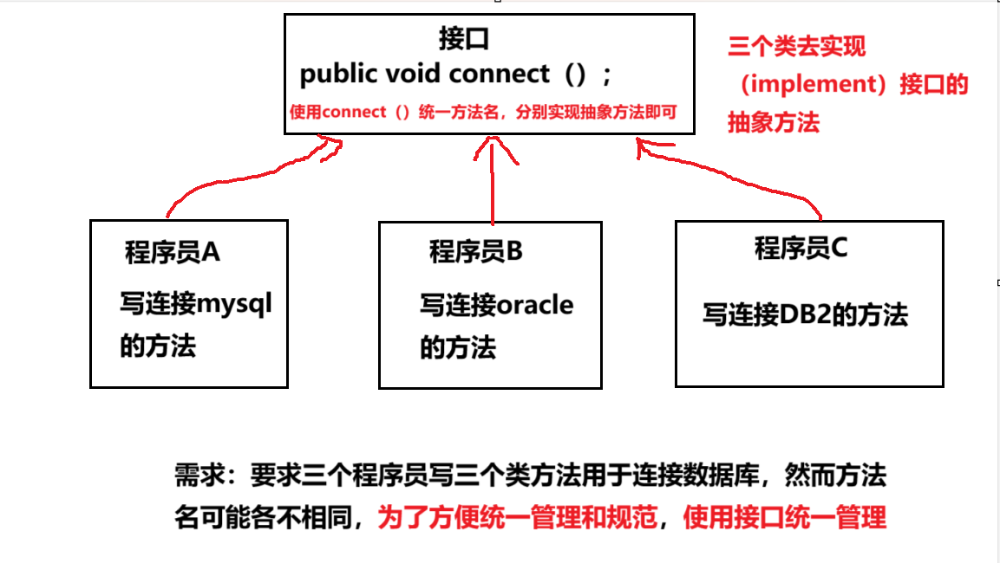

# 接口

## 应用场景引出

## 

---

# 一、接口的介绍

## 1. 接口的基本结构

```java
interface 接口名{
    属性
    抽象方法
}
```

## 引出关键字：==implements==

## 2. 子类实现接口

```java
class a implements 接口名{

}
```

## 3. 接口中的==属性==说明：属性默认是==public static final==修饰的

- ## （1）`final`：无法通过接口修改接口中属性的值
- ## （2）`static`：可以通过接口名（即类名）访问接口中的属性

## 4. 接口中的==方法==说明

- ## 1. 方法是==抽象的==
- ## 2. ==JDK7 之前==接口里的方法==都没有方法体==
- ## 3. ==JDK8 之后==接口里的方法==可以有方法体==
- ## 4. 接口中的方法可以是：==静态方法，默认方法==（`即接口中可以有方法的具体实现`）

## 5. 代码示例：场景引入的实现

```java
package interface_;

public class main {
    public static void main(String[] args) {
        person_a person_a = new person_a();
        person_b person_b = new person_b();
        interface_implement.t(person_a);
        System.out.println("============================");
        interface_implement.t(person_b);
    }
}

interface database_tool{

    public void connect();
    public void close();

}

class interface_implement{
    public static void t(database_tool n){
        n.connect();
        n.close();
    }
}

class person_a implements database_tool{

    @Override
    public void connect() {
        System.out.println("程序员a  连接  了mysql数据库");
    }

    @Override
    public void close() {
        System.out.println("程序员a  关闭  了mysql数据库");
    }
}

class person_b implements database_tool{

    @Override
    public void connect() {
        System.out.println("程序员b  连接  了oracle数据库");
    }

    @Override
    public void close() {
        System.out.println("程序员b  连接  了oracle数据库");
    }
}

// 输出结果
程序员a  连接  了mysql数据库
程序员a  关闭  了mysql数据库
============================
程序员b  连接  了oracle数据库
程序员b  连接  了oracle数据库

```

## 代码解释

- ## （1）在接口中编写抽象方法，用于连接和关闭数据库，由类具体实现抽象方法
  - ## 1. connect()
  - ## 2. close()
- ## （2）类中使用==implements==实现接口，编写具体的方法实现接口中的抽象方法
- ## （3）编写==interface_implement 类==，实现调用接口，传入不同实现类的对象，==方法会自动调用对应类的具体实现==

---

# 二、接口的==使用细节==

- ## （1）==接口不能被实例化==（即不能创建一个接口对象），接口是抽象类
- ## （2）接口中的==所有方法都是`public`方法==，接口中的抽象方法==可以不用`abstract`修饰==
- ## （3）一个普通类实现接口，就必须==将该接口的所有方法都实现==
  - ## 说明：把光标放在接口上，使用`快捷键`==alt + enter==，可以快速实现接口中的抽象方法
- ## （4）抽象类实现接口，可以不用实现接口的方法
- ## （5）一个类同时==可以实现多个接口==
- ## （6）接口中的==属性==：只能是 final 的, 而且是 `public static final` 修饰符，而且==属性必须初始化==
- ## （7）接口中==属性的访问==形式: 接口名.属性名
- ## （8）==接口不能继承其它的类==，但是==可以继承多个接口==
- ## （9）==接口的修饰符只能是 public 和默认==，这点和类的修饰符是一样的

---

# 三、==访问接口中属性==的三种方式

```java
package c;

public class main {
    public static void main(String[] args) {
        B b = new B();

        System.out.println(b.a);
        System.out.println(A.a);
        System.out.println(B.a);
    }
}

interface A{
    int a = 10; // 等价于 public static final a = 10;
}

class B implements A{

}

// 输出结果
10
10
10
```

## 说明

- ## （1）==b.a==：类实现了接口，b 是类 B 的一个实例，当然可以用实例对象去访问
- ## （2）==A.a==：接口中的属性是==public static final==修饰的，是静态属性，当然可以用类名访问
- ## （3）==B.a==：类 B 实现了接口，当然可以用类去访问

---

# 四、接口 VS ==继承==

## ==核心理解：接口是对 Java 中`单继承机制`的补充说明==

- ## 补充：在==继承关系==中
  - ## （1）子类可以有独有的方法
  - ## （2）子类可以继承父类的方法作为补充
  - ## （3）如果子类，父类都没有，那么可以通过接口的方法进行补充

## （1）==继承==的价值主要在于：解决代码的==复用性和可维护性==

## （2）==接口==的价值主要在于：设计好各种规范(方法)，让其它类去实现这些方法，更加的灵活

## 案例说明：通过接口让猴子实现`鱼类的游泳方法` 和 `鸟类的飞行功能`

```java
package a;

public class main {
    public static void main(String[] args) {
        monkey monkey = new monkey("monkey");
        monkey.climb_tree();
        monkey.swim();
        monkey.fly();
    }
}

interface fish{
    void swim();  // 默认是 public
}

interface bird{
    void fly();  // 默认是 public
}

// 类可以继承多个接口
class monkey implements fish,bird{

    String name;

    // 构造器
    public monkey(String name){
        this.name = name;
    }

    public String getName() {
        return name;
    }

    @Override
    public void swim() {
        System.out.println(getName() + "通过学习,获得——>鱼类的swim()方法");
    }

    @Override
    public void fly() {
        System.out.println(getName() + "通过学习,获得——>鸟类的fly()方法");
    }

    public void climb_tree(){
        System.out.println(getName() + "本身拥有——>climb_tree（）方法");
    }
}

// 输出结果
monkey本身拥有——>climb_tree（）方法
monkey通过学习,获得——>鱼类的swim()方法
monkey通过学习,获得——>鸟类的fly()方法
```

## 代码解释

- ## （1）首先创建两个接口，定义抽象方法
- ## （2）让==monkey 类==实现多个接口
- ## （3）在==monkey 类==中具体实现方法
- ## （4）在主函数中实现方法

---

# 五、接口 VS ==多态==

## 多态的体现

- ## （1）==多态参数==（只要是实现了接口的类，都可以把类作为参数传入接口调用的方法，实现调用接口的功能）
- ## （2）==多态数组==
  - ## 说明：可以定义一个接口类型的数组，数组元素可以是实现了接口的类，之后完成一些具体要求
- ## （3）==多态传递==

## （1）代码示例：==多态数组==

## 要求：编写 a 类，b 类实现接口，遍历数组，调用共有的方法，如果遍历的是 b 类，即调用独有的方法

```java
package a;

public class main {
    public static void main(String[] args) {
        arr[] interface_arr = new arr[2];
        interface_arr[0] = new a();
        interface_arr[1] = new b();
        for (int i = 0; i < interface_arr.length; i++) {
            interface_arr[i].shared_method();
            // 如果是b对象就调用其独有的方法
            if(interface_arr[i] instanceof b){
                ((b) interface_arr[i]).unique_method();
            }
        }
    }
}

interface arr{
    void shared_method();
}


class a implements arr{
    public void shared_method(){
        System.out.println("a类中调用了共有的方法");
    }
}

class b implements arr{
    public void shared_method(){
        System.out.println("b类中调用了共有的方法");
    }

    public void unique_method(){
        System.out.println("调用了b类独有的方法");
    }
}

// 输出结果
a类中调用了共有的方法
b类中调用了共有的方法
调用了b类独有的方法

```

## （2）代码示例：==多态传递==

```java
package d;

public class main {
    public static void main(String[] args) {
        B b = new test_class();

        A a = new test_class();
    }
}

interface A{
    void a();
}

interface B extends A{
    void b();
}

class test_class implements B{

    @Override
    public void a() {

    }

    @Override
    public void b() {

    }
}
```

## 代码解释

- ## （1）B b = new test_class();
  - ## 接口类型的变量可以指向，实现了该接口的类的对象实例
- ## （2）A a = new test_class();
  - ## 1. 类实现了接口 B，然而==接口 B 是`继承`了接口 A==，也相当于类实现了接口 A
  - ## 2. ==即类需要实现 接口 A 和 接口 B 的方法==
  - ## 3. ==体现了多态传递==
