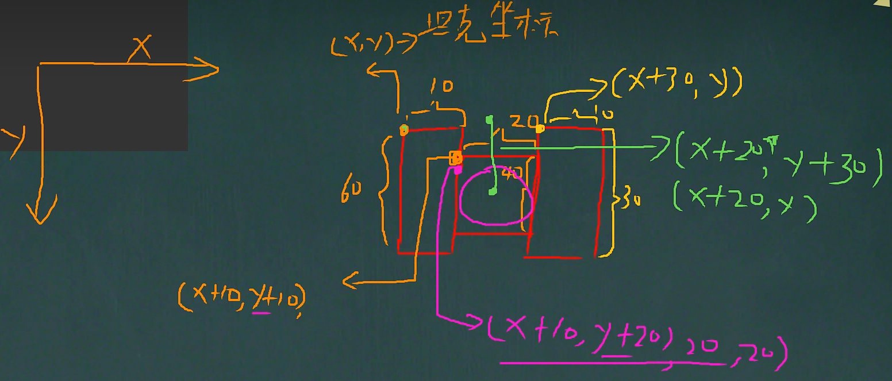
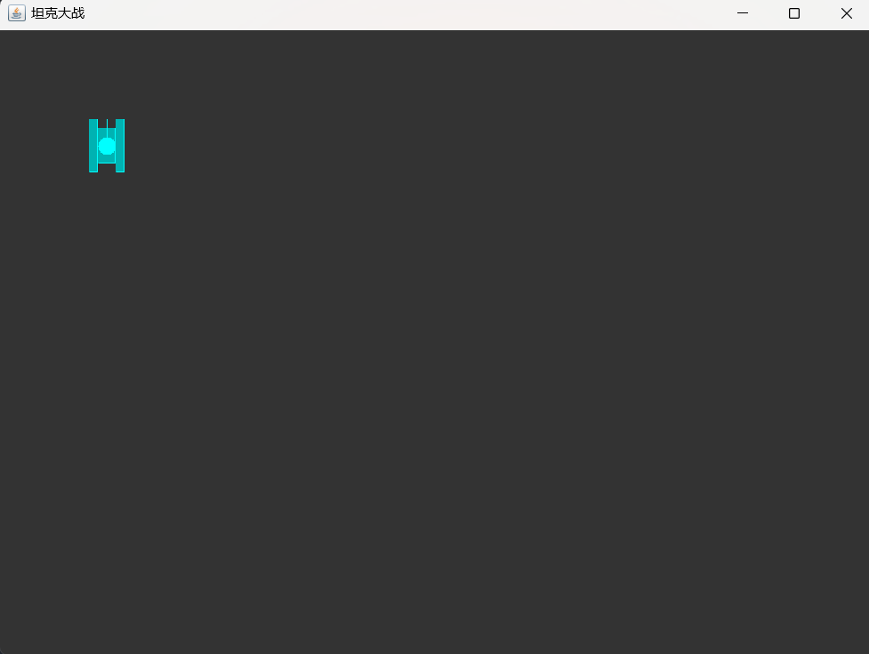
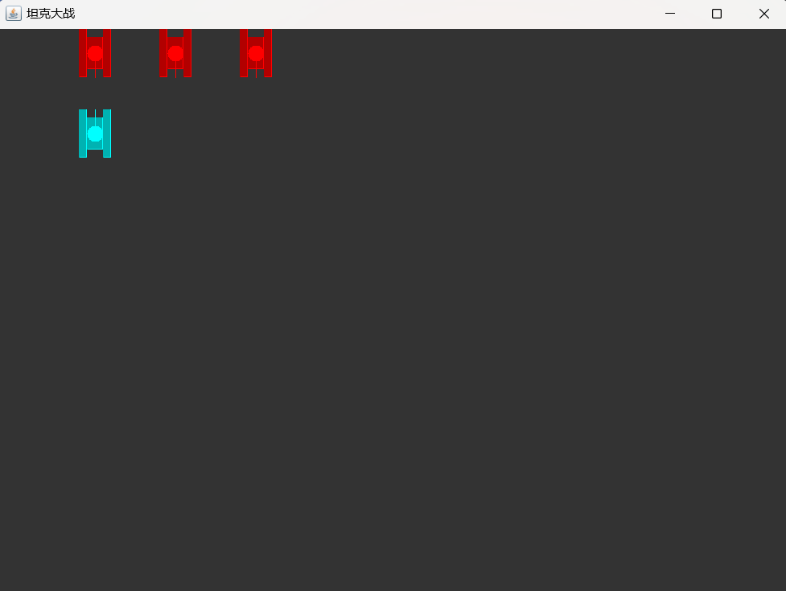

# 绘制坦克

# 一、Tank 类的创建

## 首先创建`Tank`类，运用==封装思想==，作为父类，提供相应的属性和方法，让子类继承

- ## 提供==属性==
  - ## 坦克绘制的起始坐标：x，y
  - ## 坦克的方向：direction
  - ## 坦克的速度：speed（后续在坦克的移动中会用到）
- ## 提供 `getter` 和 `setter` ==方法==

```java
public class Tank {
    // 绘制坦克的起始坐标
    private int x;
    private int y;
    private int direction; // 坦克的方向：0向上、1向右、2向下、3向左

    public int getDirection() {
        return direction;
    }

    public void setDirection(int direction) {
        this.direction = direction;
    }

    public Tank(int x, int y) {
        this.x = x;
        this.y = y;
    }

    public int getX() {
        return x;
    }

    public void setX(int x) {
        this.x = x;
    }

    public int getY() {
        return y;
    }

    public void setY(int y) {
        this.y = y;
    }
}

```

---

# 二、绘制我方坦克

## 首先创建`MyTank`类，继承父类`Tank`，调用父类的构造器完成初始化

```java
public class MyTank extends Tank{
    public MyTank(int x, int y) {
        super(x, y);
    }
}
```

## 思路分析

## 1. 坦克的种类

- ## 我方坦克
- ## 敌方坦克

## 2. 坦克的颜色

- ## 我方坦克：青色
- ## 敌方坦克：红色

## 3. 绘制模块的拆分

- ## 绘制矩形：坦克的两个轮子
- ## 绘制直线：坦克的炮筒
- ## 绘制圆形：坦克的顶盖

## 总结：可以先设置画笔的颜色，再绘制坦克的形状，两部分是独立的模块

## 4. 坦克需要有的参数

- ## 坦克绘制的起始坐标：x，y
- ## 坦克朝向：direction
- ## 坦克的种类:type

## 6. 关于坦克的绘制方法

## 可以采用==封装思想==，==在一个函数中完成坦克的绘制==，==之后在画板中调用该函数==，就可以实现自定义坦克的种类，这样提高了灵活性

## 7.绘制思路分析



## 说明

## （1）首先需要绘制出==朝向为上和朝向为左==的坦克

## （2）在此基础上改变炮筒的朝向就就可以完成==朝向为下和朝向为右==的坦克绘制

## 源码如下

## （1）坦克的绘制函数

```java
// 运用封装思想实现绘制坦克的方法

/**
 * @param x         绘制坦克的起始横坐标
 * @param y         绘制坦克的起始纵坐标
 * @param g         画笔参数，调用该类的方法绘制图形
 * @param direction 绘制坦克的朝向
 * @param type      坦克的类型：自己的坦克，地方坦克
 */
public void drawTank(int x, int y, Graphics g, int direction, int type) {

    // 判断坦克类型，设置不同的颜色
    switch (type) {
        case 0: // 自己的坦克：青色
            g.setColor(Color.CYAN);
            break; // 防止穿透现象的发生
        case 1: // 敌人的坦克：红色
            g.setColor(Color.red);
            break;
    }


    // 根据坦克方向，绘制坦克
    switch (direction) {
        case 0: // 表示向上
            g.fill3DRect(x, y, 10, 60, false); // 画出坦克左边轮子
            g.fill3DRect(x + 30, y, 10, 60, false); // 画出坦克右边轮子
            g.fill3DRect(x + 10, y + 10, 20, 40, false); // 画出坦克盖子
            g.fillOval(x + 10, y + 20, 20, 20); // 画出圆形盖子
            g.drawLine(x + 20, y + 30, x + 20, y); // 画出炮筒，
            break;
        case 1: //表示向右
            g.fill3DRect(x, y, 60, 10, false); //画出坦克上边轮子
            g.fill3DRect(x, y + 30, 60, 10, false); //画出坦克下边轮子
            g.fill3DRect(x + 10, y + 10, 40, 20, false); //画出坦克盖子
            g.fillOval(x + 20, y + 10, 20, 20); //画出圆形盖子
            g.drawLine(x + 30, y + 20, x + 60, y + 20); //画出炮筒
            break;
        case 2: //表示向下
            g.fill3DRect(x, y, 10, 60, false); //画出坦克左边轮子
            g.fill3DRect(x + 30, y, 10, 60, false); //画出坦克右边轮子
            g.fill3DRect(x + 10, y + 10, 20, 40, false); //画出坦克盖子
            g.fillOval(x + 10, y + 20, 20, 20); //画出圆形盖子
            g.drawLine(x + 20, y + 30, x + 20, y + 60); //画出炮筒
            break;
        case 3: //表示向左
            g.fill3DRect(x, y, 60, 10, false); //画出坦克上边轮子
            g.fill3DRect(x, y + 30, 60, 10, false); //画出坦克下边轮子
            g.fill3DRect(x + 10, y + 10, 40, 20, false); //画出坦克盖子
            g.fillOval(x + 20, y + 10, 20, 20); //画出圆形盖子
            g.drawLine(x + 30, y + 20, x, y + 20); //画出炮筒
            break;
    }
}
```

## 代码分析

## 分两个步骤绘制

- ## 绘制坦克的颜色
- ## 绘制不同的坦克朝向

## 注意：参数根据代码中设定的即可，也可以自定义修改，==坦克的绘制的起始坐标点是坦克图形的左上角==

## （2）在画板中调用该函数

```java
    // 绘制游戏区域背景，在此基础上绘制坦克
    @Override
    public void paint(Graphics g) {
        super.paint(g);
        g.fillRect(0, 0, 1000, 750); // 默认是黑色

        // 调用方法绘制坦克
        /*
            diretion（顺时针方向：上下左右）
            （1）0表示向上的坦克
            （2）1表示向右的坦克
            （3）2表示向下的坦克
            （4）3表示向左的坦克

            type
            （1）0表示自己的坦克，颜色是青色
            （2）1表示敌方的坦克，颜色是黄色
         */

        // 绘制自己的坦克
        drawTank(myTank.getX(), myTank.getY(), g, myTank.getDirection(), 0);
    }
```

## 代码分析

## 传入参数

- ## 绘制坦克的起始坐标（x，y）
- ## 画笔参数 g（调用 Graphics 类中的方法完成图形的绘制）
- ## 坦克的朝向
- ## 坦克的颜色

## ==我方==坦克的绘制效果图



---

# 三、绘制敌方坦克

## 思路分析

- ## 颜色需要不同：设置为红色
- ## 可以有多辆坦克
- ## 考虑到==线程安全问题==，可以使用 ==Vector== 集合来存储地方坦克，后续实现被攻击后就减少一个坦克
- ## 可以调用原有的函数绘制坦克

## 实现步骤如下

## （1）首先创建`EnemyTank`类，继承父类`Tank`，调用父类的构造器完成初始化

```java
public class EnemyTank extends Tank{
    public EnemyTank(int x, int y) {
        super(x, y);
    }
}
```

## （2）在画板中实现敌方坦克的绘制

```java
public class mypanle extends JPanel {

    // 定义自己的坦克
    MyTank myTank = null;

    // 考虑多线程问题，使用线程安全的 Vector 存放敌人的坦克
    Vector<EnemyTank> enemyTanks = new Vector<>();
    int enemyTankSize = 3;

    // 坦克的初始化
    public mypanle() {
        myTank = new MyTank(100, 100); // 绘制坦克的初始位置

        for (int i = 0; i < enemyTankSize; i++) {
            EnemyTank enemyTank = new EnemyTank((100 * (i + 1)), 0);
            enemyTank.setDirection(2); // 初始化方向向下，和自己的坦克对峙
            enemyTanks.add(enemyTank);
        }
    }

    // 绘制游戏区域背景，在此基础上绘制坦克
    @Override
    public void paint(Graphics g) {
        super.paint(g);
        g.fillRect(0, 0, 1000, 750); // 默认是黑色

        // 调用方法绘制坦克
        /*
            diretion（顺时针方向：上下左右）
            （1）0表示向上的坦克
            （2）1表示向右的坦克
            （3）2表示向下的坦克
            （4）3表示向左的坦克

            type
            （1）0表示自己的坦克，颜色是青色
            （2）1表示敌方的坦克，颜色是黄色
         */

        // 绘制自己的坦克
        drawTank(myTank.getX(), myTank.getY(), g, myTank.getDirection(), 0);

        // 绘制敌人的坦克
        for (int i = 0; i < enemyTanks.size(); i++) {
            EnemyTank enemyTank = enemyTanks.get(i);
            drawTank(enemyTank.getX(),enemyTank.getY(),g,enemyTank.getDirection(),1);
        }
    }
}
```

## 代码分析

## 1. 做出如下规定

## diretion（顺时针方向：上下左右）

- ## ==0== 表示==向上==的坦克

- ## ==1== 表示==向右==的坦克

- ## ==2== 表示==向下==的坦克

- ## ==3== 表示==向左==的坦克

## type

- ## ==0== 表示==自己==的坦克，颜色是==青色==

- ## ==1== 表示==敌方==的坦克，颜色是==红色==

## 2. 初始化工作

- ## 首先定义好我方坦克，敌方坦克
- ## 由于敌方坦克可能有多个，采用 Vector 集合存储，==使用泛型约束（只存储敌方坦克）==，初始化敌方坦克为 3 个
- ## 构造器的初始化
  - ## 注意：==在窗口第一次出现时会自动调用 paint 函数绘制==
  - ## 创建==我方==坦克对象，传入绘制的起始位置
  - ## 创建==敌方==坦克
    - ## 使用循环，创建坦克对象到集合中
    - ## 设置坦克朝向（和我方坦克相对）
    - ## 为了区别显示效果，绘制的三个坦克在==水平方向上间隔 100 个像素==

## 3. 在 paint 函数中遍历集合，为每一个坦克对象绘制图形和颜色

## ==敌方==坦克的绘制效果图



## 综上，绘制坦克图形的完整代码如下

```java
package TankGame;

import javax.swing.*;
import java.awt.*;
import java.awt.event.KeyEvent;
import java.awt.event.KeyListener;
import java.util.Vector;

// 通过键盘监听接口来实现坦克的移动
public class mypanle extends JPanel implements KeyListener {

    // 定义自己的坦克
    MyTank myTank = null;

    // 考虑多线程问题，使用线程安全的 Vector 存放敌人的坦克
    Vector<EnemyTank> enemyTanks = new Vector<>();
    int enemyTankSize = 3;

    // 坦克的初始化
    public mypanle() {
        myTank = new MyTank(100, 100); // 绘制坦克的初始位置

        for (int i = 0; i < enemyTankSize; i++) {
            EnemyTank enemyTank = new EnemyTank((100 * (i + 1)), 0);
            enemyTank.setDirection(2); // 初始化方向向下，和自己的坦克对峙
            enemyTanks.add(enemyTank);
        }
    }

    // 绘制游戏区域背景，在此基础上绘制坦克
    @Override
    public void paint(Graphics g) {
        super.paint(g);
        g.fillRect(0, 0, 1000, 750); // 默认是黑色

        // 调用方法绘制坦克
        /*
            diretion（顺时针方向：上下左右）
            （1）0表示向上的坦克
            （2）1表示向右的坦克
            （3）2表示向下的坦克
            （4）3表示向左的坦克

            type
            （1）0表示自己的坦克，颜色是青色
            （2）1表示敌方的坦克，颜色是红色
         */

        // 绘制自己的坦克
        drawTank(myTank.getX(), myTank.getY(), g, myTank.getDirection(), 0);

        // 绘制敌人的坦克
        for (int i = 0; i < enemyTanks.size(); i++) {
            EnemyTank enemyTank = enemyTanks.get(i);
            drawTank(enemyTank.getX(),enemyTank.getY(),g,enemyTank.getDirection(),1);
        }
    }

    // 运用封装思想实现绘制坦克的方法

    /**
     * @param x         绘制坦克的起始横坐标
     * @param y         绘制坦克的起始纵坐标
     * @param g         画笔参数，调用该类的方法绘制图形
     * @param direction 绘制坦克的朝向
     * @param type      坦克的类型：自己的坦克，地方坦克
     */
    public void drawTank(int x, int y, Graphics g, int direction, int type) {

        // 判断坦克类型，设置不同的颜色
        switch (type) {
            case 0: // 自己的坦克：青色
                g.setColor(Color.CYAN);
                break; // 防止穿透现象的发生
            case 1: // 敌人的坦克：红色
                g.setColor(Color.red);
                break;
        }


        // 根据坦克方向，绘制坦克
        switch (direction) {
            case 0: // 表示向上
                g.fill3DRect(x, y, 10, 60, false); // 画出坦克左边轮子
                g.fill3DRect(x + 30, y, 10, 60, false); // 画出坦克右边轮子
                g.fill3DRect(x + 10, y + 10, 20, 40, false); // 画出坦克盖子
                g.fillOval(x + 10, y + 20, 20, 20); // 画出圆形盖子
                g.drawLine(x + 20, y + 30, x + 20, y); // 画出炮筒，
                break;
            case 1: //表示向右
                g.fill3DRect(x, y, 60, 10, false); //画出坦克上边轮子
                g.fill3DRect(x, y + 30, 60, 10, false); //画出坦克下边轮子
                g.fill3DRect(x + 10, y + 10, 40, 20, false); //画出坦克盖子
                g.fillOval(x + 20, y + 10, 20, 20); //画出圆形盖子
                g.drawLine(x + 30, y + 20, x + 60, y + 20); //画出炮筒
                break;
            case 2: //表示向下
                g.fill3DRect(x, y, 10, 60, false); //画出坦克左边轮子
                g.fill3DRect(x + 30, y, 10, 60, false); //画出坦克右边轮子
                g.fill3DRect(x + 10, y + 10, 20, 40, false); //画出坦克盖子
                g.fillOval(x + 10, y + 20, 20, 20); //画出圆形盖子
                g.drawLine(x + 20, y + 30, x + 20, y + 60); //画出炮筒
                break;
            case 3: //表示向左
                g.fill3DRect(x, y, 60, 10, false); //画出坦克上边轮子
                g.fill3DRect(x, y + 30, 60, 10, false); //画出坦克下边轮子
                g.fill3DRect(x + 10, y + 10, 40, 20, false); //画出坦克盖子
                g.fillOval(x + 20, y + 10, 20, 20); //画出圆形盖子
                g.drawLine(x + 30, y + 20, x, y + 20); //画出炮筒
                break;
        }
    }
}
```
