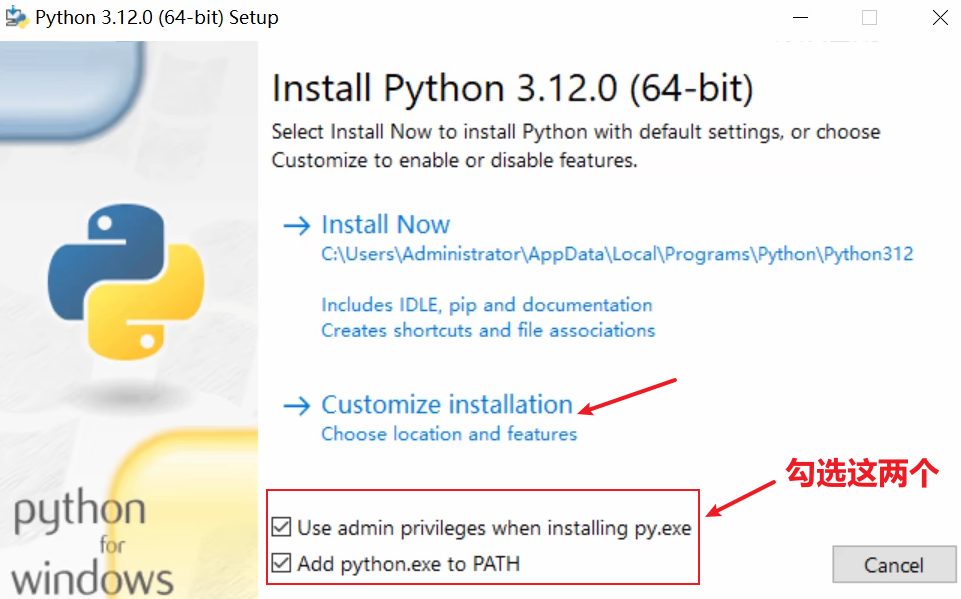
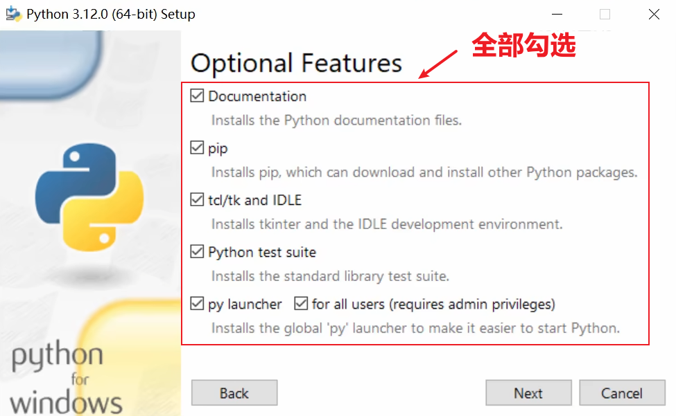
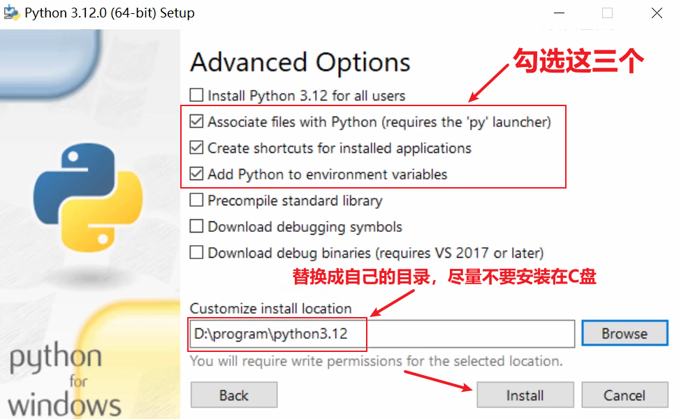
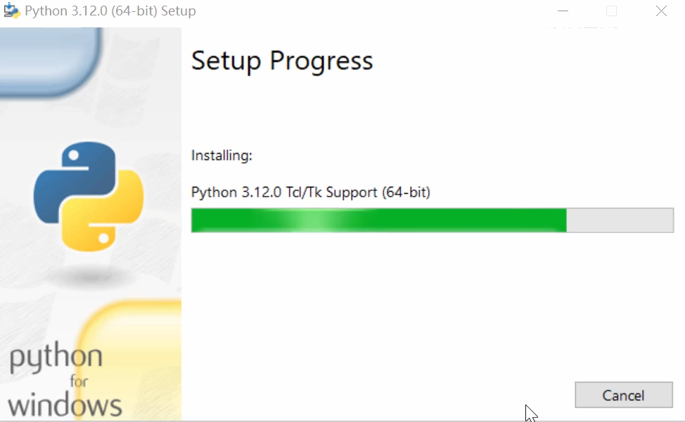
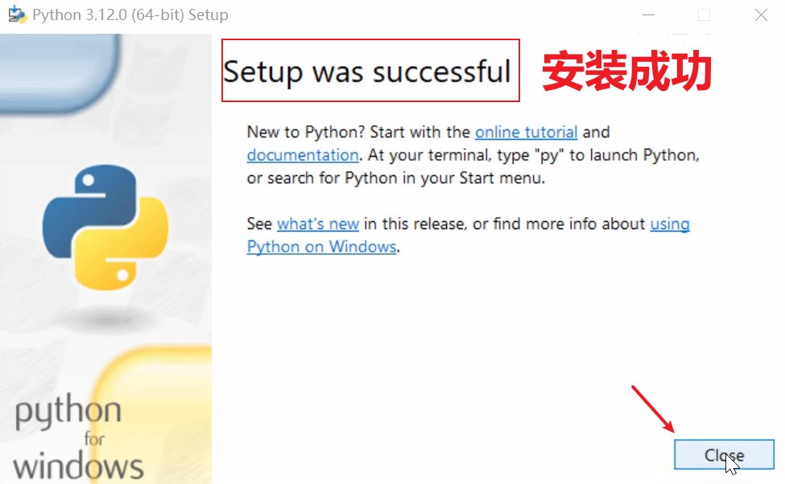
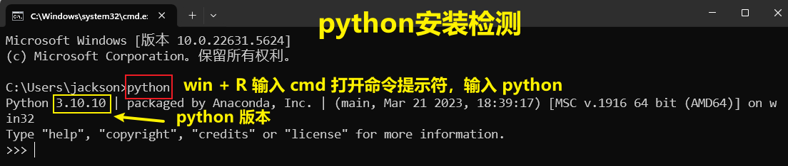
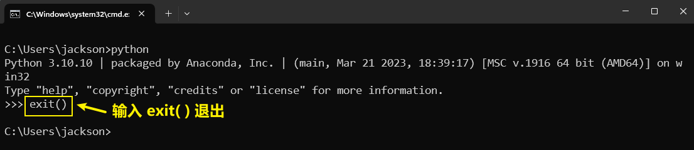
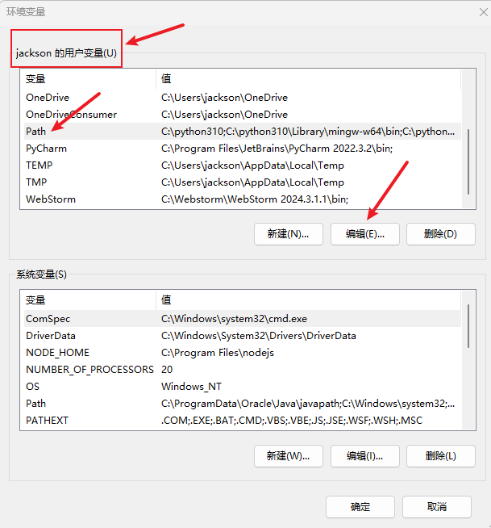
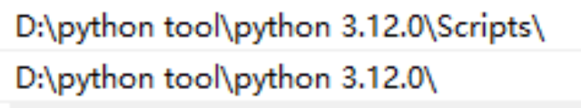

<h1 style="text-align: center; font-weight: bold;">python 3 .12 .0 解释器安装</h1>

---

## 1. 软件下载

<h3>官网下载地址</h3>

https://www.python.org/downloads/windows/

<h3>点击下方链接开始下载 python 3.12.0</h3>

https://www.python.org/ftp/python/3.12.0/python-3.12.0-amd64.exe

## 2. 安装

<br/>
<div style="width:700px; margin: 0 auto;">
  
</div>
<hr/>

<div style="width:700px; margin: 0 auto;">
  
</div>
<hr/>

<h1><center><span style = "color:red;font-weight:bold">安装路径不要有中文或和特殊字符！！！</span></center></h1>

<br/>

<div style="width:700px; margin: 0 auto;">
  
</div>
<hr/>

<div style="width:700px; margin: 0 auto;">
  
</div>
<hr/>

<div style="width:700px; margin: 0 auto;">
  
</div>
<hr/>

## 3. 检测

<h3>输入如下指令查看 python 版本</h3>

```bash
python -V
```

<br/>
<div style="width:800px; margin: 0 auto;">
  
</div>
<hr/>

<div style="width:800px; margin: 0 auto;">
  
</div>
<hr/>

<h2>🎉🎉安装成功，完结散花🎉🎉</h2>

## 4. 环境变量

<h3>配置环境变量的目的</h3>

- <h3>配置环境变量的目的是让计算机知道有某个程序的存在，这样便可以在<span style = "color:red;font-weight:bold">任何路径</span>下使用该程序</h3>
- <h3>如果没有配置环境变量，则不再该程序目录运行该程序时会<span style = "color:red;font-weight:bold">提示不是内部或外部命令，也不是可运行的程序或批处理文件</span></h3>

<br/>
<div style="width:600px; margin: 0 auto;">
  
</div>
<hr/>

<h3>在环境变量中的 path 中配置如下<span style = "color:red;font-weight:bold">三条</span>环境变量，<span style = "color:red;font-weight:bold">注意把换成自己的路径</span></h3>

<br/>

<div style="width:500px; margin: 0 auto;">
  
</div>
<hr/>
