<h1 style="text-align: center; font-weight: bold;">annaconda安装</h1>

---

<h3><span style = "color:red;font-weight:bold">温馨提醒：如果不是专业数据分析和机器学习、深度学习方向，可以不安装，使用 python 环境配置 pip 安装需要的包即可，annaconda占用空间大（初始化安装后可以达到10个G多），且独立管理环境上有一定难度，衍生问题众多...</span></h3>

## 1. 安装

<h3>简介：annaconda 简单理解是一个环境管理器</h3>

<h3>点击下方链接开始下载annaconda</h3>

https://repo.anaconda.com/archive/Anaconda3-2024.10-1-Windows-x86_64.exe

<h3>官网下载地址如下</h3>

https://www.anaconda.com/download/success

<h3>历史版本</h3>

https://repo.anaconda.com/archive/

<br/>
<div style="width:500px; margin: 0 auto;">
  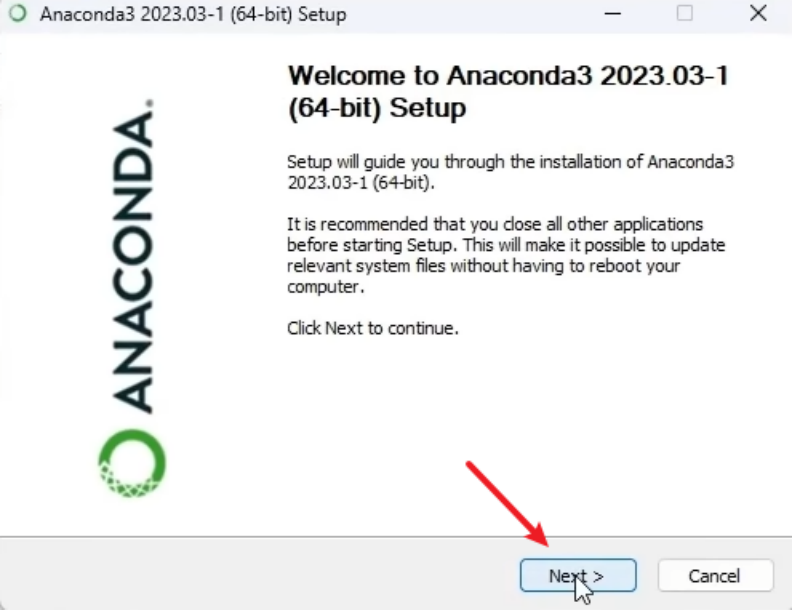
</div>
<hr/>

<div style="width:600px; margin: 0 auto;">
  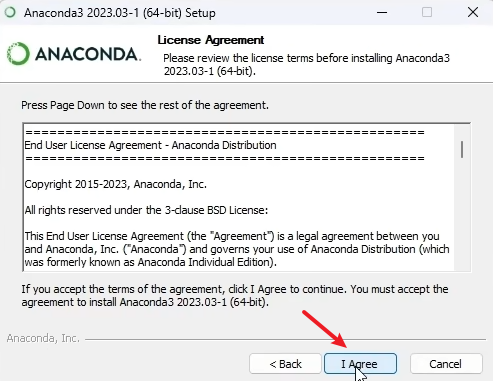
</div>
<hr/>

<div style="width:600px; margin: 0 auto;">
  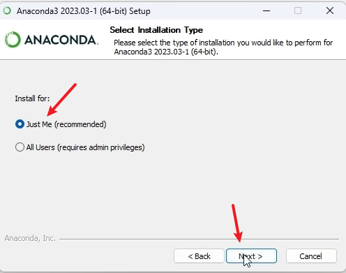
</div>
<hr/>

<div style="width:600px; margin: 0 auto;">
  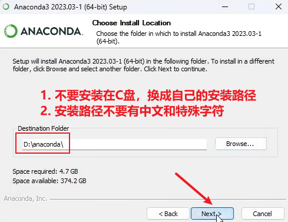
</div>
<hr/>

<div style="width:600px; margin: 0 auto;">
  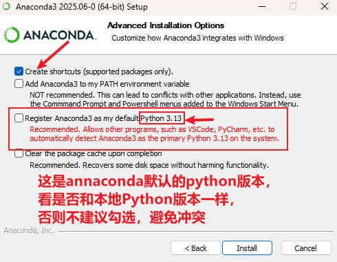
</div>
<hr/>

<div style="width:600px; margin: 0 auto;">
  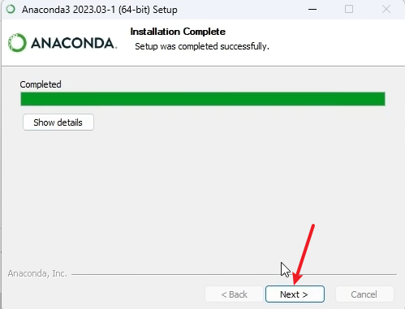
</div>
<hr/>

<div style="width:600px; margin: 0 auto;">
  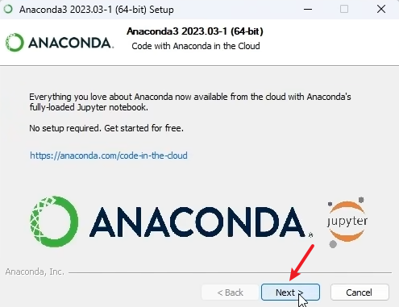
</div>
<hr/>

<div style="width:600px; margin: 0 auto;">
  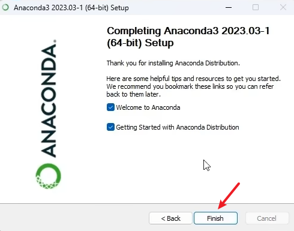
</div>
<hr/>

## 2. 环境变量

<br/>
<div style="width:500px; margin: 0 auto;">
  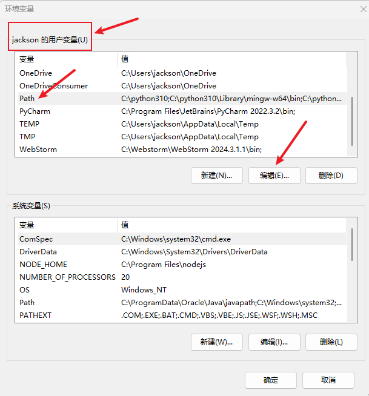
</div>
<hr/>

<h3>在环境变量中的 path 中配置如下<span style = "color:red;font-weight:bold">四条</span>环境变量，<span style = "color:red;font-weight:bold">注意把换成自己的路径</span></h3>

<br/>

<div style="width:500px; margin: 0 auto;">
  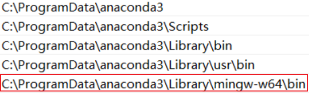
</div>
<hr/>

<h3>说明：在最新版的 Anaconda 安装中，mingw-w64 可能不再作为默认包安装，如果你要使用 C 或 C++ 编写 Python 扩展模块，或者将 C/C++ 代码集成到 Python 项目中可以安装，然后配置环境变量</h3>

## 3. 检测

<br/>

<div style="width:800px; margin: 0 auto;">
  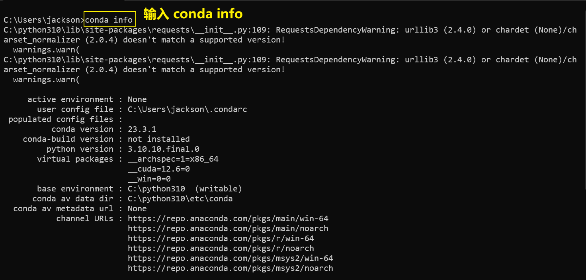
</div>
<hr/>

<h2>🎉🎉安装成功，完结散花🎉🎉</h2>

## 4. conda 环境使用

### （1）配置镜像源

采用清华镜像源，网址：https://mirrors.tuna.tsinghua.edu.cn/help/anaconda/

找到 conda 的配置文件 <span style = "color:red;font-weight:bold">.condarc</span>文件，把如下内容粘贴进去即可

```bash
show_channel_urls: true
default_channels:
  - https://mirrors.tuna.tsinghua.edu.cn/anaconda/pkgs/main
  - https://mirrors.tuna.tsinghua.edu.cn/anaconda/pkgs/r
  - https://mirrors.tuna.tsinghua.edu.cn/anaconda/pkgs/msys2
custom_channels:
  conda-forge: https://mirrors.tuna.tsinghua.edu.cn/anaconda/cloud
  pytorch: https://mirrors.tuna.tsinghua.edu.cn/anaconda/cloud
```

<h3>检查配置：使用如下命令查看是否配置成功，在输出的信息中查看 channel 部分</h3>

```bash
conda info
```

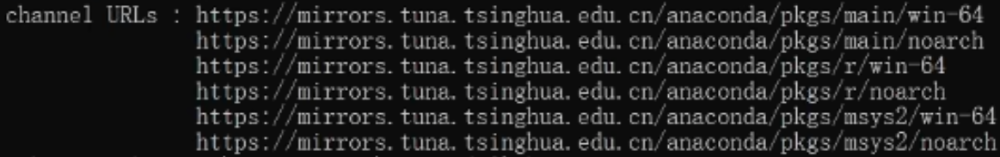

### （2）修改存储路径

<h3>检查配置：使用如下命令查看<span style = "color:red;font-weight:bold">包和环境</span>存储路径</h3>

```bash
conda info
```

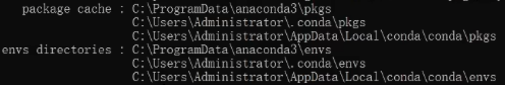

<h3>修改环境存储路径</h3>

```bash
conda config --add envs_dirs 文件路径
```

<h3>修改包存储路径</h3>

```bash
conda config --add pkgs_dirs 文件路径
```

### （3）新建环境

<h4>回车后就开始加载环境以及下载一些依赖，一个 python 版本的依赖只会下载依次，下次创建就会直接复制过来</h4>

```bash
conda create -n 环境名 python=版本名称
```

### （4）启用环境

<h4>回车后就会显示该环境的路径</h4>

```bash
conda activate 环境名
```

### （5）查看创建的环境

```bash
conda env list
```

### （6）删除环境

```bash
conda env remove -n 环境名
```

### （7）安装包

```bash
conda install 包名
```

### （8）删除包

<h4>只会删除环境中的包，但是不会删除package中的包</h4>

```bash
conda uninstall 包名
```

### （9）查看包

```bash
conda list
```

## 5. .condarc 配置镜像源

#### 清华镜像源

```bash
channels:
  - defaults
show_channel_urls: true
channel_alias: https://mirrors.tuna.tsinghua.edu.cn/anaconda
default_channels:
  - https://mirrors.tuna.tsinghua.edu.cn/anaconda/pkgs/main
  - https://mirrors.tuna.tsinghua.edu.cn/anaconda/pkgs/free
  - https://mirrors.tuna.tsinghua.edu.cn/anaconda/pkgs/r
  - https://mirrors.tuna.tsinghua.edu.cn/anaconda/pkgs/pro
  - https://mirrors.tuna.tsinghua.edu.cn/anaconda/pkgs/msys2
custom_channels:
  conda-forge: https://mirrors.tuna.tsinghua.edu.cn/anaconda/cloud
  msys2: https://mirrors.tuna.tsinghua.edu.cn/anaconda/cloud
  bioconda: https://mirrors.tuna.tsinghua.edu.cn/anaconda/cloud
  menpo: https://mirrors.tuna.tsinghua.edu.cn/anaconda/cloud
  pytorch: https://mirrors.tuna.tsinghua.edu.cn/anaconda/cloud
  simpleitk: https://mirrors.tuna.tsinghua.edu.cn/anaconda/cloud
```

#### 阿里云镜像源

```bash
channels:
  - defaults
show_channel_urls: true
default_channels:
  - http://mirrors.aliyun.com/anaconda/pkg/main
  - http://mirrors.aliyun.com/anaconda/pkg/r
  - http://mirrors.aliyun.com/anaconda/pkg/msys2
custom_channels:
  conda-forge: http://mirrors.aliyun.com/anaconda/cloud
  msys2: http://mirrors.aliyun.com/anaconda/cloud
  bioconda: http://mirrors.aliyun.com/anaconda/cloud
  menpo: http://mirrors.aliyun.com/anaconda/cloud
  pytorch: http://mirrors.aliyun.com/anaconda/cloud
  simpleitk: http://mirrors.aliyun.com/anaconda/cloud
```

## 6. ⚠️ 安装问题 ⚠️

<h3>如果需要卸载，需要删除干净，特别是<span style="color:red;font-weight:bold">需要删除 .condarc 配置文件</span>，否则重重装会报如下错误</h3>
<br/>
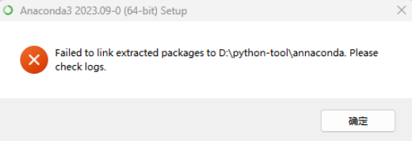

## 7. ⚠️ 环境搭建失败问题 ⚠️

<h3>更换了不同的镜像源都无法创建新环境或者是网络问题，这里直接使用本地安装的 annaconda 作为环境，里面配置了大部分包，属于是开箱即用</h3>

<br/>

<div style="width:700px; margin: 0 auto;">
  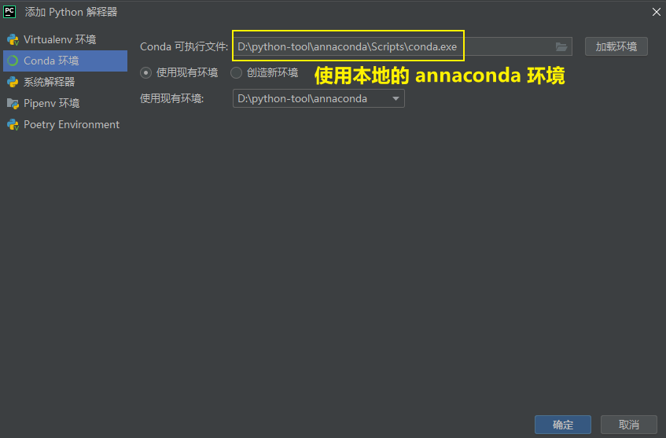
</div>
<hr/>
