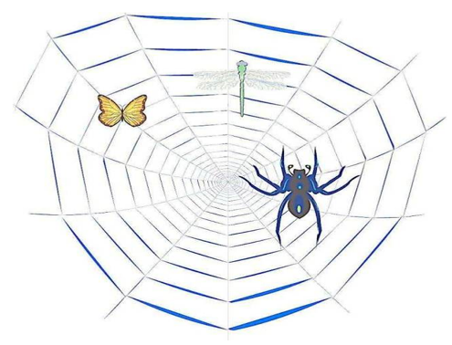
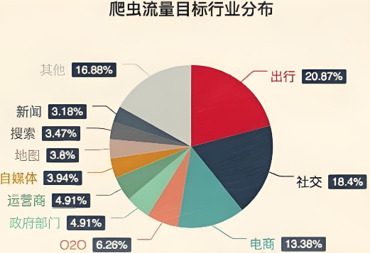

<h1 style="text-align: center; font-weight: bold;">爬虫基本介绍🐍</h1>

---

## 什么是爬虫

#### 如果我们把互联网比作一张大的蜘蛛网，那一台计算机上的数据便是蜘蛛网上的一个猎物，而爬虫程序就是一只小蜘蛛，沿着蜘蛛网抓取自己想要的数据

#### 两种解释

> #### 解释 1：通过一个程序，根据 Url(http://www.taobao.com)进行爬取网页，获取有用信息
>
> #### 解释 2：使用程序模拟浏览器，去向服务器发送请求，获取响应信息

## 爬虫的核心

> #### 1. 爬取网页：爬取整个网页 包含了网页中所有得内容

> #### 2. 解析数据：将网页中你得到的数据 进行解析

> #### 3. 难点：爬虫和反爬虫之间的博弈

## 爬虫的用途

> #### 1. 数据分析/人工数据集
>
> #### 2. 社交软件冷启动
>
> #### 3. 舆情监控
>
> #### 4. 竞争对手监控

## 爬虫的分类

### 通用爬虫

#### 1. 实例

> #### 百度、360、google、sougou 等搜索引擎‐‐‐伯乐在线

#### 2. 功能

> #### 访问网页‐>抓取数据‐>数据存储‐>数据处理‐>提供检索服务

#### 3. robots 协议

> #### 一个约定俗成的协议，添加 robots.txt 文件，来说明本网站哪些内容不可以被抓取，起不到限制作用，自己写的爬虫无需遵守

#### 4. 网站排名(SEO)

> #### （1）根据 pagerank 算法值进行排名（参考个网站流量、点击率等指标）
>
> #### （2）百度竞价排名

#### 5. 缺点

> #### （1）抓取的数据大多是无用的
>
> #### （2）不能根据用户的需求来精准获取数据

### ⭐ 聚焦爬虫

#### 1. 功能

> #### 根据需求，实现爬虫程序，抓取需要的数据

#### 2. 设计思路

> #### （1）确定要爬取的 url（如何获取 Url）
>
> #### （2）模拟浏览器通过 http 协议访问 url，获取服务器返回的 html 代码（如何访问）
>
> #### （3）解析 html 字符串（根据一定规则提取需要的数据）（如何解析）

## 反爬手段

### User‐Agent

> #### User Agent 中文名为用户代理，简称 UA，它是一个特殊字符串头，使得服务器能够识别客户使用的操作系统及版本、CPU 类型、浏览器及版本、浏览器渲染引擎、浏览器语言、浏览器插件等。

### 代理 IP

> #### 西次代理
>
> #### 快代理

#### 什么是高匿名、匿名和透明代理？它们有什么区别？

> #### 1.使用透明代理，对方服务器可以知道你使用了代理，并且也知道你的真实 IP
>
> #### 2.使用匿名代理，对方服务器可以知道你使用了代理，但不知道你的真实 IP
>
> #### 3.使用高匿名代理，对方服务器不知道你使用了代理，更不知道你的真实 IP

### 验证码访问

> #### 打码平台
>
> #### 云打码平台
>
> #### 超级 🦅

### 动态加载网页

> #### 网站返回的是 js 数据 并不是网页的真实数据
>
> #### selenium 驱动真实的浏览器发送请求

### 数据加密

> #### 分析 js 代码
