<h1 style="text-align: center;">
  腾讯云部署教程
</h1>

**教学视频资源分享**

- [点我跳转：腾讯云部署网站及宝塔使用教程](https://www.bilibili.com/video/BV1r34y1x72A/?spm_id_from=333.1387.favlist.content.click)
- [点我跳转：腾讯云配置 CDN 教程](https://www.bilibili.com/video/BV1fi4y1M7XV/?spm_id_from=333.337.search-card.all.click&vd_source=822e86b53dab98632ef279a46d2536db)
- [点我跳转：网站上线全流程（腾讯云）](https://www.bilibili.com/video/BV18a4y1Y7e9/?spm_id_from=333.1387.favlist.content.click)

---

## 1. 准备工作

腾讯云官网：https://cloud.tencent.com/

说明：本教程的服务器和域名均采用腾讯云的产品

### (1) 个人账号完善

1. 在官网完成个人账号的注册和实名认证

2. 若需购买域名需要创建好个人信息模板

3. 如果是学生，可以完成学生认证，购买更优惠（[点我跳转学生优惠活动专区](https://cloud.tencent.com/act/campus?from=19070)）

### (2) 购买服务器

#### 1. 购买介绍

618 特惠服务器：38 / 年（[点我跳转 618 特惠活动](https://cloud.tencent.com/act/pro/warmup202506?from=27490)）

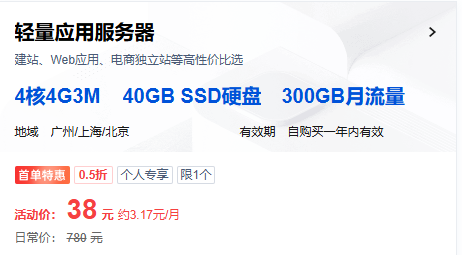

如果是新用户，可以享受一次优惠，建议如果价格在能承受的范围内，一次购买的时间越长越好，后续续费会越来越贵，由于上面的活动太抢手了，jacksonling 购买的是新用户优惠活动的服务器

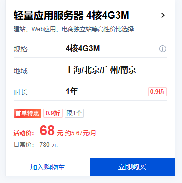

#### 2. 购买说明

服务器配置参数解释：

cpu: 1 核 1G 就够用了。

带宽：带宽越大，打开网页、从服务器下载东西的速度越快

系统盘：够用就好，一般静态资源、数据库、缓存都是存到其他地方去

月流量：这个够用就好，300G 小公司网站都用不完

时长：优惠购买只能一次，能承受范围内，时长越长越好，配置越高越好。

### (3) 购买域名

[点我跳转腾讯云域名注册](https://cloud.tencent.com/product/domain)

购买说明

- 域名可以根据自己的喜好进行挑选，不同的域名价格也不相同
- 域名一次最多购买十年，如果需要长期使用，在能力承受范围内建议一次性购买时间为 3 / 5 年
- 域名购买后需要备案才可以使用，通过 DNS 解析来和服务器匹配，最终通过域名来访问网站 ([点我跳转腾讯云域名备案](https://cloud.tencent.com/product/ba))，**根据步骤提示完成备案流程即可**

**注意点：域名如果没有备案成功，是无法通过购买的域名访问对应的网址的**

---

## 2. 部署方法

### (1) 说明

服务器使用的是**宝塔面板**，如果不是可以选择**重装系统**

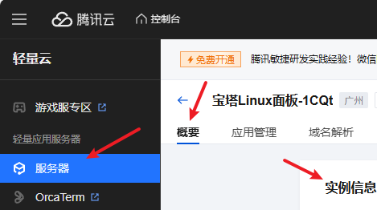

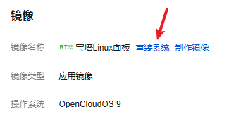

### (2) 预备工作

**开放 8888 端口**

1. 进入控制台
2. 进入服务器管理界面
3. 进入应用管理界面，找到应用内软件信息

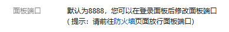

4. 点击防火墙
5. 点击添加规则，开放 8888 端口

6. **点击添加规则**

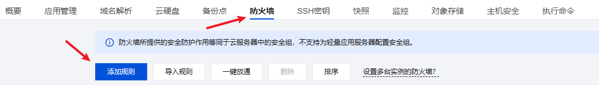

7. **添加端口**

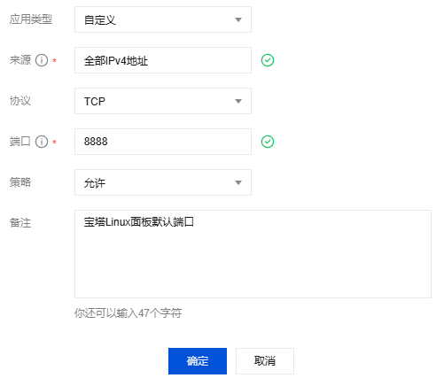

### (3) 部署步骤

#### 1. 初始化宝塔面板

1. 进入控制台中，进入个人服务器的应用管理界面，**使用提供的命令初始化宝塔面板**，此时会生成默认的账号和密码，复制提供的**外网 ipv4 面板地址**到浏览器中，使用默认的账号密码登录

2. 首次进入会提示安装如下内容
   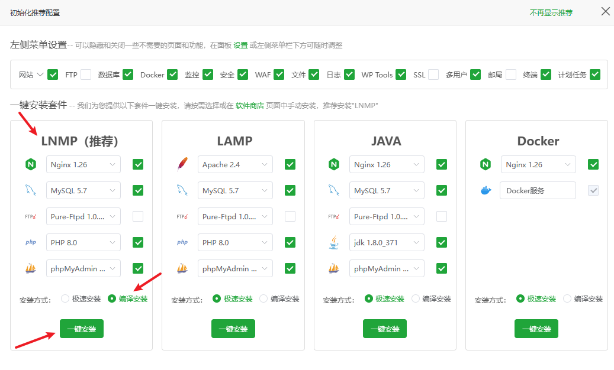
3. 进入左边栏的设置界面，重置一下用户名和密码

#### 2. 域名解析

点击控制台，找到个人域名，点击解析，跳转界面后点击**添加记录**

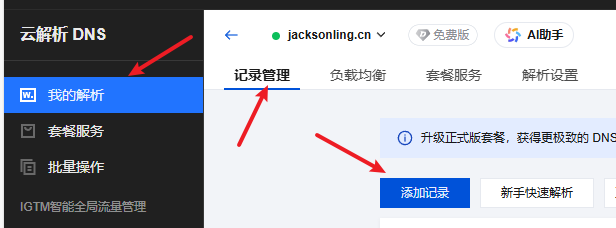

添加两条记录，记录值填写自己服务器的 IP 地址即可

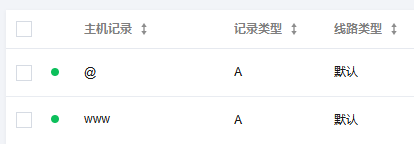

回到服务器管理界面，点击添加域名解析，把刚刚的解析记录添加进来

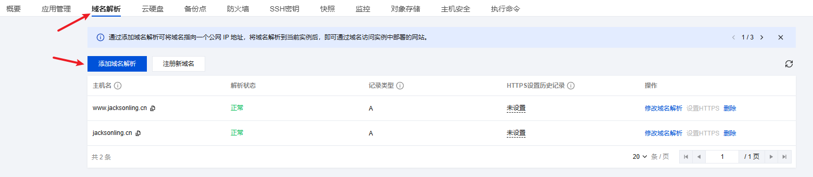

#### 3. 上传网页文件

在宝塔面板左侧选择网站，添加对应的项目类型（本站选择是 html）

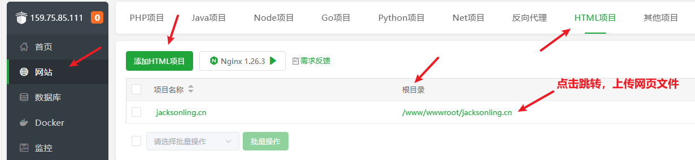

点击**根目录**，跳转到文件界面，上传网站文件即可

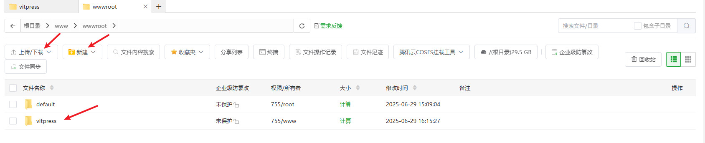

补充：可以使用 **XShell** 通过 **SSH** 连接服务器，操作上会更方便

#### 4. 申请 SSL 证书

**（1）在控制台中搜索 SSL 证书，点击申请免费的证书**

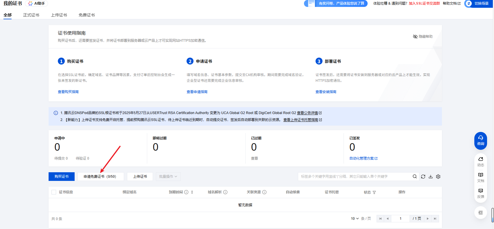

**（2）选择自动 DNS 认证**

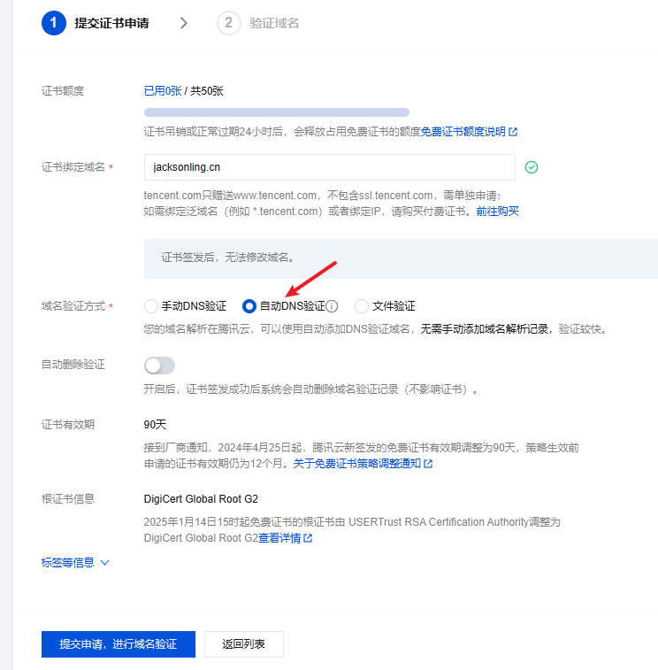

**（3）证书签发成功后，点击下载 Nginx 版本文件**

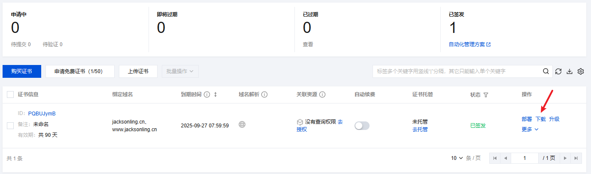

证书内容如下

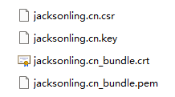

**（4）回到宝塔面板配置证书**

1. 点击部署

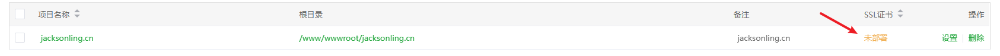

2. 根据提示，粘贴对应文件的内容，保存

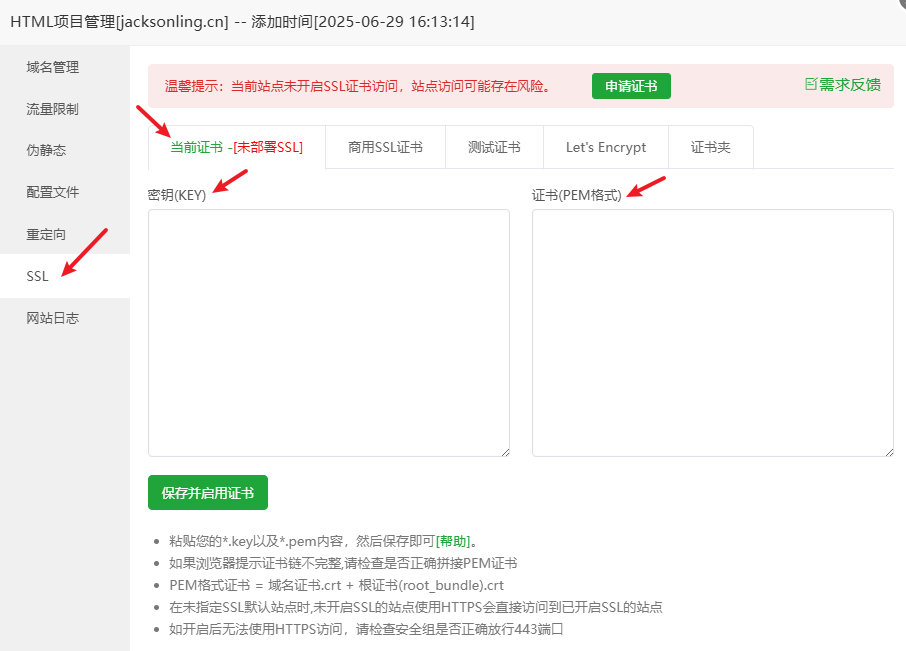

3. **证书添加成功后，强制开启 https**

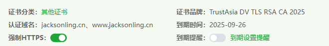

## 3. 内容补充

### 1. 网站内容更新

登录服务器，使用如下命令启动宝塔

```bash
bt start
```

启动服务后，根据初始化时宝塔给的外网 ipv4 面板地址来访问宝塔面板，上传新的网站文件即可

完成操作后使用如下命令关闭服务

```bash
bt stop
```

### 2. 更多宝塔功能

登录服务器，输入如下命令，之后根据提示选择对应的功能

```bash
bt
```


### 3. SSL 证书过期

在控制台搜索 SSL 证书，再次申请一张并在宝塔界面从新配置即可，方法和前面相同

### 4. CDN 加速及配置方法
