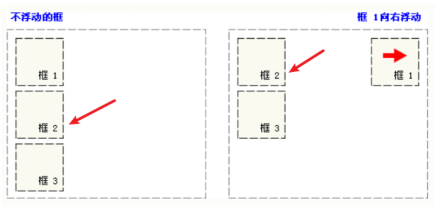
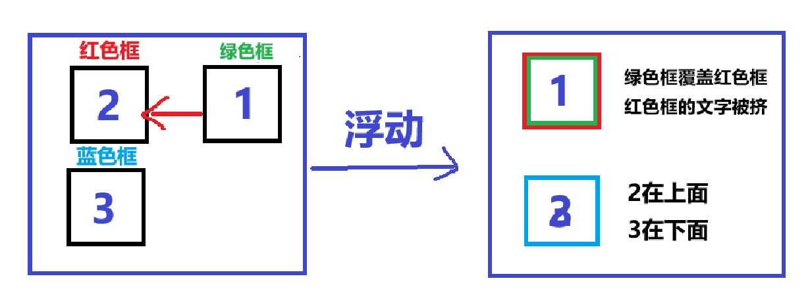
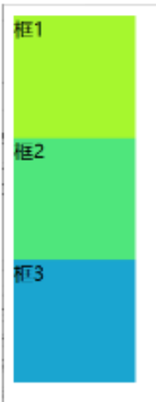
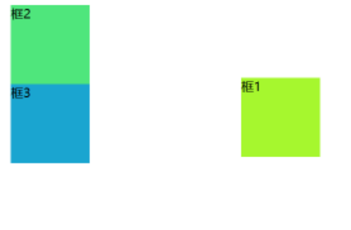
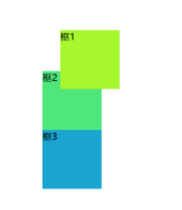

<h1 style="text-align: center; font-weight: bold;">基于 Javaweb 课程的 CSS 笔记</h1>

---

## 基本介绍

> <h3>CSS <span style = "color:red;font-weight:bold">层叠样式表</span>(英文全称：(Cascading Style Sheets)) 能够对网页中元素位置的排版进行像素级精确控制，支持几乎所有的字体字号样式，拥有对网页对象和模型样式编辑的能力 ,简单来说,美化页面</h3>

## 引入方式

### 行内式

> <h3><span style = "color:red;font-weight:bold">常配合JS使用</span></h3>
> <h3>语法： `style="样式名: 样式值; 样式名: 样式值; ..."</h3>
>
> <h3>缺点如下</h3>
>
> <h3>1. 代码<span style = "color:red;font-weight:bold">复用性低</span>，不利于维护</h3>
>
> <h3>2. css 样式代码和 html 结构代码紧在一起，<span style = "color:red;font-weight:bold">影响阅读</span>，影响文件大小，<span style = "color:red;font-weight:bold">影响性能</span></h3>

```html
<input
  type="button"
  value="按钮"
  style="
            width: 60px;    /* 宽度 */
            height: 40px;  /* 高度 */
            background-color: rgb(140, 235, 100);  /* 背景色 */
            color: white;   /* 字体颜色 */
            border: 3px solid green;   /* 边框线：实线（solid） */
            font-size: 22px;  /* 字体大小 */
            font-family: '隶书';  /* 字体样式 */
            border-radius: 5px;   /* 边角弧度 */
    "
/>
```

### 内嵌式

> <h3>说明</h3>

> - **内嵌式样式需要<span style = "color:red;font-weight:bold">在 head 标签</span>中,使用<span style = "color:red;font-weight:bold">一对 style 标签</span>，通过<span style = "color:red;font-weight:bold">指定标签</span>的方式来<span style = "color:red;font-weight:bold">定义 CSS 样式</span>（缺点：无法精确控制，只能全局改变）**
> - **CSS 样式的<span style = "color:red;font-weight:bold">作用范围</span>控制要<span style = "color:red;font-weight:bold">依赖选择器</span>**
> - **CSS 的样式代码中注释的方式为 /\* \*/**
> - **内嵌式虽然对样式代码做了抽取,但是 CSS 代码仍然在 html 文件中**
> - **内嵌样式<span style = "color:red;font-weight:bold">仅仅能作用于当前文件</span>,代码<span style = "color:red;font-weight:bold">复用度还是不够</span>,不利于网站风格统一**

```html
<head>
  <meta charset="UTF-8" />
  <style>
    /* 通过选择器确定样式的作用范围 */
    input {
      width: 60px; /* 宽度 */
      height: 40px; /* 高度 */
      background-color: rgb(140, 235, 100); /* 背景色 */
      color: white; /* 字体颜色 */
      border: 3px solid green; /* 边框线：实线（solid） */
      font-size: 22px; /* 字体大小 */
      font-family: "隶书"; /* 字体样式 */
      border-radius: 5px; /* 边角弧度 */
    }
  </style>
</head>
<body>
  <input type="button" value="按钮1" />
  <input type="button" value="按钮2" />
  <input type="button" value="按钮3" />
  <input type="button" value="按钮4" />
</body>
```

### 外部样式表

**说明**

> - **CSS 样式代码从 html 文件中剥离,利于代码的维护**
> - **CSS 样式文件可以被多个不同的 html 引入,利于网站风格统一**
> - **将 css 代码单独放入一个 `.css` 文件中，通过<span style = "color:red;font-weight:bold">&lt;link&gt;标签</span>从外部引入 CSS 样式表，<span style = "color:red;font-weight:bold;font-size:20px">&lt;link href="CSS 文件路径" rel="stylesheet" /&gt;</span>，rel 后填写的是文件类型，CSS 指定是 stylesheet**

```html
<head>
  <meta charset="UTF-8" />
  <!--引入外部样式表-->
  <link href="CSS文件路径" rel="stylesheet" />
</head>
<body>
  <!--主体内容-->
</body>
```

### 常见样式属性 ⭐

## 选择器

### 元素选择器

> <h3>说明</h3>

> - **语法：<span style = "color:red;font-weight:bold;font-size:20px">元素名{}</span>**
> - **引入方式：在 <span style = "color:red;font-weight:bold">head 标签</span>中，使用<span style = "color:red;font-weight:bold">一对 style 标签</span>，通过<span style = "color:red;font-weight:bold">指定标签</span>的方式来<span style = "color:red;font-weight:bold">定义 CSS 样式</span>**
> - **根据标签名确定样式的作用范围**
> - **样式只能作用到同名标签上,其他标签不可用**
> - **相同的标签未必需要相同的样式,会造成样式的作用范围太大**

```html
<head>
  <meta charset="UTF-8" />
  <style>
    input {
      width: 60px; /* 宽度 */
      height: 40px; /* 高度 */
      background-color: rgb(140, 235, 100); /* 背景色 */
      color: white; /* 字体颜色 */
      border: 3px solid green; /* 边框线：实线（solid） */
      font-size: 22px; /* 字体大小 */
      font-family: "隶书"; /* 字体样式 */
      border-radius: 5px; /* 边角弧度 */
    }
  </style>
</head>
<body>
  <input type="button" value="按钮1" />
  <input type="button" value="按钮2" />
  <input type="button" value="按钮3" />
  <input type="button" value="按钮4" />
  <button>按钮5</button>
</body>
```

### id 选择器

> <h3>说明</h3>

> - **语法：<span style = "color:red;font-weight:bold;font-size:20px">#（id 值） {}</span>**
> - **定义方式：在 <span style = "color:red;font-weight:bold">head 标签</span>中，使用<span style = "color:red;font-weight:bold">一对 style 标签</span>，通过<span style = "color:red;font-weight:bold">指定标签</span>的方式来<span style = "color:red;font-weight:bold">定义 CSS 样式</span>**
> - **引入方式：添加属性 id="id 值"**
> - **根据元素 id 属性的值确定样式的作用范围**
> - **id 属性的值在页面上具有<span style = "color:red;font-weight:bold">唯一性</span>,所有 id 选择器也<span style = "color:red;font-weight:bold">只能影响一个元素</span>的样式**
> - **因为 id 属性值不够灵活,所以使用该选择器的情况较少**

```html
<head>
  <meta charset="UTF-8" />
  <style>
    #btn1 {
      width: 60px; /* 宽度 */
      height: 40px; /* 高度 */
      background-color: rgb(140, 235, 100); /* 背景色 */
      color: white; /* 字体颜色 */
      border: 3px solid green; /* 边框线：实线（solid） */
      font-size: 22px; /* 字体大小 */
      font-family: "隶书"; /* 字体样式 */
      border-radius: 5px; /* 边角弧度 */
    }
  </style>
</head>
<body>
  <input id="btn1" type="button" value="按钮1" />
  <input id="btn2" type="button" value="按钮2" />
  <input id="btn3" type="button" value="按钮3" />
  <input id="btn4" type="button" value="按钮4" />
  <button id="btn5">按钮5</button>
</body>
```

### class 选择器

> <h3>说明</h3>

> - **语法：<span style = "color:red;font-weight:bold;font-size:20px"> .(class 值) {}</span>**
> - **定义方式（1）在 <span style = "color:red;font-weight:bold">head 标签</span>中，使用<span style = "color:red;font-weight:bold">一对 style 标签</span>，通过<span style = "color:red;font-weight:bold">指定标签</span>的方式来<span style = "color:red;font-weight:bold">定义 CSS 样式</span>（2）还可以写在 CSS 文件中，在 html 标签中通过<span style = "color:red;font-weight:bold">&lt;link&gt;标签</span>从外部引入 CSS 样式表，**
> - **引入方式：添加属性 class="class 值 1 class 值 2 class 值 3..."，使用<span style = "color:red;font-weight:bold">多个 class 值时，用空格隔开</span>**
> - **根据元素 class 属性的值确定样式的作用范围**
> - **class 属性值<span style = "color:red;font-weight:bold">可以有一个,也可以有多个</span>,多个不同的标签也<span style = "color:red;font-weight:bold">可以是使用相同的 class 值</span>**
> - **多个选择器的<span style = "color:red;font-weight:bold">样式</span>可以在同一个元素上进行<span style = "color:red;font-weight:bold">叠加</span>**
> - **因为 class 选择器非常灵活,所以在 CSS 中,使用该选择器的情况较多**

```html
<head>
  <meta charset="UTF-8" />
  <style>
    .shapeClass {
      display: block;
      width: 80px;
      height: 40px;
      border-radius: 5px;
    }
    .colorClass {
      background-color: rgb(140, 235, 100);
      color: white;
      border: 3px solid green;
    }
    .fontClass {
      font-size: 22px;
      font-family: "隶书";
      line-height: 30px;
    }
  </style>
</head>
<body>
  <input class="shapeClass colorClass fontClass" type="button" value="按钮1" />
</body>
```

## CSS 浮动

### 基本介绍

> <h4>CSS 的 Float（浮动）使元素脱离文档流，按照指定的方向（左或右发生移动），直到它的外边缘碰到包含框或另一个浮动框的边框为止</h4>

- <h4>浮动设计的初衷为了解决文字环绕图片问题，<span style = "color:red;font-weight:bold">浮动后一定不会将文字挡住，这是设计初衷</span></h4>
- <h4>文档流是是文档中可显示对象在排列时所占用的位置/空间，而脱离文档流就是在页面中不占位置了</h4>

### 浮动属性

| left  | 元素**向左**浮动。                                   |
| ----- | ---------------------------------------------------- |
| right | 元素**向右**浮动。                                   |
| none  | 默认值，元素不浮动，并会显示在其在文本中出现的位置。 |

### 浮动原则

#### （1）当一个元素浮动后，空位会由下方的元素补齐，就像汽水冒泡一样



#### （2）浮动过程中，块会被覆盖，但是<span style = "color:red;font-weight:bold">文字不会被覆盖</span>，会被挤出去



### 示例代码

```html
<head>
  <meta charset="UTF-8" />
  <style>
    .outerDiv {
      width: 500px;
      height: 300px;
      border: 1px solid green;
      background-color: rgb(230, 224, 224);
    }
    .innerDiv {
      width: 100px;
      height: 100px;
      border: 1px solid blue;
      float: left;
    }
    .d1 {
      background-color: greenyellow;
      /*  float: right; */
    }
    .d2 {
      background-color: rgb(79, 230, 124);
    }
    .d3 {
      background-color: rgb(26, 165, 208);
    }
  </style>
</head>
<body>
  <div class="outerDiv">
    <div class="innerDiv d1">框1</div>
    <div class="innerDiv d2">框2</div>
    <div class="innerDiv d3">框3</div>
  </div>
</body>
```

<image src="./浮动效果图.png" style="width:600px;margin: 0px auto"/>

## CSS 定位

### 基本介绍

> #### position 属性指定了元素的定位类型

| 值       | 描述                                                                                                                                                                                     |
| -------- | ---------------------------------------------------------------------------------------------------------------------------------------------------------------------------------------- |
| static   | 默认值，没有定位，元素按照正常的文档流进行排列（忽略 top、bottom、left、right 以及 z-index 等属性）。                                                                                    |
| absolute | 生成相对于定位的元素，相对于 static 定位之外的第一个父元素进行定位。元素的位置通过 <span style = "color:red;font-weight:bold">"left"、"top"、"right" 以及 "bottom"</span> 属性进行控制。 |
| relative | 生成相对于其正常位置进行定位。因此，"left:20" 会向元素的 LEFT 位置添加 20 像素。                                                                                                         |
| fixed    | 生成<span style = "color:red;font-weight:bold">相对于浏览器窗口</span>定位。元素的位置通过 "left"、"top"、"right" 以及 "bottom" 属性进行控制。                                           |

### static

> #### 不设置的时候的默认值就是 static，静态定位，没有定位，元素出现在该出现的位置，<span style = "color:red;font-weight:bold">块级元素垂直排列，行内元素水平排列</span>

```html
<head>
  <meta charset="UTF-8" />
  <style>
    .innerDiv {
      width: 100px;
      height: 100px;
    }
    .d1 {
      background-color: rgb(166, 247, 46);
      position: static;
    }
    .d2 {
      background-color: rgb(79, 230, 124);
    }
    .d3 {
      background-color: rgb(26, 165, 208);
    }
  </style>
</head>
<body>
  <div class="innerDiv d1">框1</div>
  <div class="innerDiv d2">框2</div>
  <div class="innerDiv d3">框3</div>
</body>
```



### absolute

> - #### absolute ,通过 <span style = "color:red;font-weight:bold">top left right bottom</span> 指定元素在页面上的固定位置
> - #### 定位后元素会让出原来位置,其他元素可以占用

```html
<head>
  <meta charset="UTF-8" />
  <style>
    .innerDiv {
      width: 100px;
      height: 100px;
    }
    .d1 {
      background-color: rgb(166, 247, 46);
      position: absolute;
      left: 300px;
      top: 100px;
    }
    .d2 {
      background-color: rgb(79, 230, 124);
    }
    .d3 {
      background-color: rgb(26, 165, 208);
    }
  </style>
</head>
<body>
  <div class="innerDiv d1">框1</div>
  <div class="innerDiv d2">框2</div>
  <div class="innerDiv d3">框3</div>
</body>
```



### relative

> - #### relative <span style = "color:red;font-weight:bold">相对于自己原来的位置</span>进行地位
> - #### 定位后<span style = "color:red;font-weight:bold">保留原来的站位</span>,其他元素不会移动到该位置

```html
<head>
  <meta charset="UTF-8" />
  <style>
    .innerDiv {
      width: 100px;
      height: 100px;
    }
    .d1 {
      background-color: rgb(166, 247, 46);
      position: relative;
      left: 30px;
      top: 30px;
    }
    .d2 {
      background-color: rgb(79, 230, 124);
    }
    .d3 {
      background-color: rgb(26, 165, 208);
    }
  </style>
</head>
<body>
  <div class="innerDiv d1">框1</div>
  <div class="innerDiv d2">框2</div>
  <div class="innerDiv d3">框3</div>
</body>
```



### fixd

> - #### fixed 始终在<span style = "color:red;font-weight:bold">浏览器窗口固定位置</span>,不会随着页面的上下移动而移动
> - #### 元素定位后会<span style = "color:red;font-weight:bold">让出原来的位置</span>,其他元素可以占用

```html
<head>
  <meta charset="UTF-8" />
  <style>
    .innerDiv {
      width: 100px;
      height: 100px;
    }
    .d1 {
      background-color: rgb(166, 247, 46);
      position: fixed;
      right: 30px;
      top: 30px;
    }
    .d2 {
      background-color: rgb(79, 230, 124);
    }
    .d3 {
      background-color: rgb(26, 165, 208);
    }
  </style>
</head>
<body>
  <div class="innerDiv d1">框1</div>
  <div class="innerDiv d2">框2</div>
  <div class="innerDiv d3">框3</div>
  br*100+tab
</body>
```

<image src="./固态定位.gif" style="width:500px;margin:0px auto"/>

## 盒子模型

### 基本介绍

> - #### CSS 盒模型本质上是一个盒子，封装周围的 HTML 元素，它包括：边距（margin），边框（border），填充（padding），和实际内容（content）

<image src="./盒子模型-1.png" style="width:700px;margin:0px auto"/>

### 属性

> - #### content(内容) - 盒子的内容，显示文本和图像
> - #### border(边框) - 围绕在内边距和内容外的边框（<span style = "color:red;font-weight:bold">不会侵占内容的空间</span>）
> - #### padding(内边距) - 清除内容周围的区域，内边距是透明的（<span style = "color:red;font-weight:bold">不会侵占内容的空间</span>）
>   - #### padding-top：上内边距
>   - #### padding-right：右内边距
>   - #### padding-bottom：下内边距
>   - #### padding-left：左内边距
> - #### margin(外边距) - 清除边框外的区域，外边距是透明的
>   - #### margin-top：上外边距
>   - #### margin-right：右外边距
>   - #### margin-bottom：下外边距
>   - #### margin-left：左外边距
>   - #### 如果不指定方向，默认是<span style = "color:red;font-weight:bold">上右下左（顺时针方向）</span>，即 margin:(margin-top)(margin-right)(margin-bottom)(margin-left)
>   - #### margin：（上下边距）（左右边距）（<span style = "color:red;font-weight:bold">只填写两个值的情况</span>）
>   - #### <span style = "color:red;font-weight:bold">居中应用-->margin：0px auto</span>

<br/>

<image src="./盒子模型-2.png" style="width:700px;margin:0px auto"/>

### 示例代码

```html
<head>
  <meta charset="UTF-8" />
  <style>
    .outerDiv {
      width: 800px;
      height: 300px;
      border: 1px solid green;
      background-color: rgb(230, 224, 224);
      margin: 0px auto;
    }
    .innerDiv {
      width: 100px;
      height: 100px;
      border: 1px solid blue;
      float: left;
      /* margin-top: 10px;
            margin-right: 20px;
            margin-bottom: 30px;
            margin-left: 40px; */
      margin: 10px 20px 30px 40px;
    }
    .d1 {
      background-color: greenyellow;
      /* padding-top: 10px;
            padding-right: 20px;
            padding-bottom: 30px;
            padding-left: 40px; */
      padding: 10px 20px 30px 40px;
    }
    .d2 {
      background-color: rgb(79, 230, 124);
    }
    .d3 {
      background-color: rgb(26, 165, 208);
    }
  </style>
</head>
<body>
  <div class="outerDiv">
    <div class="innerDiv d1">框1</div>
    <div class="innerDiv d2">框2</div>
    <div class="innerDiv d3">框3</div>
  </div>
</body>
```

<image src="./盒子模型-3.png" style="width:800px;margin:0px auto"/>
