<h1 style="text-align: center; font-weight: bold;">基于 Javaweb 课程的 HTML 笔记</h1>

---

<h2>课程链接：<a href="https://www.bilibili.com/video/BV1UN411x7xe">点我跳转</a></h2>

<h2>在线帮助文档</h2>

- w3school：http://www.w3school.com.cn
- MDN：https://developer.mozilla.org/zh-CN/

## 一、概述

### 1. 基本概念

> HTML 是 `Hyper Text Markup Language` 的缩写。意思是<span style="color:red;font-weight:bold">超文本标记语言</span>。它的作用是搭建网页结构，在网页上展示内容

- 超文本

> HTML 文件本质上是文本文件，而普通的文本文件只能显示字符。但是 HTML 技术则通过 HTML 标签把其他网页、图片、音频、视频等各种多媒体资源引入到当前网页中，让网页有了非常丰富的呈现方式，这就是超文本的含义——本身是文本，但是呈现出来的最终效果超越了文本。

- 标记语言

> 说 HTML 是一种『标记语言』是因为它不是像 Java 这样的『编程语言』，因为它是由一系列『标签』组成的，没有常量、变量、流程控制、异常处理、IO 等等这些功能。HTML 很简单，每个标签都有它固定的含义和确定的页面显示效果。

### 2. 快速入门

#### （1）相关术语

- 标签：代码中的<span style="color:red;font-weight:bold">一个</span> `<>` <span style="color:red;font-weight:bold">叫做一个标签</span>，有些标签<span style="color:red;font-weight:bold">成对出现</span>,称之为<span style="color:red;font-weight:bold">双标签</span>,有些标签<span style="color:red;font-weight:bold">单独出现</span>,称之为<span style="color:red;font-weight:bold">单标签</span>

- 属性：一般在开始标签中,用于定义标签的一些特征

- 文本：双标签中间的文字,包含空格换行等结构

- 元素：经过浏览器解析后,每一个完整的标签(<span style="color:red;font-weight:bold">标签+属性+文本</span>)可以称之为<span style="color:red;font-weight:bold">一个元素</span>

#### （2）基本结构

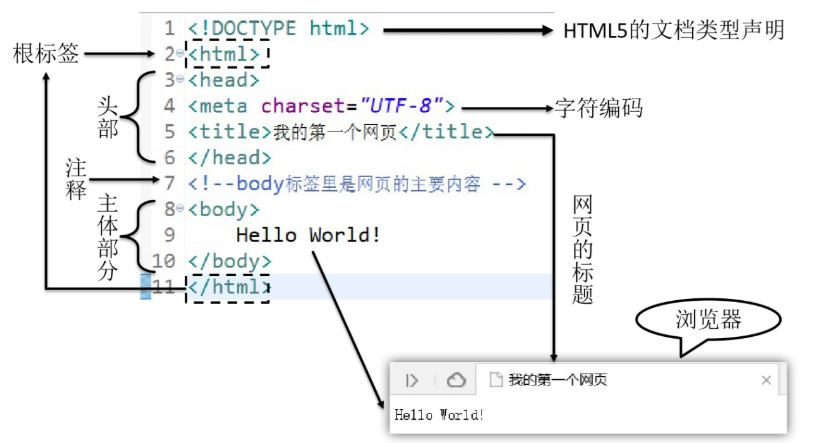

> 1 **文档声明**

- HTML 文件中第一行的内容，用来告诉浏览器当前 HTML 文档的基本信息，其中最重要的就是当前 HTML 文档遵循的语法标准。这里我们只需要知道 HTML 有 4 和 5 这两个大的版本
- HTML4 版本的文档类型声明是：

```HTML
<!DOCTYPE HTML PUBLIC "-//W3C//DTD HTML 4.01 Transitional//EN"
"http://www.w3.org/TR/html4/loose.dtd">
```

- HTML5 版本的文档类型声明是：

```html
<!DOCTYPE html>
```

- 现在主流的技术选型都是使用 HTML5，之前的版本基本不用了。

> 2 **根标签**

- html 标签是整个文档的根标签，所有其他标签都必须放在 html 标签里面。

> 3 **头部元素**

- head 标签用于定义文档的头部，其他头部元素都放在 head 标签里。头部元素包括 title 标签、script 标签、style 标签、link 标签、meta 标签等等。

> 4 **主体元素**

- body 标签定义网页的主体内容，在浏览器窗口内显示的内容都定义到 body 标签内。

> 5 **注释**

- HTML 注释的写法是

```html
<!-- 注释内容 -->
```

#### （3）语法规则

- 1 根标签有且只能有一个

- 2 无论是双标签还是单标签都需要正确关闭

- 3 标签可以嵌套但不能交叉嵌套

- 4 注释语法为<!-- --> ,注意不能嵌套

- 5 属性必须有值，值必须加引号,H5 中属性名和值相同时可以省略属性值

- 6 HTML 中**不严格区分**字符串使用**单双引号**

- 7 HTML 标签不严格区分大小写,但是**不能大小写混用**

- 8 HTML 中不允许自定义标签名,强行自定义则无效

#### （3）第一个程序

<span style ="color:red;font-weight:bold;font-size:20px">敲击 ! 之后回车，即可生成一个 html 模板</span>

```html
<!DOCTYPE html>
<!--根标签-->
<html>
  <!--头标签：定义重要但是不显示在页面的内容，例如：字符集；css引入；js引入等等-->
  <head>
    <title>我的第一个网页</title>
    <!--网页标签页的内容-->
    <meta charset="UTF-8" />
    <!--告诉浏览器用什么字符集解析文本，和文本的字符集有关-->
  </head>
  <!--主体元素-->
  <body>
    <h1>Hello,World</h1>
    <!--主体内容-->
  </body>
</html>
```

## 二、常见标签

### 1. 标题标签

```html
<body>
  <h1>一级标题</h1>
  <h2>二级标题</h2>
  <h3>二级标题</h3>
  <h4>二级标题</h4>
  <h5>二级标题</h5>
  <h6>二级标题</h6>
</body>
```

> <h1>一级标题</h1>
> <h2>二级标题</h2>
> <h3>三级标题</h3>
> <h4>四级标题</h4>
> <h5>五级标题</h5>
> <h6>六级标题</h6>

### 2. 段落标签

```html
<body>
  <p>
    记者从工信部了解到，近年来我国算力产业规模快速增长，年增长率近30%，算力规模排名全球第二。
  </p>
  <p>
    工信部统计显示，截至去年底，我国算力总规模达到180百亿亿次浮点运算/秒，存力总规模超过1000EB（1万亿GB）。
    国家枢纽节点间的网络单向时延降低到20毫秒以内，算力核心产业规模达到1.8万亿元。中国信息通信研究院测算，
    算力每投入1元，将带动3至4元的GDP经济增长。
  </p>
  <p>
    近年来，我国算力基础设施发展成效显著，梯次优化的算力供给体系初步构建，算力基础设施的综合能力显著提升。
    当前，算力正朝智能敏捷、绿色低碳、安全可靠方向发展。
  </p>
</body>
```

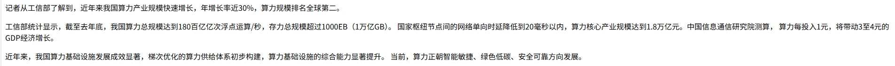

### 3. 换行标签

<h4>
    <ul>
        <li>普通换行标签：<span style="color:red;font-weight:bold">&lt;br/&gt;</span></li>
        <br/>
        <li>换行后带分割线：<span style="color:red;font-weight:bold">&lt;hr/&gt;</span></li>
        <br/>
        <li>多个换行快捷键：<span style="color:red;font-weight:bold">br * 换行的行数 + Tab 键</span></li>
    </ul>
</h4>

```html
<body>
    <p>
        我是第一行<br/>
        我是第二行<hr/>
        我是第三行
    </p>
</body>
```

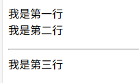

### 4. 列表标签

> <h3>
> 有序列表：<span style="color:red;font-weight:bold">&lt;ol&gt; &lt;/ol&gt;</span> <br/>
> 无序列表：<span style="color:red;font-weight:bold">&lt;ul&gt; &lt;/ul&gt;</span> <br/>
> 列表元素：<span style="color:red;font-weight:bold">&lt;li&gt; &lt;/li&gt;</span> <br/>
> </h3>

> <h3>理解如下</h3>
>
> - <h4>ol：orderlist--->有序列表</h4>
> - <h4>ul：unorderlist--->无序列表</h4>

```html
<body>
  <ol>
    <li>无序列表第一项</li>
    <li>无序列表第二项</li>
    <li>无序列表第三项</li>
  </ol>
  <ul>
    <li>无序列表第一项</li>
    <li>无序列表第二项</li>
    <li>无序列表第三项</li>
  </ul>
</body>
```

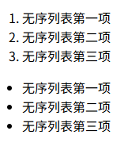

<h4>综合运用</h4>

```html
<body>
  <h3>技术栈示例</h3>
  <ol>
    <li>Java</li>
    <ul>
      <li>JavaWeb</li>
      <li>SPring</li>
      <li>SpringMVC</li>
      <li>Springboot</li>
    </ul>
    <li>Python</li>
    <ul>
      <li>Numpy</li>
      <li>Pandas</li>
      <li>Matplotlib</li>
    </ul>
  </ol>
</body>
```

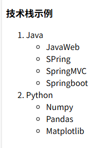

### 5. 超链接标签

> <span style="color:red;font-weight:bold;font-size:20px">&lt;a href="" target=""&gt;&lt;/a&gt;</span>

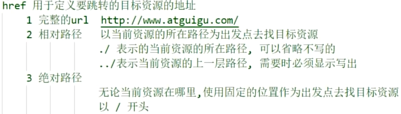

- href 属性用于**定义连接**

  - href 中可以使用**绝对路径**,<span style="color:red;font-weight:bold">以/开头</span>,始终以一个固定路径作为基准路径作为出发点
  - href 中也可以使用**相对路径**,<span style="color:red;font-weight:bold">不以/开头</span>,以当前文件所在路径为出发点
  - href 中也可以定义<span style="color:red;font-weight:bold">完整的 URL</span>

- target 用于定义**打开的方式**
  - \_blank 在**新窗口**中打开目标资源
  - \_self 在**当前窗口**中打开目标资源

```html
<a href="https://www.atguigu.com/" target="_blank">点击跳转尚硅谷官网</a>
<!--在新的界面中打开-->
```

<h3><a href="https://www.atguigu.com/" target="_blank">点击跳转尚硅谷官网</a></h3>

### 6. 图片标签

> <span style="color:red;font-weight:bold;font-size:20px">&lt;img src="" title="" alt=""/&gt;</span>

> <h4>src：用于定义图片的连接</h4>
> <h4>title：用于定义鼠标悬停时显示的文字</h4>
> <h4>alt：用于定义图片加载失败时显示的提示文字</h4>

```html

```


### 7. 音频标签

> - **src：用于定义目标声音资源**
> - **autoplay：用于控制打开页面时是否<span style="color:red;font-weight:bold">自动播放</span>**
> - **controls：用于控制是否展示<span style="color:red;font-weight:bold">控制面板</span>**
> - **loop：用于控制是否进行<span style="color:red;font-weight:bold">循环播放</span>**

```html
<audio
  src="img/music.mp3"
  autoplay="autoplay"
  controls="controls"
  loop="loop"
/>
```

### 8. 视频标签

> - **src：用于定义目标视频资源**
> - **autoplay：用于控制打开页面时是否<span style="color:red;font-weight:bold">自动播放</span>**
> - **controls：用于控制是否展示<span style="color:red;font-weight:bold">控制面板</span>**
> - **loop：用于控制是否进行<span style="color:red;font-weight:bold">循环播放</span>**

```html
<video
  src="img/movie.mp4"
  autoplay="autoplay"
  controls="controls"
  loop="loop"
  width="400px"
/>
```

### 9. ⭐ 表格标签

> - **table 标签：代表表格**
> - **thead 标签：代表表头 可以省略不写**
> - **tbody 标签：代表表体 可以省略不写**
> - **tfoot 标签：代表表尾 可以省略不写**
> - **tr 标签：代表一行**
> - **td 标签：代表行内的一格**
> - **th 标签：自带<span style="color:red;font-weight:bold">加粗和居中</span>效果的 td**
> - <h3>注意点：如果表中<span style="color:red;font-weight:bold">没有thead、tbody、tfoot</span>，全部用tr表示，则浏览器会在解析时会<span style="color:red;font-weight:bold">对所有的tr在外层自动补上tbody</span></h3><br/>

```html
<body>
  <h2 style="text-align: center;">表格示例</h2>
  <!--临时使用 CSS 样式，重点还是标签-->
  <table border="1px" ; style="margin: 0px auto;width: 300px;">
    <!--表头-->
    <thead>
      <!--行标签-->
      <tr>
        <!--居中和加粗效果-->
        <th>姓名</th>
        <th>性别</th>
        <th>身高</th>
      </tr>
    </thead>

    <!--表体-->
    <tbody>
      <tr>
        <td>小红</td>
        <td>女</td>
        <td>156</td>
      </tr>
      <tr>
        <td>小明</td>
        <td>男</td>
        <td>165</td>
      </tr>
    </tbody>

    <!--表尾-->
    <tfoot>
      <tr>
        <td>小强</td>
        <td>男</td>
        <td>170</td>
      </tr>
    </tfoot>
  </table>
</body>
```

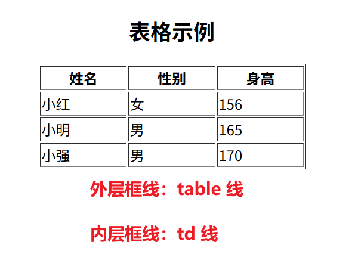

### 10. ⭐ 表格跨行与跨列

> - **思路：（1）跨行：向右侵占位置（2）跨列：向下侵占位置**
> - **跨<span style="color:red;font-weight:bold">行</span>：&lt;td&gt;标签中赋予属性--><span style="color:red;font-weight:bold">colspan = "列数"</span>**
> - **跨<span style="color:red;font-weight:bold">列</span>：&lt;td&gt;标签中赋予属性--><span style="color:red;font-weight:bold">rowspan = "行数"</span>**

<h2>案例</h2>

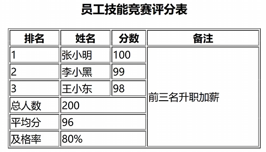

```html
<!--主体内容-->
<body>
  <h2 style="text-align: center;">员工技能竞赛评分表</h2>
  <!--临时使用 CSS 样式，重点还是标签-->
  <table border="1px" ; style="margin: 0px auto;width: 500px;">
    <!--表头-->
    <thead>
      <!--行标签-->
      <tr>
        <!--居中和加粗效果-->
        <th>排名</th>
        <th>姓名</th>
        <th>分数</th>
        <th>备注</th>
      </tr>
    </thead>

    <!--表体-->
    <tbody>
      <!--前三行-->
      <tr>
        <td>1</td>
        <td>张小明</td>
        <td>100</td>
        <!--备注内容-->
        <td rowspan="6">前三名升职加薪</td>
      </tr>
      <tr>
        <td>2</td>
        <td>李小黑</td>
        <td>99</td>
      </tr>
      <tr>
        <td>3</td>
        <td>王小东</td>
        <td>98</td>
      </tr>
      <!--后三行-->
      <tr>
        <td>总人数</td>
        <td colspan="2">200</td>
      </tr>
      <tr>
        <td>平均分</td>
        <td colspan="2">96</td>
      </tr>
      <tr>
        <td>及格率</td>
        <td colspan="2">80%</td>
      </tr>
    </tbody>
  </table>
</body>
```

### 11. ⭐ 表单标签

> ##### <span style="color:red;font-weight:bold">表单标签</span>,可以实现让用户在界面上输入各种信息并提交的一种标签. 是<span style="color:red;font-weight:bold">向服务端发送数据</span>主要的方式之一

> #### （1）<span style="color:red;font-weight:bold">form 标签</span>
>
> > <h4>表单标签,其内部用于定义可以让用户输入信息的表单项标签</h4>
>
> #### action 属性
>
> > <h4>用于定义信息提交的服务器的地址（即点击提交按钮后跳转界面的 url）</h4>
>
> 1. url
> 2. 相对路径
> 3. 绝对路径
>
> #### method 属性
>
> > <h4>用于定义信息的提交方式</h4>

> > ##### GET
> >
> > 1. 参数会以键值对形式放在 url 后提交 **url?key=value&key=value&key=value**
> > 2. 数据直接暴露在地址栏上，**相对不安全**
> > 3. 地址栏长度有限制，所以提交的数据量不大
> > 4. 地址栏上，只能是字符，**不能提交文件**
> > 5. 相比于 post 效率高一些
> >
> > ##### POST
> >
> > ##### 注意：<span style="color:red;font-weight:bold">LiveServer 不支持 POST 请求</span>
> >
> > 1. 参数默认不放到 url 后
> > 2. 数据不会直接暴露在地址栏上，**相对安全**
> > 3. 数据是单独打包通过请求体发送，提交的数据量比较大
> > 4. 请求体中，可以是字符，也可以携带数据，**可以提交文件**
> > 5. 相比于 get 效率较低一些

> #### （2）<span style="color:red;font-weight:bold">input 标签</span>
>
> <h4>主要的表单项标签,可以用于定义表单项</h4>
>
> #### 属性
>
> - name：用于定义提交的参数名
> - value：用于指定 key 对应的值，**如果指定，则是默认显示 value**
> - type：用于定义表单项类型
>   - text 文本框
>   - password 密码框
>   - submit 提交按钮
>   - reset 重置按钮
>   - button 普通按钮

```html
<form action="http://www.atguigu.com" method="get">
  用户名 <input type="text" name="username" /> <br />
  密&nbsp;&nbsp;&nbsp;码 <input type="password" name="password" /> <br />
  <input type="submit" value="登录" />
  <input type="reset" value="重置" />
</form>
```

### 12. ⭐ 表单项标签

#### 单行文本框

> <h3>input标签，属性 type="text"</h3>

```html
个性签名：<input type="text" name="signal" /><br />
```

#### 密码框

> <h3>input标签，属性 type="password"</h3>

```html
密码：<input type="password" name="secret" /><br />
```

#### 单选框

> <h3>input标签，属性 type="radio"，<span style="color:red;font-weight:bold">互斥</span>属性：有<span style="color:red;font-weight:bold">相同的 name 属性</span>，默认勾选属性：checked="checked"</h3>

<h4>注意点</h4>

> - <h4>当用户选择了一个 radio 并提交表单，这个 radio 的 <span style="color:red;font-weight:bold">name 属性和 value 属性组成一个键值对</span>发送给服务器</h4>
> - <h4>如果属性名和属性值一样的话，可以省略属性值</h4>

```html
你的性别是： <input type="radio" />男 <input type="radio" checked="checked" />女
```

#### 复选框

> <h3>input标签，属性 type="checkbox"，默认勾选属性：checked="checked"</h3>

```html
你喜欢的球队是： <input type="checkbox" name="team" value="Brazil" />巴西
<input type="checkbox" name="team" value="German" checked />德国
<input type="checkbox" name="team" value="France" />法国
<input type="checkbox" name="team" value="China" checked="checked" />中国
<input type="checkbox" name="team" value="Italian" />意大利
```

#### 下拉框

> <h3>select标签，下拉框选项属性：option，默认选择属性：selected="selected"</h3>

<h4>注意点</h4>

> - <h4>下拉列表用到了两种标签，其中select标签用来定义下拉列表，而option标签设置列表项</h4>
> - <h4>name属性在select标签中设置,value属性在option标签中设置</h4>
> - <h4>option标签的标签体是显示出来给用户看的，<span style="color:red;font-weight:bold">提交到服务器的是value属性</span>的值</h4>

```html
你喜欢的运动是：
<select name="hobby">
  <option value="swimming">游泳</option>
  <option value="running">跑步</option>
  <option value="shooting" selected="selected">射击</option>
  <option value="skating">溜冰</option>
</select>
```

#### 按钮

> <h3>button标签，普通按钮：type="button"，重置按钮：type="reset"，提交按钮：type="submit"</h3>

<h4>注意点</h4>

> - <h4>普通按钮: 点击后无效果，需要通过<span style="color:red;font-weight:bold">JavaScript绑定单击响应函数</span></h4>
> - <h4>重置按钮: 点击后将表单内的所有表单项都恢复为默认值</h4>
> - <h4>提交按钮: 点击后提交表单</h4>

```html
<button type="button">普通按钮</button>
或
<input type="button" value="普通按钮" />

<button type="reset">重置按钮</button>
或
<input type="reset" value="重置按钮" />

<button type="submit">提交按钮</button>
或
<input type="submit" value="提交按钮" />
```

#### 隐藏域-1

> <h3>input标签，隐藏属性：type="hidden"</h3>

<h4>通过表单隐藏域设置的表单项<span style="color:red;font-weight:bold">不会显示到页面上</span>，用户看不到。<span style="color:red;font-weight:bold">但是</span>提交表单时<span style="color:red;font-weight:bold">会被提交</span>。用来设置一些需要和表单一起提交但是不希望用户看到的数据，例如：用户 id 等等</h4>

```html
<input type="hidden" name="userId" value="2233" />
```

#### 隐藏域-2

> <h3>input标签，属性：type="text"，只读且不可改属性：readonly</h3>

<h4>注意点：属性为<span style="color:red;font-weight:bold">readonl</span>y时，name 和 value 属性在提交表单时<span style="color:red;font-weight:bold">会被提交</span></h4>

```html
<input type="text" name="userId" value="2233" readonly />
```

#### 隐藏域-3

> <h3>input标签，属性：type="text"，只显示属性：disabled</h3>

<h4>注意点：属性为<span style="color:red;font-weight:bold">disabled</span>时，name 和 value 属性在提交表单时<span style="color:red;font-weight:bold">不会被提交</span></h4>

```html
<input type="text" name="userId" value="2233" disabled />
```

#### 多行文本框

> <h3>textarea标签，<span style="color:red;font-weight:bold">没有 name 属性</span>，提交的就是标签中间的内容，如果要设置默认值需要写在开始和结束标签之间</h3>

```html
自我介绍：<textarea name="desc"></textarea>
```

#### 选择文件

> <h3>input标签，属性：type="file"</h3>

```html
头像:<input type="file" name="file" />
```

### 13. 布局相关标签

> <h4>div 标签 俗称"块",主要用于划分页面结构,做页面布局（<span style="color:red;font-weight:bold">块元素</span>）</h4>

> <h4>span 标签 俗称"层",主要用于划分元素范围,配合 CSS 做页面元素样式的修饰（<span style="color:red;font-weight:bold">行内元素</span>）</h4>

```html
<div style="width: 500px; height: 400px;background-color: cadetblue;">
  <!--第一块-->
  <div
    style="width: 400px; height: 100px;background-color: beige;margin: 10px auto;"
  >
    <span style="color: blueviolet;">页面开头部分</span>
  </div>
  <!--第二块-->
  <div
    style="width: 400px; height: 100px;background-color: blanchedalmond;margin: 10px auto;"
  >
    <span style="color: blueviolet;">页面中间部分</span>
  </div>
  <!--第三块-->
  <div
    style="width: 400px; height: 100px;background-color: burlywood;margin: 10px auto;"
  >
    <span style="color: blueviolet;">页面结尾部分</span>
  </div>
</div>
```

<div style="width: 500px; height: 400px;background-color: cadetblue;">
    <div style="width: 400px; height: 100px;background-color: beige;margin: 10px auto;">
        <span style="color: blueviolet;">页面开头部分</span>
    </div> 
    <div style="width: 400px; height: 100px;background-color: blanchedalmond;margin: 10px auto;">
        <span style="color: blueviolet;">页面中间部分</span>
    </div> 
    <div style="width: 400px; height: 100px;background-color: burlywood;margin: 10px auto;">
        <span style="color: blueviolet;">页面结尾部分</span>
    </div> 
</div>

### 14. 特殊字符

<h3>注意：实体名称对大小写敏感</h3>

#### 常用符号

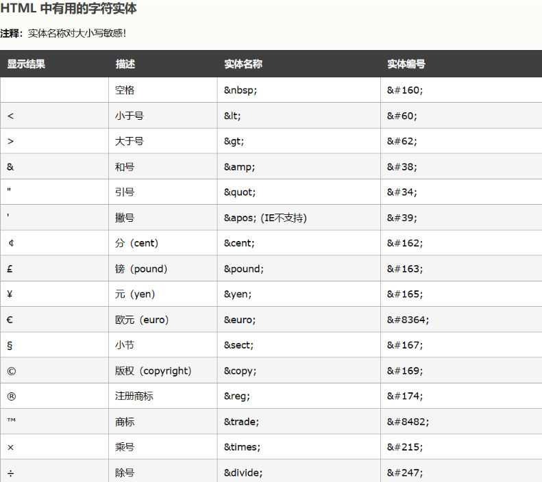

#### 数学符号

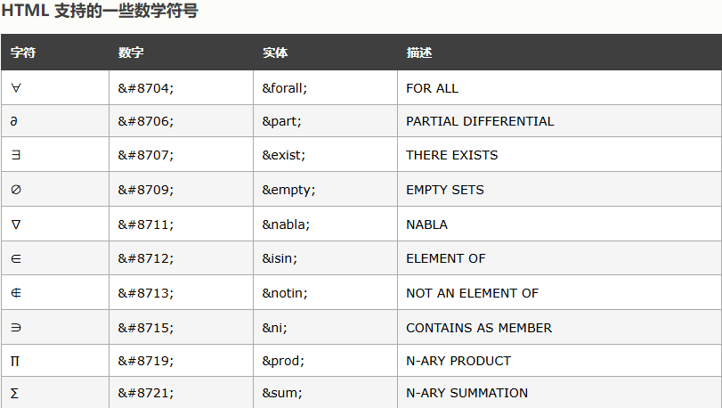

<br/>

#### 希腊字母

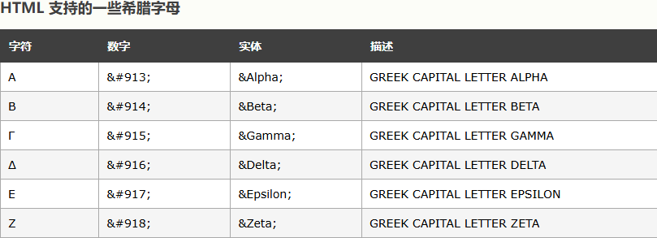

#### 其他符号

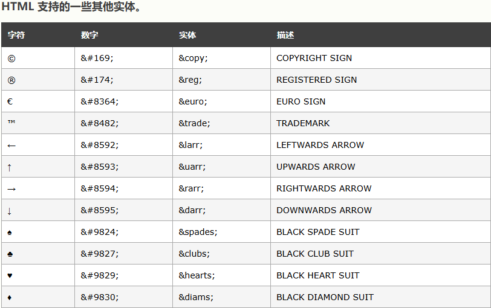
