<h1 style="text-align: center; font-weight: bold;">vscode安装及配置</h1>

---

## ⭐ 安装包

<h3>软件安装包 ：<a href="https://pan.baidu.com/s/1Uq9xdDGIRQLgtodbfB1DUA?pwd=maw3" target="_blank">https://pan.baidu.com/s/1Uq9xdDGIRQLgtodbfB1DUA?pwd=maw3</a></h3>
<h3>VSCode官网下载地址：<a href="https://code.visualstudio.com/" target="_blank">https://code.visualstudio.com/</a></h3>
<h3>mingw64官网下载地址：<a href="https://sourceforge.net/projects/mingw-w64/" target="_blank">https://sourceforge.net/projects/mingw-w64/</a></h3>

## 1. 安装教程

### 配置环境变量

```bash
自己的路径/mingw64/bin
```

<br>
<div style="width: 1000px; margin: 0 auto;">
  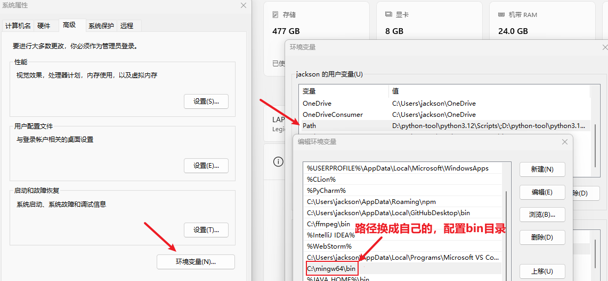
</div>

<hr/>

### 检测 gcc 配置

```bash
where gcc
```

<br>
<div style="width: 800px; margin: 0 auto;">
  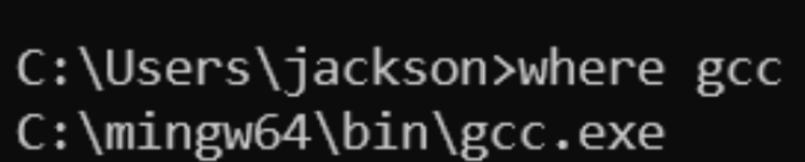
</div>

<hr/>

### 调整控制台字体大小

```bash
terminal font size
```

<br>
<div style="width: 1000px; margin: 0 auto;">
  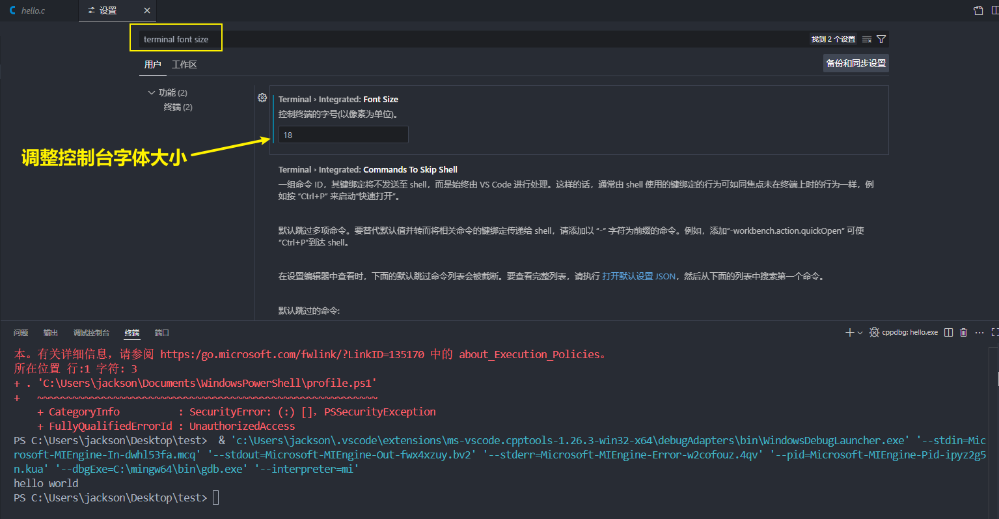
</div>

<hr/>

### ctrl + 滚轮调整字体大小

<br>
<div style="width: 1000px; margin: 0 auto;">
  
</div>

<hr/>

## 2. 常用插件整理 ⭐

<h3>主题类</h3>

> - <h4>One Dark Pro：主题</h4>
> - <h4>One Monokai Theme：主题</h4>
> - <h4>Material Icon Theme：文件图标主题</h4>

<h3>markdown</h3>

> - <h4>Markdown Preview Enhanced：支持文章预览</h4>
> - <h4>Markdown Emoji：narkdown支持emoji，例如：:smille: --->😄</h4>

<h3>功能类</h3>

> - <h4>Chinese (Simplified) (简体中文)：汉化包</h4>
> - <h4>Error Lens：错误提示，警告</h4>
> - <h4>Competitive Programming Helper (cph)：提供算法测试用例</h4>
> - <h4>CodeSnap：代码截图</h4>

## 3. Javaweb 配置

Javaweb 课程是跟着**尚硅谷**学习的，下面是课程中 vscode 部分的准备工作教学连接

1. vscode 安装：[点击跳转](https://www.bilibili.com/video/BV1UN411x7xe?spm_id_from=333.788.videopod.episodes&vd_source=822e86b53dab98632ef279a46d2536db&p=8)
2. vscode 配置：[点击跳转](https://www.bilibili.com/video/BV1UN411x7xe?spm_id_from=333.788.videopod.episodes&vd_source=822e86b53dab98632ef279a46d2536db&p=9)

#### 相关插件安装

1. **编程语言支持**

   - **Chinese (Simplified) Language Pack**： 中文（简体）语言包
   - **HTML CSS Support**： HTML CSS 支持
   - **JavaScript (ES6) code snippets** ：支持 ES6 语法提示
   - **Vue 3 Snippets** 在 Vue 2 或者 Vue 3 ：提供语法高亮和格式化
   - **Vue Official** ：一个专门为 Vue 3 构建的语言支持插件
   - **Vetur**： VScode 中的 Vue 工具插件

2. **功能类**

   - **Live Server**：实时加载功能的小型服务器 实时查看开发的网页或项目效果
   - **Prettier-Code formatter**： 代码美化格式化插件
   - **Auto Rename Tag**： 自动修改标签对插件
   - **Auto Close Tag** ：自动闭合 HTML/XML 标签
   - **Path Intellisense** ：路径提示插件
   - **Image preview**：图片预览插件

3. **其他**

   - **open in browser**： 通过浏览器打开当前文件的插件
   - **vscode-icons** ：文件显示图标插件
   - **Intellij IDEA Keybindings** ：IDEA 快捷键支持

#### 说明

- **Live Server**
  - 点击右下角 Go Live , 或者在 html 编辑视图上右击 open with live Server ,会自动启动小型服务器,并自动打开浏览器访问当前资源
  - Live Server 使用完毕后,要记得关闭
- **其他常见设置**
  - 设置字体: 齿轮>search>搜索 "字体大小"
  - 设置字体大小可以用滚轮控制: 齿轮>设置>搜索 "Mouse Wheel Zoom"
  - 设置左侧树缩进: 齿轮>设置>搜索 "树缩进"
  - 设置文件夹折叠: 齿轮>设置>搜索 "compact" 取消第一个勾选
  - 设置编码自动保存: 齿轮> 设置> 搜索 "Auto Save" ,选择为"afterDelay"

## 4. 配置 C/C++ 环境

### 参考视频

- 快速配置（使用插件运行）：https://www.bilibili.com/video/BV1kR4y1M7R8/?spm_id_from=333.1387.favlist.content.click&vd_source=822e86b53dab98632ef279a46d2536db
- 快速配置（传统方式运行）：https://www.bilibili.com/video/BV1z4RcY1EwT/?spm_id_from=333.337.search-card.all.click&vd_source=822e86b53dab98632ef279a46d2536db
- 系统教程：https://www.bilibili.com/video/BV1356zYMEp5?spm_id_from=333.788.videopod.episodes&vd_source=822e86b53dab98632ef279a46d2536db&p=4

### 相关插件

<br>
<div style="width: 500px; margin: 0 auto;">
  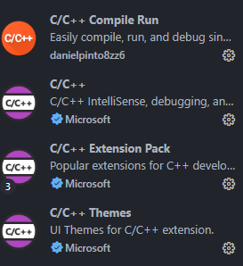
</div>

<hr/>

<h3>设置 C/C++ Compile Run，运行结果在<span style = "color:red;font-weight:bold">弹出的窗口</span>中显示</h3>
<br>
<div style="width: 500px; margin: 0 auto;">
  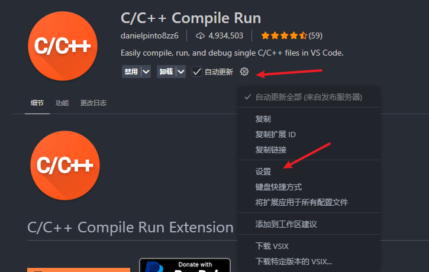
</div>
<br>
<div style="width: 500px; margin: 0 auto;">
  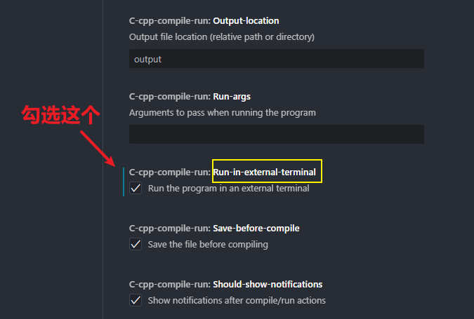
</div>

### 配置 C/C++

<br>
<div style="width: 800px; margin: 0 auto;">
  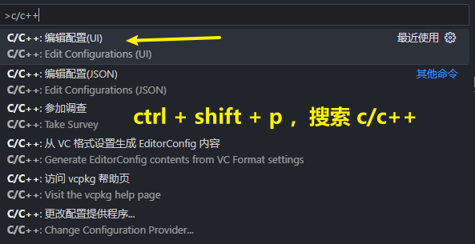
</div>

<br>
<div style="width: 800px; margin: 0 auto;">
  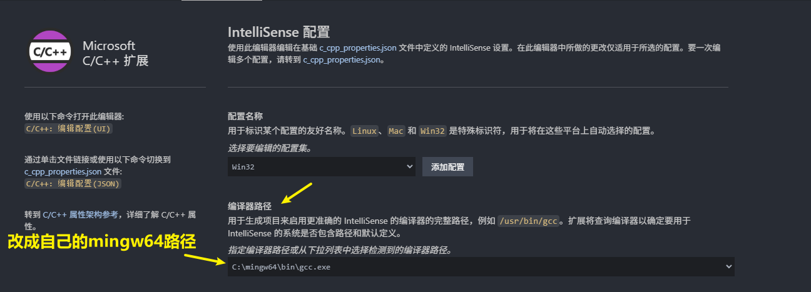
</div>

<br>
<div style="width: 800px; margin: 0 auto;">
  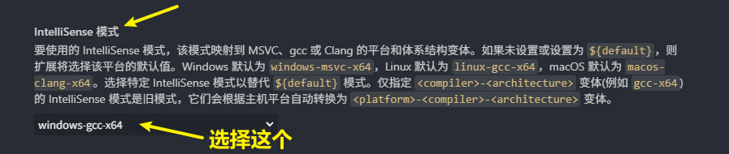
</div>

### 运行

#### 使用插件运行

<br>
<div style="width: 1000px; margin: 0 auto;">
  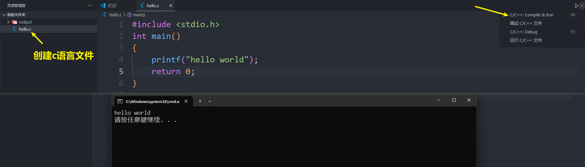
</div>

#### 常规方法

<h3>注意点：<span style = "color:red;font-weight:bold">项目路径不能有中文</span>，否则运行会报错</h3>

<br>
<div style="width: 500px; margin: 0 auto;">
  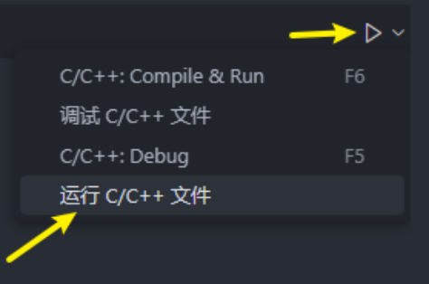
</div>

<br>
<div style="width: 800px; margin: 0 auto;">
  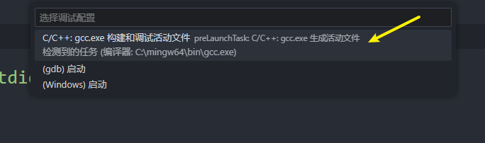
</div>

<br>
<div style="width: 1000px; margin: 0 auto;">
  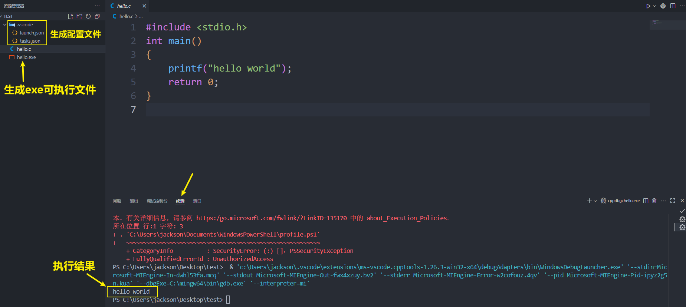
</div>

### task.json 配置文件

<br>
<div style="width: 800px; margin: 0 auto;">
  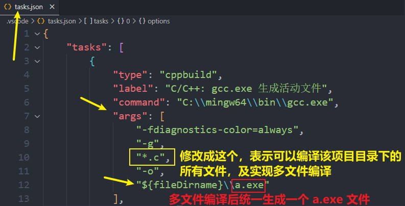
</div>
