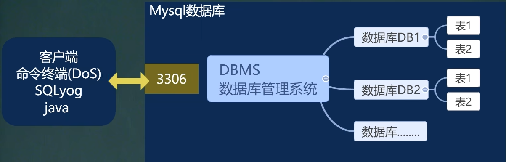
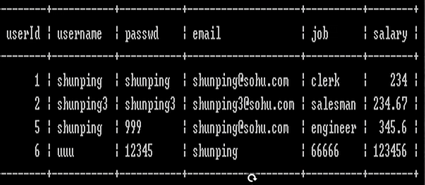
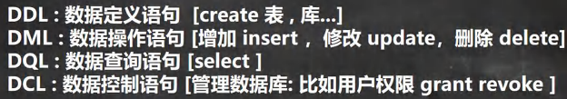

<h1 style="text-align: center;">MySQL基本介绍</h1>
 
- - -
## 1. 概述
MySQL 是一款广泛使用的开源关系型数据库管理系统（RDBMS），由瑞典 MySQL AB 公司最初开发，后被 Sun 公司收购，最终随 Sun 被 Oracle 公司收购并持续维护。它以开源免费、高性能、易扩展和跨平台等特点，成为互联网行业、中小型企业及个人开发者的首选数据库之一。
## 2. 软件
> - MySQL5.7 : 基于dos命令的数据库软件
> - **可视化**数据软件
>   - Navicat
>   - SQLyog：可视化的同时，还可以使用命令行操作
## 3. MySQL的三层结构
- 所谓安装 Mysql 数据库，就是在主机安装一个数据库管理系统(DBMS)，这个管理程序可以管理多个数据库。DBMS(database manage system)  
- 一个数据库中可以创建多个表，以保存数据(信息)。
#### 除了表还有很多其他的结构，这里只是示例

## 4. 数据存储方式

#### 说明

#### （1）行：row

#### （2）列：column

#### （3）表的一行称之为一条记录，在Java中，一行记录往往使用对象表示

## 4. SQL 语句分类

#### 记忆方法

- DDL：定义语句，**D 代表 define**
- DML：操作语句（增删改），**M 代表 modifiy**
- DQL：查询语句，**Q 代表 query**
- DCL：控制语句，**C 代表 control**
