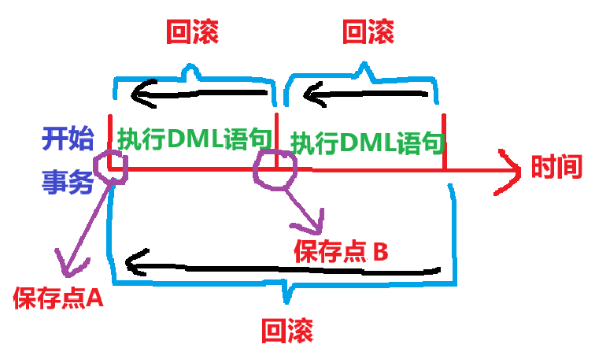
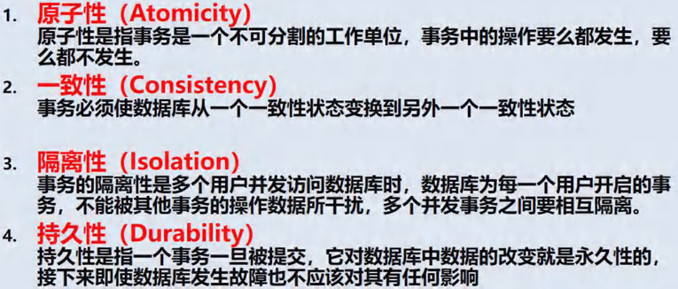

<h1 style="text-align: center;">MySQL 事务</h1>
 
- - -

## 基本介绍

> #### 事务用于保证数据的一致性，它由<span style = "color:red;font-weight:bold">一组相关的 DML 语句组成</span>，该组的 DML 语句<span style = "color:red;font-weight:bold">要么全部成功，要么全部失败</span>，举例：转账就要用事务来处理，用以保证数据的一致性



#### 当<span style = "color:red;font-weight:bold">执行事务</span>操作时（DML 语句），mysql 会在表上<span style = "color:red;font-weight:bold">加锁</span>，防止其他用户改变表的数据，这对用户来讲是非常重要的

## 事务的前提

> <span style = "font-weight:bold;font-size:25px">执行事务的前提：</span><span style = "color:red;font-weight:bold;font-size:25px">innodb 引擎</span>

## 事务操作


<span style = "color:red;font-weight:bold;font-size:30px">start transaction = set autocommit=off</span>

### 操作案例

```bash
# 创建表
CREATE TABLE table01(
  id INT AUTO_INCREMENT PRIMARY KEY, # 主键 + 自增长
  `name` VARCHAR(32)
)

START TRANSACTION # 开启事务

INSERT INTO table01 (id,`name`) VALUES(1,'jack') # 插入第一条记录

SAVEPOINT a # 建立保存点 a

INSERT INTO table01(id,`name`) VALUES(NULL,'tom')

SAVEPOINT b # 建立保存点 b

ROLLBACK TO a # 回退到保存点 a

COMMIT # 提交，不可回退
```

### 回退事务

#### 在介绍回退事务前，先介绍一下保存点（savepoint）。保存点是事务中的一个点，用于取消部分事务。当结束事务（commit）时，会自动的删除事务定义的所有保存点，当执行回退事务时，通过指定保存点可以回退到指定的点

### 提交事务

#### 使用 commit 语句可以提交事务。当执行了 commit 语句后，会确认事务的变化，结束事务，删除保存点，释放锁，数据生效。当使用 commit 语句结束事务后，其他会话【其他连接】将可以看到事务变化后的新数据【所有数据就正式生效】

### 使用细节


## ⭐ 事务隔离级别

### 前提

#### 隔离级别是<span style = "color:red;font-weight:bold">跟事务相关的</span>，首先得启动事务

### 基本介绍

> #### 多个连接<span style = "color:red;font-weight:bold">开启各自事务</span>操作数据库中数据时，数据库系统要负责<span style = "color:red;font-weight:bold">隔离</span>操作，以<span style = "color:red;font-weight:bold">保证</span>各个连接在<span style = "color:red;font-weight:bold">获取数据</span>时的<span style = "color:red;font-weight:bold">准确性</span>

#### 如果不考虑隔离，可能会引发如下问题

> - #### 脏读
> - #### 不可重复读
> - #### 幻读

#### 脏读 (dirty read)

> #### 当一个事务<span style = "color:red;font-weight:bold">读取</span>另一个事务<span style = "color:red;font-weight:bold">尚未提交的改动</span>（update, insert, delete）时，产生<span style = "color:red;font-weight:bold">脏读</span>

#### 不可重复读 (nonrepeatable read)

> #### 同一查询在同一事务中多次进行，由于其他事务所做的<span style = "color:red;font-weight:bold">修改或删除</span>，每次返回不同的结果集，此时发生<span style = "color:red;font-weight:bold">不可重复读</span>（<span style = "color:red;font-weight:bold">简单理解：读取到事务的修改或者删除操作结果</span>）

#### 幻读 (phantom read)

> #### 同一查询在同一事务中多次进行，由于其他事务所做的<span style = "color:red;font-weight:bold">插入</span>操作，每次返回不同的结果集，此时发生<span style = "color:red;font-weight:bold">幻读</span>（<span style = "color:red;font-weight:bold">简单理解：读取到事务的插入操作结果</span>）

### 四种隔离级别 ⭐

#### <span style = "color:red;font-weight:bold">默认</span>隔离级别：<span style = "color:red;font-weight:bold">可重复读</span>（repeatable read）

| Mysql 隔离级别              | 脏读 | 不可重复读 | 幻读 | 加锁读                                                 |
| --------------------------- | ---- | ---------- | ---- | ------------------------------------------------------ |
| 读未提交 (Read uncommitted) | ✔    | ✔          | ✔    | 不加锁                                                 |
| 读已提交 (Read committed)   | ✘    | ✔          | ✔    | 不加锁                                                 |
| 可重复读 (Repeatable read)  | ✘    | ✘          | ✘    | 不加锁                                                 |
| 可串行化 (Serializable)     | ✘    | ✘          | ✘    | <span style = "color:red;font-weight:bold">加锁</span> |

#### 注意：<span style = "color:red;font-weight:bold">加锁</span>后，需要等<span style = "color:red;font-weight:bold">事务 commit 后才会读取内容</span>，<span style = "color:red;font-weight:bold">否则</span>会处于<span style = "color:red;font-weight:bold">阻塞</span>状态

## 相关操作

### 查看隔离界别

#### 1. 查看当前会话隔离界别

```bash
SELECT @@tx_isolation
```

#### 2. 查看全局隔离界别

```bash
SELECT @@gloabl.tx_isolation
```

### 设置隔离级别

#### 1. 设置当前会话隔离级别

#### 隔离级别：Read uncommitted、Read committed、Repeatable read、Serializable

```bash
SET SESSION TRANSACTION ISOLATION LEVEL 隔离级别
```

#### 2. 设置全局隔离级别

#### 隔离级别：Read uncommitted、Read committed、Repeatable read、Serializable

```bash
SET GLOBAL TRANSACTION ISOLATION LEVEL 隔离级别
```

### 5. 修改默认隔离级别

> #### 说明：mysql 默认的事务隔离级别是 repeatable read，一般情况下，没有特殊要求，没有必要修改，默认级别能够满足大部分项目需求

#### 修改方法

> #### 打开 <span style = "color:red;font-weight:bold">.ini</span> 配置文件，添加如下指令，

#### 可选参数：READ-UNCOMMITTED、READ-COMMITTED、REPEATABLE-READ、SERIALIZABLE，<span style = "color:red;font-weight:bold">要带中间的一个横杠</span>

```bash
transaction-isolation = REPEATABLE-READ
```

## 事务 ACID 特性


