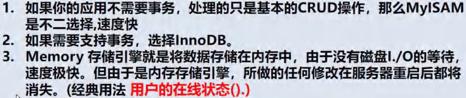

<h1 style="text-align: center;">MySQL 存储引擎</h1>
 
- - -

## 基本介绍

### 分类

> #### MySQL 的<span style = "color:red;font-weight:bold">表类型</span>由<span style = "color:red;font-weight:bold">存储引擎</span>（Storage Engines）决定，<span style = "color:red;font-weight:bold">主要</span>包括 <span style = "color:red;font-weight:bold">MyISAM、innoDB、Memory</span> 等

#### MySQL <span style = "color:red;font-weight:bold">数据表</span>主要<span style = "color:red;font-weight:bold">支持六种类型</span>，分别是：CSV、Memory、ARCHIVE、MRG MYISAM、MYISAM、InnoDB

#### 这六种又分为两类，一类是 “<span style = "color:red;font-weight:bold">事务安全型</span>”（transaction - safe），比如：<span style = "color:red;font-weight:bold">InnoDB</span>；其余都属于第二类，称为 “<span style = "color:red;font-weight:bold">非事务安全型</span>”（non - transaction - safe），比如：<span style = "color:red;font-weight:bold">myisiam 和 memory</span>

### 特点


> #### innoDB 支持<span style = "color:red;font-weight:bold">事务、外键、行级锁</span>
>
> #### myisam <span style = "color:red;font-weight:bold">添加速度快、不支持外键和事务、表级锁</span>
>
> #### menmory
>
> #### （1）数据存储在内存中（<span style = "color:red;font-weight:bold">关闭了 Mysql 服务，数据丢失</span>，但是表结构还在）
>
> #### （2）执行速度很快（没有 IO 读写）
>
> #### （3）默认支持索引（<span style = "color:red;font-weight:bold">hash 表</span>）

## 细节说明


## 查看所有存储引擎


```bash
SHOW ENGINES
```

## 如何选择存储引擎



## 创建存储引擎

> #### 语法： CREATE TABLE 表名 （...）<span style = "color:red;font-weight:bold">ENGINE 存储引擎</span>

## 修改存储引擎

> #### 语法： ALTER TABLE 表名 <span style = "color:red;font-weight:bold">ENGINE = 存储引擎</span>
