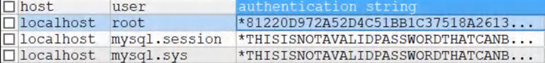
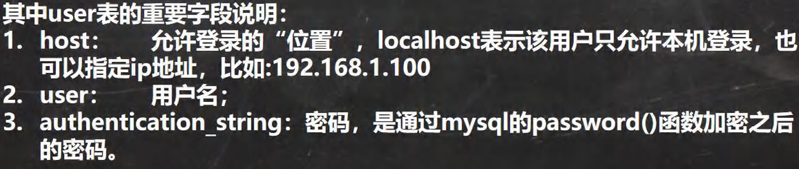

<h1 style="text-align: center;">MySQL 管理</h1>
 
- - -

## 用户管理

### 用户表





### 查询用户

```bash
SELECT * FROM mysql.user
```

### 创建用户

#### 说明：创建用户，同时指定密码

```bash
CREATE USER '用户名'@'允许登录的位置' IDENTIFIED BY '密码'
```

#### 细节说明

> #### 如果创建用户时，不指定<span style = "color:red;font-weight:bold">Host，默认为%</span>，表示所有 <span style = "color:red;font-weight:bold">IP 都有连接权限</span>
>
> #### 'xxx'@'192.168.1.%'：表示 xxx <span style = "color:red;font-weight:bold">用户在 <span style = "color:blue;font-weight:bold">192.168.1.%.\*</span> 的 ip 可以登录 mysql</span>

### 删除用户

```bash
DROP USER '用户名'@'允许登录的位置'
```

#### 细节说明

> #### 在删除用户的时候，如果 Host 不是%，需要指定'用户'@'host 值'
>
> #### DROP USER 用户名 默认是 DROPUSER '用户名' @ '%'

### 修改自己的密码

```bash
SET PASSWORD = PASSWORD('密码')
```

### 修改用户的密码（root）

#### <span style = "color:red;font-weight:bold">需要有 root（管理员）权限</span>

```bash
SET PASSWORD FOR '用户名'@'允许登录的位置' = PASSWORD('密码')
```

### 用户权限表

<br>


### 授予权限

#### 授予指定权限

```bash
GRANT 权限1,权限2,权限3... ON 库.对象名(或 *.*) TO '用户名'@'登录位置' （IDENTIFIED BY '密码'）
```

#### 授予全部权限

```bash
GRANT ALL PRIVILEGES ON *.* TO '用户名'@'登录位置'
```

#### 特别说明

> #### \*.\*：代表本系统中的<span style = "color:red;font-weight:bold">所有数据库</span>的<span style = "color:red;font-weight:bold">所有对象</span>（表，视图，存储过程）
>
> #### 库.\*：表示<span style = "color:red;font-weight:bold">某个数据库</span>中的<span style = "color:red;font-weight:bold">所有数据对象</span> ####pan>（表，视图，存储过程）

#### identified by <span style = "color:red;font-weight:bold">可以省略，也可以写出</span>

> #### 如果用户<span style = "color:red;font-weight:bold">存在</span>，就是<span style = "color:red;font-weight:bold">修改</span>改用户的<span style = "color:red;font-weight:bold">密码</span>
>
> #### 如果改用户<span style = "color:red;font-weight:bold">不存在</span>，就是<span style = "color:red;font-weight:bold">创建该用户</span>

### 回收权限

#### 回收指定权限

```bash
REVOKE 权限1，权限2... ON 库.对象名 FROM '用户名'@'登录位置'
```

#### 回收全部权限

```bash
REVOKE ALL ON 库.对象名 FROM '用户名'@'登录位置'
```
