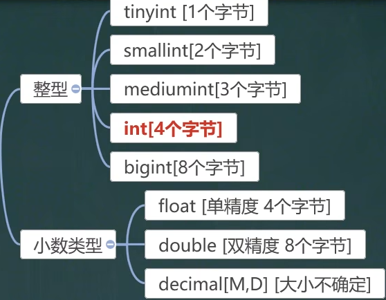
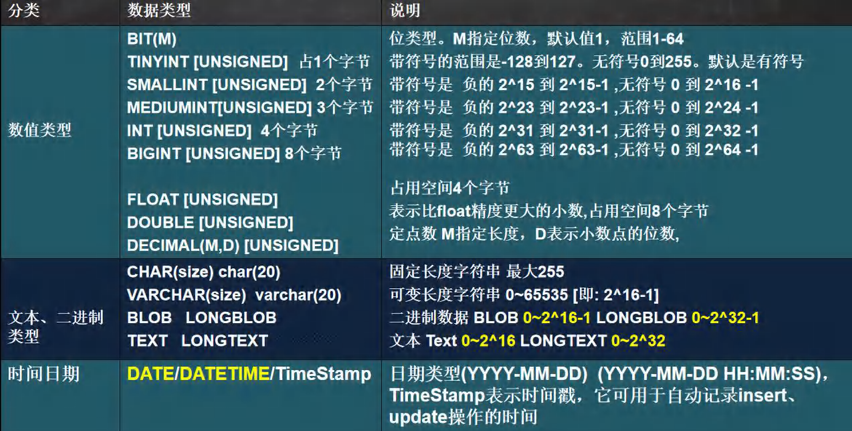
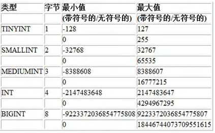
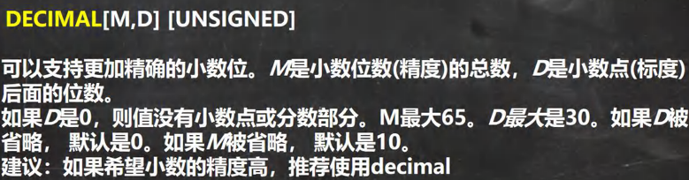

<h1 style="text-align: center;">MySQL数据类型（<span style = "color:red;font-weight:bold">列类型</span>）</h1>
 
- - -

## 结构图

<div style="padding-left: 250px;">
  <h3>MySQL 列类型</h3>
  <ul>
    <li><h4>数值类型</h4></li>
    <li><h4>文本类型（字符串类型）</h4></li>
    <li><h4>二进制数据类型</h4></li>
    <li><h4>日期类型</h4></li>
  </ul>
</div>

### 1. 数值类型



### 2. 字符串类型


### 3. 二进制数据


### 4. 日期类型


### 5. 数值类型表



## 1. 数值型

### 整型



<h3>使用规范：在能够满足需求的情况下，尽量选择占用空间小的数据类型，避免空间浪费</h3>

#### 案例：使用 TINYINT，分别演示有符号和无符号的

```bash
CREATE TABLE t1(id TINYINT); # 创建一个无符号表
CREATE TABLE t2(id TINYINT UNSIGNED); # 创建又给有符号表
INSERT INTO t1 VALUES(-128); # 取左边的临界值
INSERT INTO t2 VALUES(255); # 取右边的临界值
SELECT * FROM t1; # 查修 t1 表
SELECT * FROM t2; # 查询 t2 表
```

### bit

#### 基本介绍


#### 说明

> - **bit 是**<span style = "color:red;font-weight:bold">按位显示（二进制数据）</span>，**但是**<span style = "color:red;font-weight:bold">查询仍可以使用十进制</span>**查询**
> - **范围：1 - 64 位，8 位一个字节，即能表示 8 个字节单位大小的数**

## 2. 小数

<h3>FLOAT:单精度<br/><br/>DOUBLE：双精度</h3>



> **注意：M 是指**<span style = "color:red;font-weight:bold">小数位数的总数</span>**，即整数部分位数 + 小数部分位数**

```bash
CREATE TABLE t3 (`value` DECIMAL(65,30)); # 总位数小于等于65
INSERT INTO t3 VALUES(6555623131846915231354843213.654313418513103465132185);
SELECT * FROM t3;
```

## 3. 字符串

#### 基本介绍


> **注意点**
>
> - **语句中传入的是**<span style = "color:red;font-weight:bold">字符个数</span>**，需要区分字符和字节的关系，避免超出范围**
> - **VARCHAR**
>
> - **（1）这种类型是<span style = "color:red;font-weight:bold">变长的</span>**，**需要**<span style = "color:red;font-weight:bold"> 1 - 3 个字符</span>**记录空间大小**
>
> - **（2）字符占用的<span style = "color:red;font-weight:bold">空间大小不确定</span>，需要根据<span style = "color:red;font-weight:bold">编码的不同</span>确定每个字符占用的空间**
>
> - **（3）<span style = "color:red;font-weight:bold">UTF8</span>：每个字符 <span style = "color:red;font-weight:bold">3 个</span>字节；<span style = "color:red;font-weight:bold">GBK</span>：每个字符 <span style = "color:red;font-weight:bold">2 个</span>字节**

| 编码方式             | 最大<span style = "color:red;font-weight:bold">长度</span> | 最大<span style = "color:red;font-weight:bold">字符数</span> |
| -------------------- | ---------------------------------------------------------- | ------------------------------------------------------------ |
| CHAR(size)           | 最大 255 字符                                              |                                                              |
| VARCHAR(size) (utf8) | 最大 65535 字节                                            | <span style = "color:red;font-weight:bold">21844</span> 字符 |
| VARCHAR(size) (gbk)  | 最大 65535 字节                                            | <span style = "color:red;font-weight:bold">32766</span> 字符 |

#### 使用细节

#### 细节一

> - **char (4) ：这个 4 表示字符数 (最大 255)，<span style = "color:red;font-weight:bold">不是字节数</span>，不管是中文还是字母都是放四个，<span style = "color:red;font-weight:bold">按字符计算</span>**
> - **varchar (4) ：这个 4 表示字符数，不管是字母还是中文都以定义好的表的编码来存放数据**
> - **不管是 中文还是英文字母，都是最多存放 4 个，是**<span style = "color:red;font-weight:bold">按照字符来存放</span>

#### 细节二

> - **char (4) 是<span style = "color:red;font-weight:bold">定长</span> (固定的大小)，就是说，即使你 插入 'aa' , 也会占用 分配的 4 个字符的空间**
> - **varchar (4) 是<span style = "color:red;font-weight:bold">变长</span> (变化的大小)，就是说，如果你插入了 'aa', 实际占用空间大小并不是 4 个字符，而是按照实际占用空间来分配**
> - **注意：varchar 本身还需要占用 <span style = "color:red;font-weight:bold">1 - 3 个字节</span>来记录存放内容长度），即实际占用空间大小 = L (实际数据大小)+ (1 - 3) 字节**

#### 细节三

> <h4>什么时候使用 char，什么时候使用 varchar？</h4>
>
> - **如果数据是<span style = "color:red;font-weight:bold">定长</span>，推荐使用 <span style = "color:red;font-weight:bold">char</span>，比如 md5 的密码，邮编，手机号，身份证号码等. char (32)**
>
> - **如果一个字段的长度是<span style = "color:red;font-weight:bold">不确定</span>，我们使用 <span style = "color:red;font-weight:bold">varchar</span>，比如留言，文章**
>
>  <h4>查询速度：<span style = "color:red;font-weight:bold">char > varchar</span></h4>

#### 细节四

> - **在存放文本时，也可以使用 Text 数据类型.可以将 TEXT 列视为 VARCHAR 列<br/>注意 Text 不能有默认值，大小 0-2<sup>16</sup> 字节**
> - **如果希望存放更多字符，可以选择 MEDIUMTEXT 0-2<sup>24</sup> 或者 LONGTEXT 0-2<sup>32</sup>**

#### 案例

```bash
CREATE TABLE t4 (content1 TEXT,content2 TEXT,content3 TEXT);
INSERT INTO t4 VALUES('tom','bob','lucy');
SELECT * FROM t4;
```

## 4. 日期类型

#### 说明：TIMESTAMP（时间戳）在 INSET 和 UPDATE 时会<span style = "color:red;font-weight:bold">自动以当前时间进行更新</span>

#### 设置两个属性

- **NOT NULL DEFAULT CURRENT_TIMESTAMP**
- **ON UPDATE CURRENT_TIMESTAMP**

```bash
CREATE TABLE t5
(
    a DATE, b DATETIME, c TIMESTAMP
    NOT NULL DEFAULT CURRENT_TIMESTAMP # 第一个属性
    ON UPDATE CURRENT_TIMESTAMP # 第二个属性
);

INSERT INTO t5(a,b) VALUES('2022-11-11','2022-11-11 10:10:10');

SELECT * FROM t5;
```
