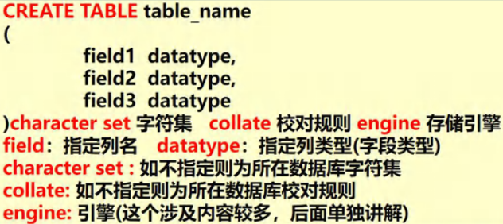
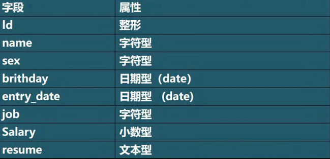
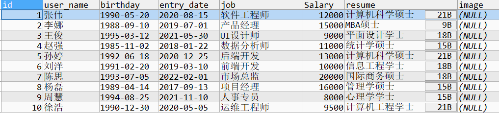
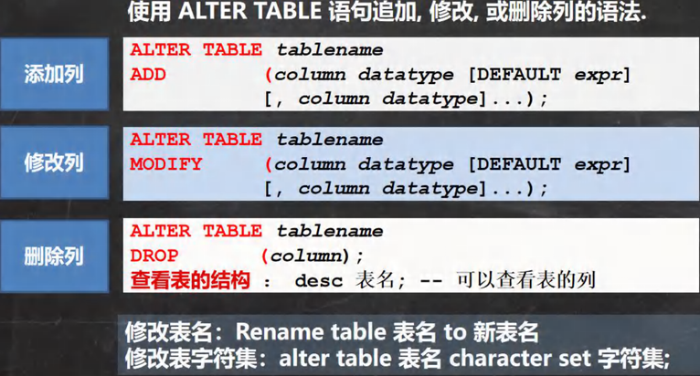
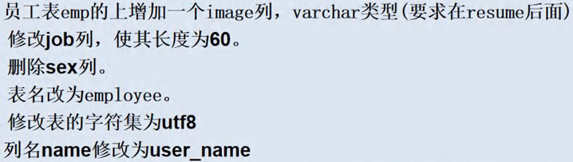

<h1 style="text-align: center;">表操作</h1>
 
- - -
## 1. 创建表
### 创建普通表

#### 三个属性
> - <h4>character set utf8</h4>
> - <h4>collate </h4>
>
>   - utf_bin（区分大小写）
>
>   - urf_general_ci（不区分大小写）
>
> - <h4>engine INNODB</h4>
#### 案例
```bash
CREATE TABLE t6
(
   `id` CHAR(255),
   `name` VARCHAR(255)
)CHARACTER SET utf8 COLLATE uft8_bin ENGINE INNODB; 
```

<h3>注意：最后一个属性后面<span style = "color:red;font-weight:bold">不能有逗号</span></h3>

### 指定属性默认值创建表

> <h3>在字段后加上 <span style = "color:red;font-weight:bold">NOT NULL DEFALUT （默认值）</span></h3>

#### 在表中添加记录时，如果没有给某个字段赋值，则会自动添加默认值

```bash
CREATE TABLE t0
(
  id INT;
  price DOUBLE NOT NULL DEFAULT 100; # 指定默认值 100
);
```

### 创建表练习



```bash
CREATE TABLE t6
(
   `id` INT,
   `name` VARCHAR(32),
   `sex` CHAR(1),
   `birthday` DATE,
   `entry_date` DATE,
   `job` VARCHAR(32),
   `Salary` DOUBLE,
   `resume` TEXT
)CHARACTER SET utf8 COLLATE utf8_bin ENGINE INNODB;
```

### 🚀 表案例



#### 创建表

```bash
CREATE TABLE employee (
    id INT PRIMARY KEY,
    user_name VARCHAR(50),
    birthday DATE,
    entry_date DATE,
    job VARCHAR(50),
    salary DECIMAL(10, 2),
    resume TEXT
);
```

#### 添加数据

```bash
INSERT INTO employee (id, user_name, birthday, entry_date, job, salary, resume)
VALUES
(1, '张伟', '1990-05-20', '2020-08-15', '软件工程师', 12000, '计算机科学硕士'),
(2, '李娜', '1988-09-10', '2019-07-01', '产品经理', 15000, 'MBA硕士'),
(3, '王俊', '1995-03-12', '2021-05-30', 'UI设计师', 9000, '平面设计学士'),
(4, '赵强', '1985-11-02', '2018-01-22', '数据分析师', 11000, '统计学硕士'),
(5, '孙婷', '1992-06-18', '2020-12-25', '后端开发', 13000, '计算机科学硕士'),
(6, '刘洋', '1991-02-20', '2019-03-10', '前端开发', 10000, '信息工程学士'),
(7, '陈思', '1993-07-05', '2022-02-01', '市场总监', 20000, '国际商务硕士'),
(8, '杨磊', '1989-04-14', '2017-09-13', '项目经理', 16000, '管理学硕士'),
(9, '周慧', '1994-08-25', '2021-11-10', '人事专员', 8000, '心理学学士'),
(10, '徐浩', '1990-12-30', '2020-05-05', '运维工程师', 9500, '计算机工程学士');
```

## 2. 查看当前数据所有表

> <h3><span style = "color:red;font-weight:bold">SHOW TABLES</span>：显示当前所在数据库中的所有表</h3>

```bash
SHOW TABLES
```

## 3. 查看任意数据库表

> <h3><span style = "color:red;font-weight:bold">SELECT * FROM 数据库名.表名</span>：查看任意数据库的任意一张表</h3>

```bash
SELECT * FROM jacksonling.t6;
```

## 4. 查看表内容

> <h3><span style = "color:red;font-weight:bold">SELECT * FROM 表名</span>：查看表中所有的<span style = "color:red;font-weight:bold">数据</span></h3>

```bash
SELECT * FROM t6;
```

## 5. 查看表字段类型

> <h3><span style = "color:red;font-weight:bold">DESC指令</span>：查看表中所有的<span style = "color:red;font-weight:bold">字段</span>和对应的<span style = "color:red;font-weight:bold">类型</span></h3>

```bash
DESC t6
```

## 6. 删除表

> <h3><span style = "color:red;font-weight:bold">DROP指令</span></h3>

```bash
DROP TABLE 表名;
```

## 7. 修改表



> <h3>统一指令：<span style = "color:red;font-weight:bold">ALTER TABLE (TABLENAME)</span></h3>

### 添加列

> <h3><span style = "color:red;font-weight:bold">ADD</span> 列名 <span style = "color:red;font-weight:bold">AFTER</span> 列名（<span style = "color:red;font-weight:bold">在哪一列之后插入</span>），需要指定添加的<span style = "color:red;font-weight:bold">列名、列类型</span></h3>

```bash
ALTER TABLE t6 ADD image VARCHAR(32) AFTER `resume`;
```

### 修改列类型

> <h3><span style = "color:red;font-weight:bold">MODIFY 列名 新类型</span></h3>

```bash
ALTER TABLE t6 MODIFY job CHAR(32);
```

### 修改列名

> <h3><span style = "color:red;font-weight:bold">CHANGE 旧列名 新列名 类型</span></h3>

```bash
ALTER TABLE t6 CHANGE job JOB VARCHAR(32);
```

### 修改表名

> <h3><span style = "color:red;font-weight:bold">RENAME TABLE 旧表名 TO 新表名</span></h3>

```bash
RENAME TABLE t6 TO mytable;
```

### 修改表的字符集

> <h3><span style = "color:red;font-weight:bold">CHARACTER SET 字符集</span></h3>

```bash
ALTER TABLE mytable CHARACTER SET UTF8;
```

### 删除列

> <h3><span style = "color:red;font-weight:bold">DROP 列名</span></h3>

```bash
ALTER TABLE mytable DROP job;
```

## 8. 修改表练习



```bash
ALTER TABLE mytable ADD image VARCHAR(32) AFTER RESUME; # 增加image列

ALTER TABLE mytable MODIFY job VARCHAR(60); # 修改job列

ALTER TABLE mytable DROP sex; # 删除sex列

RENAME TABLE mytable TO employee; # 表名改为 employee

ALTER TABLE employee CHARACTER SET utf8; # 修改字符集为 utf8

ALTER TABLE employee CHANGE `name` user_name VARCHAR(32); # 修改列名name为user_name

SELECT * FROM employee; # 查询表内容
```

## 9. 表复制

### 复制字段

#### 方法一：使用 like

```bash
CREATE TABLE my_tab02
LIKE emp
```

#### 方法二：使用 select

```bash
CREATE TABLE my_tab02
SELECT * FROM emp;
```

### 复制记录

```bash
INSERT INTO my_tab01 (id, `name`, sal, job, deptno)
SELECT empno, ename, sal, job, deptno FROM emp;
```

### 自我复制

```bash
INSERT INTO my_tab01
SELECT * FROM my_tab01
```

## 10. 表去重

#### 前提：有重复记录的表（table）、临时表（my_temp）

> - <h4>创建临时表my_temp，并复制 table 表的字段</h4>
> - <h4>把 table 的记录通过 distinct 关键字处理后复制到 my_tmp</h4>
> - <h4>清除 table 的记录</h4>
> - <h4>把 my_tmp 的记录复制到 table</h4>
> - <h4>删除临时表 my_temp</h4>

```bash
-- 创建临时表 my_temp，并复制 table 表的字段
CREATE TEMPORARY TABLE my_temp LIKE table;

-- 把 table 的记录通过 DISTINCT 关键字处理后复制到 my_temp
INSERT INTO my_temp
SELECT DISTINCT * FROM table;

-- 清除 table 的记录
DELETE FROM table;

-- 把 my_temp 的记录复制到 table
INSERT INTO table
SELECT * FROM my_temp;

-- 删除临时表 my_temp
DROP TEMPORARY TABLE my_temp;

```

## 11. 合并表

### UNION（去重）

```bash
SELECT * FROM table01
UNION
SELECT * FROM table02
```

### UNION ALL（不去重）

```bash
SELECT * FROM table01
UNION ALL
SELECT * FROM table02
```
