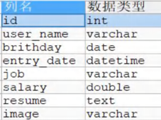
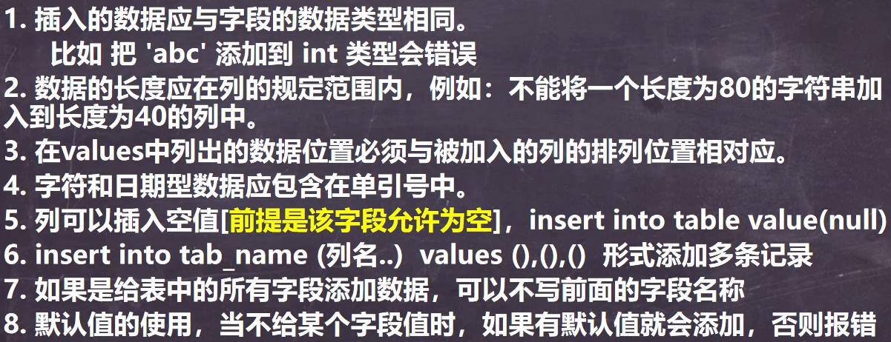
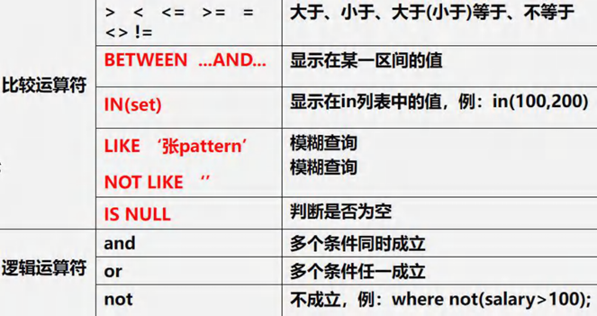

<h1 style="text-align: center;">CRUD</h1>
 
- - -

## Insert

### 添加单条记录

> <h3>指令：<span style = "color:red;font-weight:bold">INSERT  INTO （表名）（列名 1，列名2...） VALUES （值 1，值 2，...）</span></h3>

#### 案例：已知表结构如下，插入一组数据



```bash
INSERT INTO employee # 表名
(id, user_name, birthday, entry_date, job, salary, `resume`) # 字段
VALUES
(1, '张伟', '1990-05-20', '2020-08-15', '软件工程师', 12000, '计算机科学硕士'); # 字段对应的值
```

### 添加多条记录

> <h3>指令：<span style = "color:red;font-weight:bold">INSERT  INTO （表名）（列名 1，列名2...） VALUES （第一组数据）,（第二组数据）...</span></h3>

```bash
INSERT INTO employee # 表名
(id, user_name, birthday, entry_date, job, salary, `resume`) # 字段
VALUES
(1, '张伟', '1990-05-20', '2020-08-15', '软件工程师', 12000, '计算机科学硕士'), # 第一条记录
(2, '李娜', '1988-03-10', '2018-05-01', '数据分析师', 15000, '统计学博士');  # 第二条记录
```

### 使用细节



## Update

> <h3>指令：<span style = "color:red;font-weight:bold">UPDATE 表名 SET 字段=更新值 （WHERE 字段=指定字段值）</span></h3>

> #### 注意点：如果<span style = "color:red;font-weight:bold">不指定 WHERE，会修改全部字段值</span>，慎用 ❗❗❗

### 修改值（多个）

```bash
UPDATE employee SET job='测试工程师',birthday='1990-05-30' WHERE user_name='李强';
```

### 修改数值

#### 在原基础上修改可以写为：<span style = "color:red;font-weight:bold">字段=字段 （操作）</span>，例如：salary = salary \* 2，表示工资在原基础上翻一倍

```bash
UPDATE employee SET salary=salary + 1000 WHERE user_name='刘欣'; # 在原基础上加 1000 元
```

### 使用细节

> #### 1. **UPDATE** 语法可以用新值更新原有表行中的各列。
>
> #### 2. **SET** 子句指定要修改哪些列和要给予哪些值。
>
> #### 3. **WHERE** 子句指定应<span style = "color:red;font-weight:bold">更新哪些行</span>。如没有 WHERE 子句，则更新所有的行（记录），<span style = "color:red;font-weight:bold">一定要小心</span>
>
> #### 4. 如果需要<span style = "color:red;font-weight:bold">修改多个字段</span>，可以通过 **SET** 字段 1=值 1，字段 2=值 2....

## Delete

> <h3>指令：<span style = "color:red;font-weight:bold">DELETE FROM 表名 WHERE 字段=指定字段值</span></h3>

### 删除指定信息

```bash
DELETE FROM employee WHERE id=1;
```

### 删除全部表信息

```bash
DELETE FROM 表名
```

### 使用细节

> #### 1. 如果<span style = "color:red;font-weight:bold">不使用 **where**</span> 子句，将<span style = "color:red;font-weight:bold">删除</span>表中<span style = "color:red;font-weight:bold">所有</span>数据。
>
> #### 2. **Delete** 语句<span style = "color:red;font-weight:bold">不能删除某一列</span>的值（可使用 **update** 设置为 `null` 或者 `''`）。
>
> #### 3. 使用 <span style = "color:red;font-weight:bold">**delete**</span> 语句<span style = "color:red;font-weight:bold">仅删除记录</span>，不删除表本身。如果要删除表，使用 **drop table** 语句（**drop table 表名;**）

## Select ⭐

> <h3>指令：<span style = "color:red;font-weight:bold">SELECT （DISTINCT）*（或者）（column...） FROM 表名 (WHERE 过滤条件)</span></h3>


> #### 去重说明：<span style = "color:red;font-weight:bold">每个字段值都相同，才会去重</span>

### 查询全部表数据

```bash
SELECT * FROM employee;
```

### 查询指定列数据

```bash
SELECT id,user_name FROM employee;
```

### DISTINCT

#### 去重说明：<span style = "color:red;font-weight:bold">每个字段值都相同，才会去重</span>

```bash
SELECT DISTINCT * FROM employee;
```

### AS

> <h3>指令：<span style = "color:red;font-weight:bold">SELECT 列名 as 别名 FROM 表名</span></h3>

#### 不会改变原来的字段，但是在显示的时候会<span style = "color:red;font-weight:bold">以别名显示</span>

```bash
SELECT id AS '编号' FROM employee;
```

### 运算符



<h3>LIKE 模糊查询</h3>

> <h3>（1）%：表示 <span style = "color:red;font-weight:bold">0 到多个字符</span></h3>
> <h3>（1）_：表示<span style = "color:red;font-weight:bold">单个字符</span></h3>

<h3>注意点</h3>

> <h3>（1）<span style = "color:red;font-weight:bold">表达式需要使用括号包起来</span></h3>
> <h3>（2）BETWEEN ... AND ... 是<span style = "color:red;font-weight:bold">左闭右闭</span>的</h3>
> <h3>（3）WHERE 列字段 LIKE '指定值<span style = "color:red;font-weight:bold">%</span>'，% 是一个通配符，表示任意数量的字符，可以理解成是起一个占位作用</h3>
> <h3>（4）<span style = "color:red;font-weight:bold">IN（多个值）</span>表示数据中包含这些值都是符合条件的</h3>
> <h3>（5）如果有多个过滤条件，则全部使用<span style = "color:red;font-weight:bold"> AND </span>连接</h3>

#### 案例一：计算总分

```bash
SELECT (chinese + math + english) AS
total_score FROM employee;
```

#### 案例二：过滤查询

```bash
SELECT (chinese + math + english) AS total_score
FROM employee
WHERE (chinese + math + english) > 200;
```

#### 案例三：BETWEEN ... AND ...

```bash
SELECT (chinese + math + english) AS total_score
FROM employee
WHERE (chinese + math + english)
BETWEEN 200 AND 300;
```

#### 案例三：模糊查询

#### 以下语句是查询姓名中所有<span style = "color:red;font-weight:bold">姓 “王”</span> 的并且包含一个过滤条件

```bash
SELECT (chinese + math + english) AS total_score
FROM employee
WHERE (chinese + math + english) BETWEEN 200 AND 300
AND user_name LIKE '王%';
```

#### 以下语句事查询姓名中<span style = "color:red;font-weight:bold">第二个字</span>为 “王” 的用户

```bash
SELECT * FROM `user` WHERE `user_name` LIKE '_王%'
```

#### 案例四：使用 IN 设置筛选条件

```bash
SELECT * FROM employee WHERE resume IN ('计算机科学硕士', '信息工程学士');
```

### 排序

> - <h4> Order by 指定排序的列（<span style = "color:red;font-weight:bold">可以是多列</span>），排序的列既可以是表中的列名，也可以是select语句后指定的列名。</h4>
> - <h4> ASC（ascending order） 升序（<span style = "color:red;font-weight:bold">默认</span>），DESC（descending order） 降序</h4>
> - <h4> ORDER BY 子句应位于SELECT语句的结尾。</h4>

#### ORDER BY<span style = "color:red;font-weight:bold">指定多列</span>的使用

> - <h4>表示在第一个条件的限制下排序后，实现第二个条件的排序</h4>

```bash
SELECT * FROM `user` ORDER BY `group`,`salary` ASC
```

#### 案例：升序排列

```bash
SELECT (chinese + math + english) AS total_score
FROM employeec
WHERE (chinese + math + english) > 200
OORDER BY total_score ASC;
```

#### 案例：降序排列

```bash
SELECT (chinese + math + english) AS total_score
FROM employeec
WHERE (chinese + math + english) > 200
OORDER BY total_score DESC;
```

### WHERE

> #### 过滤查询
>
> - <h4>指定查询条件，如果有多个过滤条件，则全部使用<span style = "color:red;font-weight:bold"> AND </span>连接</h4>
> - <h4><span style = "color:red;font-weight:bold">可以比较时间</span></h4>
>
>   - <h4>日期需要使用<span style = "color:red;font-weight:bold">单引号包裹</span></h4>
>
>   - <h4>日期的格式为 0000-00-00，<span style = "color:red;font-weight:bold">不要省略 0</span></h4>

#### 案例：查询姓王的薪水，按照从高到低排序

```bash
SELECT user_name,Salary FROM employee WHERE `user_name` LIKE '王%' ORDER BY Salary DESC;
```

#### 案例：查询 1992.1.1 后出生的用户

```bash
SELECT * FROM `user` WHERE `birth` > '1992-01-01'
```

### 分页查询


#### 案例：一共有 100 条记录，一页显示 5 条记录，请查询 <span style = "color:red;font-weight:bold">第五页</span> 的记录

#### 公式计算

> #### 每页显示记录数（<span style = "color:red;font-weight:bold;font-size:25px">5</span>） \* （第几页（<span style = "color:red;font-weight:bold;font-size:25px">5</span>） - 1），每页显示记录数（<span style = "color:red;font-weight:bold;font-size:25px">5</span>）= <span style = "color:red;font-weight:bold;font-size:25px">20,5</span>

```bash
SELECT * FROM `user` LIMIT 20,5
```

### 多语句顺序 ⭐

- <h3><span style = "color:red;font-weight:bold">group by</span></h3>
- <h3><span style = "color:red;font-weight:bold">having</span></h3>
- <h3><span style = "color:red;font-weight:bold">order by</span></h3>
- <h3><span style = "color:red;font-weight:bold">limit</span></h3>

> #### 案例：请统计各个部分的平均工资，并且是大于 1000 的，兵器按照平均工资从高到低排序，去除前两行记录

```bash
SELECT deptno,AVG(sal) AS avg_sal FROM emp
GROUP BY deptno
HAVING avg_sal > 1000
ORDER BY avg_sal DESC
LIMIT 0,2
```
