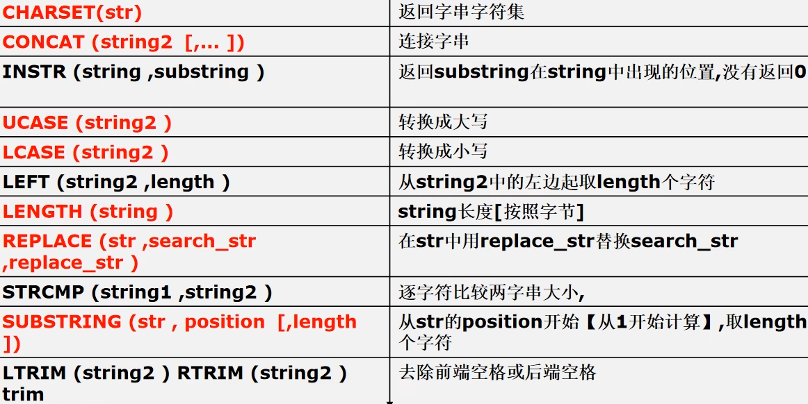
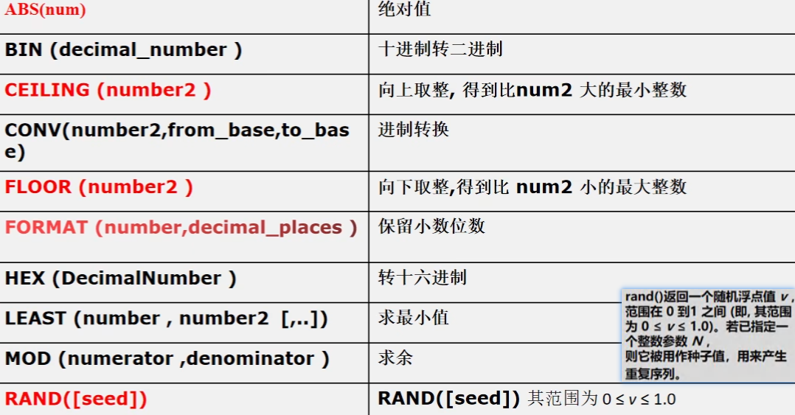
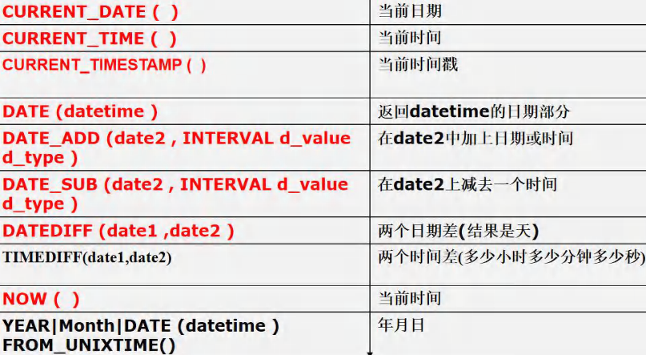
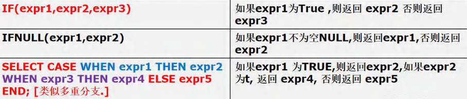

<h1 style="text-align: center;">函数</h1>
 
- - -

## 统计函数

### COUNT

> <h3>SELECT  <span style = "color:red;font-weight:bold">COUNT( * 或者 （<span style = "color:blue;font-weight:bold">DISTINCT</span>）列字段)</span>  FROM 表名 WHERE ...</h3>

#### 注意点

#### （1）如果传入的是字段，<span style = "color:red;font-weight:bold">不会统计字段值为 NULL 的字段</span>

#### （2）适用对象是数字，对于其他值没有意义

> count (\*) 返回满足条件的记录的行数
>
> count (列)：统计满足条件的某列有多少个，**但是会排除 为 null 的情况**

#### 案例一：统计总人数

```bash
SELECT COUNT(*) FROM employee;
```

#### 案例二：统计薪水大于一万的人数

```bash
SELECT COUNT('Salary') FROM employee WHERE Salary > 10000;
```

#### 案例三：统计有多少种部门管理者

#### 说明：每个部门对应一个管理者编号，但是一个部门可以有多个管理者，需要去重

```bash
SELECT * COUNT(DISTINCT('manager_id')) FROM `company`
```

### SUM

> <h3>SELECT  <span style = "color:red;font-weight:bold">SUM(列字段 或者 表达式)</span>  FROM 表名 WHERE ...</h3>

#### 案例：统计全班数学总分

```bash
SELECT SUM(math) FROM employee;
```

#### 案例：统计平均薪水

```bash
SELECT SUM(Salary) / COUNT(*) FROM employee;
```

### AVG

> <h3>SELECT  <span style = "color:red;font-weight:bold">AVG(列字段 或者 表达式)</span>  FROM 表名 WHERE ...</h3>

#### 案例：统计平均薪水

```bash
SELECT AVG(Salary) FROM employee;
```

#### 案例：统计平均总分

```bash
SELECT AVG(chinese + math + english) FROM employee;
```

### MAX

> <h3>SELECT  <span style = "color:red;font-weight:bold">MAX(列字段 或者 表达式)</span>  FROM 表名 WHERE ...</h3>

#### 案例：薪水最高的

```bash
SELECT MAX(Salary) FROM employee;
```

### MIN

> <h3>SELECT  <span style = "color:red;font-weight:bold">MIN(列字段 或者 表达式)</span>  FROM 表名 WHERE ...</h3>

#### 案例：薪水最低的

```bash
SELECT MIN(Salary) FROM employee;
```

## 分组统计

> <h3>SELECT  <span style = "color:red;font-weight:bold">函数/列字段...</span>  FROM 表名 <span style = "color:red;font-weight:bold">group by</span> 分组名 <span style = "color:red;font-weight:bold">having</span> 分组的限制条件...</h3>

#### 案例一：按岗位分类查询平均工资，最高工资和最低工资

```bash
SELECT job, AVG(Salary), MAX(Salary), MIN(Salary)
FROM employee
GROUP BY job;
```

#### 案例二：在案例一的基础上只显示平均工资大于一万的

```bash

SELECT job,AVG(Salary), MAX(Salary),MIN(Salary)
FROM employee
GROUP BY job HAVING AVG(Salary) > 10000;
```

## 字符串函数



> **说明**
>
> - **<span style = "color:red;font-weight:bold">DUAL 亚元表</span>，是系统表，可以作为<span style = "color:red;font-weight:bold">测试表</span>使用**
> - SUBSTRING：如果<span style = "color:red;font-weight:bold">不写结束位置</span>，默认是从开始位置<span style = "color:red;font-weight:bold">截取到</span>字符串<span style = "color:red;font-weight:bold">末尾</span>
> - STRCMP：返回的结果值和 Java 字符串中的 CMP 函数规则一致
> - LENGTH：返回的<span style = "color:red;font-weight:bold">长度按字节计算</span>

<h3>练习：以首字母小写的方式显示所有员工的姓名</h3>

```bash
SELECT CHARSET(user_name) FROM employee # 返回 id 字段的字符集

SELECT LENGTH('王强') FROM DUAL # 返回字符串的长度（按字节计算）

SELECT CONCAT(user_name,'的工作：',job) FROM employee # 字符串拼接


SELECT INSTR('jacksonling','ling') FROM DUAL # 返回字串的第一个字符在主串中出现的位置

SELECT UCASE(user_name) FROM employee # 查询时，所有用户的姓名转为大写

SELECT LCASE(user_name) FROM employee # 查询时，所有用户的姓名转为小写

SELECT REPLACE(user_name, '刘洋', 'lucy') AS user_name FROM employee # 查询时，替换名字

SELECT STRCMP('app','bpp') FROM DUAL # 适用strcmp函数

SELECT SUBSTRING(user_name, 1,1) FROM employee # 查询时，显示所有名字的第一个字

SELECT LEFT(user_name, 1) FROM employee  # 查询时，显示所有名字的第一个字

SELECT LTRIM('  hi  ') FROM DUAL # 去除左边空格

SELECT RTRIM('  hi  ') FROM DUAL # 去除右边空格

SELECT TRIM('  hi  ') FROM DUAL # 去除两边空格
```

#### 思路如下

- 首先取出每个员工姓名的第一个字母
- 然后把该字母转为小写
- 最后把转换后的字母姓名中剩余的字母拼接

```bash
SELECT CONCAT(LCASE(SUBSTRING(user_name,1,1)),SUBSTRING(user_name,2)) FROM employee
```

## 数学函数



```bash
# 数学运算
SELECT ABS(-3) FROM DUAL # 取绝对值

SELECT MOD(10,3) # 取模

SELECT CEILING (3.4) # 向上取整

SELECT FLOOR (3.9) # 向下取整

SELECT FORMAT(3.568923,3) # 保留小数位数：3位

SELECT LEAST(0,1,2) # 返回最小值


# 进制转换
SELECT CONV(10,10,2) # 进制转换：把 10 从 十进制 转为 二进制

SELECT BIN(2) FROM DUAL # 十进制转二进制

SELECT HEX(2) FROM DUAL # 十进制转十六进制


# 随机数
SELECT RAND() FROM DUAL # 返回 [0,1] 之间的随机数

SELECT RAND(1) FROM DUAL # 返回固定的随机数（指定SEED）
```

## 日期函数



#### 说明

- **DATE_ADD()函数和 DATE_SUB()函数中的 type <span style = "color:red;font-weight:bold">只能接收一个参数</span>，如需计算多个时间单位，需要使用函数嵌套实现**
- 这四个函数的日期类型可以是 **date**、**datetime** 或者 **timestamp**
  - **DATE_ADD()** 中的 **interval** 后面可以是 **year**、**month**、**day**、**hour**、**minute**、**second** 等
  - **DATE_SUB()** 中的 **interval** 后面可以是 **year**、**month**、**day**、**hour**、**minute**、**second** 等
  - **DATEDIFF(date1, date2)** <span style = "color:red;font-weight:bold">得到的是天数</span>，而且是 **date1 - date2** 的天数，因此**可以取负数**
  - **DATE()**

#### 补充函数

- **DATE()**：返回日期部分
- **TIME()**：返回时间部分
- **UNIX_TIMESTAMP**：返回 1970-01-01 到 现在的秒数
- **FROM_UNIXTIME()**：日期格式化，格式化参数为--><span style = "color:red;font-weight:bold">"%Y-%m-%d %H:%i:%s"</span>

#### 注意：在实际开发中，我们也经常使用 int 来保存一个 unix 时间戳，然后使用 from_unixtime () 进行转换，还是非常有实用价值的

```bash
# 获取时间
SELECT NOW() FROM DUAL # 获取当前时间

SELECT CURRENT_DATE() FROM DUAL # 返回当前日期（年月日）

SELECT CURRENT_TIME() FROM DUAL # 返回当前时间（时分秒）

SELECT CURRENT_TIMESTAMP() FROM DUAL # 返回时间戳（年月日、时分秒）

# 指定获取时间部分
SELECT DATE(NOW()) FROM DUAL # 返回日期部分

SELECT TIME(NOW()) FROM DUAL # 返回时间部分

# 时间戳：返回1970-01-01 到 现在的秒数
SELECT UNIX_TIMESTAMP() FROM DUAL

# 日期格式化
SELECT FROM_UNIXTIME(1752751557,"%Y-%m-%d %H:%i:%s") FROM DUAL

# 时间计算

## 案例一：'2011-11-11' 和 '1990-1-1' 相差多少天
SELECT DATEDIFF('2011-11-11','1990-1-1')

## 案例二：计算 '18:20:56' 和 '23:56:23' 相差多久
SELECT TIMEDIFF('23:56:23','18:20:56')

## 案例三：计算 10 天后的时间
SELECT DATE_ADD(NOW(),INTERVAL 10 DAY)

## 案例四：计算 10 天前的时间
SELECT DATE_SUB(NOW(),INTERVAL 10 DAY)

## 案例五：计算 '年月日、时分秒' 后的时间（计算多个时间需要使用嵌套，因为只能接收一个type的时间参数）
SELECT
  DATE_ADD(
    DATE_ADD(
      DATE_ADD(
        DATE_ADD(
          DATE_ADD(
            DATE_ADD(NOW(), INTERVAL 2 YEAR),
            INTERVAL 3 MONTH
          ),
          INTERVAL 10 DAY
        ),
        INTERVAL 5 HOUR
      ),
      INTERVAL 30 MINUTE
    ),
    INTERVAL 45 SECOND
  )AS future_time FROM DUAL;

## 案例六：如果能活到 100 岁，计算还能活多少天（2006-07-05为例）
## 思路：出生日期加上 100 年减去当前时间
SELECT DATEDIFF(DATE_ADD('2006-07-05',INTERVAL 100 YEAR),NOW()) FROM DUAL
```

## 加密函数

##### 用途：用于用户<span style = "color:red;font-weight:bold">密码的加密</span>

- **MD5(str)**：返回一个长度为 <span style = "color:red;font-weight:bold;font-size:20px">32</span> 的字符串，该种加密方式<span style = "color:red;font-weight:bold">加密后不可逆</span>
- **PASSWORD(str)**：从原文密码 str 计算并返回密码字符串，通常用于对数据库的用户密码加密

#### 案例

#### （1）创建一个表

```bash
CREATE TABLE `user`
(
  id CHAR(1),
  `name` CHAR(32),
  `password` CHAR(32)
)
```

#### （2）添加数据，密码加密

```bash
INSERT INTO `user` (`id`, `name`, `password`)
VALUES ('1', 'jack', MD5('123456'));
```

## 系统函数

- USER()：查看数据库的用户，**返回值：用户@IP 地址**
- DATABASE()：查看当前数据库

```bash
SELECT USER() FROM DUAL # 查询数据库用户

SELECT DATABASE() FROM DUAL # 查询当前所在数据库
```

## 流程控制函数



### IF

#### 类似三元运算符：条件为真取第一个结果，否则取第二个结果

```bash
SELECT IF(TRUE,'jack','jackson') FROM DUAL
```

### IFNULL

#### 传入两个参数，<span style = "color:red;font-weight:bold">谁不为空返回谁</span>

```bash
SELECT IFNULL(NULL,'jack')
```

### SELECT CASE

> <h3>指令：SELECT <span style = "color:red;font-weight:bold">CASE WHEN 条件 THEN 执行语句...   ELSE 执行语句</span> END</h3>

#### 案例：查询表，如果匹配到对应的职位，就把职位从英文转为中文

```bash
SELECT ename,(SELECT CASE
    WHEN job='CLERK' THEN'职员'
    WHEN job='MANAGER' THEN'经理'
    WHEN job='SALESMAN' THEN'销售人员'
    ELSE job END
)FROM emp
```

### ⚠️ 判断是否为空

> <h3>空判断：使用关键字<span style = "color:red;font-weight:bold">IS</span>判断，<span style = "color:red;font-weight:bold">不要使用 = </span></h3>

```bash
SELECT * FROM `user` WHERE `password` IS NULL
```
